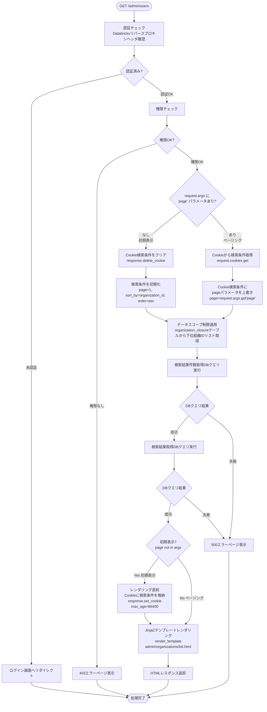
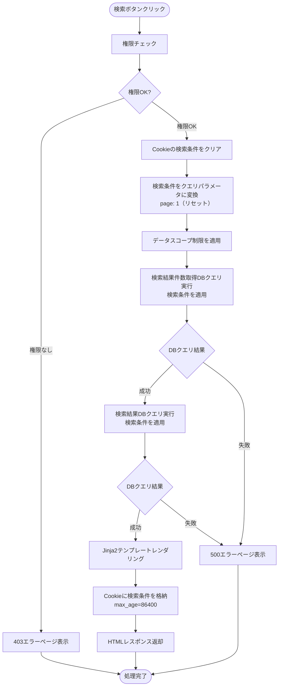
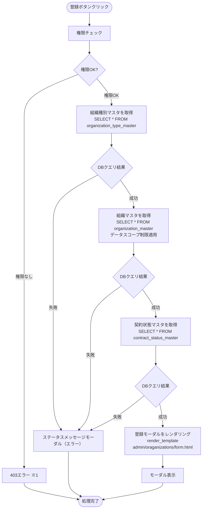
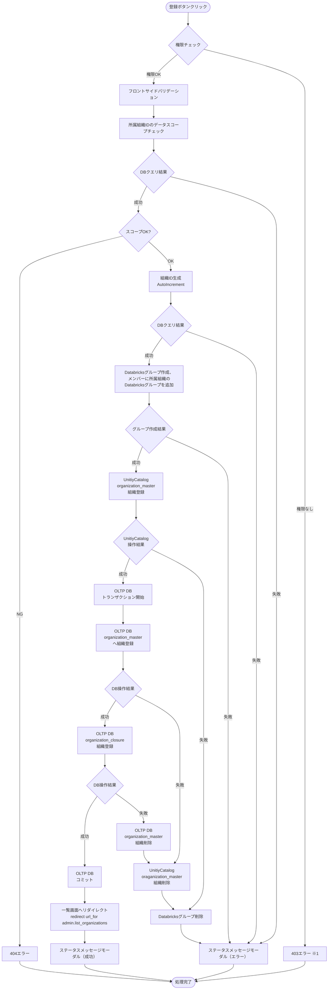
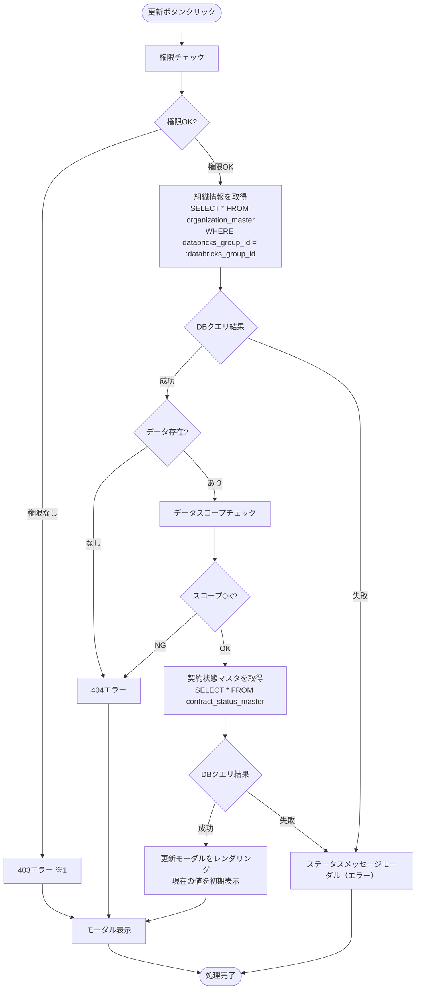
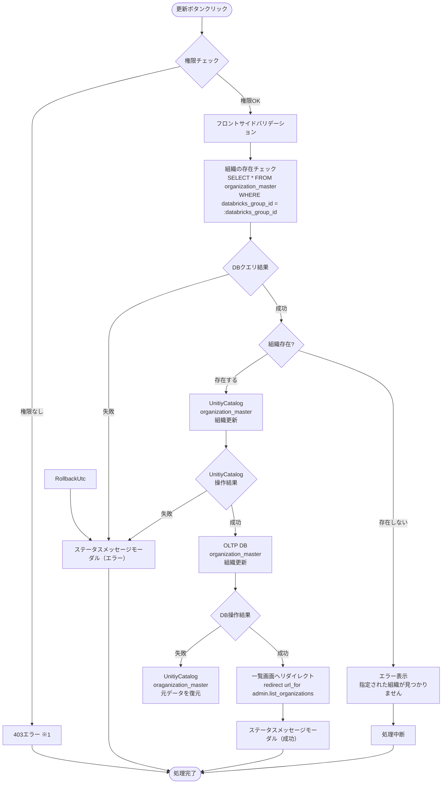
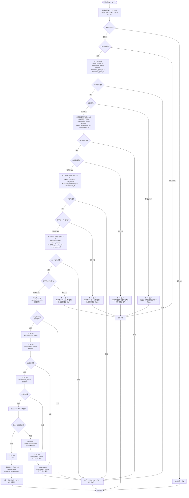

# 組織管理画面 - ワークフロー仕様書

## 📑 目次

- [組織管理画面 - ワークフロー仕様書](#組織管理画面---ワークフロー仕様書)
  - [📑 目次](#-目次)
  - [概要](#概要)
  - [使用するFlaskルート一覧](#使用するflaskルート一覧)
  - [ルート呼び出しマッピング](#ルート呼び出しマッピング)
  - [ワークフロー一覧](#ワークフロー一覧)
    - [初期表示](#初期表示)
      - [処理フロー](#処理フロー)
      - [Flaskルート](#flaskルート)
      - [バリデーション](#バリデーション)
      - [処理詳細（サーバーサイド）](#処理詳細サーバーサイド)
      - [表示メッセージ](#表示メッセージ)
      - [エラーハンドリング](#エラーハンドリング)
      - [ログ出力タイミング](#ログ出力タイミング)
      - [検索条件の保持方法](#検索条件の保持方法)
      - [UI状態](#ui状態)
    - [検索・絞り込み](#検索絞り込み)
      - [処理フロー](#処理フロー-1)
      - [処理詳細（サーバーサイド）](#処理詳細サーバーサイド-1)
      - [表示メッセージ](#表示メッセージ-1)
      - [エラーハンドリング](#エラーハンドリング-1)
      - [ログ出力タイミング](#ログ出力タイミング-1)
      - [検索条件の保持方法](#検索条件の保持方法-1)
      - [UI状態](#ui状態-1)
    - [全体ソート](#全体ソート)
      - [処理詳細](#処理詳細)
    - [ページ内ソート](#ページ内ソート)
      - [処理詳細](#処理詳細-1)
    - [ページング](#ページング)
      - [処理詳細](#処理詳細-2)
      - [UI状態](#ui状態-2)
    - [組織登録](#組織登録)
      - [登録ボタン押下](#登録ボタン押下)
        - [処理フロー](#処理フロー-2)
        - [処理詳細（サーバーサイド）](#処理詳細サーバーサイド-2)
      - [登録実行](#登録実行)
        - [処理フロー](#処理フロー-3)
        - [処理詳細（サーバーサイド）](#処理詳細サーバーサイド-3)
        - [バリデーション](#バリデーション-1)
        - [表示メッセージ](#表示メッセージ-2)
      - [ログ出力タイミング](#ログ出力タイミング-2)
    - [組織更新](#組織更新)
      - [更新画面表示](#更新画面表示)
        - [処理フロー](#処理フロー-4)
        - [処理詳細（サーバーサイド）](#処理詳細サーバーサイド-4)
      - [更新実行](#更新実行)
        - [処理フロー](#処理フロー-5)
        - [処理詳細（サーバーサイド）](#処理詳細サーバーサイド-5)
        - [バリデーション](#バリデーション-2)
        - [表示メッセージ](#表示メッセージ-3)
      - [ログ出力タイミング](#ログ出力タイミング-3)
    - [組織参照](#組織参照)
      - [処理詳細（サーバーサイド）](#処理詳細サーバーサイド-6)
      - [ログ出力タイミング](#ログ出力タイミング-4)
    - [組織削除](#組織削除)
      - [処理フロー](#処理フロー-6)
        - [処理詳細（サーバーサイド）](#処理詳細サーバーサイド-7)
      - [表示メッセージ](#表示メッセージ-4)
      - [ログ出力タイミング](#ログ出力タイミング-5)
    - [CSVエクスポート](#csvエクスポート)
        - [処理詳細（サーバーサイド）](#処理詳細サーバーサイド-8)
  - [使用データベース詳細](#使用データベース詳細)
    - [使用テーブル一覧](#使用テーブル一覧)
    - [インデックス最適化](#インデックス最適化)
  - [トランザクション管理](#トランザクション管理)
    - [トランザクション開始・終了タイミング](#トランザクション開始終了タイミング)
  - [セキュリティ実装](#セキュリティ実装)
    - [認証・認可実装](#認証認可実装)
    - [入力検証](#入力検証)
    - [ログ出力ルール](#ログ出力ルール)
  - [関連ドキュメント](#関連ドキュメント)
    - [機能設計・仕様](#機能設計仕様)
    - [アーキテクチャ設計](#アーキテクチャ設計)
    - [共通仕様](#共通仕様)
    - [類似機能](#類似機能)

---

## 概要

このドキュメントは、組織管理画面のユーザー操作に対する処理フロー、バリデーション実行タイミング、データベース処理の詳細を記載します。

**このドキュメントの役割:**
- ✅ ユーザー操作のトリガー条件
- ✅ 処理フローの詳細（Flaskルート呼び出しシーケンス、フォーム送信、リダイレクト）
- ✅ バリデーション実行タイミング（いつチェックするか）
- ✅ エラーハンドリングフロー
- ✅ サーバーサイド処理詳細（SQL、変数、条件分岐、コード例）
- ✅ データベース利用詳細（トランザクション管理、テーブル操作、インデックス）
- ✅ セキュリティ実装詳細（認証、入力検証、ログ出力）
- ✅ Databricks API連携詳細（ワークスペースグループ作成・更新・削除）

**UI仕様書との役割分担:**
- **UI仕様書**: バリデーションルール定義（何をチェックするか）、UI要素の詳細仕様
- **ワークフロー仕様書**: バリデーション実行タイミング（いつどのようにチェックするか）、処理フロー、サーバーサイド実装詳細

**注:** UI要素の詳細やバリデーションルールは [UI仕様書](./ui-specification.md) を参照してください。

---

## 使用するFlaskルート一覧

この画面で使用するすべてのFlaskルート（エンドポイント）を記載します。

| No | ルート名 | エンドポイント | メソッド | 用途 | レスポンス形式 | 備考 |
|----|---------|---------------|---------|------|---------------|------|
| 1 | 組織一覧初期表示 | `/admin/organizations` | GET | 組織一覧の初期表示・ページング | HTML | pageパラメータなし=初期表示、あり=ページング |
| 2 | 組織一覧検索 | `/admin/organizations` | POST | 組織検索実行 | HTML | 検索条件をCookieに格納 |
| 3 | 組織登録画面 | `/admin/organizations/create` | GET | 組織登録画面表示 | HTML（モーダル） | 組織種別・所属組織・契約状態選択肢を含む |
| 4 | 組織登録実行 | `/admin/organizations/register` | POST | 組織登録処理 | リダイレクト (302) | 成功時: `/admin/organizations`、失敗時: フォーム再表示 |
| 5 | 組織参照画面 | `/admin/organizations/<databricks_group_id>` | GET | 組織詳細情報表示 | HTML（モーダル） | - |
| 6 | 組織更新画面 | `/admin/organizations/<databricks_group_id>/edit` | GET | 組織更新画面表示 | HTML（モーダル） | 現在の値を初期表示 |
| 7 | 組織更新実行 | `/admin/organizations/<databricks_group_id>/update` | POST | 組織更新処理 | リダイレクト (302) | 成功時: `/admin/organizations` |
| 8 | 組織削除実行 | `/admin/organizations/delete` | POST | 組織削除処理 | リダイレクト (302) | 成功時: `/admin/organizations` |
| 9 | CSVエクスポート | `/admin/organizations?export=csv` | GET | 組織一覧CSVダウンロード | CSV | 現在の検索条件を適用 |

**注:**
- **レスポンス形式**:
  - `HTML`: Jinja2テンプレートをレンダリングして返す（`render_template()`）
  - `リダイレクト (302)`: 成功時に別のルートへリダイレクト（`redirect(url_for())`）、失敗時はフォームを再表示
  - `CSV`: CSVファイルをダウンロードレスポンスとして返す
- **Flask Blueprint構成**: `admin_bp` として実装

---

## ルート呼び出しマッピング

| ユーザー操作 | トリガー | 呼び出すルート | パラメータ | レスポンス | エラー時の挙動 |
|-------------|---------|-------------|-----------|-----------|---------------|
| 画面初期表示 | URL直接アクセス | `GET /admin/organizations` | なし | HTML（組織一覧画面） | エラーページ表示 |
| 検索ボタン押下 | フォーム送信 | `POST /admin/organizations` | `organization_name, organization_type_id, contact_person_name, contract_status_id, sort_by, order` | HTML（検索結果画面） | エラーメッセージ表示 |
| ページボタン押下 | リンククリック | `GET /admin/organizations` | `page` | HTML（検索結果画面 | エラーページ表示 |
| 登録ボタン押下 | ボタンクリック | `GET /admin/organizations/create` | なし | HTML（登録モーダル） | エラーページ表示 |
| 登録実行 | フォーム送信 | `POST /admin/organizations/register` | フォームデータ | リダイレクト → `GET /admin/organizations` | フォーム再表示（エラーメッセージ付き） |
| 参照ボタン押下 | ボタンクリック | `GET /admin/organizations/<databricks_group_id>` | databricks_group_id | HTML（参照モーダル） | 404エラーページ表示 |
| 更新ボタン押下 | ボタンクリック | `GET /admin/organizations/<databricks_group_id>/edit` | databricks_group_id | HTML（更新モーダル） | 404エラーページ表示 |
| 更新実行 | フォーム送信 | `POST /admin/organizations/<databricks_group_id>/update` | フォームデータ | リダイレクト → `GET /admin/organizations` | フォーム再表示（エラーメッセージ付き） |
| 削除実行 | フォーム送信 | `POST /admin/organizations/delete` | databricks_group_id | リダイレクト → `GET /admin/organizations` | エラーメッセージ表示 |
| CSVエクスポート | ボタンクリック | `GET /admin/organizations?export=csv` | 検索条件 | CSVダウンロード | エラーメッセージ表示 |

---

## ワークフロー一覧

### 初期表示

**トリガー:** URL直接アクセス時（ユーザーが画面にアクセスしたとき）

**前提条件:**
- ユーザーがログイン済み（Databricks認証完了）
- 適切な権限を持っている（システム保守者、管理者、販社ユーザー）

#### 処理フロー



#### Flaskルート

| ルート | エンドポイント | 詳細 |
|-------|---------------|------|
| 組織一覧初期表示表示 | `GET /admin/organizations` | クエリパラメータ: `page` |

#### バリデーション

**実行タイミング:** なし（初期表示のため、デフォルト値を使用）

**データスコープ制限:**
- **フィルタリングロジックは全ユーザーで共通、実質的なアクセス可能範囲に差分あり**
- システム保守者・管理者: すべてのユーザーにアクセス可能
- 販社ユーザー・サービス利用者: ログインユーザーの `organization_id` に紐づく全子組織でフィルタリング

#### 処理詳細（サーバーサイド）

**① 認証・認可チェック**

リバースプロキシヘッダから認証情報を取得し、権限を確認します。

**処理内容:**
- ヘッダ `X-Databricks-User-Id` からユーザーIDを取得
- データベースから現在ユーザー情報を取得（ユーザー種別、組織ID）
- 組織に応じてデータスコープを決定

**変数・パラメータ:**
- `current_user_id`: string - リバースプロキシヘッダから取得したユーザーID
- `current_user`: User - データベースから取得したユーザーオブジェクト
- `user_type_id`: int - ユーザー種別ID（user_type_masterへの外部キー）
- `organization_id`: string - データスコープ制限用の組織ID

**実装例:**
```python
from flask import request, abort, g
from functools import wraps

def require_auth(f):
    @wraps(f)
    def decorated_function(*args, **kwargs):
        user_id = request.headers.get('X-Databricks-User-Id')
        if not user_id:
            abort(401)

        user = User.query.filter_by(user_id=user_id, delete_flag=0).first()
        if not user:
            abort(403)

        g.current_user = user
        return f(*args, **kwargs)
    return decorated_function
```

**② クエリパラメータ取得**

```python
page = request.args.get('page', 1, type=int)
per_page = ITEM_PER_PAGE  # 設定ファイルから取得
```

**③ データスコープ制限の適用**

組織階層に基づいてデータスコープ制限を適用します。

**処理内容:**
- **全ユーザー共通**: 組織階層（`organization_closure`）でフィルタ
  - ユーザーの `organization_id` を親組織IDとして検索
  - 下位組織リスト（`subsidiary_organization_id`）を取得
  - そのリストに該当する組織のデータのみアクセス可能
  - **ロールによる条件分岐は一切行わない**

**注**: システム保守者・管理者が全データにアクセスできるのは、ルート組織に所属しているため

**変数・パラメータ:**
- `accessible_org_ids`: list - アクセス可能な組織IDリスト

**実装例:**
```python
def apply_data_scope_filter(query, current_user):
    # organization_closure テーブルから下位組織リストを取得（全ユーザー共通）
    accessible_org_ids = db.session.query(
        OrganizationClosure.subsidiary_organization_id
    ).filter(
        OrganizationClosure.parent_organization_id == current_user.organization_id
    ).all()

    # 下位組織IDのリストを抽出
    org_ids = [org_id[0] for org_id in accessible_org_ids]

    if not org_ids:
        # アクセス可能な組織がない場合は空の結果を返す
        # （通常は発生しない - 最低でも自組織は含まれる）
        return query.filter(User.organization_id.in_([]))

    # 組織IDリストでフィルタリング
    return query.filter(User.organization_id.in_(org_ids))
```

**④ データベースクエリ実行**

組織マスタからデータを取得します。

**使用テーブル:** organization_master、organization_type_master、contract_status_master

**SQL詳細:**
- 検索結果件数取得DBクエリ
```sql
SELECT
  COUNT(organization_id) AS data_count
FROM
  organization_master
WHERE
  delete_flag = FALSE
  AND organization_id IN (:accessible_org_ids)
```

- 検索結果取得DBクエリ
```sql
SELECT
  om.organization_name,
  om.organization_type_id,
  ot.organization_type_name,
  om.address,
  om.phone_number,
  om.contact_person_name,
  om.contract_status_id,
  cs.contract_status_name
FROM
  organization_master om
LEFT JOIN organization_type_master ot
  ON om.organization_type_id = ot.organization_type_id
  AND ot.delete_flag = FALSE
LEFT JOIN contract_status_master cs
  ON om.contract_status_id = cs.contract_status_id
  AND cs.delete_flag = FALSE
WHERE
  om.delete_flag = FALSE
  AND om.organization_id IN (:accessible_org_ids)
ORDER BY
  om.organization_id ASC
LIMIT :item_per_page OFFSET 0
```

**実装例:**
```python
offset = (page - 1) * per_page

# ベースクエリ
query = Organization.query.filter_by(delete_flag=0)

# データスコープ制限適用
query = apply_data_scope_filter(query, g.current_user)

# ソート適用
if order == 'asc':
    query = query.order_by(getattr(Organization, sort_by).asc())
else:
    query = query.order_by(getattr(Organization, sort_by).desc())

# ページング適用
organizations = query.limit(per_page).offset(offset).all()
total = query.count()
```

**⑤ HTMLレンダリング**

Jinja2テンプレートをレンダリングしてHTMLレスポンスを返却します。

**実装例:**
```python
return render_template('organization/list.html',
                      organizations=organizations,
                      total=total,
                      page=page,
                      per_page=per_page,
                      sort_by=sort_by,
                      order=order,
                      current_user=g.current_user)
```

**初期表示とページングの実装例**
```python
@admin_bp.route('/admin/organizations', methods=['GET'])
@require_auth
def organizations_list():
    """初期表示・ページング（統合）"""

    # 初期表示 vs ページング判定
    if 'page' not in request.args:
        # 初期表示: デフォルト値
        search_params = {
            'organization_name': '',
            'organization_type_id': None,
            'contact_person_name': '',
            'contract_status_id': None
        }
        save_cookie = True
    else:
        # ページング: Cookieから取得
        cookie_data = request.cookies.get('organization_search_params')
        if cookie_data:
            search_params = json.loads(cookie_data)
        else:
            search_params = get_default_search_params()

        search_params['page'] = request.args.get('page', 1, type=int)
        save_cookie = False

    # データスコープ制限適用
    accessible_org_ids = get_accessible_organizations(g.current_user.organization_id)

    # DB検索実行
    organizations, total = search_alert_histories(search_params, accessible_org_ids)

    # レンダリング
    response = make_response(render_template(
        'admin/organizations/list.html',
        organizations=organizations,
        total=total,
        page=page,
        per_page=per_page,
        sort_by=sort_by,
        order=order,
        search_params=search_params
    ))

    # 初期表示時のみCookie格納
    if save_cookie:
        response.set_cookie(
            'organization_search_params',
            json.dumps(search_params),
            max_age=86400,  # 24時間
            httponly=True,
            samesite='Lax'
        )

    return response
```

#### 表示メッセージ

| メッセージID | 表示内容 | 表示タイミング | 表示場所 |
|-------------|---------|---------------|---------|
| ERR_001 | データの取得に失敗しました | DBクエリ失敗時 | エラーページ |

#### エラーハンドリング

| HTTPステータス | エラー種別 | 処理内容 | 表示内容 |
|--------------|-----------|---------|---------|
| 401 | 認証エラー | ログイン画面へリダイレクト | - |
| 403 | 権限エラー | toast表示 | アクセス権限がありません |
| 500 | データベースエラー | 500エラーページ表示 | データの取得に失敗しました |

#### ログ出力タイミング
DBクエリ実行の直前、直後に操作ログを出力する

#### 検索条件の保持方法
Cookieに検索条件を保持する

#### UI状態

- 検索条件: デフォルト値
  - 組織名: 空
  - 組織種別: すべて
  - 担当者名: 空
  - 契約状態: すべて
  - ソート項目: 空
  - ソート順: 空
- テーブル: 組織一覧データ表示
- ページネーション: 1ページ目を選択状態

---

### 検索・絞り込み

**トリガー:** (2.7) 検索ボタンクリック（フォーム送信）

**前提条件:**
- 検索条件が入力されている（空でも可）

#### 処理フロー



#### 処理詳細（サーバーサイド）

**検索クエリ実行**
**使用テーブル:** organization_master、organization_type_master、contract_status_master

**SQL詳細:**
- 検索結果件数取得DBクエリ
```sql
SELECT
  COUNT(organization_id) AS data_count
FROM
  organization_master om
LEFT JOIN organization_type_master ot
  ON om.organization_type_id = ot.organization_type_id
  AND ot.delete_flag = FALSE
LEFT JOIN contract_status_master cs
  ON om.contract_status_id = cs.contract_status_id
  AND cs.delete_flag = FALSE
WHERE
  om.delete_flag = FALSE
  AND om.organization_id IN (:accessible_org_ids)
  AND CASE WHEN :organization_name IS NULL THEN TRUE ELSE om.organization_name LIKE CONCAT('%', :organization_name, '%') END
  AND CASE WHEN :organization_type_id IS NULL THEN TRUE ELSE om.organization_type_id = :organization_type_id END
  AND CASE WHEN :contact_person_name IS NULL THEN TRUE ELSE om.contact_person_name LIKE CONCAT('%', :contact_person_name, '%') END
  AND CASE WHEN :contract_status_id IS NULL THEN TRUE ELSE om.contract_status_id = :contract_status_id END
```

- 検索結果取得DBクエリ
```sql
SELECT
  om.organization_name,
  om.organization_type_id,
  ot.organization_type_name,
  om.address,
  om.phone_number,
  om.contact_person_name,
  om.contract_status_id,
  cs.contract_status_name
FROM
  organization_master om
LEFT JOIN organization_type_master ot
  ON om.organization_type_id = ot.organization_type_id
  AND ot.delete_flag = FALSE
LEFT JOIN contract_status_master cs
  ON om.contract_status_id = cs.contract_status_id
  AND cs.delete_flag = FALSE
WHERE
  om.delete_flag = FALSE
  AND om.organization_id IN (:accessible_org_ids)
  AND CASE WHEN :organization_name IS NULL THEN TRUE ELSE om.organization_name LIKE CONCAT('%', :organization_name, '%') END
  AND CASE WHEN :organization_type_id IS NULL THEN TRUE ELSE om.organization_type_id = :organization_type_id END
  AND CASE WHEN :contact_person_name IS NULL THEN TRUE ELSE om.contact_person_name LIKE CONCAT('%', :contact_person_name, '%') END
  AND CASE WHEN :contract_status_id IS NULL THEN TRUE ELSE om.contract_status_id = :contract_status_id END
ORDER BY
  {sort_by} {order}
LIMIT :item_per_page OFFSET (:page -1) * :item_per_page
```

#### 表示メッセージ

| メッセージID | 表示内容 | 表示タイミング | 表示場所 |
|-------------|---------|---------------|---------|
| ERR_001 | データの取得に失敗しました | DBクエリ失敗時 | エラーページ |

#### エラーハンドリング

| HTTPステータス | エラー種別 | 処理内容 | 表示内容 |
|--------------|-----------|---------|---------|
| 403 | 権限エラー | toast表示 | アクセス権限がありません |
| 500 | データベースエラー | 500エラーページ表示 | データの取得に失敗しました |

#### ログ出力タイミング
DBクエリ実行の直前、直後に操作ログを出力する

#### 検索条件の保持方法
Cookieに検索条件を保持する

#### UI状態
- 検索条件: 入力値を保持（フォームに再設定）
- テーブル: 検索結果データ表示
- ページネーション: 1ページ目にリセット

---

### 全体ソート

**トリガー:** (2) 検索条件欄でソート項目、ソート順ドロップダウンで具体値を選択し、検索を実行

#### 処理詳細
検索条件欄のソート項目ドロップダウンで選択した内容に対して、ソート順ドロップダウンで選択した順序でページをまたいだソートを行う。
詳細は[共通仕様書](../../common/common-specification.md)参照のこと。

---

### ページ内ソート

**トリガー:**（6）データテーブルのソート可能カラム（組織名、組織種別、住所、電話番号、担当者名、契約状態、操作）のヘッダをクリック

#### 処理詳細
データテーブルのヘッダをクリックすることで、ページ内で閉じたソートを行う。
詳細は[共通仕様書](../../common/common-specification.md)参照のこと

---

### ページング

**トリガー:** (6.9) ページネーションのページ番号ボタンクリック

#### 処理詳細
ページネーションのページ番号を選択することで、選択されたページ番号に対応するデータをデータテーブルに表示する。
具体的な処理は[初期表示](#初期表示)の処理と同様とする。

#### UI状態

- 検索条件: 保持
- ソート条件: 保持
- テーブル: 選択ページのデータ表示
- ページネーション: 選択ページをアクティブ状態

---

### 組織登録

#### 登録ボタン押下

**トリガー:** (3.1) 登録ボタンクリック

**前提条件:**
- ユーザーがシステム保守者、管理者、または販社ユーザー権限を持っている

##### 処理フロー



※1　403エラー発生時、ドロップダウン、テキストボックスに具体的なデータは表示せず、空で表示する。

##### 処理詳細（サーバーサイド）

**実装例:**
```python
@admin_organizations_bp.route('/create', methods=['GET'])
@require_permission('organization:write')
def create_organization_form():
    """
    組織登録画面表示

    フロー:
    1. 権限チェック（デコレーターで実施）
    2. 組織種別一覧取得
    3. 所属組織一覧取得（データスコープ制限適用）
    4. 契約状態一覧取得
    5. 登録モーダルレンダリング
    """
    try:
        # ① 権限チェック（デコレーターで実施済み）
        current_user = g.current_user

        logger.info(f'組織登録画面表示開始: user_id={current_user.user_id}')

        # ② 組織種別一覧取得
        logger.info('組織種別一覧取得開始')
        organization_types = OrganizationType.query.filter_by(delete_flag=0).order_by(
            OrganizationType.organization_type_id
        ).all()
        logger.info(f'組織種別一覧取得成功: count={len(organization_types)}')

        # ③ 所属組織一覧取得（データスコープ制限適用）
        logger.info('所属組織一覧取得開始')
        affiliated_organizations = db.session.query(Organization)\
            .join(OrganizationClosure,
                  Organization.organization_id == OrganizationClosure.subsidiary_organization_id)\
            .filter(OrganizationClosure.parent_organization_id == current_user.organization_id)\
            .filter(Organization.delete_flag == 0)\
            .order_by(Organization.organization_name)\
            .all()
        logger.info(f'所属組織一覧取得成功: count={len(affiliated_organizations)}')

        # ④ 契約状態一覧取得
        logger.info('契約状態一覧取得開始')
        contract_statuses = ContractStatus.query.filter_by(delete_flag=0).order_by(
            ContractStatus.contract_status_id
        ).all()
        logger.info(f'契約状態一覧取得成功: count={len(contract_statuses)}')

        # ⑤ 登録モーダルレンダリング
        return render_template(
            'admin/organizations/form.html',
            mode='create',
            organization_types=organization_types,
            affiliated_organizations=affiliated_organizations,
            contract_statuses=contract_statuses
        )

    except Exception as e:
        logger.error(f'組織登録画面表示エラー: user_id={current_user.user_id}, error={str(e)}')
        abort(500)
```

---

#### 登録実行

**トリガー:** (7.12) 登録ボタンクリック（モーダル内）クリック後に表示される登録実施確認モーダルで「はい」を選択

##### 処理フロー



※1　403エラー発生時、ドロップダウン、テキストボックスに具体的なデータは表示せず、空で表示する。

---

##### 処理詳細（サーバーサイド）

**実装例:**
```python
from app.databricks_client import create_databricks_group, DatabricksAPIError
from datetime import datetime


@admin_organizations_bp.route('/register', methods=['POST'])
@require_permission('organization:write')
def register_organization():
    """
    組織登録実行

    フロー:
    1. 権限チェック（デコレーターで実施）
    2. フォームデータ取得・バリデーション
    3. 所属組織のデータスコープチェック
    4. Databricksグループ作成
    5. トランザクション開始
    6. organization_master登録
    7. organization_closure登録
    8. コミット
    9. 成功メッセージ表示
    10. 一覧画面へリダイレクト

    エラー時のロールバック:
    - organization_master登録失敗 → Databricksグループ削除
    - organization_closure登録失敗 → organization_master削除 + Databricksグループ削除
    """
    current_user = g.current_user
    databricks_group_id = None

    try:
        logger.info(f'組織登録開始: user_id={current_user.user_id}')

        # ② フォームデータ取得
        organization_name = request.form.get('organization_name')
        organization_type_id = request.form.get('organization_type_id', type=int)
        affiliated_organization_id = request.form.get('affiliated_organization_id', type=int)
        address = request.form.get('address')
        phone_number = request.form.get('phone_number')
        fax_number = request.form.get('fax_number')
        contact_person = request.form.get('contact_person')
        contract_status_id = request.form.get('contract_status_id', type=int)
        contract_start_date = request.form.get('contract_start_date')
        contract_end_date = request.form.get('contract_end_date')

        # バリデーション（簡易版、実際はFlask-WTFを使用）
        if not all([organization_name, organization_type_id, affiliated_organization_id,
                   address, phone_number, contact_person, contract_status_id, contract_start_date]):
            flash('必須項目を入力してください', 'error')
            return redirect(url_for('admin.organizations.create_organization_form'))

        # ③ 所属組織のデータスコープチェック
        logger.info(f'所属組織データスコープチェック開始: affiliated_organization_id={affiliated_organization_id}')
        affiliated_org = db.session.query(Organization)\
            .join(OrganizationClosure,
                  Organization.organization_id == OrganizationClosure.subsidiary_organization_id)\
            .filter(OrganizationClosure.parent_organization_id == current_user.organization_id)\
            .filter(Organization.organization_id == affiliated_organization_id)\
            .filter(Organization.delete_flag == 0)\
            .first()

        if not affiliated_org:
            logger.warning(f'所属組織が見つかりません: affiliated_organization_id={affiliated_organization_id}')
            abort(404)

        logger.info('所属組織データスコープチェック成功')

        # ④ Databricksグループ作成
        # 組織ID生成（AutoIncrementのため、先にダミーレコードを作成してIDを取得）
        temp_org = Organization(
            organization_name='temp',
            organization_type_id=organization_type_id,
            address='temp',
            phone_number='temp',
            contact_person='temp',
            contract_status_id=contract_status_id,
            contract_start_date=contract_start_date,
            creater=current_user.user_id,
            delete_flag=1  # 一時的に削除フラグを立てる
        )
        db.session.add(temp_org)
        db.session.flush()  # IDを取得するためにフラッシュ
        organization_id = temp_org.organization_id
        db.session.rollback()  # ダミーレコードを削除

        logger.info(f'組織ID生成: organization_id={organization_id}')

        # Databricksグループ作成
        group_name = f'organization_{organization_id}'
        databricks_group_id = create_databricks_group(
            group_name=group_name,
            parent_group_id=affiliated_org.databricks_group_id
        )

        logger.info(f'Databricksグループ作成成功: group_id={databricks_group_id}')

        # ⑤ トランザクション開始（明示的ではなくSQLAlchemyのセッション管理）

        # ⑥ organization_master登録
        logger.info('organization_master登録開始')
        organization = Organization(
            organization_id=organization_id,
            organization_name=organization_name,
            organization_type_id=organization_type_id,
            affiliated_organization_id=affiliated_organization_id,
            address=address,
            phone_number=phone_number,
            fax_number=fax_number,
            contact_person=contact_person,
            contract_status_id=contract_status_id,
            contract_start_date=datetime.strptime(contract_start_date, '%Y-%m-%d').date(),
            contract_end_date=datetime.strptime(contract_end_date, '%Y-%m-%d').date() if contract_end_date else None,
            databricks_group_id=databricks_group_id,
            creater=current_user.user_id,
            create_date=datetime.now()
        )
        db.session.add(organization)
        db.session.flush()  # エラーチェック
        logger.info('organization_master登録成功')

        # ⑦ organization_closure登録
        logger.info('organization_closure登録開始')

        # 自己参照（depth=0）
        closure_self = OrganizationClosure(
            parent_organization_id=organization_id,
            subsidiary_organization_id=organization_id,
            depth=0
        )
        db.session.add(closure_self)

        # 所属組織との関係（depth=1）
        closure_parent = OrganizationClosure(
            parent_organization_id=affiliated_organization_id,
            subsidiary_organization_id=organization_id,
            depth=1
        )
        db.session.add(closure_parent)

        # 所属組織の祖先すべてとの関係を登録
        ancestor_closures = OrganizationClosure.query.filter_by(
            subsidiary_organization_id=affiliated_organization_id
        ).all()

        for ancestor_closure in ancestor_closures:
            if ancestor_closure.parent_organization_id != affiliated_organization_id:
                new_closure = OrganizationClosure(
                    parent_organization_id=ancestor_closure.parent_organization_id,
                    subsidiary_organization_id=organization_id,
                    depth=ancestor_closure.depth + 1
                )
                db.session.add(new_closure)

        db.session.flush()  # エラーチェック
        logger.info('organization_closure登録成功')

        # ⑧ コミット
        db.session.commit()
        logger.info(f'組織登録コミット成功: organization_id={organization_id}')

        # ⑨ 成功メッセージ
        flash('組織を登録しました', 'success')

        # ⑩ 一覧画面へリダイレクト
        return redirect(url_for('admin.organizations.list_organizations'))

    except DatabricksAPIError as e:
        # Databricksグループ作成失敗
        db.session.rollback()
        logger.error(f'組織登録失敗（Databricks API）: error={str(e)}')
        flash('Databricksグループの作成に失敗しました', 'error')
        return redirect(url_for('admin.organizations.create_organization_form'))

    except Exception as e:
        # DB操作失敗
        db.session.rollback()

        # Databricksグループのロールバック
        if databricks_group_id:
            try:
                from app.databricks_client import delete_databricks_group
                delete_databricks_group(databricks_group_id)
                logger.info(f'Databricksグループロールバック成功: group_id={databricks_group_id}')
            except Exception as rollback_error:
                logger.error(f'Databricksグループロールバック失敗: group_id={databricks_group_id}, error={str(rollback_error)}')

        logger.error(f'組織登録失敗: error={str(e)}')
        flash('組織の登録に失敗しました', 'error')
        return redirect(url_for('admin.organizations.create_organization_form'))
```

##### バリデーション

**実行タイミング:** 登録ボタンクリック直後（サーバーサイド）

**バリデーションルール:** [UI仕様書](./ui-specification.md) の要素詳細 (7) 組織登録/更新モーダル > バリデーション を参照

##### 表示メッセージ

| メッセージID | 表示内容 | 表示タイミング | 表示場所 |
|-------------|---------|---------------|---------|
| - | 組織を登録しました | 組織登録成功時 | ステータスメッセージモーダル（成功） |
| - | 組織登録に失敗しました | API呼び出し失敗時、DB操作失敗時 | ステータスメッセージモーダル（エラー） |

#### ログ出力タイミング
DBクエリ実行の直前、直後に操作ログを出力する

---

### 組織更新

#### 更新画面表示

**トリガー:** (6.8) 更新ボタンクリック

##### 処理フロー



※1　403エラー発生時、ドロップダウン、テキストボックスに具体的なデータは表示せず、空で表示する。

##### 処理詳細（サーバーサイド）

**実装例:**
```python
@admin_organizations_bp.route('/<databricks_group_id>/edit', methods=['GET'])
@require_permission('organization:write')
def edit_organization_form(databricks_group_id):
    """
    組織更新画面表示

    フロー:
    1. 権限チェック（デコレーターで実施）
    2. 組織情報取得（データスコープ制限適用）
    3. データ存在チェック
    4. 契約状態一覧取得
    5. 更新モーダルレンダリング
    """
    try:
        # ① 権限チェック（デコレーターで実施済み）
        current_user = g.current_user

        logger.info(f'組織更新画面表示開始: user_id={current_user.user_id}, databricks_group_id={databricks_group_id}')

        # ② 組織情報取得（データスコープ制限適用）
        logger.info('組織情報取得開始')
        organization = db.session.query(Organization)\
            .join(OrganizationClosure,
                  Organization.organization_id == OrganizationClosure.subsidiary_organization_id)\
            .filter(OrganizationClosure.parent_organization_id == current_user.organization_id)\
            .filter(Organization.databricks_group_id == databricks_group_id)\
            .filter(Organization.delete_flag == 0)\
            .first()

        # ③ データ存在チェック
        if not organization:
            logger.warning(f'組織が見つかりません: databricks_group_id={databricks_group_id}')
            abort(404)

        logger.info(f'組織情報取得成功: organization_id={organization.organization_id}')

        # ④ 契約状態一覧取得
        logger.info('契約状態一覧取得開始')
        contract_statuses = ContractStatus.query.filter_by(delete_flag=0).order_by(
            ContractStatus.contract_status_id
        ).all()
        logger.info(f'契約状態一覧取得成功: count={len(contract_statuses)}')

        # ⑤ 更新モーダルレンダリング
        return render_template(
            'admin/organizations/form.html',
            mode='edit',
            organization=organization,
            contract_statuses=contract_statuses
        )

    except Exception as e:
        logger.error(f'組織更新画面表示エラー: databricks_group_id={databricks_group_id}, error={str(e)}')
        abort(500)
```

---

#### 更新実行

**トリガー:** (7.12) 更新ボタン（モーダル内）クリック後に表示される更新実行確認モーダルで「はい」を選択

##### 処理フロー



※1　403エラー発生時、ドロップダウン、テキストボックスに具体的なデータは表示せず、空で表示する。

**注:** 組織更新時にDatabricks API連携は不要

##### 処理詳細（サーバーサイド）

**実装例:**
```python
@admin_organizations_bp.route('/<databricks_group_id>/update', methods=['POST'])
@require_permission('organization:write')
def update_organization(databricks_group_id):
    """
    組織更新実行

    フロー:
    1. 権限チェック（デコレーターで実施）
    2. フォームデータ取得・バリデーション
    3. 元データ取得（データスコープチェック含む）
    4. 存在チェック
    5. organization_master更新
    6. コミット
    7. 成功メッセージ表示
    8. 一覧画面へリダイレクト
    """
    current_user = g.current_user

    try:
        logger.info(f'組織更新開始: user_id={current_user.user_id}, databricks_group_id={databricks_group_id}')

        # ② フォームデータ取得
        organization_name = request.form.get('organization_name')
        organization_type_id = request.form.get('organization_type_id', type=int)
        address = request.form.get('address')
        phone_number = request.form.get('phone_number')
        fax_number = request.form.get('fax_number')
        contact_person = request.form.get('contact_person')
        contract_status_id = request.form.get('contract_status_id', type=int)
        contract_start_date = request.form.get('contract_start_date')
        contract_end_date = request.form.get('contract_end_date')

        # バリデーション（簡易版）
        if not all([organization_name, organization_type_id, address,
                   phone_number, contact_person, contract_status_id, contract_start_date]):
            flash('必須項目を入力してください', 'error')
            return redirect(url_for('admin.organizations.edit_organization_form',
                                  databricks_group_id=databricks_group_id))

        # ③④ 元データ取得とデータスコープチェック
        logger.info('元データ取得開始')
        organization = db.session.query(Organization)\
            .join(OrganizationClosure,
                  Organization.organization_id == OrganizationClosure.subsidiary_organization_id)\
            .filter(OrganizationClosure.parent_organization_id == current_user.organization_id)\
            .filter(Organization.databricks_group_id == databricks_group_id)\
            .filter(Organization.delete_flag == 0)\
            .first()

        if not organization:
            logger.warning(f'組織が見つかりません: databricks_group_id={databricks_group_id}')
            flash('指定された組織が見つかりません', 'error')
            return redirect(url_for('admin.organizations.list_organizations'))

        logger.info(f'元データ取得成功: organization_id={organization.organization_id}')

        # ⑤ organization_master更新
        logger.info('organization_master更新開始')
        organization.organization_name = organization_name
        organization.organization_type_id = organization_type_id
        organization.address = address
        organization.phone_number = phone_number
        organization.fax_number = fax_number
        organization.contact_person = contact_person
        organization.contract_status_id = contract_status_id
        organization.contract_start_date = datetime.strptime(contract_start_date, '%Y-%m-%d').date()
        organization.contract_end_date = datetime.strptime(contract_end_date, '%Y-%m-%d').date() if contract_end_date else None
        organization.updater = current_user.user_id
        organization.update_date = datetime.now()

        db.session.flush()  # エラーチェック
        logger.info('organization_master更新成功')

        # ⑥ コミット
        db.session.commit()
        logger.info(f'組織更新コミット成功: organization_id={organization.organization_id}')

        # ⑦ 成功メッセージ
        flash('組織を更新しました', 'success')

        # ⑧ 一覧画面へリダイレクト
        return redirect(url_for('admin.organizations.list_organizations'))

    except Exception as e:
        db.session.rollback()
        logger.error(f'組織更新失敗: databricks_group_id={databricks_group_id}, error={str(e)}')
        flash('組織の更新に失敗しました', 'error')
        return redirect(url_for('admin.organizations.edit_organization_form',
                              databricks_group_id=databricks_group_id))
```

##### バリデーション

**実行タイミング:** 更新ボタンクリック直後（フロントサイド）

**バリデーションルール:** [UI仕様書](./ui-specification.md) の要素詳細 (7) 組織登録/更新モーダル > バリデーション を参照

##### 表示メッセージ

| メッセージID | 表示内容 | 表示タイミング | 表示場所 |
|-------------|---------|---------------|---------|
| - | 組織を更新しました | 更新成功時 | ステータスメッセージモーダル（成功） |
| - | 組織の更新に失敗しました | DB操作失敗時 | ステータスメッセージモーダル（エラー） |
| - | 指定された組織が見つかりません | 存在チェック時 | ステータスメッセージモーダル（エラー） |

#### ログ出力タイミング
DBクエリ実行の直前、直後に操作ログを出力する

---

### 組織参照

**トリガー:** (6.8) 参照ボタンクリック

#### 処理詳細（サーバーサイド）

**実装例:**
```python
@admin_organizations_bp.route('/<databricks_group_id>', methods=['GET'])
@require_permission('organization:read')
def view_organization(databricks_group_id):
    """
    組織参照画面表示

    フロー:
    1. 権限チェック（デコレーターで実施）
    2. 組織情報取得（データスコープ制限適用）
    3. データ存在チェック
    4. 参照モーダルレンダリング
    """
    try:
        # ① 権限チェック（デコレーターで実施済み）
        current_user = g.current_user

        logger.info(f'組織参照画面表示開始: user_id={current_user.user_id}, databricks_group_id={databricks_group_id}')

        # ② 組織情報取得（データスコープ制限適用）
        logger.info('組織情報取得開始')
        organization = db.session.query(Organization)\
            .join(OrganizationClosure,
                  Organization.organization_id == OrganizationClosure.subsidiary_organization_id)\
            .filter(OrganizationClosure.parent_organization_id == current_user.organization_id)\
            .filter(Organization.databricks_group_id == databricks_group_id)\
            .filter(Organization.delete_flag == 0)\
            .first()

        # ③ データ存在チェック
        if not organization:
            logger.warning(f'組織が見つかりません: databricks_group_id={databricks_group_id}')
            abort(404)

        logger.info(f'組織情報取得成功: organization_id={organization.organization_id}')

        # ④ 参照モーダルレンダリング
        return render_template(
            'admin/organizations/view.html',
            organization=organization
        )

    except Exception as e:
        logger.error(f'組織参照画面表示エラー: databricks_group_id={databricks_group_id}, error={str(e)}')
        abort(500)
```
#### ログ出力タイミング
DBクエリ実行の直前、直後に操作ログを出力する

---

### 組織削除

**トリガー:** (3.2) 削除ボタンクリック → (9) 削除確認モーダル → 削除ボタンクリック

#### 処理フロー



※1　403エラー発生時、ドロップダウン、テキストボックスに具体的なデータは表示せず、空で表示する。

##### 処理詳細（サーバーサイド）

**実装例:**
```python
from app.databricks_client import delete_databricks_group

@admin_organizations_bp.route('/delete', methods=['POST'])
@require_permission('organization:write')
def delete_organizations():
    """
    組織削除実行

    フロー:
    1. 権限チェック（デコレーターで実施）
    2. 削除対象のdatabricks_group_id取得
    3. 各組織に対して以下を実行:
       a. 元データ取得（データスコープチェック含む）
       b. 傘下組織の存在チェック
       c. 傘下ユーザーの存在チェック
       d. 傘下デバイスの存在チェック
       e. organization_master論理削除
       f. organization_closure物理削除
       g. Databricksグループ削除
    4. コミット
    5. 成功メッセージ表示
    6. 一覧画面へリダイレクト

    エラー時のロールバック:
    - organization_master更新失敗 → ロールバック
    - organization_closure削除失敗 → organization_master復元 + ロールバック
    """
    current_user = g.current_user

    try:
        # ② 削除対象のdatabricks_group_id取得
        databricks_group_ids = request.form.getlist('databricks_group_ids')

        if not databricks_group_ids:
            flash('削除する組織を選択してください', 'error')
            return redirect(url_for('admin.organizations.list_organizations'))

        logger.info(f'組織削除開始: user_id={current_user.user_id}, count={len(databricks_group_ids)}')

        deleted_count = 0

        # ③ 各組織に対して削除処理実行
        for databricks_group_id in databricks_group_ids:
            logger.info(f'組織削除処理開始: databricks_group_id={databricks_group_id}')

            # a. 元データ取得とデータスコープチェック
            logger.info('元データ取得開始')
            organization = db.session.query(Organization)\
                .join(OrganizationClosure,
                      Organization.organization_id == OrganizationClosure.subsidiary_organization_id)\
                .filter(OrganizationClosure.parent_organization_id == current_user.organization_id)\
                .filter(Organization.databricks_group_id == databricks_group_id)\
                .filter(Organization.delete_flag == 0)\
                .first()

            if not organization:
                logger.warning(f'組織が見つかりません: databricks_group_id={databricks_group_id}')
                continue

            logger.info(f'元データ取得成功: organization_id={organization.organization_id}')

            # b. 傘下組織の存在チェック
            logger.info('傘下組織の存在チェック開始')
            affiliated_org_count = OrganizationClosure.query.filter(
                OrganizationClosure.parent_organization_id == organization.organization_id,
                OrganizationClosure.subsidiary_organization_id != organization.organization_id
            ).count()

            if affiliated_org_count > 0:
                logger.warning(f'傘下組織が存在します: organization_id={organization.organization_id}, count={affiliated_org_count}')
                flash(f'組織「{organization.organization_name}」: 傘下の組織が存在するため削除できません', 'error')
                continue

            logger.info('傘下組織の存在チェック成功')

            # c. 傘下ユーザーの存在チェック
            logger.info('傘下ユーザーの存在チェック開始')
            from app.models import User
            affiliated_user_count = User.query.filter(
                User.organization_id == organization.organization_id,
                User.delete_flag == 0
            ).count()

            if affiliated_user_count > 0:
                logger.warning(f'傘下ユーザーが存在します: organization_id={organization.organization_id}, count={affiliated_user_count}')
                flash(f'組織「{organization.organization_name}」: 傘下のユーザーが存在するため削除できません', 'error')
                continue

            logger.info('傘下ユーザーの存在チェック成功')

            # d. 傘下デバイスの存在チェック
            logger.info('傘下デバイスの存在チェック開始')
            from app.models import Device
            affiliated_device_count = Device.query.filter(
                Device.organization_id == organization.organization_id,
                Device.delete_flag == 0
            ).count()

            if affiliated_device_count > 0:
                logger.warning(f'傘下デバイスが存在します: organization_id={organization.organization_id}, count={affiliated_device_count}')
                flash(f'組織「{organization.organization_name}」: 傘下のデバイスが存在するため削除できません', 'error')
                continue

            logger.info('傘下デバイスの存在チェック成功')

            # e. organization_master論理削除
            logger.info('organization_master論理削除開始')
            organization.delete_flag = 1
            organization.updater = current_user.user_id
            organization.update_date = datetime.now()
            db.session.flush()  # エラーチェック
            logger.info('organization_master論理削除成功')

            # f. organization_closure物理削除
            logger.info('organization_closure物理削除開始')
            closures = OrganizationClosure.query.filter_by(
                subsidiary_organization_id=organization.organization_id
            ).all()

            for closure in closures:
                db.session.delete(closure)

            db.session.flush()  # エラーチェック
            logger.info(f'organization_closure物理削除成功: count={len(closures)}')

            # g. Databricksグループ削除
            if organization.databricks_group_id:
                try:
                    delete_databricks_group(organization.databricks_group_id)
                    logger.info(f'Databricksグループ削除成功: group_id={organization.databricks_group_id}')
                except DatabricksAPIError as e:
                    # Databricks API失敗は警告ログのみで続行
                    logger.warning(f'Databricksグループ削除失敗: group_id={organization.databricks_group_id}, error={str(e)}')

            deleted_count += 1
            logger.info(f'組織削除処理完了: organization_id={organization.organization_id}')

        # ④ コミット
        db.session.commit()
        logger.info(f'組織削除コミット成功: deleted_count={deleted_count}')

        # ⑤ 成功メッセージ
        if deleted_count > 0:
            flash(f'{deleted_count}件の組織を削除しました', 'success')

        # ⑥ 一覧画面へリダイレクト
        return redirect(url_for('admin.organizations.list_organizations'))

    except Exception as e:
        db.session.rollback()
        logger.error(f'組織削除失敗: error={str(e)}')
        flash('組織の削除に失敗しました', 'error')
        return redirect(url_for('admin.organizations.list_organizations'))
```

#### 表示メッセージ

| メッセージID | 表示内容 | 表示タイミング | 表示場所 |
|-------------|---------|---------------|---------|
| - | 組織を削除しました | 削除成功時 | ステータスメッセージモーダル（成功） |
| - | 組織の削除に失敗しました | Databricks API失敗時、DB操作失敗時 | ステータスメッセージモーダル（エラー） |
| - | 指定された組織が見つかりません | 存在チェック時 | ステータスメッセージモーダル（エラー） |
| - | 傘下の組織が存在するため削除できません | 傘下組織の存在チェック時 | ステータスメッセージモーダル（エラー） |
| - | 傘下のユーザーが存在するため削除できません | 傘下ユーザーの存在チェック時 | ステータスメッセージモーダル（エラー） |
| - | 傘下のデバイスが存在するため削除できません | 傘下デバイスの存在チェック時 | ステータスメッセージモーダル（エラー） |

#### ログ出力タイミング
DBクエリ実行の直前、直後に操作ログを出力する

---

### CSVエクスポート

**トリガー:** (3.3) CSVエクスポートボタンクリック

##### 処理詳細（サーバーサイド）

**実装例:**
```python
@admin_bp.route('/organizations', methods=['GET'])
def list_organizations():
    # ... 初期表示と同じ検索処理 ...

    # CSVエクスポート処理
    if request.args.get('export') == 'csv':
        import csv
        from io import StringIO
        from flask import make_response

        # 検索条件に基づいてすべてのデータを取得（ページング制限なし）
        organizations = query.all()

        # CSV形式で出力
        si = StringIO()
        writer = csv.writer(si)

        # ヘッダー行
        writer.writerow([
            '組織ID',
            '組織名',
            '組織種別',
            '住所',
            '電話番号',
            'FAX番号',
            '担当者',
            '契約状態',
            '契約開始日',
            '契約終了日'
        ])

        # データ行
        for org in organizations:
            writer.writerow([
                org.organization_id,
                org.organization_name,
                org.organization_type.organization_type_name if org.organization_type else '',
                org.address,
                org.phone_number,
                org.fax_number or '',
                org.contact_person,
                org.contract_status.contract_status_name if org.contract_status else '',
                org.contract_start_date.strftime('%Y-%m-%d') if org.contract_start_date else '',
                org.contract_end_date.strftime('%Y-%m-%d') if org.contract_end_date else ''
            ])

        # レスポンス作成
        output = make_response(si.getvalue())
        output.headers["Content-Disposition"] = f"attachment; filename=organizations_{datetime.now().strftime('%Y%m%d_%H%M%S')}.csv"
        output.headers["Content-type"] = "text/csv; charset=utf-8"

        return output

    # 通常の画面表示
    return render_template('admin/organizations/list.html',
                          organizations=organizations,
                          total=total,
                          page=page,
                          per_page=per_page)
```

---

## 使用データベース詳細

### 使用テーブル一覧

| No | テーブル名 | 論理名 | 操作種別 | ワークフロー | 目的 | インデックス利用 |
|----|-----------|--------|---------|------------|------|----------------|
| 1 | organization_master | 組織マスタ | SELECT | 初期表示、検索 | 組織情報取得 | PRIMARY KEY (organization_id) |
| 2 | organization_master | 組織マスタ | INSERT | 組織登録 | 新規組織作成 | - |
| 3 | organization_master | 組織マスタ | UPDATE | 組織更新、組織削除 | 組織情報更新、論理削除 | - |
| 4 | organization_closure | 組織閉包テーブル | SELECT | 初期表示、検索 | データスコープ制限 | PRIMARY KEY (parent_organization_id, subsidiary_organization_id) |
| 5 | organization_closure | 組織閉包テーブル | INSERT | 組織登録 | 組織階層構造登録 | - |
| 6 | organization_closure | 組織閉包テーブル | UPDATE | 組織更新 | 組織階層構造更新 | - |
| 6 | organization_closure | 組織閉包テーブル | DELETE | 組織削除 | 組織階層構造物理削除 | - |
| 7 | organization_type_master | 組織種別マスタ | SELECT | 初期表示、組織登録画面、組織更新画面 | 組織種別選択肢取得 | - |
| 8 | contract_status_master | 契約状態マスタ | SELECT | 初期表示、組織登録画面、組織更新画面 | 契約状態選択肢取得 | - |

### インデックス最適化

**使用するインデックス:**
- organization_master.organization_id: PRIMARY KEY - 組織一意識別
- organization_closure.parent_organization_id: PRIMARY KEY - データスコープ制限高速化
- organization_closure.subsidiary_organization_id: PRIMARY KEY - 組織階層検索高速化

---

## トランザクション管理

### トランザクション開始・終了タイミング

**トランザクション開始:**
- ワークフロー: 組織登録/更新/削除
- 開始タイミング: バリデーション完了後、DB操作開始前
- 開始条件: バリデーションが成功

**トランザクション終了（コミット）:**
- 終了タイミング: すべてのDB操作とDatabricks API呼び出しが成功した後
- 終了条件:
  - **組織登録**: Databricks API POST成功 AND organization_master INSERT成功 AND organization_closure INSERT成功
  - **組織更新**: organization_master UPDATE成功
  - **組織削除**: organization_master UPDATE成功 organization_closure DELETE成功 Databricks API DELETE成功

**トランザクション終了（ロールバック）:**
- ロールバックタイミング: いずれかのDB操作またはDatabricks API呼び出しが失敗した時
- ロールバック対象:
  - **組織登録**: Databricksグループ POST、 organization_master INSERT、organization_closure INSERT
  - **組織更新**: organization_master UPDATE
  - **組織削除**: organization_master UPDATE、organization_closure DELETE
- ロールバック条件:
  - **組織登録**: organization_master INSERTエラー、organization_closure INSERTエラー
  - **組織更新**: organization_master UPDATEエラー
  - **組織削除**: organization_master UPDATEエラー、organization_closure DELETEエラー、Databricksグループ DELETE

---

## セキュリティ実装

### 認証・認可実装

**認証方式:**
- Databricksリバースプロキシヘッダ認証（`X-Databricks-User-Id`）

**認可ロジック:**

組織階層に基づいて、ユーザーがアクセスできるデータを制限します。

**処理内容:**
- **全ユーザー共通**: 組織階層（`organization_closure`）でフィルタ
  - ユーザーの `organization_id` を親組織IDとして検索
  - 下位組織リスト（`subsidiary_organization_id`）を取得
  - そのリストに該当する組織のデータのみアクセス可能
  - **ロールによる条件分岐は一切行わない**

**注**: システム保守者・管理者が全データにアクセスできるのは、ルート組織（すべての組織を子組織に持つ）に所属しているため

**実装例:**
```python
def apply_data_scope_filter(query, current_user):
    """組織階層に基づいたデータスコープ制限を適用

    すべてのユーザーに対して同じフィルタリングロジックを適用。
    ロールによる条件分岐は一切行わない。

    システム保守者・管理者が全データにアクセスできるのは、
    ルート組織に所属しており、すべての組織がその下位組織として
    登録されているため。
    """
    # organization_closure テーブルから下位組織リストを取得（全ユーザー共通）
    accessible_org_ids = db.session.query(
        OrganizationClosure.subsidiary_organization_id
    ).filter(
        OrganizationClosure.parent_organization_id == current_user.organization_id
    ).all()

    # 下位組織IDのリストを抽出
    org_ids = [org_id[0] for org_id in accessible_org_ids]

    if not org_ids:
        # アクセス可能な組織がない場合は空の結果を返す
        return query.filter(Organization.organization_id.in_([]))

    # 組織IDリストでフィルタリング
    return query.filter(Organization.organization_id.in_(org_ids))

# 使用例
@admin_bp.route('/admin/organizations', methods=['GET'])
@require_auth
def list_organizations():
    query = Organization.query.filter_by(delete_flag=0)

    # データスコープ制限適用
    query = apply_data_scope_filter(query, g.current_user)

    organizations = query.all()
    return render_template('admin/organizations/list.html', organizations=organizations)
```

### 入力検証

**検証項目:**
- **organization_name**: 最大200文字、必須
- **organization_type**: 許可された値のみ、必須
- **affiliated_organization**: 存在する組織IDのみ、必須
- **address**: 最大500文字、必須
- **phone_number**: 電話番号形式、最大20文字、必須
- **fax_number**: 電話番号形式、最大20文字、任意
- **contact_person**: 最大20文字、必須
- **contract_status**: 許可された値のみ、必須
- **contract_start_date**: 日付形式、必須
- **contract_end_date**: 日付形式、任意、契約開始日以降

**実装例:**
```python
from flask_wtf import FlaskForm
from wtforms import StringField, SelectField
from wtforms.validators import DataRequired, Email, Length, ValidationError

class OrganizationCreateForm(FlaskForm):
    organization_name = StringField('組織名', validators=[
        DataRequired(message='組織名は必須です'),
        Length(min=1, max=200, message='組織名は200文字以内で入力してください')
    ])
    organization_type = StringField('組織種別', validators=[
        DataRequired(message='組織種別は必須です')
    ])
    affiliated_organization = StringField('所属組織', validators=[
        DataRequired(message='所属組織は必須です')
    ])
    address = StringField('住所', validators=[
        DataRequired(message='住所は必須です'),
        Length(min=1, max=500, message='住所は500文字以内で入力してください')
    ])
    phone_number = StringField('電話番号', validators=[
        DataRequired(message='電話番号は必須です'),
        Phone(message='電話番号の形式が正しくありません'),
        Length(max=20, message='電話番号は20文字以内で入力してください')
    ])
    fax_number = StringField('FAX', validators=[
        Phone(message='FAXの形式が正しくありません'),
        Length(max=20, message='FAXは20文字以内で入力してください')
    ])
    contact_person = StringField('担当者', validators=[
        DataRequired(message='担当者は必須です'),
        Length(min=1, max=20, message='担当者は20文字以内で入力してください')
    ])
    contract_status = StringField('契約状態', validators=[
        DataRequired(message='契約状態は必須です')
    ])
    contract_start_date = StringField('契約開始日', validators=[
        DataRequired(message='契約開始日は必須です'),
        Date(message='契約開始日の形式が正しくありません')
    ])
    contract_end_date = StringField('契約終了日', validators=[
        DataRequired(message='契約終了日は必須です'),
        Date(message='契約終了日の形式が正しくありません'),
        DateDiff(message='契約終了日は契約開始日以降の日付を入力してください')
    ])

    def validate_organization_id(self, field):
        """所属組織IDの存在チェック"""
        if field.data:
            org = Organization.query.filter_by(organization_id=field.data, delete_flag=0).first()
            if not org:
                raise ValidationError('指定された組織が存在しません')
```

### ログ出力ルール

**出力する情報:**
- リクエストID
- ユーザーID（操作者）
- 操作種別（ユーザー登録、更新、削除等）
- 対象リソースID（user_id）
- 処理結果（成功/失敗）
- エラー種別（バリデーションエラー、DBエラー、Databricks連携エラー等）
- タイムスタンプ（UTC）

**出力しない情報（機密情報）:**
- 認証トークン
- 機密情報

---

## 関連ドキュメント

### 機能設計・仕様

- [機能概要 README](./README.md) - 画面の概要、データモデル、使用するテーブル一覧
- [UI仕様書](./ui-specification.md) - 画面レイアウト、UI要素の詳細仕様
- [機能要件定義書](../../02-requirements/functional-requirements.md) - FR-004-4（組織管理）
- [技術要件定義書](../../02-requirements/technical-requirements.md) - TR-SEC-001, TR-SEC-004, TR-SEC-005
- [非機能要件定義書](../../02-requirements/non-functional-requirements.md) - NFR-SEC-006, NFR-SEC-007

### アーキテクチャ設計

- [バックエンド設計](../../01-architecture/backend.md) - Flask/LDP設計、Blueprint構成
- [データベース設計](../../01-architecture/database.md) - テーブル定義、インデックス設計
- [インフラストラクチャ設計](../../01-architecture/infrastructure.md) - Databricks環境、Private Link

### 共通仕様

- [共通仕様書](../common/common-specification.md) - HTTPステータスコード、エラーコード、トランザクション管理
- [認証仕様書](../common/authentication-specification.md) - 認証アーキテクチャ、Token Exchange、Unity Catalog接続
- [UI共通仕様書](../common/ui-common-specification.md) - すべての画面に共通するUI仕様

### 類似機能

- [デバイス管理機能](../devices/README.md) - 同様のCRUD画面構成
- [ユーザー管理機能](../users/README.md) - 同様のDatabricks連携（ワークスペースグループ）

---

**このワークフロー仕様書は、実装前に必ずレビューを受けてください。**

**最終更新日:** 2025-12-18
**作成者:** Claude Sonnet 4.5
