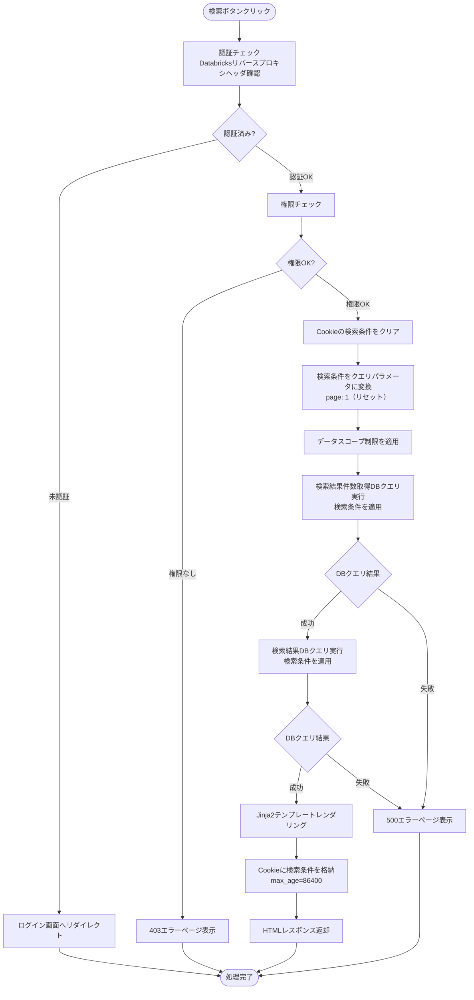
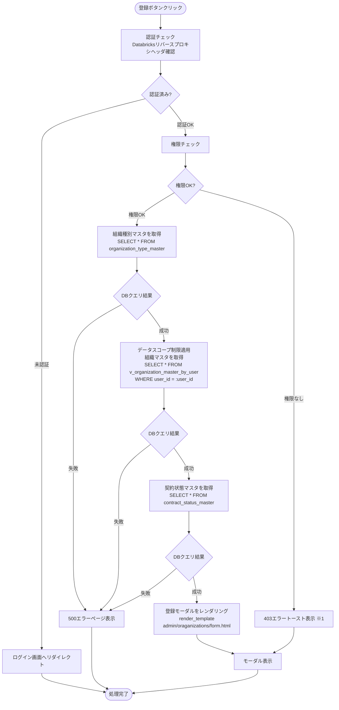
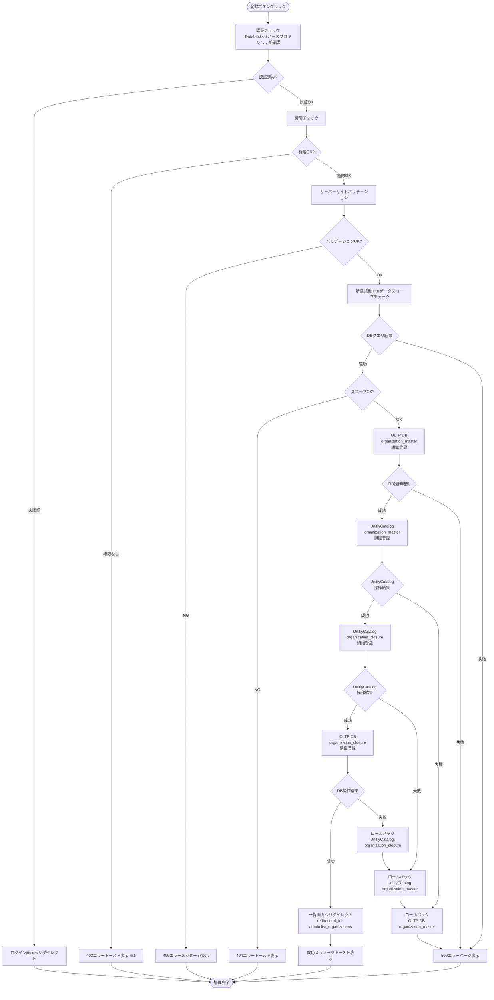
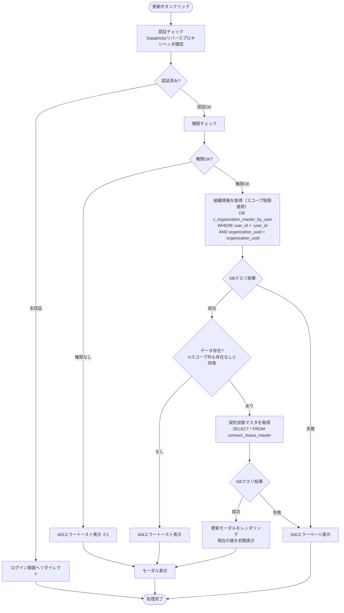
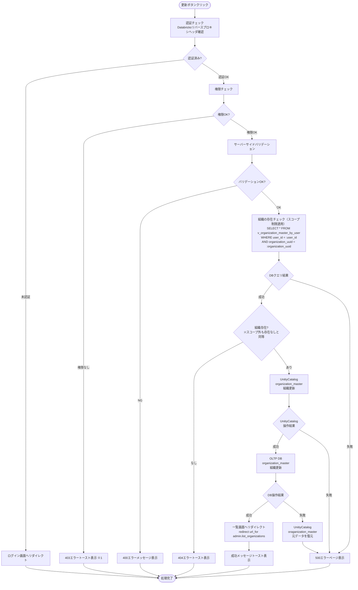
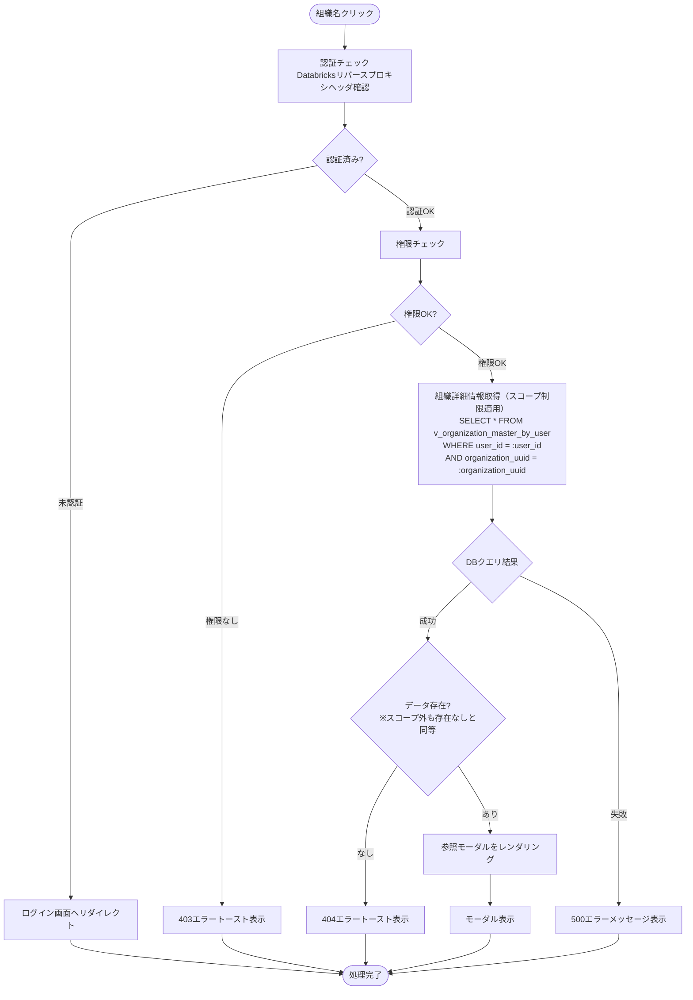
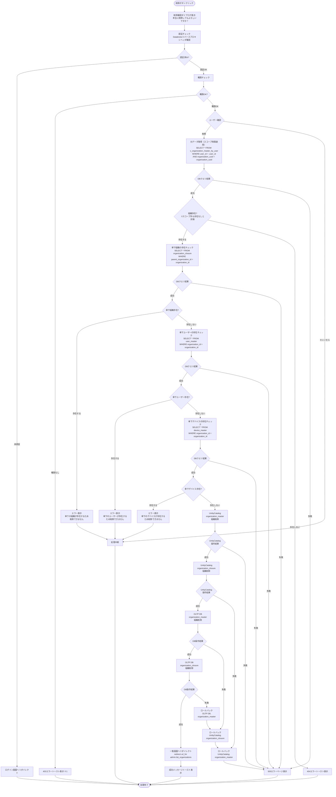

# 組織管理画面 - ワークフロー仕様書

## 📑 目次

- [組織管理画面 - ワークフロー仕様書](#組織管理画面---ワークフロー仕様書)
  - [📑 目次](#-目次)
  - [概要](#概要)
  - [使用するFlaskルート一覧](#使用するflaskルート一覧)
  - [ルート呼び出しマッピング](#ルート呼び出しマッピング)
  - [ワークフロー一覧](#ワークフロー一覧)
    - [初期表示](#初期表示)
      - [処理フロー](#処理フロー)
      - [Flaskルート](#flaskルート)
      - [バリデーション](#バリデーション)
      - [処理詳細（サーバーサイド）](#処理詳細サーバーサイド)
      - [表示メッセージ](#表示メッセージ)
      - [エラーハンドリング](#エラーハンドリング)
      - [ログ出力タイミング](#ログ出力タイミング)
      - [検索条件の保持方法](#検索条件の保持方法)
      - [UI状態](#ui状態)
    - [検索・絞り込み](#検索絞り込み)
      - [処理フロー](#処理フロー-1)
      - [処理詳細（サーバーサイド）](#処理詳細サーバーサイド-1)
      - [表示メッセージ](#表示メッセージ-1)
      - [エラーハンドリング](#エラーハンドリング-1)
      - [ログ出力タイミング](#ログ出力タイミング-1)
      - [検索条件の保持方法](#検索条件の保持方法-1)
      - [UI状態](#ui状態-1)
    - [全体ソート](#全体ソート)
      - [処理詳細](#処理詳細)
    - [ページ内ソート](#ページ内ソート)
      - [処理詳細](#処理詳細-1)
    - [ページング](#ページング)
      - [処理詳細](#処理詳細-2)
      - [UI状態](#ui状態-2)
    - [組織登録](#組織登録)
      - [登録ボタン押下](#登録ボタン押下)
        - [処理フロー](#処理フロー-2)
        - [処理詳細（サーバーサイド）](#処理詳細サーバーサイド-2)
      - [表示メッセージ](#表示メッセージ-2)
      - [エラーハンドリング](#エラーハンドリング-2)
      - [登録実行](#登録実行)
        - [処理フロー](#処理フロー-3)
        - [処理詳細（サーバーサイド）](#処理詳細サーバーサイド-3)
        - [バリデーション](#バリデーション-1)
        - [表示メッセージ](#表示メッセージ-3)
      - [エラーハンドリング](#エラーハンドリング-3)
      - [ログ出力タイミング](#ログ出力タイミング-2)
        - [UI状態](#ui状態-3)
    - [組織更新](#組織更新)
      - [更新画面表示](#更新画面表示)
        - [処理フロー](#処理フロー-4)
        - [処理詳細（サーバーサイド）](#処理詳細サーバーサイド-4)
        - [表示メッセージ](#表示メッセージ-4)
      - [エラーハンドリング](#エラーハンドリング-4)
      - [更新実行](#更新実行)
        - [処理フロー](#処理フロー-5)
        - [処理詳細（サーバーサイド）](#処理詳細サーバーサイド-5)
        - [バリデーション](#バリデーション-2)
        - [表示メッセージ](#表示メッセージ-5)
      - [エラーハンドリング](#エラーハンドリング-5)
      - [ログ出力タイミング](#ログ出力タイミング-3)
        - [UI状態](#ui状態-4)
    - [組織参照](#組織参照)
      - [処理フロー](#処理フロー-6)
      - [処理詳細（サーバーサイド）](#処理詳細サーバーサイド-6)
        - [表示メッセージ](#表示メッセージ-6)
      - [エラーハンドリング](#エラーハンドリング-6)
      - [ログ出力タイミング](#ログ出力タイミング-4)
    - [組織削除](#組織削除)
      - [処理フロー](#処理フロー-7)
        - [処理詳細（サーバーサイド）](#処理詳細サーバーサイド-7)
      - [表示メッセージ](#表示メッセージ-7)
      - [エラーハンドリング](#エラーハンドリング-7)
      - [ログ出力タイミング](#ログ出力タイミング-5)
    - [CSVエクスポート](#csvエクスポート)
        - [処理詳細（サーバーサイド）](#処理詳細サーバーサイド-8)
  - [使用データベース詳細](#使用データベース詳細)
    - [使用テーブル一覧](#使用テーブル一覧)
    - [インデックス最適化](#インデックス最適化)
  - [トランザクション管理](#トランザクション管理)
    - [2層トランザクション整合性保証](#2層トランザクション整合性保証)
      - [基本方針](#基本方針)
    - [トランザクション開始・終了タイミング](#トランザクション開始終了タイミング)
      - [実装パターン: Sagaパターン](#実装パターン-sagaパターン)
  - [セキュリティ実装](#セキュリティ実装)
    - [認証・認可実装](#認証認可実装)
    - [入力検証](#入力検証)
    - [ログ出力ルール](#ログ出力ルール)
  - [関連ドキュメント](#関連ドキュメント)
    - [画面仕様](#画面仕様)
    - [アーキテクチャ設計](#アーキテクチャ設計)
    - [共通仕様](#共通仕様)

---

## 概要

このドキュメントは、組織管理画面のユーザー操作に対する処理フロー、バリデーション実行タイミング、データベース処理の詳細を記載します。

**このドキュメントの役割:**
- ✅ ユーザー操作のトリガー条件
- ✅ 処理フローの詳細（Flaskルート呼び出しシーケンス、フォーム送信、リダイレクト）
- ✅ バリデーション実行タイミング（いつチェックするか）
- ✅ エラーハンドリングフロー
- ✅ サーバーサイド処理詳細（SQL、変数、条件分岐、コード例）
- ✅ データベース利用詳細（トランザクション管理、テーブル操作、インデックス）
- ✅ セキュリティ実装詳細（認証、データスコープ制限、入力検証、ログ出力）

**UI仕様書との役割分担:**
- **UI仕様書**: バリデーションルール定義（何をチェックするか）、UI要素の詳細仕様
- **ワークフロー仕様書**: バリデーション実行タイミング（いつどのようにチェックするか）、処理フロー、サーバーサイド実装詳細

**注:** UI要素の詳細やバリデーションルールは [UI仕様書](./ui-specification.md) を参照してください。

---

## 使用するFlaskルート一覧

この画面で使用するすべてのFlaskルート（エンドポイント）を記載します。

| No | ルート名 | エンドポイント | メソッド | 用途 | レスポンス形式 | 備考 |
|----|---------|---------------|---------|------|---------------|------|
| 1 | 組織一覧表示・ページング | `/admin/organizations` | GET | 組織一覧初期表示・ページング | HTML | pageパラメータなし=初期表示、あり=ページング |
| 2 | 組織一覧検索 | `/admin/organizations` | POST | 組織検索実行 | HTML | 検索条件をCookieに格納 |
| 3 | 組織登録画面 | `/admin/organizations/create` | GET | 組織登録フォーム表示 | HTML（モーダル） | 組織種別・所属組織・契約状態選択肢を含む |
| 4 | 組織登録実行 | `/admin/organizations/register` | POST | 組織登録処理 | リダイレクト (302) | 成功時: `/admin/organizations`、失敗時: フォーム再表示 |
| 5 | 組織参照画面 | `/admin/organizations/<organization_uuid>` | GET | 組織詳細情報表示 | HTML（モーダル） | - |
| 6 | 組織更新画面 | `/admin/organizations/<organization_uuid>/edit` | GET | 組織更新フォーム表示 | HTML（モーダル） | 現在の値を初期表示 |
| 7 | 組織更新実行 | `/admin/organizations/<organization_uuid>/update` | POST | 組織更新処理 | リダイレクト (302) | 成功時: `/admin/organizations` |
| 8 | 組織削除実行 | `/admin/organizations/delete` | POST | 組織削除処理（複数件対応） | リダイレクト (302) | 成功時: `/admin/organizations`、削除対象IDはボディで送信 |
| 9 | CSVエクスポート | `/admin/organizations/export` | POST | 組織一覧CSVダウンロード | CSV | 現在の検索条件を適用 |

**注:**
- **レスポンス形式**:
  - `HTML`: Jinja2テンプレートをレンダリングして返す（`render_template()`）
  - `リダイレクト (302)`: 成功時に別のルートへリダイレクト（`redirect(url_for())`）、失敗時はフォームを再表示
  - `CSV`: CSVファイルをダウンロードレスポンスとして返す
- **Flask Blueprint構成**: `admin_bp` として実装

---

## ルート呼び出しマッピング

| ユーザー操作 | トリガー | 呼び出すルート | パラメータ | レスポンス | エラー時の挙動 |
|-------------|---------|-------------|-----------|-----------|---------------|
| 画面初期表示 | URL直接アクセス | `GET /admin/organizations` | なし | HTML（組織一覧画面） | エラーページ表示 |
| 検索ボタン押下 | フォーム送信 | `POST /admin/organizations` | `organization_name, organization_type_id, contact_person_name, contract_status_id, sort_by, order` | HTML（検索結果画面） | エラーメッセージ表示 |
| ページボタン押下 | リンククリック | `GET /admin/organizations` | `page` | HTML（検索結果画面） | エラーメッセージ表示 |
| 登録ボタン押下 | ボタンクリック | `GET /admin/organizations/create` | なし | HTML（登録モーダル） | エラーページ表示 |
| 登録実行 | フォーム送信 | `POST /admin/organizations/register` | フォームデータ | リダイレクト → `GET /admin/organizations` | フォーム再表示（エラーメッセージ付き） |
| 参照ボタン押下 | ボタンクリック | `GET /admin/organizations/<organization_uuid>` | organization_uuid | HTML（参照モーダル） | 404エラーページ表示 |
| 更新ボタン押下 | ボタンクリック | `GET /admin/organizations/<organization_uuid>/edit` | organization_uuid | HTML（更新モーダル） | 404エラーページ表示 |
| 更新実行 | フォーム送信 | `POST /admin/organizations/<organization_uuid>/update` | フォームデータ | リダイレクト → `GET /admin/organizations` | フォーム再表示（エラーメッセージ付き） |
| 削除実行 | フォーム送信 | `POST /admin/organizations/delete` | organization_uuids（複数可） | リダイレクト → `GET /admin/organizations` | エラーメッセージ表示 |
| CSVエクスポート | ボタンクリック | `POST /admin/organizations/export` | 検索条件 | CSVダウンロード | エラーメッセージ表示 |

---

## ワークフロー一覧

### 初期表示

**トリガー:** URL直接アクセス時（ユーザーが `/admin/organizations` にアクセスしたとき）

**前提条件:**
- ユーザーがログイン済み（Databricks認証完了）
- ユーザーが適切な権限を持っている（システム保守者、管理者、販社ユーザ）

#### 処理フロー


**ルート実装例:**

- `get_default_search_params()` / `search_organizations()` は `organization_service.py` に定義
- Cookie操作は `common` の `get_search_conditions_cookie` / `set_search_conditions_cookie` / `clear_search_conditions_cookie` を使用

```python
# views/admin/organizations.py
@admin_bp.route('/organizations', methods=['GET'])
@require_auth
@require_role('system_admin', 'management_admin', 'sales_company_user')
def organizations_list():
    """初期表示・ページング（統合）"""

    if 'page' not in request.args:
        # 初期表示: デフォルト検索条件
        search_params = get_default_search_params()  # → organization_service
        save_cookie = True
    else:
        # ページング: Cookie から検索条件取得 → page 上書き
        search_params = get_search_conditions_cookie('organizations') or get_default_search_params()
        search_params['page'] = request.args.get('page', 1, type=int)
        save_cookie = False

    try:
        organizations, total = search_organizations(search_params, g.current_user.user_id)  # → organization_service
        organization_types, _, contract_statuses, sort_items = get_organization_form_options(g.current_user.user_id)  # → organization_service
    except Exception:
        abort(500)

    response = make_response(render_template(
        'admin/organizations/list.html',
        organizations=organizations,
        total=total,
        search_params=search_params,
        organization_types=organization_types,
        contract_statuses=contract_statuses,
        sort_items=sort_items,
    ))
    if save_cookie:
        response = clear_search_conditions_cookie(response, 'organizations')
        response = set_search_conditions_cookie(response, 'organizations', search_params)
    return response
```

#### Flaskルート

| ルート | エンドポイント | 詳細 |
|-------|---------------|------|
| 組織一覧表示 | `GET /admin/organizations` | クエリパラメータ: `page` |

#### バリデーション

**実行タイミング:** なし（初期表示のため、デフォルト値を使用）

**データスコープ制限:**
- **フィルタリングロジックは全ユーザーで共通、実質的なアクセス可能範囲に差分あり**
- システム保守者・管理者: すべてのユーザーにアクセス可能
- 販社ユーザ・サービス利用者: ログインユーザーの `organization_id` に紐づく全子組織でフィルタリング

#### 処理詳細（サーバーサイド）

**① 認証・認可チェック**

リバースプロキシヘッダから認証情報を取得し、権限を確認します。

**処理内容:**
- ヘッダ `X-Forwarded-User` からユーザーIDを取得
- データベースから現在ユーザー情報を取得（ユーザー種別、組織ID）
- 組織に応じてデータスコープを決定

**変数・パラメータ:**
- `current_user_id`: string - リバースプロキシヘッダから取得したユーザーID
- `current_user`: User - データベースから取得したユーザーオブジェクト
- `user_type_id`: int - ユーザー種別ID（user_type_masterへの外部キー）
- `organization_id`: string - データスコープ制限用の組織ID

**実装例:**
```python
from flask import request, abort, g
from functools import wraps

def require_auth(f):
    @wraps(f)
    def decorated_function(*args, **kwargs):
        user_id = request.headers.get('X-Forwarded-User')
        if not user_id:
            abort(401)

        user = User.query.filter_by(user_id=user_id, delete_flag=FALSE).first()
        if not user:
            abort(403)

        g.current_user = user
        return f(*args, **kwargs)
    return decorated_function
```

**② クエリパラメータ取得**

```python
page = request.args.get('page', 1, type=int)
per_page = ITEM_PER_PAGE  # 設定ファイルから取得
```

**③ データスコープ制限の適用**

`v_organization_master_by_user` にログインユーザーの `user_id` を渡すことで、アクセス可能な組織配下のデータに自動的に絞り込まれます。

詳細な実装仕様は[認証・認可実装](#認証認可実装)を参照してください。

**④ データベースクエリ実行**

組織マスタからデータを取得します。

**使用テーブル:** v_organization_master_by_user（組織一覧用VIEW）、organization_type_master（組織種別マスタ）、contract_status_master（契約状態マスタ）

**SQL詳細:**
- 検索結果件数取得DBクエリ
```sql
SELECT
  COUNT(organization_id) AS data_count
FROM
  v_organization_master_by_user
WHERE
  user_id = :user_id
  AND delete_flag = FALSE
```

- 検索結果取得DBクエリ
```sql
SELECT
  o.organization_name,
  o.organization_type_id,
  t.organization_type_name,
  o.address,
  o.phone_number,
  o.contact_person_name,
  o.contract_status_id,
  c.contract_status_name
FROM
  v_organization_master_by_user o
LEFT JOIN organization_type_master t
  ON o.organization_type_id = t.organization_type_id
  AND t.delete_flag = FALSE
LEFT JOIN contract_status_master c
  ON o.contract_status_id = c.contract_status_id
  AND c.delete_flag = FALSE
WHERE
  o.user_id = :user_id
  AND o.delete_flag = FALSE
ORDER BY
  o.organization_id ASC
LIMIT :item_per_page OFFSET 0
```

**実装例:**
```python
# services/organization_service.py

def get_default_search_params() -> dict:
    """組織一覧検索のデフォルトパラメータを返す"""
    return {
        'page': 1,
        'per_page': ITEM_PER_PAGE,
        'sort_by': '',
        'order': '',
        'organization_name': '',
        'organization_type_id': None,
        'contact_person_name': '',
        'contract_status_id': None,
    }


def search_organizations(search_params: dict, user_id: int) -> tuple[list, int]:
    """組織一覧をスコープ制限付きで検索する

    Args:
        search_params: 検索条件（page, per_page, sort_by, order, 各検索項目）
        user_id: ログインユーザーID（スコープ制限に使用）

    Returns:
        (organizations, total): 組織リストと総件数のタプル
    """
    page = search_params['page']
    per_page = search_params['per_page']
    sort_by = search_params['sort_by']
    order = search_params['order']
    offset = (page - 1) * per_page

    query = db.session.query(OrganizationMasterByUser).filter(
        OrganizationMasterByUser.user_id == user_id,
        OrganizationMasterByUser.delete_flag == False,
    )

    sort_col = getattr(OrganizationMasterByUser, sort_by, None)
    # 検索条件フィルタ（フロー2: 検索・絞り込みでも共用）
    if search_params.get('organization_name'):
        query = query.filter(OrganizationMasterByUser.organization_name.like(f"%{search_params['organization_name']}%"))
    if search_params.get('organization_type_id') is not None:
        query = query.filter(OrganizationMasterByUser.organization_type_id == search_params['organization_type_id'])
    if search_params.get('contact_person_name'):
        query = query.filter(OrganizationMasterByUser.contact_person_name.like(f"%{search_params['contact_person_name']}%"))
    if search_params.get('contract_status_id') is not None:
        query = query.filter(OrganizationMasterByUser.contract_status_id == search_params['contract_status_id'])

    if sort_col is None:
        query = query.order_by(OrganizationMasterByUser.organization_id.asc())
    else:
        query = query.order_by(
                sort_col.asc() if order == 'asc' else sort_col.desc(),
                OrganizationMasterByUser.organization_id.asc(),
            )

    total = query.count()
    organizations = query.limit(per_page).offset(offset).all()
    return organizations, total
```

**⑤ HTMLレンダリング**

Jinja2テンプレートをレンダリングしてHTMLレスポンスを返却します。

**実装例:**
```python
# views/admin/organizations.py（organizations_list 内）
return responese # make_response + render_template は上記ルート実装例を参照
```

#### 表示メッセージ

| メッセージID | 表示内容 | 表示タイミング | 表示場所 |
|-------------|---------|---------------|---------|
| - | この操作を実行する権限がありません | 権限不足時 | エラーページ |
| - | データの取得に失敗しました | DBクエリ失敗時 | エラーページ |

#### エラーハンドリング

| HTTPステータス | エラー種別 | 処理内容 | 表示内容 |
|--------------|-----------|---------|---------|
| 401 | 認証エラー | ログイン画面へリダイレクト | - |
| 403 | 権限エラー | 403エラーページ表示 | この操作を実行する権限がありません |
| 500 | データベースエラー | 500エラーページ表示 | データの取得に失敗しました |

#### ログ出力タイミング

DBクエリ実行の直前、直後に操作ログを出力する

#### 検索条件の保持方法

Cookieに検索条件を保持する

#### UI状態

- 検索条件: デフォルト値
  - 組織名: 空
  - 組織種別: すべて
  - 担当者名: 空
  - 契約状態: すべて
  - ソート項目: 空
  - ソート順: 空
- テーブル: 組織一覧データ表示
- ページネーション: 1ページ目を選択状態

---

### 検索・絞り込み

**トリガー:** (2.7) 検索ボタンクリック（フォーム送信）

**前提条件:**
- 検索条件が入力されている（空でも可）

#### 処理フロー



#### 処理詳細（サーバーサイド）

**検索クエリ実行**
**使用テーブル:** v_organization_master_by_user（組織一覧用VIEW）、organization_type_master（組織種別マスタ）、contract_status_master（契約状態マスタ）

**SQL詳細:**
- 検索結果件数取得DBクエリ
```sql
SELECT
  COUNT(organization_id) AS data_count
FROM
  v_organization_master_by_user o
LEFT JOIN organization_type_master t
  ON o.organization_type_id = t.organization_type_id
  AND t.delete_flag = FALSE
LEFT JOIN contract_status_master c
  ON o.contract_status_id = c.contract_status_id
  AND c.delete_flag = FALSE
WHERE
  o.user_id = :user_id
  AND o.delete_flag = FALSE
  AND CASE WHEN :organization_name IS NULL THEN TRUE ELSE o.organization_name LIKE CONCAT('%', :organization_name, '%') END
  AND CASE WHEN :organization_type_id IS NULL THEN TRUE ELSE o.organization_type_id = :organization_type_id END
  AND CASE WHEN :contact_person_name IS NULL THEN TRUE ELSE o.contact_person_name LIKE CONCAT('%', :contact_person_name, '%') END
  AND CASE WHEN :contract_status_id IS NULL THEN TRUE ELSE o.contract_status_id = :contract_status_id END
```

- 検索結果取得DBクエリ
```sql
SELECT
  o.organization_name,
  o.organization_type_id,
  t.organization_type_name,
  o.address,
  o.phone_number,
  o.contact_person_name,
  o.contract_status_id,
  c.contract_status_name
FROM
  v_organization_master_by_user o
LEFT JOIN organization_type_master t
  ON o.organization_type_id = t.organization_type_id
  AND t.delete_flag = FALSE
LEFT JOIN contract_status_master c
  ON o.contract_status_id = c.contract_status_id
  AND c.delete_flag = FALSE
WHERE
  o.user_id = :user_id
  AND o.delete_flag = FALSE
  AND CASE WHEN :organization_name IS NULL THEN TRUE ELSE o.organization_name LIKE CONCAT('%', :organization_name, '%') END
  AND CASE WHEN :organization_type_id IS NULL THEN TRUE ELSE o.organization_type_id = :organization_type_id END
  AND CASE WHEN :contact_person_name IS NULL THEN TRUE ELSE o.contact_person_name LIKE CONCAT('%', :contact_person_name, '%') END
  AND CASE WHEN :contract_status_id IS NULL THEN TRUE ELSE o.contract_status_id = :contract_status_id END
ORDER BY
  {sort_by} {order}
LIMIT :item_per_page OFFSET (:page -1) * :item_per_page
```

**実装例:**

- `search_organizations()` はフロー1と共用（フィルタ条件はすべてサービス内で処理）
- `OrganizationSearchForm` は `forms/organization.py` に定義
- Cookie操作は共通関数を使用

```python
# forms/organization.py
class OrganizationSearchForm(FlaskForm):
    organization_name    = StringField('組織名')
    organization_type_id = StringField('組織種別')
    contact_person_name  = StringField('担当者名')
    contract_status_id   = StringField('契約状態')
    sort_by              = SelectField('ソート項目', coerce=str)   # 選択肢は sort_item_master から動的取得（空白=デフォルトソート）
    order                = SelectField('ソート順', coerce=str, choices=[('', ''), ('asc', '昇順'), ('desc', '降順')])
```

```python
# views/admin/organizations.py
@admin_bp.route('/organizations', methods=['POST'])
@require_auth
@require_role('system_admin', 'management_admin', 'sales_company_user')
def search_organizations_view():
    form = OrganizationSearchForm(request.form)
    if not form.validate():
        abort(400)

    search_params = {
        'page': 1,
        'per_page': ITEM_PER_PAGE,
        'sort_by': form.sort_by.data or '',   # 空白選択時はデフォルトソート（組織ID昇順）
        'order': form.order.data or '',
        'organization_name': form.organization_name.data or '',
        'organization_type_id': form.organization_type_id.data,
        'contact_person_name': form.contact_person_name.data or '',
        'contract_status_id': form.contract_status_id.data,
    }

    try:
        organizations, total = search_organizations(search_params, g.current_user.user_id)  # → organization_service
        organization_types, _, contract_statuses, sort_items = get_organization_form_options(g.current_user.user_id)  # → organization_service
    except Exception:
        abort(500)

    response = make_response(render_template(
        'admin/organizations/list.html',
        organizations=organizations,
        total=total,
        search_params=search_params,
        organization_types=organization_types,
        contract_statuses=contract_statuses,
        sort_items=sort_items,
    ))
    response = clear_search_conditions_cookie(response, 'organizations')
    response = set_search_conditions_cookie(response, 'organizations', search_params)
    return response
```

#### 表示メッセージ

| メッセージID | 表示内容 | 表示タイミング | 表示場所 |
|-------------|---------|---------------|---------|
| - | この操作を実行する権限がありません | 権限不足時 | エラートースト |
| - | データの取得に失敗しました | DBクエリ失敗時 | エラーページ |

#### エラーハンドリング

| HTTPステータス | エラー種別 | 処理内容 | 表示内容 |
|--------------|-----------|---------|---------|
| 401 | 認証エラー | ログイン画面へリダイレクト | - |
| 403 | 権限エラー | 403エラートースト表示 | この操作を実行する権限がありません |
| 500 | データベースエラー | 500エラーページ表示 | データの取得に失敗しました |

#### ログ出力タイミング

DBクエリ実行の直前、直後に操作ログを出力する

#### 検索条件の保持方法

Cookieに検索条件を保持する

#### UI状態
- 検索条件: 入力値を保持（フォームに再設定）
- テーブル: 検索結果データ表示
- ページネーション: 1ページ目を選択状態

---

### 全体ソート

**トリガー:** (2) 検索条件欄でソート項目、ソート順ドロップダウンで具体値を選択し、検索を実行

#### 処理詳細

検索条件欄のソート項目ドロップダウンで選択した内容に対して、ソート順ドロップダウンで選択した順序でページをまたいだソートを行う。
詳細は[共通仕様書](../../common/common-specification.md)参照のこと。

---

### ページ内ソート

**トリガー:**（6）データテーブルのソート可能カラム（組織名、組織種別、住所、電話番号、担当者名、契約状態、操作）のヘッダをクリック

#### 処理詳細

データテーブルのヘッダをクリックすることで、ページ内で閉じたソートを行う。
詳細は[共通仕様書](../../common/common-specification.md)参照のこと

---

### ページング

**トリガー:** (6.9) ページネーションのページ番号ボタンクリック

#### 処理詳細

ページネーションのページ番号を選択することで、選択されたページ番号に対応するデータをデータテーブルに表示する。
具体的な処理は[初期表示](#初期表示)の処理と同様とする。

#### UI状態

- 検索条件: 保持
- ソート条件: 保持
- テーブル: 選択ページのデータ表示
- ページネーション: 選択ページをアクティブ状態

---

### 組織登録

#### 登録ボタン押下

**トリガー:** (3.1) 登録ボタンクリック

**前提条件:**
- ユーザーが適切な権限を持っている（システム保守者、管理者、販社ユーザ）

##### 処理フロー



※1　403エラー発生時、ドロップダウン、テキストボックスに具体的なデータは表示せず、空で表示する。

##### 処理詳細（サーバーサイド）

**実装例:**

- `get_organization_form_options()` は `organization_service.py` に定義（フロー5: 更新ボタン押下でも共用）

```python
# services/organization_service.py
def get_organization_form_options(user_id: int) -> tuple[list, list, list, list]:
    """検索・登録・更新フォーム用マスターデータを取得する

    Args:
        user_id: ログインユーザーID（組織スコープ制限に使用）

    Returns:
        (organization_types, organizations, contract_statuses, sort_items)
    """
    organization_types = db.session.query(OrganizationType).filter(
        OrganizationType.delete_flag == False,
    ).order_by(OrganizationType.organization_type_id).all()

    organizations = db.session.query(OrganizationMasterByUser).filter(
        OrganizationMasterByUser.user_id == user_id,
        OrganizationMasterByUser.delete_flag == False,
    ).order_by(OrganizationMasterByUser.organization_id).all()

    contract_statuses = db.session.query(ContractStatus).filter(
        ContractStatus.delete_flag == False,
    ).order_by(ContractStatus.contract_status_id).all()

    # TODO: 組織一覧画面の view_id を sort_item_master 初期データに追加後、定数化すること
    ORGANIZATION_LIST_VIEW_ID = None  # TODO: view_id 未定義。app-database-specification.md の sort_item_master 初期データに追加が必要
    sort_items = db.session.query(SortItem).filter(
        SortItem.view_id == ORGANIZATION_LIST_VIEW_ID,
        SortItem.delete_flag == False,
    ).order_by(SortItem.sort_order).all()

    return organization_types, organizations, contract_statuses, sort_items
```

```python
# views/admin/organizations.py
@admin_bp.route('/organizations/create', methods=['GET'])
@require_auth
@require_role('system_admin', 'management_admin', 'sales_company_user')
def create_organization_form():
    try:
        organization_types, organizations, contract_statuses, _ = get_organization_form_options(g.current_user.user_id)  # → organization_service（sort_itemsは登録フォームでは不要）
    except Exception:
        abort(500)

    return render_template(
        'admin/organizations/form.html',
        mode='create',
        organization_types=organization_types,
        organizations=organizations,
        contract_statuses=contract_statuses,
    )
```

#### 表示メッセージ

| メッセージID | 表示内容 | 表示タイミング | 表示場所 |
|-------------|---------|---------------|---------|
| - | この操作を実行する権限がありません | 権限不足時 | エラートースト |
| - | データの取得に失敗しました | DBクエリ失敗時 | エラーページ |

#### エラーハンドリング

| HTTPステータス | エラー種別 | 処理内容 | 表示内容 |
|--------------|-----------|---------|---------|
| 401 | 認証エラー | ログイン画面へリダイレクト | - |
| 403 | 権限エラー | 403エラートースト表示 | この操作を実行する権限がありません |
| 500 | データベースエラー | 500エラーページ表示 | データの取得に失敗しました |

---

#### 登録実行

**トリガー:** (7.12) 登録ボタンクリック（モーダル内）クリック後に表示される登録実施確認モーダルで「はい」を選択

##### 処理フロー



※1　403エラー発生時、登録モーダルを閉じる。

---

##### 処理詳細（サーバーサイド）

**実装例:**
```python
# forms/organization.py
class OrganizationCreateForm(FlaskForm):
    organization_name = StringField('組織名', validators=[
        DataRequired(message='組織名は必須です'),
        Length(min=1, max=200, message='組織名は200文字以内で入力してください'),
    ])
    organization_type_id = StringField('組織種別', validators=[
        DataRequired(message='組織種別は必須です'),
    ])
    affiliated_organization_id = StringField('所属組織', validators=[
        DataRequired(message='所属組織は必須です'),
    ])
    address = StringField('住所', validators=[
        DataRequired(message='住所は必須です'),
        Length(min=1, max=500, message='住所は500文字以内で入力してください'),
    ])
    phone_number = StringField('電話番号', validators=[
        DataRequired(message='電話番号は必須です'),
        Phone(message='電話番号の形式が正しくありません'),
        Length(max=20, message='電話番号は20文字以内で入力してください'),
    ])
    fax_number = StringField('FAX', validators=[
        Optional(),  # 任意
        Phone(message='FAXの形式が正しくありません'),
        Length(max=20, message='FAXは20文字以内で入力してください'),
    ])
    contact_person = StringField('担当者', validators=[
        DataRequired(message='担当者は必須です'),
        Length(min=1, max=20, message='担当者は20文字以内で入力してください'),
    ])
    contract_status_id = StringField('契約状態', validators=[
        DataRequired(message='契約状態は必須です'),
    ])
    contract_start_date = StringField('契約開始日', validators=[
        DataRequired(message='契約開始日は必須です'),
        Date(message='契約開始日の形式が正しくありません'),
    ])
    contract_end_date = StringField('契約終了日', validators=[
        Optional(),  # 任意
        Date(message='契約終了日の形式が正しくありません'),
        DateDiff(message='契約終了日は契約開始日以降の日付を入力してください'),
    ])

# services/organization_service.py
def check_organization_id_scope(user_id: int, organization_id: int) -> bool:
    """組織IDデータスコープチェック

    Args:
        user_id: ログインユーザーID（スコープ制限に使用）
        organization_id: チェック対象の組織ID

    Returns:
        True=スコープOK, False=スコープNG
    """
    return OrganizationMasterByUser.query.filter_by(
        user_id=user_id,
        organization_id=organization_id,
        delete_flag=False,
    ).first() is not None

def _insert_unity_catalog_organization(organization_id: int, organization_uuid: str, organization_data: dict, creator_id: int) -> None:
    """UC organization_master に新規レコードを INSERT する"""
    uc = UnityCatalogConnector()
    uc.execute_dml(
        """
        INSERT INTO iot_catalog.oltp_db.organization_master (
            organization_id, organization_name, organization_type_id, address, phone_number,
            fax_number, contact_person, contract_status_id, contract_start_date,
            contract_end_date, organization_uuid,
            create_date, creator, update_date, modifier, delete_flag
        ) VALUES (
            :organization_id, :organization_name, :organization_type_id, :address, :phone_number,
            :fax_number, :contact_person, :contract_status_id, :contract_start_date,
            :contract_end_date, :organization_uuid,
            CURRENT_TIMESTAMP(), :creator_id, CURRENT_TIMESTAMP(), :creator_id, FALSE
        )
        """,
        {
            'organization_id':       organization_id,
            'organization_name':     organization_data['organization_name'],
            'organization_type_id':  organization_data['organization_type_id'],
            'address':               organization_data['address'],
            'phone_number':          organization_data['phone_number'],
            'fax_number':            organization_data['fax_number'],
            'contact_person':        organization_data['contact_person'],
            'contract_status_id':    organization_data['contract_status_id'],
            'contract_start_date':   organization_data['contract_start_date'],
            'contract_end_date':     organization_data['contract_end_date'],
            'organization_uuid':   organization_uuid,
            'creator_id':            creator_id,
        },
        operation="UC organization_master INSERT",
    )

def _insert_unity_catalog_organization_closure(organization_id: int, affiliated_organization_id: int) -> None:
    """UC organization_closure に新規レコードを INSERT する"""
    uc = UnityCatalogConnector()

    # ① 自己参照レコードを INSERT する
    uc.execute_dml(
        """
        INSERT INTO iot_catalog.oltp_db.organization_closure (
            parent_organization_id, subsidiary_organization_id, depth
        ) VALUES (
            :organization_id, :organization_id, 0
        )
        """,
        {
            'organization_id': organization_id,
        },
        operation="UC organization_closure INSERT",
    )

    # ② 全親組織 → 新規組織への経路を INSERT する
    uc.execute_dml(
        """
        INSERT INTO iot_catalog.oltp_db.organization_closure (
            parent_organization_id, subsidiary_organization_id, depth
        ) SELECT
            oc.parent_organization_id,
            :organization_id,
            oc.depth + 1
        FROM
            organization_closure oc
        WHERE
            oc.subsidiary_organization_id = :affiliated_organization_id;
        """,
        {
            'organization_id': organization_id,
            'affiliated_organization_id': affiliated_organization_id,
        }
    )


def _rollback_create_organization(organization_id: int | None) -> None:
    """UC への INSERT を逆順で削除する補償トランザクション（ベストエフォート）"""
    try:
        if organization_id is not None:
            uc = UnityCatalogConnector()
            uc.execute_dml(
                "DELETE FROM iot_catalog.oltp_db.organization_closure WHERE parent_organization_id = :id OR subsidiary_organization_id = :id",
                {'id': organization_id},
                operation="UC organization_closure 登録ロールバック",
            )
            uc.execute_dml(
                "DELETE FROM iot_catalog.oltp_db.organization_master WHERE organization_id = :organization_id",
                {'organization_id': organization_id},
                operation="UC organization_master 登録ロールバック",
            )
    except Exception:
        logger.error("組織登録ロールバック失敗", exc_info=True)


def create_organization(organization_data: dict, creator_id: int) -> None:
    """組織登録（Sagaパターン）

    Args:
        organization_data: フォームから取得した組織データ
        creator_id: 登録者のユーザーID

    Returns:
        None

    Raises:
        Exception: 登録処理失敗時（ロールバック済み）
    """
    organization_id = None
    organization_uuid = str(uuid.uuid4())

    try:
        # ① OLTP DB organization_master INSERT
        organization = Organization(
            organization_uuid=organization_uuid,
            organization_name=organization_data['organization_name'],
            organization_type_id=organization_data['organization_type_id'],
            address=organization_data['address'],
            phone_number=organization_data['phone_number'],
            fax_number=organization_data['fax_number'],
            contact_person=organization_data['contact_person'],
            contract_status_id=organization_data['contract_status_id'],
            contract_start_date=organization_data['contract_start_date'],
            contract_end_date=organization_data['contract_end_date'],
            creator=creator_id,
            modifier=creator_id,
        )
        db.session.add(organization)
        db.session.flush()
        organization_id = organization.organization_id

        # ② Unity Catalog organization_master INSERT
        _insert_unity_catalog_organization(organization_id, organization_uuid, organization_data, creator_id)

        # ③ Unity Catalog organization_closure INSERT
        _insert_unity_catalog_organization_closure(organization_id, organization_data['affiliated_organization_id'])

        # ④ OLTP DB organization_closure INSERT
        # ④-1 自己参照レコードを INSERT する
        db.session.execute(
            text("""
                INSERT INTO organization_closure (
                    parent_organization_id, subsidiary_organization_id, depth
                ) VALUES (
                    :organization_id, :organization_id, 0
                )
            """),
            {'organization_id': organization_id},
        )

        # ④-2 全親組織 → 新規組織への経路を INSERT する
        db.session.execute(
            text("""
                INSERT INTO organization_closure (
                    parent_organization_id, subsidiary_organization_id, depth
                )
                SELECT
                    oc.parent_organization_id,
                    :organization_id,
                    oc.depth + 1
                FROM
                    organization_closure oc
                WHERE
                    oc.subsidiary_organization_id = :affiliated_organization_id
            """),
            {
                'organization_id': organization_id,
                'affiliated_organization_id': organization_data['affiliated_organization_id'],
            },
        )

        # ⑤ OLTP DB COMMIT
        db.session.commit()

    except Exception:
        db.session.rollback()
        _rollback_create_organization(organization_id)
        raise


# views/admin/organizations.py
@admin_bp.route('/organizations/register', methods=['POST'])
@require_auth
@require_role('system_admin', 'management_admin', 'sales_company_user')
def create_organization_view():
    form = OrganizationCreateForm(request.form)
    if not form.validate():
        return render_template('admin/organizations/form.html', mode='create', form=form), 400

    try:
        scope = check_organization_id_scope(g.current_user.user_id, form.affiliated_organization_id.data)  # → organization_service
    except Exception:
        abort(500)
    if not scope:
        abort(404)

    organization_data = {
        'organization_name': form.organization_name.data,
        'organization_type_id': form.organization_type_id.data,
        'affiliated_organization_id': form.affiliated_organization_id.data,
        'address': form.address.data,
        'phone_number': form.phone_number.data,
        'fax_number': form.fax_number.data,
        'contact_person': form.contact_person.data,
        'contract_status_id': form.contract_status_id.data,
        'contract_start_date': form.contract_start_date.data,
        'contract_end_date': form.contract_end_date.data,
    }

    try:
        create_organization(organization_data, g.current_user.user_id)  # → organization_service
    except Exception:
        abort(500)
    
    flash('組織情報を登録しました', 'success')

    return redirect(url_for('admin.organizations.organizations_list'))
```

##### バリデーション

**実行タイミング:** 登録ボタンクリック直後（サーバーサイド）

**バリデーションルール:** [UI仕様書](./ui-specification.md) の要素詳細 (7) 組織登録/更新モーダル > バリデーション を参照

##### 表示メッセージ

| メッセージID | 表示内容 | 表示タイミング | 表示場所 |
|-------------|---------|---------------|---------|
| - | 組織情報を登録しました | 組織登録成功時 | 成功トースト |
| - | 組織の登録に失敗しました | API呼び出し失敗時、DB操作失敗時 | エラートースト |
| - | この操作を実行する権限がありません | 権限不足時 | エラートースト |
| - | 指定された所属組織が見つかりません | リソース不在時 | エラートースト |
| - | データの取得に失敗しました | DBクエリ失敗時 | エラーページ |

#### エラーハンドリング

| HTTPステータス | エラー種別 | 処理内容 | 表示内容 |
|--------------|-----------|---------|---------|
| 400 | バリデーションエラー | フォーム再表示（エラーメッセージ表示） | バリデーションエラーメッセージ |
| 401 | 認証エラー | ログイン画面へリダイレクト | - |
| 403 | 権限エラー | 403エラートースト表示 | この操作を実行する権限がありません |
| 404 | リソース不在 | 404エラートースト表示 | 指定された所属組織が見つかりません |
| 500 | データベースエラー | 500エラーページ表示 | データの取得に失敗しました |

#### ログ出力タイミング

DBクエリ実行の直前、直後に操作ログを出力する

##### UI状態

モーダル: 閉じる（成功時/エラー時）

---

### 組織更新

#### 更新画面表示

**トリガー:** (6.8) 更新ボタンクリック

##### 処理フロー



※1　403エラー発生時、ドロップダウン、テキストボックスに具体的なデータは表示せず、空で表示する。

##### 処理詳細（サーバーサイド）

**実装例:**
```python
# services/organization_service.py
def get_organization_by_databricks_id(organization_uuid: str, user_id: int):
    """組織情報を取得（スコープ制限適用）

    フロー5（更新ボタン押下）・フロー6（更新実行）で共用。

    Args:
        organization_uuid: 取得対象のDatabricksグループID
        user_id: ログインユーザーID（スコープ制限に使用）

    Returns:
        OrganizationMasterByUser or None（スコープ外・存在しない場合）
    """
    return db.session.query(OrganizationMasterByUser).filter(
        OrganizationMasterByUser.user_id == user_id,
        OrganizationMasterByUser.organization_uuid == organization_uuid,
        OrganizationMasterByUser.delete_flag == False,
    ).first()

# get_organization_form_options(user_id) → フロー3定義済み、共用

# views/admin/organizations.py
@admin_bp.route('/organizations/<organization_uuid>/edit', methods=['GET'])
@require_auth
@require_role('system_admin', 'management_admin', 'sales_company_user')
def edit_organization_form(organization_uuid):
    try:
        organization = get_organization_by_databricks_id(organization_uuid, g.current_user.user_id)  # → organization_service
    except Exception:
        abort(500)
    if not organization:
        abort(404)

    try:
        organization_types, organizations, contract_statuses, _ = get_organization_form_options(g.current_user.user_id)  # → organization_service（フロー3と共用、sort_itemsは登録フォームでは不要）
    except Exception:
        abort(500)

    return render_template(
        'admin/organizations/form.html',
        mode='edit',
        organization=organization,
        organization_types=organization_types,
        organizations=organizations,
        contract_statuses=contract_statuses,
    )
```

##### 表示メッセージ

| メッセージID | 表示内容 | 表示タイミング | 表示場所 |
|-------------|---------|---------------|---------|
| - | この操作を実行する権限がありません | 権限不足時 | エラートースト |
| - | 指定された組織が見つかりません | リソース不在時 | エラートースト |
| - | データの取得に失敗しました | DBクエリ失敗時 | エラーページ |

#### エラーハンドリング

| HTTPステータス | エラー種別 | 処理内容 | 表示内容 |
|--------------|-----------|---------|---------|
| 401 | 認証エラー | ログイン画面へリダイレクト | - |
| 403 | 権限エラー | 403エラートースト表示 | この操作を実行する権限がありません |
| 404 | リソース不在 | 404エラートースト表示 | 指定された組織が見つかりません |
| 500 | データベースエラー | 500エラーページ表示 | データの取得に失敗しました |

---

#### 更新実行

**トリガー:** (7.12) 更新ボタン（モーダル内）クリック後に表示される更新実行確認モーダルで「はい」を選択

##### 処理フロー



※1　403エラー発生時、更新モーダルを閉じる。

**注:** 組織更新時にDatabricks API連携は不要

##### 処理詳細（サーバーサイド）

**実装例:**
```python
# forms/organization.py
class OrganizationUpdateForm(FlaskForm):
    organization_name = StringField('組織名', validators=[
        DataRequired(message='組織名は必須です'),
        Length(min=1, max=200, message='組織名は200文字以内で入力してください'),
    ])
    organization_type_id = StringField('組織種別', validators=[
        DataRequired(message='組織種別は必須です'),
    ])
    address = StringField('住所', validators=[
        DataRequired(message='住所は必須です'),
        Length(min=1, max=500, message='住所は500文字以内で入力してください'),
    ])
    phone_number = StringField('電話番号', validators=[
        DataRequired(message='電話番号は必須です'),
        Phone(message='電話番号の形式が正しくありません'),
        Length(max=20, message='電話番号は20文字以内で入力してください'),
    ])
    fax_number = StringField('FAX', validators=[
        Optional(),  # 任意
        Phone(message='FAXの形式が正しくありません'),
        Length(max=20, message='FAXは20文字以内で入力してください'),
    ])
    contact_person = StringField('担当者', validators=[
        DataRequired(message='担当者は必須です'),
        Length(min=1, max=20, message='担当者は20文字以内で入力してください'),
    ])
    contract_status_id = StringField('契約状態', validators=[
        DataRequired(message='契約状態は必須です'),
    ])
    contract_start_date = StringField('契約開始日', validators=[
        DataRequired(message='契約開始日は必須です'),
        Date(message='契約開始日の形式が正しくありません'),
    ])
    contract_end_date = StringField('契約終了日', validators=[
        Optional(),  # 任意
        Date(message='契約終了日の形式が正しくありません'),
        DateDiff(message='契約終了日は契約開始日以降の日付を入力してください'),
    ])


# services/organization_service.py
# get_organization_by_databricks_id(organization_uuid, user_id) → フロー5定義済み、共用

def _update_unity_catalog_organization(organization_id: int, organization_data: dict, modifier_id: int) -> None:
    """UC organization_master の更新可能項目を UPDATE する"""
    uc = UnityCatalogConnector()
    uc.execute_dml(
        """
        UPDATE iot_catalog.oltp_db.organization_master
        SET organization_name=:organization_name, organization_type_id=:organization_type_id, address=:address,
            phone_number=:phone_number, fax_number=:fax_number, contact_person=:contact_person,
            contract_status_id=:contract_status_id, contract_start_date=:contract_start_date, contract_end_date=:contract_end_date,
            update_date=CURRENT_TIMESTAMP(), modifier=:modifier_id
        WHERE organization_id=:organization_id
        """,
        {
            'organization_name':     organization_data['organization_name'],
            'organization_type_id':  organization_data['organization_type_id'],
            'address':               organization_data['address'],
            'phone_number':          organization_data['phone_number'],
            'fax_number':            organization_data['fax_number'],
            'contact_person':        organization_data['contact_person'],
            'contract_status_id':    organization_data['contract_status_id'],
            'contract_start_date':   organization_data['contract_start_date'],
            'contract_end_date':     organization_data['contract_end_date'],
            'modifier_id':           modifier_id,
            'organization_id':       organization_id,
        },
        operation="UC organization_master UPDATE",
    )


def _rollback_update_organization(organization_id: int) -> None:
    """Databricks/UC を元データで復元する（db.session.rollback() 後に呼ぶこと）

    db.session.rollback() 後は OLTP が元データに戻っているため、
    OLTP から元値を取得して Databricks と UC を復元する。
    ロールバック自体の失敗はログ出力のみでエラーを握りつぶす（ベストエフォート）。
    """
    try:
        original = Organization.query.get(organization_id)
        if not original:
            return
        uc = UnityCatalogConnector()
        uc.execute_dml(
            """
            UPDATE iot_catalog.oltp_db.organization_master
            SET organization_name=:organization_name, organization_type_id=:organization_type_id, address=:address,
                phone_number=:phone_number, fax_number=:fax_number, contact_person=:contact_person,
                contract_status_id=:contract_status_id, contract_start_date=:contract_start_date, contract_end_date=:contract_end_date,
                update_date=CURRENT_TIMESTAMP(), modifier=:modifier
            WHERE organization_id=:organization_id
            """,
            {
                'organization_name':     original.organization_name,
                'organization_type_id':  original.organization_type_id,
                'address':               original.address,
                'phone_number':          original.phone_number,
                'fax_number':            original.fax_number,
                'contact_person':        original.contact_person,
                'contract_status_id':    original.contract_status_id,
                'contract_start_date':   original.contract_start_date,
                'contract_end_date':     original.contract_end_date,
                'modifier':              original.modifier,
                'organization_id':       organization_id,
            },
            operation="UC organization_master 更新ロールバック",
        )
    except Exception:
        logger.error("組織更新ロールバック失敗", exc_info=True)


def _update_oltp_organization(organization_id: int, organization_data: dict, modifier_id: int) -> None:
    """OLTP DB organization_master を UPDATE する"""
    organization = Organization.query.get(organization_id)
    organization.organization_name = organization_data['organization_name']
    organization.organization_type_id = organization_data['organization_type_id']
    organization.address = organization_data['address']
    organization.phone_number = organization_data['phone_number']
    organization.fax_number = organization_data['fax_number']
    organization.contact_person = organization_data['contact_person']
    organization.contract_status_id = organization_data['contract_status_id']
    organization.contract_start_date = organization_data['contract_start_date']
    organization.contract_end_date = organization_data['contract_end_date']
    organization.modifier = modifier_id
    db.session.flush()


def update_organization(organization_id: int, organization_data: dict, modifier_id: int) -> None:
    """組織更新（Sagaパターン）

    Args:
        organization_id: 対象組織ID（OLTP/UC更新に使用）
        organization_data: 更新データ（新値）
        modifier_id: 更新者ID

    Raises:
        Exception: 更新失敗時（ロールバック済み）
    """
    try:
        # ① UC organization_master更新
        _update_unity_catalog_organization(organization_id, organization_data, modifier_id)

        # ② OLTP DB更新
        _update_oltp_organization(organization_id, organization_data, modifier_id)
        db.session.commit()

    except Exception:
        db.session.rollback()  # OLTPは自動巻き戻し（元データに復元済み）
        _rollback_update_organization(organization_id)  # rollback後にOLTPから元データ取得してDatabricks/UC復元
        raise


# views/admin/organizations.py
@admin_bp.route('/organizations/<organization_uuid>/update', methods=['POST'])
@require_auth
@require_role('system_admin', 'management_admin', 'sales_company_user')
def update_organization_view(organization_uuid):
    form = OrganizationUpdateForm(request.form)
    if not form.validate():
        return render_template('admin/organizations/form.html', mode='edit', form=form), 400

    try:
        organization = get_organization_by_databricks_id(organization_uuid, g.current_user.user_id)  # → organization_service（フロー5と共用）
    except Exception:
        abort(500)
    if not organization:
        abort(404)

    organization_data = {
        'organization_name':     form.organization_name.data,
        'organization_type_id':  form.organization_type_id.data,
        'address':               form.address.data,
        'phone_number':          form.phone_number.data,
        'fax_number':            form.fax_number.data,
        'contact_person':        form.contact_person.data,
        'contract_status_id':    form.contract_status_id.data,
        'contract_start_date':   form.contract_start_date.data,
        'contract_end_date':     form.contract_end_date.data,
    }

    try:
        update_organization(organization.organization_id, organization_data, g.current_user.user_id)  # → organization_service
    except Exception:
        abort(500)

    flash('組織情報を更新しました', 'success')
    return redirect(url_for('admin.organizations.organizations_list'))
```

##### バリデーション

**実行タイミング:** 更新ボタンクリック直後（サーバーサイド）

**バリデーションルール:** [UI仕様書](./ui-specification.md) の要素詳細 (7) 組織登録/更新モーダル > バリデーション を参照

##### 表示メッセージ

| メッセージID | 表示内容 | 表示タイミング | 表示場所 |
|-------------|---------|---------------|---------|
| - | 組織情報を更新しました | 組織更新成功時 | 成功トースト |
| - | 組織の更新に失敗しました | API呼び出し失敗時、DB操作失敗時 | エラートースト |
| - | この操作を実行する権限がありません | 権限不足時 | エラートースト |
| - | 指定された組織が見つかりません | リソース不在時 | エラートースト |
| - | データの取得に失敗しました | DBクエリ失敗時 | エラーページ |

#### エラーハンドリング

| HTTPステータス | エラー種別 | 処理内容 | 表示内容 |
|--------------|-----------|---------|---------|
| 400 | バリデーションエラー | フォーム再表示（エラーメッセージ表示） | バリデーションエラーメッセージ |
| 401 | 認証エラー | ログイン画面へリダイレクト | - |
| 403 | 権限エラー | 403エラートースト表示 | この操作を実行する権限がありません |
| 404 | リソース不在 | 404エラートースト表示 | 指定された組織が見つかりません |
| 500 | データベースエラー | 500エラーページ表示 | データの取得に失敗しました |

#### ログ出力タイミング

DBクエリ実行の直前、直後に操作ログを出力する

##### UI状態

モーダル: 閉じる（成功時/エラー時）

---

### 組織参照

**トリガー:** (6.8) 参照ボタンクリック

**前提条件:**
- データスコープ制限内の組織である

#### 処理フロー



#### 処理詳細（サーバーサイド）

**実装例:**
```python
# services/organization_service.py
# get_organization_by_databricks_id(organization_uuid, user_id) → フロー5定義済み、共用

# views/admin/organizations.py
@admin_bp.route('/organizations/<organization_uuid>', methods=['GET'])
@require_auth
@require_role('system_admin', 'management_admin', 'sales_company_user')
def view_organization_detail(organization_uuid):
    try:
        organization = get_organization_by_databricks_id(organization_uuid, g.current_user.user_id)  # → organization_service（フロー5と共用）
    except Exception:
        abort(500)
    if not organization:
        abort(404)
    return render_template('admin/organizations/detail.html', organization=organization)
```

##### 表示メッセージ

| メッセージID | 表示内容 | 表示タイミング | 表示場所 |
|-------------|---------|---------------|---------|
| - | この操作を実行する権限がありません | 権限不足時 | エラートースト |
| - | 指定された組織が見つかりません | リソース不在時 | エラートースト |
| - | データの取得に失敗しました | DBクエリ失敗時 | エラーページ |

#### エラーハンドリング

| HTTPステータス | エラー種別 | 処理内容 | 表示内容 |
|--------------|-----------|---------|---------|
| 401 | 認証エラー | ログイン画面へリダイレクト | - |
| 403 | 権限エラー | 403エラートースト表示 | この操作を実行する権限がありません |
| 404 | リソース不在 | 404エラートースト表示 | 指定された組織が見つかりません |
| 500 | データベースエラー | 500エラーページ表示 | データの取得に失敗しました |

#### ログ出力タイミング

DBクエリ実行の直前、直後に操作ログを出力する

---

### 組織削除

**トリガー:** (3.2) 削除ボタンクリック（確認モーダル経由）

**前提条件:**
- ユーザーが適切な権限を持っている（システム保守者、管理者、販社ユーザ）
- データスコープ制限内の組織である
- 1件以上の組織が選択されている

#### 処理フロー



##### 処理詳細（サーバーサイド）

**実装例:**
```python
# services/organization_service.py
# get_organization_by_databricks_id(organization_uuid, user_id) → フロー5定義済み、共用

def _soft_delete_unity_catalog_organization(organization_id: int) -> None:
    """UC organization_master から対象組織を SOFT_DELETE（論理削除）する"""
    uc = UnityCatalogConnector()
    uc.execute_dml(
        "UPDATE iot_catalog.oltp_db.organization_master SET delete_flag = true WHERE organization_id = :organization_id",
        {'organization_id': organization_id},
        operation="UC organization_master SOFT_DELETE",
    )


def _delete_unity_catalog_organization_closure(organization_id: int) -> None:
    """UC organization_closure から対象組織を DELETE する"""
    uc = UnityCatalogConnector()
    uc.execute_dml(
        "DELETE FROM iot_catalog.oltp_db.organization_closure WHERE parent_organization_id = :organization_id OR subsidiary_organization_id = :organization_id",
        {'organization_id': organization_id},
        operation="UC organization_closure DELETE",
    )


def _rollback_soft_delete_organization(organization_id: int) -> None:
    """UC organization_master の削除フラグを FALSE にする（db.session.rollback() 後に呼ぶこと）

    db.session.rollback() 後に対象組織の organization_id で UC に再 UPDATE する。
    ロールバック自体の失敗はログ出力のみでエラーを握りつぶす（ベストエフォート）。
    """
    try:
        uc = UnityCatalogConnector()
        uc.execute_dml(
            "UPDATE iot_catalog.oltp_db.organization_master SET delete_flag = false WHERE organization_id = :organization_id",
            {'organization_id': organization_id},
            operation="UC organization_master 論理削除ロールバック",
        )
    except Exception:
        logger.error("組織論理削除ロールバック失敗", exc_info=True)


def _rollback_delete_organization_closure(organization_id: int) -> None:
    """UC organization_closure を元データで復元する（db.session.rollback() 後に呼ぶこと）

    db.session.rollback() 後は OLTP に削除前のレコードが残っているため、
    OLTP から元値を取得して UC に再 INSERT する。
    ロールバック自体の失敗はログ出力のみでエラーを握りつぶす（ベストエフォート）。
    """
    try:
        originals = OrganizationClosure.query.filter(
            db.or_(
                OrganizationClosure.parent_organization_id == organization_id,
                OrganizationClosure.subsidiary_organization_id == organization_id,
            )
        ).all()
        if not originals:
            return
        uc = UnityCatalogConnector()
        for row in originals:
            uc.execute_dml(
                """
                INSERT INTO iot_catalog.oltp_db.organization_closure (
                    parent_organization_id, subsidiary_organization_id, depth
                ) VALUES (
                    :parent_organization_id, :subsidiary_organization_id, :depth
                )
                """,
                {
                    'parent_organization_id':     row.parent_organization_id,
                    'subsidiary_organization_id': row.subsidiary_organization_id,
                    'depth':                      row.depth,
                },
                operation="UC organization_closure 削除ロールバック",
            )
    except Exception:
        logger.error("組織閉包削除ロールバック失敗", exc_info=True)


def check_has_child_organizations(organization_id: int) -> bool:
    """傘下組織の存在チェック（自己参照レコードを除く）

    Args:
        organization_id: チェック対象の組織ID

    Returns:
        True=傘下組織あり, False=なし
    """
    return OrganizationClosure.query.filter(
        OrganizationClosure.parent_organization_id == organization_id,
        OrganizationClosure.subsidiary_organization_id != organization_id,  # 自己参照を除く
    ).first() is not None


def check_has_affiliated_users(organization_id: int) -> bool:
    """傘下ユーザーの存在チェック

    Args:
        organization_id: チェック対象の組織ID

    Returns:
        True=傘下ユーザーあり, False=なし
    """
    return User.query.filter(
        User.organization_id == organization_id,
        User.delete_flag == False,
    ).first() is not None


def check_has_affiliated_devices(organization_id: int) -> bool:
    """傘下デバイスの存在チェック

    Args:
        organization_id: チェック対象の組織ID

    Returns:
        True=傘下デバイスあり, False=なし
    """
    return Device.query.filter(
        Device.organization_id == organization_id,
        Device.delete_flag == False,
    ).first() is not None


def delete_organization(organization: OrganizationMasterByUser, deleter_id: int) -> None:
    """組織削除（Sagaパターン）1件分

    Args:
        organization: 削除対象組織（OrganizationMasterByUser）
        deleter_id: 削除実行者のユーザーID

    Raises:
        Exception: 削除失敗時（ロールバック済み）
    """
    uc_mstr_deleted = False
    uc_mstr_closure = False
    try:
        # ① UC organization_master 論理削除
        _soft_delete_unity_catalog_organization(organization.organization_id)
        uc_mstr_deleted = True

        # ② UC organization_closure 削除
        _delete_unity_catalog_organization_closure(organization.organization_id)
        uc_mstr_closure = True

        # ③ OLTP DB 論理削除
        organization.delete_flag = True
        organization.modifier = deleter_id
        db.session.flush()

        # ④ OLTP DB organization_closure 削除
        OrganizationClosure.query.filter(
            db.or_(
                OrganizationClosure.parent_organization_id == organization.organization_id,
                OrganizationClosure.subsidiary_organization_id == organization.organization_id,
            )
        ).delete(synchronize_session=False)
        db.session.flush()

        db.session.commit()  # 全成功後にコミット

    except Exception:
        db.session.rollback()  # OLTPは自動巻き戻し
        if uc_mstr_deleted:
            _rollback_soft_delete_organization(organization.organization_id)  # UCのみ補償トランザクション
        if uc_mstr_closure:
            _rollback_delete_organization_closure(organization.organization_id)  # UCのみ補償トランザクション
        raise


# views/admin/organizations.py
@admin_bp.route('/organizations/delete', methods=['POST'])
@require_auth
@require_role('system_admin', 'management_admin', 'sales_company_user')
def delete_organizations_view():
    organization_uuids = request.form.getlist('organization_uuids')
    if not organization_uuids:
        flash('削除する組織を選択してください', 'error')
        return redirect(url_for('admin.organizations.organizations_list'))

    deleted_count = 0
    for organization_uuid in organization_uuids:
        try:
            organization = get_organization_by_databricks_id(organization_uuid, g.current_user.user_id)  # → organization_service（フロー5と共用）
        except Exception:
            abort(500)

        if not organization:
            flash('指定された組織が見つかりません', 'error')
            continue

        # 傘下組織の存在チェック
        try:
            has_children = check_has_child_organizations(organization.organization_id)  # → organization_service
        except Exception:
            abort(500)
        if has_children:
            flash(f'組織「{organization.organization_name}」: 傘下の組織が存在するため削除できません', 'error')
            continue

        # 傘下ユーザーの存在チェック
        try:
            has_users = check_has_affiliated_users(organization.organization_id)  # → organization_service
        except Exception:
            abort(500)
        if has_users:
            flash(f'組織「{organization.organization_name}」: 傘下のユーザーが存在するため削除できません', 'error')
            continue

        # 傘下デバイスの存在チェック
        try:
            has_devices = check_has_affiliated_devices(organization.organization_id)  # → organization_service
        except Exception:
            abort(500)
        if has_devices:
            flash(f'組織「{organization.organization_name}」: 傘下のデバイスが存在するため削除できません', 'error')
            continue

        try:
            delete_organization(organization, g.current_user.user_id)  # → organization_service
        except Exception:
            abort(500)

        deleted_count += 1

    if deleted_count > 0:
        flash(f'{deleted_count}件の組織を削除しました', 'success')
    return redirect(url_for('admin.organizations.organizations_list'))

```

#### 表示メッセージ

| メッセージID | 表示内容 | 表示タイミング | 表示場所 |
|-------------|---------|---------------|---------|
| - | 組織を削除しました | 削除成功時 | 成功トースト |
| - | 組織の削除に失敗しました | Databricks API失敗時、DB操作失敗時 | エラートースト |
| - | この操作を実行する権限がありません | 権限不足時 | エラートースト |
| - | 指定された組織が見つかりません | リソース不在時 | エラートースト |
| - | 傘下の組織が存在するため削除できません | 傘下組織の存在チェック時 | ステータスメッセージモーダル（エラー） |
| - | 傘下のユーザーが存在するため削除できません | 傘下ユーザーの存在チェック時 | ステータスメッセージモーダル（エラー） |
| - | 傘下のデバイスが存在するため削除できません | 傘下デバイスの存在チェック時 | ステータスメッセージモーダル（エラー） |

#### エラーハンドリング

| HTTPステータス | エラー種別 | 処理内容 | 表示内容 |
|--------------|-----------|---------|---------|
| 401 | 認証エラー | ログイン画面へリダイレクト | - |
| 403 | 権限エラー | 403エラートースト表示 | この操作を実行する権限がありません |
| 404 | リソース不在 | 404エラートースト表示 | 指定された組織が見つかりません |
| 500 | データベースエラー | 500エラーページ表示 | データの取得に失敗しました |

#### ログ出力タイミング

DBクエリ実行の直前、直後に操作ログを出力する

---

### CSVエクスポート

**トリガー:** (3.3) CSVエクスポートボタンクリック

##### 処理詳細（サーバーサイド）

**実装例:**
```python
# services/organization_service.py

def get_all_organizations_for_export(search_params: dict, user_id: int) -> list:
    """CSVエクスポート用：検索条件を適用しつつ全件取得（ページングなし）

    Args:
        search_params: 検索条件（page/per_page は無視）
        user_id: ログインユーザーID（スコープ制限に使用）

    Returns:
        組織リスト（全件）
    """
    query = db.session.query(OrganizationMasterByUser).filter(
        OrganizationMasterByUser.user_id == user_id,
        OrganizationMasterByUser.delete_flag == False,
    )
    if search_params.get('organization_name'):
        query = query.filter(OrganizationMasterByUser.organization_name.like(f"%{search_params['organization_name']}%"))
    if search_params.get('organization_type_id') is not None:
        query = query.filter(OrganizationMasterByUser.organization_type_id == search_params['organization_type_id'])
    if search_params.get('contact_person_name'):
        query = query.filter(OrganizationMasterByUser.contact_person_name.like(f"%{search_params['contact_person_name']}%"))
    if search_params.get('contract_status_id') is not None:
        query = query.filter(OrganizationMasterByUser.contract_status_id == search_params['contract_status_id'])
    sort_col = getattr(OrganizationMasterByUser, search_params.get('sort_by', ''), None)
    if sort_col is None:
        query = query.order_by(OrganizationMasterByUser.organization_id.asc())
    else:
        query = query.order_by(
                sort_col.asc() if search_params.get('order', 'asc') == 'asc' else sort_col.desc(),
                OrganizationMasterByUser.organization_id.asc(),
            )
    return query.all()  # limitなし・全件取得


def generate_organizations_csv(organizations: list) -> bytes:
    """組織リストをCSV形式に変換する（BOM付きUTF-8）

    Args:
        organizations: 組織リスト

    Returns:
        CSV データ（bytes）
    """
    output = StringIO()
    writer = csv.writer(output)
    writer.writerow(['組織ID', '組織名', '組織種別', '所属組織ID',
                     '住所', '電話番号', 'FAX', '担当者名', '契約状態',
                     '契約開始日', '契約終了日'])
    for organization in organizations:
        writer.writerow([
            organization.organization_uuid,
            organization.organization_name,
            organization.organization_type.organization_type_name if organization.organization_type else '',
            organization.parent_organization_id,
            organization.address,
            organization.phone_number,
            organization.fax_number,
            organization.contact_person,
            organization.contract_status.contract_status_name if organization.contract_status else '',
            organization.contract_start_date.strftime('%Y-%m-%d') if organization.contract_start_date else '',
            organization.contract_end_date.strftime('%Y-%m-%d') if organization.contract_end_date else '',
        ])
    return output.getvalue().encode('utf-8-sig')


# views/admin/organizations.py
@admin_bp.route('/organizations/export', methods=['POST'])
@require_auth
@require_role('system_admin', 'management_admin', 'sales_company_user')
def export_organizations_csv_view():
    search_params = get_search_conditions_cookie('organizations') or get_default_search_params()

    try:
        organizations = get_all_organizations_for_export(search_params, g.current_user.user_id)  # → organization_service
        csv_data = generate_organizations_csv(organizations)  # → organization_service
    except Exception:
        abort(500)

    timestamp = datetime.now().strftime('%Y%m%d_%H%M%S')
    response = make_response(csv_data)
    response.headers['Content-Type'] = 'text/csv; charset=utf-8-sig'
    response.headers['Content-Disposition'] = f'attachment; filename="organizations_{timestamp}.csv"'
    return response
```

---

## 使用データベース詳細

### 使用テーブル一覧

| No | テーブル名 | 論理名 | 操作種別 | ワークフロー | 目的 | インデックス利用 |
|----|-----------|--------|---------|------------|------|----------------|
| 1 | organization_master | 組織マスタ | SELECT | 初期表示、検索 | 組織情報取得 | PRIMARY KEY (organization_id) |
| 2 | organization_master | 組織マスタ | INSERT | 組織登録 | 新規組織作成 | - |
| 3 | organization_master | 組織マスタ | UPDATE | 組織更新、組織削除 | 組織情報更新、論理削除 | - |
| 4 | organization_closure | 組織閉包テーブル | SELECT | 初期表示、検索 | データスコープ制限 | PRIMARY KEY (parent_organization_id, subsidiary_organization_id) |
| 5 | organization_closure | 組織閉包テーブル | INSERT | 組織登録 | 組織階層構造登録 | - |
| 6 | organization_closure | 組織閉包テーブル | DELETE | 組織削除 | 組織階層構造物理削除 | - |
| 7 | organization_type_master | 組織種別マスタ | SELECT | 初期表示、組織登録画面、組織更新画面 | 組織種別選択肢取得 | - |
| 8 | contract_status_master | 契約状態マスタ | SELECT | 初期表示、組織登録画面、組織更新画面 | 契約状態選択肢取得 | - |

### インデックス最適化

**使用するインデックス:**
- organization_master.organization_id: PRIMARY KEY - 組織一意識別
- organization_closure.parent_organization_id: PRIMARY KEY - データスコープ制限高速化
- organization_closure.subsidiary_organization_id: PRIMARY KEY - 組織階層検索高速化

---

## トランザクション管理

### 2層トランザクション整合性保証

本機能では、Unity Catalog、OLTP DB の2層の操作で構成されています。
これらすべての層で整合性を保証するため、以下のトランザクション管理方針を採用します。

#### 基本方針

**全体コミット条件（すべて成功時のみ確定）:**
```
Unity Catalog操作が成功
  AND
OLTP DB操作が成功
  ↓
すべての変更を確定
```

**ロールバック条件（いずれか1つでも失敗）:**
```
Unity Catalog操作が失敗
  OR
OLTP DB操作が失敗
  ↓
すでに完了した処理を逆順でロールバック
```

**注:** 組織登録時は organization_id を採番する必要があるため、OLTP DB操作を先に実行する

### トランザクション開始・終了タイミング

**トランザクション開始:**
- ワークフロー: 組織登録/更新/削除実行
- 開始タイミング: バリデーション完了後、DB操作開始前
- 開始条件: バリデーションが成功

**トランザクション終了（コミット）:**
- 終了タイミング: Unity Catalog、OLTP DB の**2層すべて**が成功した後
- 終了条件: 以下の全てが成功
  - 組織登録: OLTP DB organization_master INSERT + UC organization_master INSERT + UC organization_closure INSERT + OLTP DB organization_closure INSERT
  - 組織更新: UC organization_master UPDATE + OLTP DB organization_master UPDATE
  - 組織削除: UC organization_master UPDATE（論理削除）+ UC organization_closure DELETE + OLTP DB organization_master UPDATE（論理削除）+ OLTP DB organization_closure DELETE

**トランザクション終了（ロールバック）:**
- ロールバックタイミング: Unity Catalog、OLTP DB の**いずれか1つでも失敗**した時
- ロールバック方法: **Sagaパターン**による補償トランザクション実行（逆順で復元）
- ロールバック対象:
  - 組織登録:
    - UC organization_master 失敗 → OLTP DB rollback
    - UC organization_closure INSERT 失敗 → UC organization_master DELETE
    - OLTP DB organization_closure INSERT 失敗 → OLTP DB rollback + UC organization_closure DELETE + UC organization_master DELETE
  - 組織更新:
    - UC organization_master UPDATE 失敗 → 処理中断
    - OLTP DB organization_master UPDATE 失敗 → UC organization_master 元データ復元
  - 組織削除:
    - UC organization_master UPDATE（論理削除）失敗 → 処理中断
    - UC organization_closure DELETE 失敗 → UC organization_master 論理削除ロールバック（delete_flag=false）
    - OLTP DB organization_master UPDATE（論理削除）失敗 → UC organization_closure 復元（INSERT）+ UC organization_master 論理削除ロールバック
    - OLTP DB organization_closure DELETE 失敗 → OLTP DB rollback + UC organization_closure 復元（INSERT）+ UC organization_master 論理削除ロールバック
- ロールバック条件: 重複エラー、データベースエラー

#### 実装パターン: Sagaパターン

各操作には対応する補償トランザクション（逆操作）を定義します:

| 操作 | 補償トランザクション |
| ---- | -------------------- |
| OLTP DB organization_master INSERT | OLTP DB ロールバック |
| UC organization_master INSERT | UC organization_master DELETE |
| UC organization_closure INSERT | UC organization_closure DELETE |
| OLTP DB organization_closure INSERT | OLTP DB ロールバック |
| UC organization_master UPDATE | UC organization_master 復元（元データでUPDATE） |
| OLTP DB organization_master UPDATE | OLTP DB ロールバック |
| UC organization_master UPDATE（論理削除） | UC organization_master delete_flag=false に復元 |
| UC organization_closure DELETE | UC organization_closure 復元（元データでINSERT） |
| OLTP DB organization_master UPDATE（論理削除） | OLTP DB ロールバック |
| OLTP DB organization_closure DELETE | OLTP DB ロールバック |

---

## セキュリティ実装

### 認証・認可実装

**認証方式:**
- Databricksリバースプロキシヘッダ認証（`X-Forwarded-User`）

**認可ロジック:**

組織階層に基づいて、ユーザーがアクセスできるデータを制限します。

**処理内容:**
- **全ユーザー共通**: 各リソース用VIEW（`v_organization_master_by_user` 等）に `user_id` を渡すことでスコープ制限を自動適用
  - VIEWが内部で `organization_closure` を参照し、アクセス可能な組織配下のデータのみ返す
  - **ロールによる条件分岐は一切行わない**

**注**: システム保守者・管理者が全データにアクセスできるのは、ルート組織（すべての組織を子組織に持つ）に所属しているため

**実装例:**
```python
# 使用例: 組織一覧取得
@admin_bp.route('/organizations', methods=['GET'])
@require_auth
def list_organizations():
    # v_organization_master_by_user に user_id を渡すだけでスコープ制限が自動適用される
    organizations = db.session.query(OrganizationMasterByUser).filter(
        OrganizationMasterByUser.user_id == g.current_user.user_id,
        OrganizationMasterByUser.delete_flag == False,
    ).all()
    return render_template('organizations/list.html', organizations=organizations)
```

### 入力検証

**検証項目:**
- **organization_name**: 最大200文字、必須
- **organization_type**: 許可された値のみ、必須
- **affiliated_organization**: 存在する組織IDのみ、必須
- **address**: 最大500文字、必須
- **phone_number**: 電話番号形式、最大20文字、必須
- **fax_number**: 電話番号形式、最大20文字、任意
- **contact_person**: 最大20文字、必須
- **contract_status**: 許可された値のみ、必須
- **contract_start_date**: 日付形式、必須
- **contract_end_date**: 日付形式、任意、契約開始日以降

**実装例:**
```python
from flask_wtf import FlaskForm
from wtforms import StringField, SelectField
from wtforms.validators import DataRequired, Length

class OrganizationCreateForm(FlaskForm):
    organization_name = StringField('組織名', validators=[
        DataRequired(message='組織名は必須です'),
        Length(min=1, max=200, message='組織名は200文字以内で入力してください'),
    ])
    organization_type_id = StringField('組織種別', validators=[
        DataRequired(message='組織種別は必須です'),
    ])
    affiliated_organization_id = StringField('所属組織', validators=[
        DataRequired(message='所属組織は必須です'),
    ])
    address = StringField('住所', validators=[
        DataRequired(message='住所は必須です'),
        Length(min=1, max=500, message='住所は500文字以内で入力してください'),
    ])
    phone_number = StringField('電話番号', validators=[
        DataRequired(message='電話番号は必須です'),
        Phone(message='電話番号の形式が正しくありません'),
        Length(max=20, message='電話番号は20文字以内で入力してください'),
    ])
    fax_number = StringField('FAX', validators=[
        Optional(),  # 任意
        Phone(message='FAXの形式が正しくありません'),
        Length(max=20, message='FAXは20文字以内で入力してください'),
    ])
    contact_person = StringField('担当者', validators=[
        DataRequired(message='担当者は必須です'),
        Length(min=1, max=20, message='担当者は20文字以内で入力してください'),
    ])
    contract_status_id = StringField('契約状態', validators=[
        DataRequired(message='契約状態は必須です'),
    ])
    contract_start_date = StringField('契約開始日', validators=[
        DataRequired(message='契約開始日は必須です'),
        Date(message='契約開始日の形式が正しくありません'),
    ])
    contract_end_date = StringField('契約終了日', validators=[
        Optional(),  # 任意
        Date(message='契約終了日の形式が正しくありません'),
        DateDiff(message='契約終了日は契約開始日以降の日付を入力してください'),
    ])
```

### ログ出力ルール

**出力する情報:**
- リクエストID
- ユーザーID（操作者）
- 操作種別（ユーザー登録、更新、削除等）
- 対象リソースID（organization_id）
- 処理結果（成功/失敗）
- エラー種別（バリデーションエラー、DBエラー、Databricks連携エラー等）
- タイムスタンプ（UTC）

**出力しない情報（機密情報）:**
- 認証トークン
- 機密情報

---

## 関連ドキュメント

### 画面仕様

- [機能概要 README](./README.md) - 画面の概要、データモデル、使用するテーブル一覧
- [UI仕様書](./ui-specification.md) - UI要素の詳細、バリデーションルール定義

### アーキテクチャ設計

- [バックエンド設計](../../../01-architecture/backend.md) - Flask/LDP設計、Blueprint構成
- [データベース設計](../../../01-architecture/database.md) - テーブル定義、インデックス設計

### 共通仕様

- [共通仕様書](../../common/common-specification.md) - HTTPステータスコード、エラーコード、トランザクション管理、セキュリティ等
- [認証仕様書](../../common/authentication-specification.md) - 認証アーキテクチャ、Token Exchange、Unity Catalog接続
- [UI共通仕様書](../../common/ui-common-specification.md) - すべての画面に共通するUI仕様
