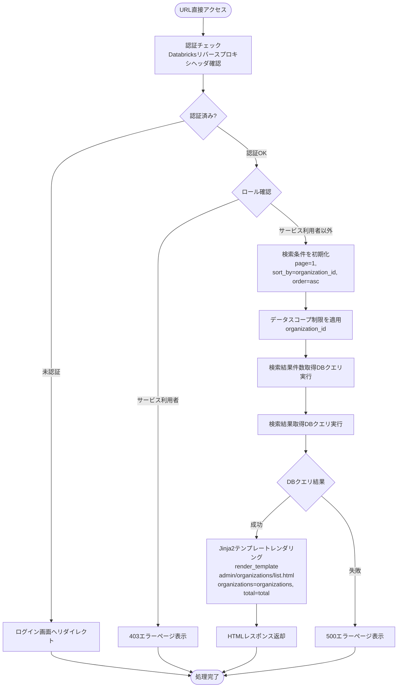
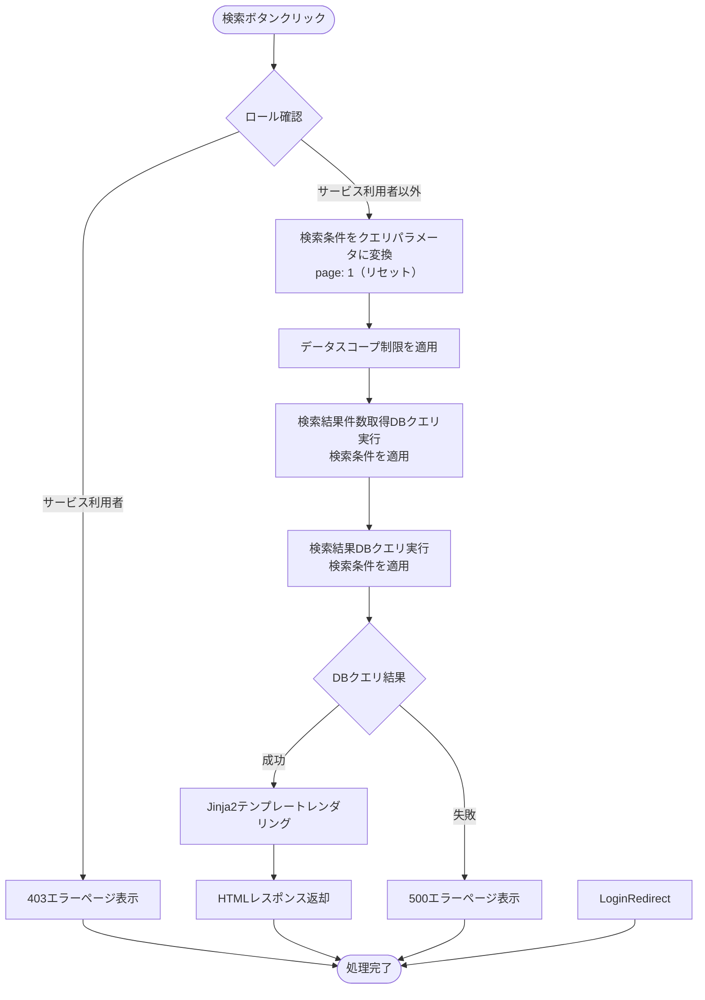
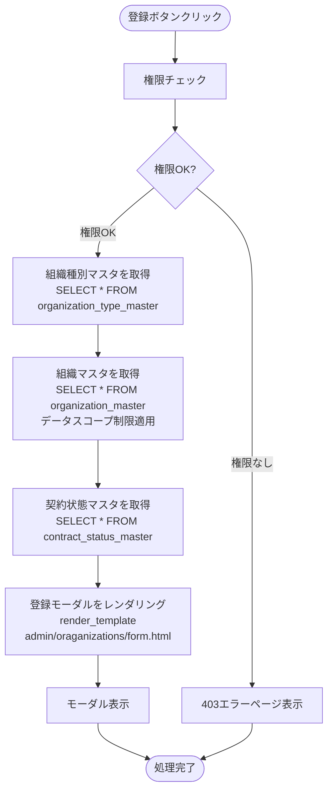
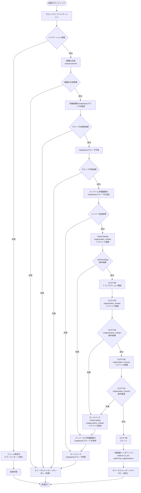
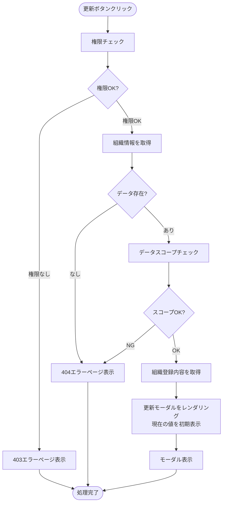
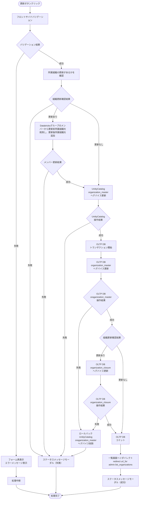
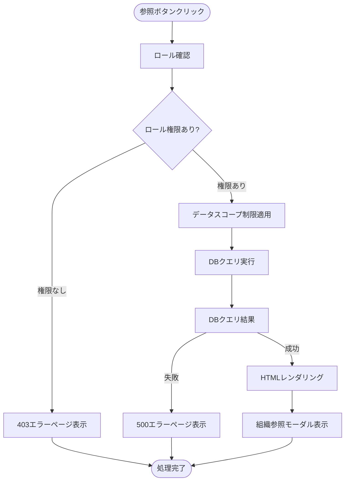
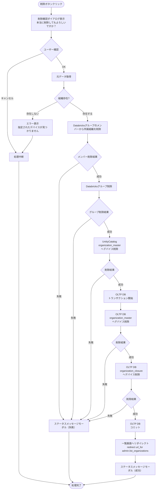

# 組織管理画面 - ワークフロー仕様書

## 📑 目次

- [概要](#概要)
- [使用するFlaskルート一覧](#使用するflaskルート一覧)
- [ルート呼び出しマッピング](#ルート呼び出しマッピング)
- [ワークフロー一覧](#ワークフロー一覧)
  - [初期表示](#初期表示)
  - [検索・絞り込み](#検索絞り込み)
  - [全体ソート](#全体ソート)
  - [ページ内ソート](#ページ内ソート)
  - [ページング](#ページング)
  - [組織登録](#組織登録)
  - [組織更新](#組織更新)
  - [組織参照](#組織参照)
  - [組織削除](#組織削除)
  - [CSVエクスポート](#csvエクスポート)
- [使用データベース詳細](#使用データベース詳細)
  - [使用テーブル一覧](#使用テーブル一覧)
  - [インデックス最適化](#インデックス最適化)
- [トランザクション管理](#トランザクション管理)
  - [トランザクション開始・終了タイミング](#トランザクション開始終了タイミング)
  - [分散トランザクション対策](#分散トランザクション対策)
- [セキュリティ実装](#セキュリティ実装)
  - [認証・認可実装](#認証認可実装)
  - [入力検証](#入力検証)
  - [ログ出力ルール](#ログ出力ルール)
- [関連ドキュメント](#関連ドキュメント)

---

## 概要

このドキュメントは、組織管理画面のユーザー操作に対する処理フロー、バリデーション実行タイミング、データベース処理の詳細を記載します。

**このドキュメントの役割:**
- ✅ ユーザー操作のトリガー条件
- ✅ 処理フローの詳細（Flaskルート呼び出しシーケンス、フォーム送信、リダイレクト）
- ✅ バリデーション実行タイミング（いつチェックするか）
- ✅ エラーハンドリングフロー
- ✅ サーバーサイド処理詳細（SQL、変数、条件分岐、コード例）
- ✅ データベース利用詳細（トランザクション管理、テーブル操作、インデックス）
- ✅ セキュリティ実装詳細（認証、入力検証、ログ出力）
- ✅ Databricks API連携詳細（ワークスペースグループ作成・更新・削除）

**UI仕様書との役割分担:**
- **UI仕様書**: バリデーションルール定義（何をチェックするか）、UI要素の詳細仕様
- **ワークフロー仕様書**: バリデーション実行タイミング（いつどのようにチェックするか）、処理フロー、サーバーサイド実装詳細

**注:** UI要素の詳細やバリデーションルールは [UI仕様書](./ui-specification.md) を参照してください。

---

## 使用するFlaskルート一覧

この画面で使用するすべてのFlaskルート（エンドポイント）を記載します。

| No | ルート名 | エンドポイント | メソッド | 用途 | レスポンス形式 | 備考 |
|----|---------|---------------|---------|------|---------------|------|
| 1 | 組織一覧表示 | `/admin/organizations` | GET | 組織検索・一覧表示（初期表示） | HTML | ページング・検索対応 |
| 2 | 組織一覧表示（検索） | `/admin/organizations` | POST | 組織検索・一覧表示（検索時） | HTML | 検索条件による絞り込み |
| 3 | 組織登録画面 | `/admin/organizations/create` | GET | 組織登録フォーム表示 | HTML（モーダル） | 組織種別・所属組織・契約状態選択肢を含む |
| 4 | 組織登録実行 | `/admin/organizations/create` | POST | 組織登録処理 | リダイレクト (302) | 成功時: `/admin/organizations`、失敗時: フォーム再表示（エラーメッセージ付き） |
| 5 | 組織参照画面 | `/admin/organizations/<databricks_group_id>` | GET | 組織詳細情報表示 | HTML（モーダル） | 読み取り専用 |
| 6 | 組織更新画面 | `/admin/organizations/<databricks_group_id>/edit` | GET | 組織更新フォーム表示 | HTML（モーダル） | 現在の値を初期表示 |
| 7 | 組織更新実行 | `/admin/organizations/<databricks_group_id>/update` | POST | 組織更新処理 | リダイレクト (302) | 成功時: `/admin/organizations`、失敗時: フォーム再表示（エラーメッセージ付き） |
| 8 | 組織削除実行 | `/admin/organizations/delete` | POST | 組織削除処理（一括） | リダイレクト (302) | 成功時: `/admin/organizations` |
| 9 | CSVエクスポート | `/admin/organizations?export=csv` | GET | 組織一覧CSVダウンロード | CSV | 現在の検索条件を適用 |

**注:**
- **レスポンス形式**:
  - `HTML`: Jinja2テンプレートをレンダリングして返す（`render_template()`）
  - `リダイレクト (302)`: 成功時に別のルートへリダイレクト（`redirect(url_for())`）、失敗時はフォームを再表示
  - `CSV`: CSVファイルをダウンロードレスポンスとして返す
- **Flask Blueprint構成**: 組織管理機能は `admin.organizations` Blueprintとして実装

---

## ルート呼び出しマッピング

| ユーザー操作 | トリガー | 呼び出すルート | パラメータ | レスポンス | エラー時の挙動 |
|-------------|---------|-------------|-----------|-----------|---------------|
| 画面初期表示 | URL直接アクセス | `GET /admin/organizations` | `page=1` | HTML（組織一覧画面） | エラーページ表示 |
| 検索ボタン押下 | フォーム送信 | `POST /admin/organizations` | `organization_name, organization_type_id, contact_person_name, contract_status_id, sort_by, order, page=1` | HTML（検索結果画面） | エラーメッセージ表示 |
| ページボタン押下 | フォーム送信 | `GET /admin/organizations` | `page` | HTML（検索結果画面 | エラーページ表示 |
| 登録ボタン押下 | ボタンクリック | `GET /admin/organizations/create` | なし | HTML（登録モーダル） | エラーページ表示 |
| 登録実行 | フォーム送信 | `POST /admin/organizations/create` | フォームデータ | リダイレクト → `GET /admin/organizations` | フォーム再表示（エラーメッセージ付き） |
| 参照ボタン押下 | ボタンクリック | `GET /admin/organizations/<databricks_group_id>` | organization_id | HTML（参照モーダル） | 404エラーページ表示 |
| 更新ボタン押下 | ボタンクリック | `GET /admin/organizations/<databricks_group_id>/edit` | organization_id | HTML（更新モーダル） | 404エラーページ表示 |
| 更新実行 | フォーム送信 | `POST /admin/organizations/<databricks_group_id>/update` | フォームデータ | リダイレクト → `GET /admin/organizations` | フォーム再表示（エラーメッセージ付き） |
| 削除実行 | フォーム送信 | `POST /admin/organizations/<databricks_group_id>/delete` | organization_id | リダイレクト → `GET /admin/organizations` | エラーメッセージ表示 |
| CSVエクスポート | ボタンクリック | `GET /admin/organizations?export=csv` | 検索条件 | CSVダウンロード | エラーメッセージ表示 |

---

## ワークフロー一覧

### 初期表示

**トリガー:** URL直接アクセス時（ユーザーが `/admin/organizations` にアクセスしたとき）

**前提条件:**
- ユーザーがログイン済み（Databricks認証完了）
- 適切な権限を持っている（システム保守者、管理者、販社ユーザ）

#### 処理フロー



#### Flaskルート

| ルート | エンドポイント | 詳細 |
|-------|---------------|------|
| 組織一覧表示 | `GET /admin/organizations` | クエリパラメータ: `page`, `organization_name`, `organization_type_id`, `contact_person_name`, `contract_status_id`, `sort_by`, `order` |

#### バリデーション

**実行タイミング:** なし（初期表示のため、デフォルト値を使用）

**データスコープ制限:**
- ログインユーザーの組織に紐づくデータのみアクセス可能

#### 処理詳細（サーバーサイド）

**① 認証・認可チェック**

リバースプロキシヘッダから認証情報を取得し、権限を確認します。

**処理内容:**
- ヘッダ `X-Forwarded-User` からユーザーIDを取得
- データベースから現在ユーザー情報を取得（ロール、組織ID）

**変数・パラメータ:**
- `current_user_id`: string - リバースプロキシヘッダから取得したユーザーID
- `current_user`: User - データベースから取得したユーザーオブジェクト
- `role`: string - ユーザーのロール
- `organization_id`: string - データスコープ制限用の組織ID

**実装例:**
```python
from flask import session, abort

def get_current_user():
    """リバースプロキシヘッダからユーザー情報取得"""
    user_id = request.headers.get('X-Forwarded-User')
    if not user_id:
        abort(401)

    user = User.query.filter_by(user_id=user_id, delete_flag=0).first()
    if not user:
        abort(403)

    return user

def require_permission(permission):
    """権限チェックデコレーター"""
    def decorator(f):
        @wraps(f)
        def decorated_function(*args, **kwargs):
            current_user = get_current_user()
            if not has_permission(current_user, permission):
                abort(403)
            return f(*args, **kwargs)
        return decorated_function
    return decorator 

current_user = get_current_user()
```

**② 画面表示制限の適用**

ロールに応じて画面表示を制限します。

**処理内容:**
- ロールがサービス利用者の場合403エラーを表示

**実装例:**
```python
@admin_bp.route('/organizations', methods=['GET'])
def list_organizations():
    current_user = get_current_user()

    # ロールチェック: サービス利用者は画面表示不可
    if current_user.role_id == 4:  # サービス利用者
        abort(403)

    # ... 以降の処理
```

**③ クエリパラメータ取得**

リクエストからクエリパラメータを取得し、デフォルト値を設定します。

**処理内容:**
- `page`: ページ番号（デフォルト: 1）
- `organization_name`: 組織名（部分一致検索、デフォルト: 空）
- `organization_type_id`: 組織種別ID（デフォルト: NULL）
- `contact_person_name`: 担当者名（部分一致検索、デフォルト: 空）
- `contract_status_id`: 契約状態ID（デフォルト: NULL）
- `sort_by`: ソートフィールド（デフォルト: organization_name）
- `order`: ソート順（デフォルト: asc）

**変数・パラメータ:**
- `page`: int - ページ番号
- `per_page`: int - 1ページあたりの件数（固定: 25）
- `sort_by`: string - ソートフィールド
- `order`: string - ソート順（asc/desc）

**実装例:**
```python
page = request.args.get('page', 1, type=int)
per_page = 25  # 固定
organization_name = request.args.get('organization_name', '')
organization_type_id = request.args.get('organization_type_id', type=int)
contact_person_name = request.args.get('contact_person_name', '')
contract_status_id = request.args.get('contract_status_id', type=int)
sort_by = request.args.get('sort_by', 'organization_name')
order = request.args.get('order', 'asc')
```

**④ データスコープ制限の適用**

ログインユーザーの組織に紐づくデータのみを表示するためにWHERE句の条件を追加します。

**処理内容:**
- organization_masterとorganization_closureをJOIN
- ① 認証・認可チェックで取得した組織IDがorganization_closureのparent_organization_idに一致するWHERE句の条件を追加

**実装例:**
```python
# ログインユーザーの組織IDを取得
current_user = get_current_user()
organization_id = current_user.organization_id

# データスコープ制限を適用したクエリを構築
# organization_closureテーブルをJOINして、親組織IDがログインユーザーの組織IDと一致するデータのみ取得
query = db.session.query(Organization)\
    .join(OrganizationClosure,
          Organization.organization_id == OrganizationClosure.subsidiary_organization_id)\
    .filter(OrganizationClosure.parent_organization_id == organization_id)\
    .filter(Organization.delete_flag == 0)
```

**⑤ データベースクエリ実行**

組織マスタからデータを取得します。

**使用テーブル:** organization_master、organization_closure、organization_type_master、contract_status_master

**SQL詳細:**
```sql
SELECT
    o.organization_id,
    o.organization_name,
    t.organization_type_name,
    o.address,
    o.phone_number,
    o.contact_person,
    s.contract_status_name
FROM organization_master o
LEFT JOIN organization_closure c ON o.organization_id = c.subsidiary_organization_id
LEFT JOIN organization_type_master t ON o.organization_type_id = t.organization_type_id
LEFT JOIN contract_status_master s ON o.contract_status_id = s.contract_status_id
WHERE
    c.parent_organization_id = :organization_id
    AND o.delete_flag = 0
    AND (:organization_name IS NULL OR o.organization_name LIKE :organization_name)
    AND (:organization_type_id IS NULL OR o.organization_type_id = :organization_type_id)
    AND (:contact_person_name IS NULL OR o.contact_person LIKE :contact_person_name)
    AND (:contract_status_id IS NULL OR o.contract_status_id = :contract_status_id)
ORDER BY {sort_by} {order}
LIMIT :per_page OFFSET :offset
```

**変数・パラメータ:**
- `organization_id`: VARCHAR(50) - データスコープ制限用の組織ID
- `offset`: int - ページングオフセット（計算式: `(page - 1) * per_page`）
- `organizations`: list - 検索結果の組織リスト
- `total`: int - 総件数（ページネーション用）

**実装例:**
```python
offset = (page - 1) * per_page

# 部分一致検索用にLIKEパラメータを作成
organization_name_like = f'%{organization_name}%' if organization_name else None
contact_person_like = f'%{contact_person_name}%' if contact_person_name else None

query = db.session.query(Organization)\
    .join(OrganizationClosure, Organization.organization_id == OrganizationClosure.subsidiary_organization_id)\
    .filter(OrganizationClosure.parent_organization_id == organization_id)\
    .filter(Organization.delete_flag == 0)

if organization_name_like:
    query = query.filter(Organization.organization_name.like(organization_name_like))
if organization_type_id:
    query = query.filter(Organization.organization_type_id == organization_type_id)
if contact_person_like:
    query = query.filter(Organization.contact_person.like(contact_person_like))
if contract_status_id:
    query = query.filter(Organization.contract_status_id == contract_status_id)

total = query.count()

organizations = query.order_by(
    getattr(Organization, sort_by).asc() if order == 'asc'
    else getattr(Organization, sort_by).desc()
).limit(per_page).offset(offset).all()
```

**⑥ HTMLレンダリング**

Jinja2テンプレートをレンダリングしてHTMLレスポンスを返却します。

**処理内容:**
- テンプレート: `admin/organizations/list.html`
- コンテキスト: `organizations`, `total`, `page`, `per_page`, `search_params`, `sort_by`, `order`

**実装例:**
```python
return render_template('admin/organizations/list.html',
                      organizations=organizations,
                      total=total,
                      page=page,
                      per_page=per_page,
                      search_params={
                          'organization_name': organization_name,
                          'organization_type_id': organization_type_id,
                          'contact_person_name': contact_person_name,
                          'contract_status_id': contract_status_id
                      },
                      sort_by=sort_by,
                      order=order)
```

#### 表示メッセージ

| メッセージID | 表示内容 | 表示タイミング | 表示場所 |
|-------------|---------|---------------|---------|
| ERR_001 | データの取得に失敗しました | DBクエリ失敗時 | エラーページ |

#### エラーハンドリング

| HTTPステータス | エラー種別 | 処理内容 | 表示内容 |
|--------------|-----------|---------|---------|
| 401 | 認証エラー | ログイン画面へリダイレクト | - |
| 403 | 権限エラー | 403エラーページ表示 | この操作を実行する権限がありません |
| 500 | データベースエラー | 500エラーページ表示 | データの取得に失敗しました |

#### UI状態

- 検索条件: デフォルト値
  - 組織名: 空
  - 組織種別: すべて
  - 担当者名: 空
  - 契約状態: すべて
  - ソート項目: 空
  - ソート順: 空
- テーブル: 組織一覧データ表示（デフォルトソート: 組織名 昇順）
- ページネーション: 1ページ目を選択状態

---

### 検索・絞り込み

**トリガー:** (3.8) 検索ボタンクリック（フォーム送信）

**前提条件:**
- 検索条件が入力されている（空でも可）

#### 処理フロー



#### Flaskルート

| ルート | エンドポイント | 詳細 |
|-------|---------------|------|
| 組織一覧表示（検索） | `POST /admin/organizations` | フォームデータ: `organization_name`, `organization_type_id`, `contact_person_name`, `contract_status_id`, `sort_by`, `order` |

#### バリデーション

**実行タイミング:** フォーム送信直後（サーバーサイド）

**バリデーション対象:** (3.2) 組織名、(3.3) 組織種別、(3.4) 担当者名、(3.5) 契約状態

**バリデーションルール:** [UI仕様書](./ui-specification.md) の要素詳細 (3) 検索フォーム > バリデーション を参照

**実装例:**
```python
organization_name = request.form.get('organization_name', '')
if len(organization_name) > 200:
    flash('組織名は200文字以内で入力してください', 'error')
    return redirect(url_for('admin.organizations.list_organizations'))

contact_person_name = request.form.get('contact_person_name', '')
if len(contact_person_name) > 100:
    flash('担当者名は100文字以内で入力してください', 'error')
    return redirect(url_for('admin.organizations.list_organizations'))
```

#### 処理詳細（サーバーサイド）

**① フォームデータ取得とクエリパラメータ変換**

フォームデータを取得し、GETリクエスト用のクエリパラメータに変換してリダイレクトします。

**処理内容:**
- フォームデータを取得
- クエリパラメータに変換
- ページ番号を1にリセット
- GETリクエストにリダイレクト（PRGパターン）

**変数・パラメータ:**
- `organization_name`: string - 組織名（部分一致検索）
- `organization_type_id`: int - 組織種別ID
- `contact_person_name`: string - 担当者名（部分一致検索）
- `contract_status_id`: int - 契約状態ID
- `sort_by`: string - ソートフィールド
- `order`: string - ソート順

**実装例:**
```python
from flask import request, redirect, url_for

@admin_bp.route('/organizations', methods=['POST'])
def search_organizations():
    # フォームデータ取得
    organization_name = request.form.get('organization_name', '')
    organization_type_id = request.form.get('organization_type_id', type=int)
    contact_person_name = request.form.get('contact_person_name', '')
    contract_status_id = request.form.get('contract_status_id', type=int)
    sort_by = request.form.get('sort_by', 'organization_name')
    order = request.form.get('order', 'asc')

    # GETリクエストにリダイレクト（PRGパターン）
    return redirect(url_for('admin.organizations.list_organizations',
                           organization_name=organization_name,
                           organization_type_id=organization_type_id,
                           contact_person_name=contact_person_name,
                           contract_status_id=contract_status_id,
                           page=1,  # ページ番号をリセット
                           sort_by=sort_by,
                           order=order))
```

**② DBクエリ実行**

初期表示と同じクエリを実行します（検索条件が追加されます）。

#### 表示メッセージ

| メッセージID | 表示内容 | 表示タイミング | 表示場所 |
|-------------|---------|---------------|---------|
| ERR_001 | データの取得に失敗しました | DBクエリ失敗時 | エラーページ |

#### エラーハンドリング

| HTTPステータス | エラー種別 | 処理内容 | 表示内容 |
|--------------|-----------|---------|---------|
| 403 | 権限エラー | 403エラーページ表示 | この操作を実行する権限がありません |
| 500 | データベースエラー | 500エラーページ表示 | データの取得に失敗しました |

#### UI状態

- 検索条件: 入力値を保持（フォームに再設定）
- テーブル: 検索結果データ表示
- ページネーション: 1ページ目にリセット

---

### 全体ソート

**トリガー:** (2) 検索条件欄でソート項目、ソート順ドロップダウンで具体値を選択し、検索を実行

#### 処理詳細
検索条件欄のソート項目ドロップダウンで選択した内容に対して、ソート順ドロップダウンで選択した順序でページをまたいだソートを行う。
詳細は[共通仕様書](../../common/common-specification.md)参照のこと。

---

### ページ内ソート

**トリガー:**（6）データテーブルのソート可能カラム（デバイスID、デバイス名、デバイス種別、設置場所、所属組織、証明書期限、ステータス）のヘッダをクリック

#### 処理詳細
データテーブルのヘッダをクリックすることで、ページ内で閉じたソートを行う。
詳細は[共通仕様書](../../common/common-specification.md)参照のこと

---

### ページング

**トリガー:** (6.10) ページネーションのページ番号ボタンクリック

#### 処理詳細
ページネーションのページ番号を選択することで、選択されたページ番号に対応するデータをデータテーブルに表示する。
詳細は[共通仕様書](../../common/common-specification.md)参照のこと

---

### 組織登録

#### 組織登録ボタン押下

**トリガー:** (2.2) 登録ボタンクリック

**前提条件:**
- ユーザーがシステム保守者、管理者、または販社ユーザ権限を持っている

##### 処理フロー



##### Flaskルート

| ルート | エンドポイント | 詳細 |
|-------|---------------|------|
| 組織登録画面 | `GET /admin/organizations/create` | - |

##### 処理詳細（サーバーサイド）

**① 組織種別一覧を取得**

**SQL詳細:**
```sql
SELECT organization_type_id, organization_type_name
FROM organization_type_master
WHERE delete_flag = 0
ORDER BY organization_type_id
```

**② 所属組織一覧を取得**

自社に紐づくすべての組織を取得します。

**SQL詳細:**
```sql
SELECT o.organization_id, o.organization_name
FROM organization_master o
LEFT JOIN organization_closure c ON o.organization_id = c.subsidiary_organization_id
WHERE
    c.parent_organization_id = :current_organization_id
    AND o.delete_flag = 0
ORDER BY organization_name
```

**③ 契約状態一覧を取得**

**SQL詳細:**
```sql
SELECT contract_status_id, contract_status_name
FROM contract_status_master
WHERE delete_flag = 0
ORDER BY contract_status_id
```

**実装例:**
```python
@admin_bp.route('/organizations/create', methods=['GET'])
def create_organization_form():
    # 組織種別一覧取得
    organization_types = OrganizationType.query.filter_by(delete_flag=0).all()

    # 所属組織一覧取得
    current_user = get_current_user()
    affiliated_organizations = db.session.query(Organization)\
        .join(OrganizationClosure, Organization.organization_id == OrganizationClosure.subsidiary_organization_id)\
        .filter(OrganizationClosure.parent_organization_id == current_user['organization_id'])\
        .filter(Organization.delete_flag == 0)\
        .all()

    # 契約状態一覧取得
    contract_statuses = ContractStatus.query.filter_by(delete_flag=0).all()

    return render_template('admin/organizations/create.html',
                          organization_types=organization_types,
                          affiliated_organizations=affiliated_organizations,
                          contract_statuses=contract_statuses)
```

---

#### 組織登録実行

**トリガー:** (7.11) 登録ボタンクリック

**前提条件:**
- すべての必須項目が入力されている

##### 処理フロー


---

##### 処理詳細（サーバーサイド）

**実装例:**
```python
   # 組織登録実行の実装例
   @admin_bp.route('/organizations/create', methods=['POST'])
   def create_organization():
       form = OrganizationCreateForm()

       if not form.validate_on_submit():
           return render_template('admin/organizations/form.html', form=form)

       try:
           # 組織ID生成
           organization_id = generate_organization_id()

           # Databricksグループ作成
           databricks_group_id = create_databricks_group(
               group_name=f"organization_{organization_id}"
           )

           # トランザクション開始
           organization = Organization(
               organization_id=organization_id,
               organization_name=form.organization_name.data,
               organization_type_id=form.organization_type_id.data,
               # ... その他のフィールド
               databricks_group_id=databricks_group_id,
               creater=current_user.user_id
           )
           db.session.add(organization)

           # 組織閉包テーブルに登録
           closure = OrganizationClosure(
               parent_organization_id=form.parent_organization_id.data,
               subsidiary_organization_id=organization_id,
               depth=1
           )
           db.session.add(closure)

           # コミット
           db.session.commit()

           flash('組織を登録しました', 'success')
           return redirect(url_for('admin.organizations.list_organizations'))

       except DatabricksAPIError as e:
           db.session.rollback()
           flash('Databricksグループの作成に失敗しました', 'error')
           return render_template('admin/organizations/form.html', form=form)

       except Exception as e:
           db.session.rollback()
           flash('組織の登録に失敗しました', 'error')
           return render_template('admin/organizations/form.html', form=form)
```

##### バリデーション

**実行タイミング:** 登録ボタンクリック直後（フロントサイド）

**バリデーションルール:** [UI仕様書](./ui-specification.md) の要素詳細 (7) 組織登録/更新モーダル > バリデーション を参照

##### 表示メッセージ

| メッセージID | 表示内容 | 表示タイミング | 表示場所 |
|-------------|---------|---------------|---------|
| - | 組織を登録しました | 組織登録成功時 | ステータスメッセージモーダル（成功） |
| - | 組織登録に失敗しました | API呼び出し失敗時（500） | ステータスメッセージモーダル（エラー） |

##### エラーハンドリング

| HTTPステータス | エラー種別 | 処理内容 | ロールバック |
|--------------|-----------|---------|------------|
| 400 | バリデーションエラー | フォーム再表示（エラーメッセージ付き） | × |
| 403 | 権限エラー | 403エラーページ表示 | × |
| 500 | Databricks APIエラー | Databricksグループ削除 → 500エラー | ✓ |
| 500 | DB INSERTエラー | OLTP DBロールバック → 500エラー | ✓ |

---

### 組織更新

#### 更新画面表示

**トリガー:** (6.9) 更新ボタンクリック

##### 処理フロー



##### Flaskルート

| ルート | エンドポイント | 詳細 |
|-------|---------------|------|
| 組織更新画面 | `GET /admin/organizations/<databricks_group_id>/edit` | - |

##### 処理詳細（サーバーサイド）

**実装例:**
```python
@admin_bp.route('/organizations/<databricks_group_id>/edit', methods=['GET'])
def edit_organization_form(organization_id):
    current_user = get_current_user()

    # データスコープ制限を適用して組織取得
    organization = db.session.query(Organization)\
        .join(OrganizationClosure,
              Organization.organization_id == OrganizationClosure.subsidiary_organization_id)\
        .filter(OrganizationClosure.parent_organization_id == current_user.organization_id)\
        .filter(Organization.organization_id == organization_id)\
        .filter(Organization.delete_flag == 0)\
        .first()

    if not organization:
        abort(404)

    # 組織種別一覧取得
    organization_types = OrganizationType.query.filter_by(delete_flag=0).all()

    # 所属組織一覧取得
    affiliated_organizations = db.session.query(Organization)\
        .join(OrganizationClosure,
              Organization.organization_id == OrganizationClosure.subsidiary_organization_id)\
        .filter(OrganizationClosure.parent_organization_id == current_user.organization_id)\
        .filter(Organization.delete_flag == 0)\
        .all()

    # 契約状態一覧取得
    contract_statuses = ContractStatus.query.filter_by(delete_flag=0).all()

    return render_template('admin/organizations/edit.html',
                          organization=organization,
                          organization_types=organization_types,
                          affiliated_organizations=affiliated_organizations,
                          contract_statuses=contract_statuses)
```

---

#### 更新実行

**トリガー:** (7.11) 更新ボタン（モーダル内）クリック後に表示される更新実行確認モーダルで「はい」を選択

##### 処理フロー



##### 処理詳細（サーバーサイド）

**実装例:**
```python
@admin_bp.route('/organizations/<databricks_group_id>/update', methods=['POST'])
def update_organization(organization_id):
    form = OrganizationUpdateForm()

    if not form.validate_on_submit():
        return render_template('admin/organizations/form.html', form=form)

    try:
        current_user = get_current_user()

        # 元データ取得
        organization = db.session.query(Organization)\
            .join(OrganizationClosure, Organization.organization_id == OrganizationClosure.subsidiary_organization_id)\
            .filter(OrganizationClosure.parent_organization_id == current_user.organization_id)\
            .filter(Organization.organization_id == organization_id)\
            .filter(Organization.delete_flag == 0)\
            .first()

        if not organization:
            abort(404)

        # 所属組織の更新チェック
        parent_org_changed = (organization.parent_organization_id != form.parent_organization_id.data)

        if parent_org_changed:
            # 元の所属組織のDatabricksグループから削除
            old_parent_org = Organization.query.get(organization.parent_organization_id)
            if old_parent_org and old_parent_org.databricks_group_id:
                remove_databricks_group_member(
                    parent_group_id=old_parent_org.databricks_group_id,
                    child_group_id=organization.databricks_group_id
                )

            # 新しい所属組織のDatabricksグループに追加
            new_parent_org = Organization.query.get(form.parent_organization_id.data)
            if new_parent_org and new_parent_org.databricks_group_id:
                add_databricks_group_member(
                    parent_group_id=new_parent_org.databricks_group_id,
                    child_group_id=organization.databricks_group_id
                )

        # 組織マスタを更新
        organization.organization_name = form.organization_name.data
        organization.organization_type_id = form.organization_type_id.data
        organization.address = form.address.data
        organization.phone_number = form.phone_number.data
        organization.fax_number = form.fax_number.data
        organization.contact_person = form.contact_person.data
        organization.contract_status_id = form.contract_status_id.data
        organization.contract_start_date = form.contract_start_date.data
        organization.contract_end_date = form.contract_end_date.data
        organization.updater = current_user.user_id
        organization.update_date = datetime.now()

        if parent_org_changed:
            # organization_closureを更新
            closure = OrganizationClosure.query.filter_by(
                subsidiary_organization_id=organization_id
            ).first()
            if closure:
                closure.parent_organization_id = form.parent_organization_id.data
                closure.updater = current_user.user_id
                closure.update_date = datetime.now()

        # コミット
        db.session.commit()

        flash('組織を更新しました', 'success')
        return redirect(url_for('admin.organizations.list_organizations'))

    except DatabricksAPIError as e:
        db.session.rollback()
        flash('Databricksグループの更新に失敗しました', 'error')
        return render_template('admin/organizations/form.html', form=form)

    except Exception as e:
        db.session.rollback()
        flash('組織の更新に失敗しました', 'error')
        return render_template('admin/organizations/form.html', form=form)
```

##### バリデーション

**実行タイミング:** 更新ボタンクリック直後（フロントサイド）

**バリデーションルール:** [UI仕様書](./ui-specification.md) の要素詳細 (7) 組織登録/更新モーダル > バリデーション を参照

##### 表示メッセージ

| メッセージID | 表示内容 | 表示タイミング | 表示場所 |
|-------------|---------|---------------|---------|
| - | 組織を登録しました | 組織登録成功時 | ステータスメッセージモーダル（成功） |
| - | 組織登録に失敗しました | API呼び出し失敗時（500） | ステータスメッセージモーダル（エラー） |

##### エラーハンドリング

| HTTPステータス | エラー種別 | 処理内容 | ロールバック |
|--------------|-----------|---------|------------|
| 400 | バリデーションエラー | フォーム再表示（エラーメッセージ付き） | × |
| 403 | 権限エラー | 403エラーページ表示 | × |
| 500 | Databricks APIエラー | Databricksグループ ロールバック → 500エラー | ✓ |
| 500 | DB UPDATEエラー | OLTP DBロールバック → 500エラー | ✓ |

---

### 組織参照

**トリガー:** (6.8) 参照ボタンクリック

**前提条件:**
- 対象組織へのアクセス権限がある

#### 処理フロー



#### 処理詳細（サーバーサイド）

**実装例:**
```python
@admin_bp.route('/organizations/<databricks_group_id>', methods=['GET'])
def view_organization(organization_id):
    current_user = get_current_user()

    # データスコープ制限を適用して組織取得
    organization = db.session.query(Organization)\
        .join(OrganizationClosure, Organization.organization_id == OrganizationClosure.subsidiary_organization_id)\
        .filter(OrganizationClosure.parent_organization_id == current_user['databricks_group_id'])\
        .filter(Organization.organization_id == organization_id)\
        .filter(Organization.delete_flag == 0)\
        .first()

    if not organization:
        abort(404)

    return render_template('admin/organizations/view.html', organization=organization)
```

#### エラーハンドリング

| HTTPステータス | エラー種別 | 処理内容 | 表示内容 |
|--------------|-----------|---------|---------|
| 403 | 権限エラー | 403エラーページ表示 | この操作を実行する権限がありません |

---

### 組織削除

**トリガー:** (2.3) 削除ボタンクリック → (9) 削除確認モーダル内の削除ボタンクリック

**前提条件:**
- 少なくとも1つの組織がチェックされている

#### 処理フロー



##### 処理詳細（サーバーサイド）

**実装例:**
```python
@admin_bp.route('/organizations/delete', methods=['POST'])
def delete_organizations():
    organization_ids = request.form.getlist('organization_ids')

    if not organization_ids:
        flash('削除する組織を選択してください', 'error')
        return redirect(url_for('admin.organizations.list_organizations'))

    try:
        current_user = get_current_user()
        deleted_count = 0

        for organization_id in organization_ids:
            # 元データ取得とデータスコープチェック
            organization = db.session.query(Organization)\
                .join(OrganizationClosure,
                      Organization.organization_id == OrganizationClosure.subsidiary_organization_id)\
                .filter(OrganizationClosure.parent_organization_id == current_user.organization_id)\
                .filter(Organization.organization_id == organization_id)\
                .filter(Organization.delete_flag == 0)\
                .first()

            if not organization:
                flash(f'組織ID {organization_id} が見つかりません', 'error')
                continue

            # 所属組織のDatabricksグループから削除
            parent_org = Organization.query.get(organization.parent_organization_id)
            if parent_org and parent_org.databricks_group_id and organization.databricks_group_id:
                try:
                    remove_databricks_group_member(
                        parent_group_id=parent_org.databricks_group_id,
                        child_group_id=organization.databricks_group_id
                    )
                except DatabricksAPIError as e:
                    # Databricks API失敗は警告ログのみで続行
                    logger.warning(f'Databricksグループの紐づけ削除に失敗: {organization_id}, error: {e}')

            # Databricksグループ削除
            if organization.databricks_group_id:
                try:
                    delete_databricks_group(organization.databricks_group_id)
                except DatabricksAPIError as e:
                    # Databricks API失敗は警告ログのみで続行
                    logger.warning(f'Databricksグループの削除に失敗: {organization_id}, error: {e}')

            # 組織マスタを論理削除
            organization.delete_flag = 1
            organization.updater = current_user.user_id
            organization.update_date = datetime.now()

            # organization_closureを論理削除
            closures = OrganizationClosure.query.filter_by(
                subsidiary_organization_id=organization_id
            ).all()
            for closure in closures:
                closure.delete_flag = 1
                closure.updater = current_user.user_id
                closure.update_date = datetime.now()

            deleted_count += 1

        # コミット
        db.session.commit()

        flash(f'{deleted_count}件の組織を削除しました', 'success')
        return redirect(url_for('admin.organizations.list_organizations'))

    except Exception as e:
        db.session.rollback()
        logger.error(f'組織削除に失敗: {e}')
        flash('組織削除に失敗しました', 'error')
        return redirect(url_for('admin.organizations.list_organizations'))
```

#### 表示メッセージ

| メッセージID | 表示内容 | 表示タイミング | 表示場所 |
|-------------|---------|---------------|---------|
| - | {N}件の組織を削除しました | 組織削除成功時 | ステータスメッセージモーダル（成功） |
| - | 組織削除に失敗しました | DB UPDATEエラー時 | ステータスメッセージモーダル（失敗） |

#### エラーハンドリング

| HTTPステータス | エラー種別 | 処理内容 | ロールバック |
|--------------|-----------|---------|------------|
| 500 | DB UPDATEエラー | OLTP DBロールバック → 500エラー | ✓ |
| 500 | Databricks APIエラー | 警告ログ記録（ロールバックしない） | × |

---

### CSVエクスポート

**トリガー:** (3.3) CSVエクスポートボタンクリック

##### 処理詳細（サーバーサイド）

**実装例:**
```python
@admin_bp.route('/organizations', methods=['GET'])
def list_organizations():
    # ... 初期表示と同じ検索処理 ...

    # CSVエクスポート処理
    if request.args.get('export') == 'csv':
        import csv
        from io import StringIO
        from flask import make_response

        # 検索条件に基づいてすべてのデータを取得（ページング制限なし）
        organizations = query.all()

        # CSV形式で出力
        si = StringIO()
        writer = csv.writer(si)

        # ヘッダー行
        writer.writerow([
            '組織ID',
            '組織名',
            '組織種別',
            '住所',
            '電話番号',
            'FAX番号',
            '担当者',
            '契約状態',
            '契約開始日',
            '契約終了日'
        ])

        # データ行
        for org in organizations:
            writer.writerow([
                org.organization_id,
                org.organization_name,
                org.organization_type.organization_type_name if org.organization_type else '',
                org.address,
                org.phone_number,
                org.fax_number or '',
                org.contact_person,
                org.contract_status.contract_status_name if org.contract_status else '',
                org.contract_start_date.strftime('%Y-%m-%d') if org.contract_start_date else '',
                org.contract_end_date.strftime('%Y-%m-%d') if org.contract_end_date else ''
            ])

        # レスポンス作成
        output = make_response(si.getvalue())
        output.headers["Content-Disposition"] = f"attachment; filename=organizations_{datetime.now().strftime('%Y%m%d_%H%M%S')}.csv"
        output.headers["Content-type"] = "text/csv; charset=utf-8"

        return output

    # 通常の画面表示
    return render_template('admin/organizations/list.html',
                          organizations=organizations,
                          total=total,
                          page=page,
                          per_page=per_page)
```

---

## 使用データベース詳細

### 使用テーブル一覧

| No | テーブル名 | 論理名 | 操作種別 | ワークフロー | 目的 | インデックス利用 |
|----|-----------|--------|---------|------------|------|----------------|
| 1 | organization_master | 組織マスタ | SELECT | 初期表示、検索 | 組織情報取得 | PRIMARY KEY (organization_id)<br>INDEX (organization_name) |
| 2 | organization_master | 組織マスタ | INSERT | 組織登録 | 新規組織作成 | - |
| 3 | organization_master | 組織マスタ | UPDATE | 組織更新、組織削除 | 組織情報更新、論理削除 | PRIMARY KEY (organization_id) |
| 4 | organization_closure | 組織閉包テーブル | SELECT | 初期表示、検索 | データスコープ制限 | INDEX (parent_organization_id) |
| 5 | organization_closure | 組織閉包テーブル | INSERT | 組織登録 | 組織階層構造の登録 | - |
| 6 | organization_closure | 組織閉包テーブル | UPDATE | 組織更新、組織削除 | 組織階層構造更新、論理削除 | - |
| 7 | organization_type_master | 組織種別マスタ | SELECT | 初期表示、組織登録画面、組織更新画面 | 組織種別選択肢取得 | PRIMARY KEY (organization_type_id) |
| 8 | contract_status_master | 契約状態マスタ | SELECT | 初期表示、組織登録画面、組織更新画面 | 契約状態選択肢取得 | PRIMARY KEY (contract_status_id) |

### インデックス最適化

**使用するインデックス:**
- organization_master.organization_id: PRIMARY KEY - 組織一意識別
- organization_master.delete_flag: INDEX - 論理削除フィルタ用
- organization_closure.parent_organization_id: INDEX - データスコープ制限高速化
- organization_closure.subsidiary_organization_id: INDEX - 組織階層検索高速化

---

## トランザクション管理

### トランザクション開始・終了タイミング

**トランザクション開始:**
- ワークフロー: 組織登録実行、組織更新実行、組織削除実行
- 開始タイミング: フォームバリデーション成功後、DB操作開始前
- 開始条件: フォームバリデーションが成功

**トランザクション終了（コミット）:**
- 終了タイミング: すべてのDB操作とDatabricks API呼び出しが成功した後
- 終了条件:
  - **組織登録**: Databricks API POST成功 AND organization_master INSERT成功 AND organization_closure INSERT成功
  - **組織更新**: organization_master UPDATE成功 AND（所属組織変更なし OR Databricks API PUT成功 AND organization_closure UPDATE成功）
  - **組織削除**: すべてのorganization_idに対してorganization_master UPDATE成功（Databricks API失敗は無視）

**トランザクション終了（ロールバック）:**
- ロールバックタイミング: いずれかのDB操作またはDatabricks API呼び出しが失敗した時
- ロールバック対象:
  - **組織登録**: Databricksグループ POST、 organization_master INSERT、organization_closure INSERT
  - **組織更新**: Databricksグループ PUT、organization_master UPDATE、organization_closure UPDATE（所属組織更新時のみ）
  - **組織削除**: organization_master UPDATE（Databricks API失敗時はロールバックしない）
- ロールバック条件:
  - **組織登録**: Databricks API POSTエラー、organization_master INSERTエラー、organization_closure INSERTエラー
  - **組織更新**: Databricks API PUTエラー、organization_master UPDATEエラー、organization_closure UPDATEエラー
  - **組織削除**: organization_master UPDATEエラー、organization_closure UPDATEエラー

---

## セキュリティ実装

### 認証・認可実装

**認証方式:**
- Databricksリバースプロキシヘッダ認証（`X-Forwarded-User`）

**認可ロジック:**
- システム保守者: すべてのデバイスを管理可能
- 管理者: すべてのデバイスを管理可能
- 販社ユーザ: 自社に紐づく、または自社の傘下組織のデバイスのみ管理可能
- サービス利用者: 組織管理画面へのアクセス不可

---

### 入力検証

**検証項目:**
- organization_name: 最大200文字、必須
- organization_type_id: 許可された値のみ、必須
- affiliated_organization_id: 存在する組織IDのみ、必須
- address: 最大500文字、必須
- phone_number: 電話番号形式、最大20文字、必須
- fax_number: 電話番号形式、最大20文字、任意
- contact_person: 最大100文字、必須
- contract_status_id: 許可された値のみ、必須
- contract_start_date: 日付形式、必須
- contract_end_date: 日付形式、任意、契約開始日以降
- SQLインジェクション対策: SQLAlchemy ORM使用（プリペアドステートメント）
- XSS対策: Jinja2自動エスケープ（`{{ variable }}`）
- CSRF対策: Flask-WTF CSRF保護

### ログ出力ルール

**出力する情報:**
- リクエストID
- ユーザーID（操作者）
- 操作種別（デバイス登録、更新、削除等）
- 対象リソースID（device_id）
- 処理結果（成功/失敗）
- エラー種別（バリデーションエラー、DBエラー等）

**出力しない情報:**
- 認証トークン
- 機密情報

---

## 関連ドキュメント

### 機能設計・仕様

- [機能概要 README](./README.md) - 画面の概要、データモデル、使用するテーブル一覧
- [UI仕様書](./ui-specification.md) - 画面レイアウト、UI要素の詳細仕様
- [機能要件定義書](../../02-requirements/functional-requirements.md) - FR-004-4（組織管理）
- [技術要件定義書](../../02-requirements/technical-requirements.md) - TR-SEC-001, TR-SEC-004, TR-SEC-005
- [非機能要件定義書](../../02-requirements/non-functional-requirements.md) - NFR-SEC-006, NFR-SEC-007

### アーキテクチャ設計

- [バックエンド設計](../../01-architecture/backend.md) - Flask/LDP設計、Blueprint構成
- [データベース設計](../../01-architecture/database.md) - テーブル定義、インデックス設計
- [インフラストラクチャ設計](../../01-architecture/infrastructure.md) - Databricks環境、Private Link

### 共通仕様

- [共通仕様書](../common/common-specification.md) - HTTPステータスコード、エラーコード、トランザクション管理
- [UI共通仕様書](../common/ui-common-specification.md) - すべての画面に共通するUI仕様

### 類似機能

- [デバイス管理機能](../devices/README.md) - 同様のCRUD画面構成
- [ユーザー管理機能](../users/README.md) - 同様のDatabricks連携（ワークスペースグループ）

---

**このワークフロー仕様書は、実装前に必ずレビューを受けてください。**

**最終更新日:** 2025-12-18
**作成者:** Claude Sonnet 4.5
