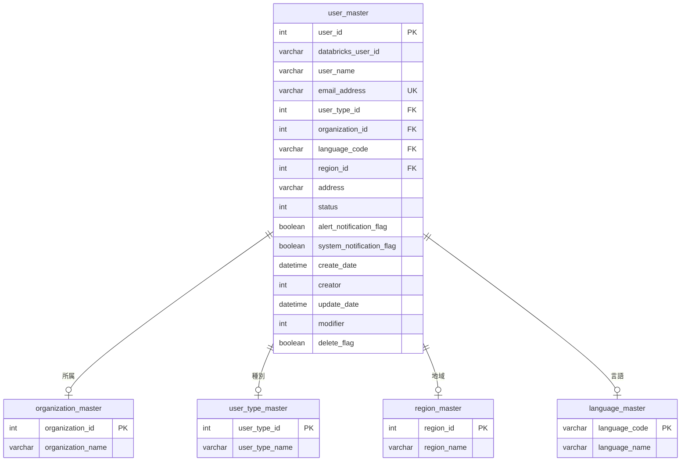

# ユーザー管理機能

## 📑 目次

- [ユーザー管理機能](#ユーザー管理機能)
  - [📑 目次](#-目次)
  - [概要](#概要)
  - [機能一覧](#機能一覧)
  - [画面一覧](#画面一覧)
  - [データモデル](#データモデル)
    - [ユーザーマスタ (user\_master)](#ユーザーマスタ-user_master)
      - [テーブル設計](#テーブル設計)
      - [インデックス](#インデックス)
    - [リレーション](#リレーション)
  - [使用するFlaskルート一覧](#使用するflaskルート一覧)
  - [アクセス権限](#アクセス権限)
  - [外部連携](#外部連携)
    - [Databricks SCIM API連携](#databricks-scim-api連携)
      - [連携タイミングと処理順序](#連携タイミングと処理順序)
      - [認証方式](#認証方式)
  - [実装ステータス](#実装ステータス)
  - [関連ドキュメント](#関連ドキュメント)
    - [設計仕様書](#設計仕様書)
    - [要件定義書](#要件定義書)
    - [アーキテクチャ設計](#アーキテクチャ設計)
    - [共通仕様](#共通仕様)

---

## 概要

ユーザー管理機能は、Databricks IoTシステムにおけるユーザーマスタの登録・更新・削除・参照を行う管理機能です。

**機能ID**: FR-004-2

**特徴**:
- **ロールベースアクセス制御**: 4つのロール（システム保守者、管理者、販社ユーザ、サービス利用者）に応じたアクセス制御
- **データスコープ制限**: すべてのユーザーに所属組織配下のデータのみアクセス可能なフィルタが適用される
- **外部連携**: Databricks SCIM APIと連携してDatabricks Userとワークスペースグループを管理

---

## 機能一覧

| 機能ID     | 機能名             | 概要                         |
| ---------- | ------------------ | ---------------------------- |
| FR-004-2-1 | ユーザー一覧・検索 | ユーザー情報の一覧表示と検索 |
| FR-004-2-2 | ユーザー登録       | ユーザー基本情報の新規登録   |
| FR-004-2-3 | ユーザー更新       | ユーザー基本情報の変更       |
| FR-004-2-4 | ユーザー参照       | ユーザーの詳細情報表示       |
| FR-004-2-5 | ユーザー削除       | ユーザーの論理削除           |

---

## 画面一覧

| 画面ID  | 画面名           | スラッグ                        | 表示方式 | 概要                       |
| ------- | ---------------- | ------------------------------- | -------- | -------------------------- |
| ADM-005 | ユーザー一覧画面 | /admin/devices                  | 画面     | ユーザーの一覧・検索・削除 |
| ADM-006 | ユーザー登録画面 | /admin/devices/create           | モーダル | ユーザーの新規登録         |
| ADM-007 | ユーザー更新画面 | /admin/devices/<device_id>/edit | モーダル | ユーザーの更新             |
| ADM-008 | ユーザー参照画面 | /admin/devices/<device_id>      | モーダル | ユーザーの詳細情報表示     |

---

## データモデル

### ユーザーマスタ (user_master)

#### テーブル設計

| カラム名                 | 論理名               | データ型     | 必須 | 備考                                              |
| ------------------------ | -------------------- | ------------ | ---- | ------------------------------------------------- |
| user_id                  | ユーザーID           | INT          | ○    | ユーザーの一意識別子（主キー、AutoIncrement）     |
| databricks_user_id       | DatabricksユーザーID | VARCHAR(36)  | ○    | Databricks SCIM APIから返されるユーザーID（UUID） |
| user_name                | 名称                 | VARCHAR(20)  | ○    | ユーザーの表示名                                  |
| email_address            | メールアドレス       | VARCHAR(254) | ○    | ユーザーのメールアドレス                          |
| user_type_id             | ユーザー種別ID       | INT          | ○    | ユーザー種別ID（外部キー）                        |
| organization_id          | 組織ID               | INT          | ○    | 所属組織ID（外部キー）                            |
| language_code            | 言語コード           | VARCHAR(10)  | ○    | 表示言語コード（外部キー、デフォルト: 'ja'）      |
| region_id                | 地域ID               | INT          | ○    | ユーザーの所在地域ID（外部キー）                  |
| address                  | 住所                 | VARCHAR(500) | ○    | ユーザーの住所                                    |
| status                   | ステータス           | INT          | ○    | 0: ロック済み、1: アクティブ                      |
| alert_notification_flag  | アラート通知フラグ   | BOOLEAN      | ○    | アラート通知の有効/無効（デフォルト: TRUE）       |
| system_notification_flag | システム通知フラグ   | BOOLEAN      | ○    | システム通知の有効/無効（デフォルト: TRUE）       |
| create_date              | 作成日時             | DATETIME     | ○    | レコード作成日時                                  |
| creator                  | 作成者               | INT          | ○    | レコード作成者のユーザーID                        |
| update_date              | 更新日時             | DATETIME     | ○    | レコード最終更新日時                              |
| modifier                 | 更新者               | INT          | ○    | レコード更新者のユーザーID                        |
| delete_flag              | 削除フラグ           | BOOLEAN      | ○    | 論理削除状態（デフォルト: FALSE）                 |

#### インデックス

| インデックス名      | カラム          | 種別   | 目的                                   |
| ------------------- | --------------- | ------ | -------------------------------------- |
| PRIMARY             | user_id         | 主キー | ユーザーの一意識別子                   |
| idx_organization_id | organization_id | INDEX  | 組織によるフィルタリング高速化         |
| idx_user_type_id    | user_type_id    | INDEX  | ユーザー種別によるフィルタリング高速化 |
| idx_region_id       | region_id       | INDEX  | 地域によるフィルタリング高速化         |

**注**: 詳細なテーブル定義は [データベース設計書](../../common/app-database-specification.md) を参照してください。

### リレーション

---

## 使用するFlaskルート一覧

| No  | ルート名             | エンドポイント                             | メソッド | 用途                        | レスポンス形式     |
| --- | -------------------- | ------------------------------------------ | -------- | --------------------------- | ------------------ |
| 1   | ユーザー一覧初期表示 | `/admin/users`                             | GET      | ユーザー覧の初期表示        | HTML               |
| 2   | ユーザー一覧検索     | `/admin/users`                             | POST     | ユーザー検索・一覧表示      | HTML               |
| 3   | ユーザー登録画面     | `/admin/users/create`                      | GET      | ユーザー登録画面表示        | HTML（モーダル）   |
| 4   | ユーザー登録実行     | `/admin/users/register`                    | POST     | ユーザー登録処理            | リダイレクト (302) |
| 5   | ユーザー参照画面     | `/admin/users/<databricks_user_id>`        | GET      | ユーザー詳細情報表示        | HTML（モーダル）   |
| 6   | ユーザー更新画面     | `/admin/users/<databricks_user_id>/edit`   | GET      | ユーザー更新画面表示        | HTML（モーダル）   |
| 7   | ユーザー更新実行     | `/admin/users/<databricks_user_id>/update` | POST     | ユーザー更新処理            | リダイレクト (302) |
| 8   | ユーザー削除実行     | `/admin/users/<databricks_user_id>/delete` | POST     | ユーザー削除処理            | リダイレクト (302) |
| 9   | CSVエクスポート      | `/admin/users?export=csv`                  | POST     | ユーザー一覧CSVダウンロード | CSV                |

**Flask SSRの特徴**:
- JSONレスポンスではなく、HTMLレスポンス（`render_template()`）またはリダイレクト（`redirect()`）を返す
- クライアントサイドJavaScriptは最小限（Jinja2テンプレートでサーバーサイドレンダリング）
- モーダル表示もサーバーサイドで生成

---

## アクセス権限

| 機能         | システム保守者 | 管理者 | 販社ユーザ | サービス利用者 |
| ------------ | -------------- | ------ | ---------- | -------------- |
| ユーザー一覧 | ○              | ○      | ○          | ○              |
| ユーザー参照 | ○              | ○      | ○          | ○              |
| ユーザー登録 | ○              | ○      | ○          | -              |
| ユーザー更新 | ○              | ○      | ○          | ○              |
| ユーザー削除 | ○              | ○      | ○          | -              |

**凡例**:
- **○**: 利用可能
- **-**: 利用不可

**データスコープ制限**:
- **すべてのユーザー**: 組織階層（organization_closure）によるデータスコープ制限
  - ユーザーの所属組織とその下位組織に属するユーザーのみアクセス可能

---

## 外部連携

### Databricks SCIM API連携

ユーザーの登録・更新・削除時には、Databricks SCIM APIと連携してDatabricks Userとワークスペースグループを管理します。

#### 連携タイミングと処理順序

| 操作         | 処理順序                                                                       | 説明                                                                                        |
| ------------ | ------------------------------------------------------------------------------ | ------------------------------------------------------------------------------------------- |
| ユーザー登録 | ① Databricks User作成 ② Unity Catalog INSERT ③ OLTP DB INSERT            | POST /api/2.0/preview/scim/v2/Users でユーザー作成後、Unity CatalogとOLTP DBに登録          |
| ユーザー更新 | ① Databricks User更新 ②Unity Catalog UPDATE ③ OLTP DB UPDATE ③        | PATCH /api/2.0/preview/scim/v2/Users/{id} でユーザー更新後、Unity CatalogとOLTP DBを更新    |
| ユーザー削除 | ① Unity Catalog DELETE ② OLTP DB UPDATE (論理削除) ③ Databricks User削除 | Unity Catalog物理削除、OLTP DB論理削除後、DELETE /api/2.0/preview/scim/v2/Users/{id} で削除 |

#### 認証方式

**サービスプリンシパル認証**:
- Databricks SCIM API、Databricks Groups APIは管理者権限が必要なため、サービスプリンシパルのトークンを使用
- 環境変数: `DATABRICKS_SERVICE_PRINCIPAL_TOKEN`

**ロールバック処理**:
  - ユーザー登録・更新・削除の各処理では、Databricks User、Unity Catalog、OLTP DBの3層操作を順次実行
  - **いずれかの処理が失敗した場合、完了済みの処理をすべてロールバック**して3層の整合性を保証
  - エラーメッセージをユーザーに表示

---

## 実装ステータス

| 機能               | UI仕様書 | ワークフロー仕様書 | 実装   | テスト | ステータス |
| ------------------ | -------- | ------------------ | ------ | ------ | ---------- |
| ユーザー一覧・検索 | 完了     | 完了               | 未着手 | 未着手 | 設計中     |
| ユーザー登録       | 完了     | 完了               | 未着手 | 未着手 | 設計中     |
| ユーザー編集       | 完了     | 完了               | 未着手 | 未着手 | 設計中     |
| ユーザー参照       | 完了     | 完了               | 未着手 | 未着手 | 設計中     |
| ユーザー削除       | 完了     | 完了               | 未着手 | 未着手 | 設計中     |

**ステータス凡例**:
- 完了
- 作業中
- 未着手

---

## 関連ドキュメント

### 設計仕様書

- [UI仕様書](./ui-specification.md) - 画面レイアウト、UI要素、バリデーションルール定義
- [ワークフロー仕様書](./workflow-specification.md) - 処理フロー、API統合、エラーハンドリング、状態管理

### 要件定義書

- [機能要件定義書](../../../02-requirements/functional-requirements.md) - FR-004-2: ユーザー管理
- [非機能要件定義書](../../../02-requirements/non-functional-requirements.md) - NFR-SEC-001, NFR-SEC-006, NFR-SEC-007
- [技術要件定義書](../../../02-requirements/technical-requirements.md) - TR-SEC-004, TR-SEC-005

### アーキテクチャ設計

- [バックエンド設計](../../../01-architecture/backend.md) - Flask/LDP設計
- [フロントエンド設計](../../../01-architecture/frontend.md) - Flask + Jinja2設計
- [データベース設計](../../../01-architecture/database.md) - テーブル定義、インデックス設計

### 共通仕様

- [共通仕様書](../../common/common-specification.md) - HTTPステータスコード、エラーコード、トランザクション管理、セキュリティ等
- [認証仕様書](../../common/authentication-specification.md) - 認証アーキテクチャ、Token Exchange、Unity Catalog接続
- [UI共通仕様書](../../common/ui-common-specification.md) - すべての画面に共通するUI仕様

---

**このREADMEは、ユーザー管理機能の全体像を示す概要ドキュメントです。詳細な仕様は各仕様書を参照してください。**
