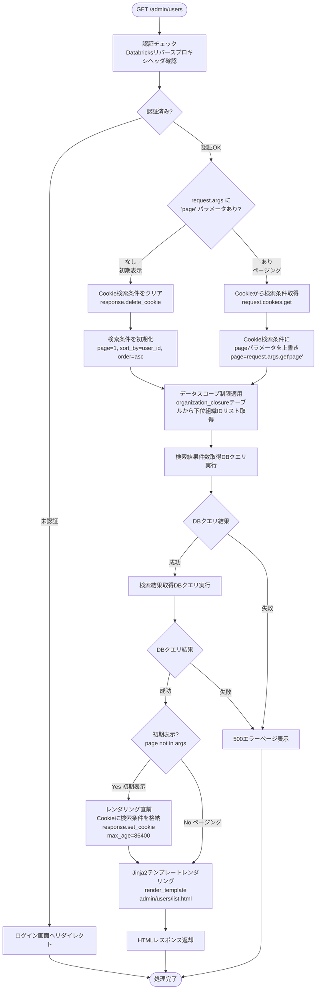
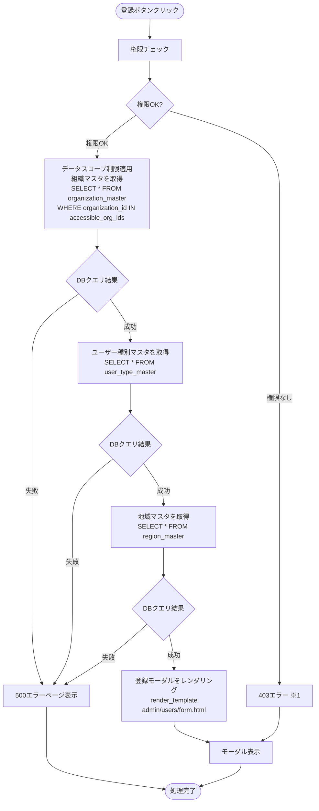
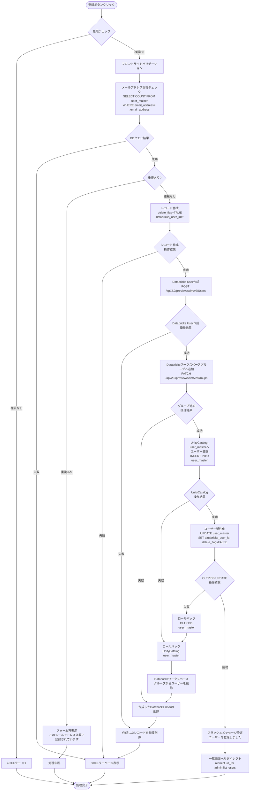
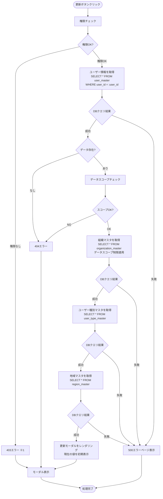
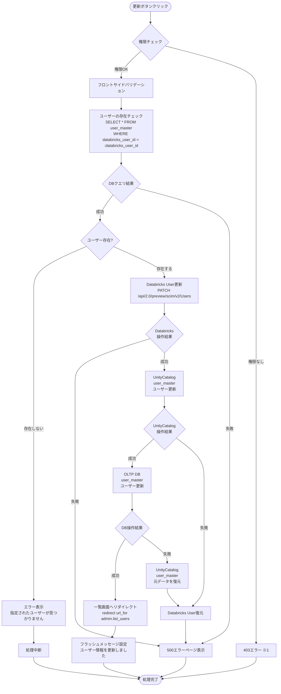
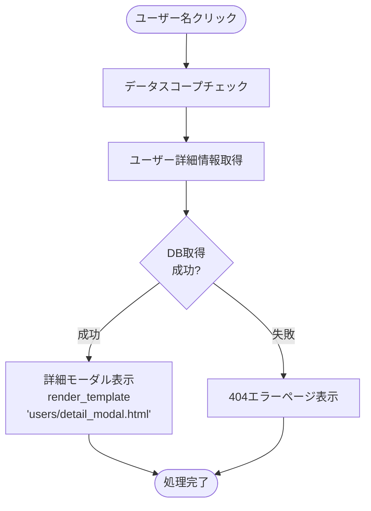
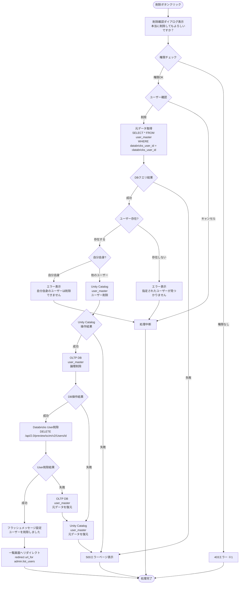

# ユーザー管理 - ワークフロー仕様書

## 📑 目次

- [ユーザー管理 - ワークフロー仕様書](#ユーザー管理---ワークフロー仕様書)
  - [📑 目次](#-目次)
  - [概要](#概要)
  - [使用するFlaskルート一覧](#使用するflaskルート一覧)
  - [ルート呼び出しマッピング](#ルート呼び出しマッピング)
  - [ワークフロー一覧](#ワークフロー一覧)
    - [初期表示](#初期表示)
      - [処理フロー](#処理フロー)
      - [Flaskルート](#flaskルート)
      - [バリデーション](#バリデーション)
      - [処理詳細（サーバーサイド）](#処理詳細サーバーサイド)
      - [表示メッセージ](#表示メッセージ)
      - [エラーハンドリング](#エラーハンドリング)
      - [ログ出力タイミング](#ログ出力タイミング)
      - [検索条件の保持方法](#検索条件の保持方法)
      - [UI状態](#ui状態)
    - [検索・絞り込み](#検索絞り込み)
      - [処理フロー](#処理フロー-1)
      - [処理詳細（サーバーサイド）](#処理詳細サーバーサイド-1)
      - [表示メッセージ](#表示メッセージ-1)
      - [エラーハンドリング](#エラーハンドリング-1)
      - [UI状態](#ui状態-1)
      - [ログ出力タイミング](#ログ出力タイミング-1)
      - [検索条件の保持方法](#検索条件の保持方法-1)
    - [全体ソート](#全体ソート)
      - [処理詳細](#処理詳細)
    - [ページ内ソート](#ページ内ソート)
      - [処理詳細](#処理詳細-1)
    - [ページング](#ページング)
      - [処理詳細](#処理詳細-2)
      - [UI状態](#ui状態-2)
    - [ユーザー登録](#ユーザー登録)
      - [登録ボタン押下](#登録ボタン押下)
        - [処理フロー](#処理フロー-2)
        - [処理詳細（サーバーサイド）](#処理詳細サーバーサイド-2)
      - [登録実行](#登録実行)
        - [処理フロー](#処理フロー-3)
        - [処理詳細（サーバーサイド）](#処理詳細サーバーサイド-3)
        - [表示メッセージ](#表示メッセージ-2)
        - [UI状態](#ui状態-3)
    - [ユーザー更新](#ユーザー更新)
      - [ユーザー更新ボタン押下](#ユーザー更新ボタン押下)
        - [処理フロー](#処理フロー-4)
        - [処理詳細（サーバーサイド）](#処理詳細サーバーサイド-4)
      - [ユーザー更新実行](#ユーザー更新実行)
        - [処理フロー](#処理フロー-5)
        - [処理詳細（サーバーサイド）](#処理詳細サーバーサイド-5)
        - [表示メッセージ](#表示メッセージ-3)
      - [ログ出力タイミング](#ログ出力タイミング-2)
        - [UI状態](#ui状態-4)
    - [ユーザー参照](#ユーザー参照)
      - [処理フロー](#処理フロー-6)
      - [処理詳細（サーバーサイド）](#処理詳細サーバーサイド-6)
      - [ログ出力タイミング](#ログ出力タイミング-3)
    - [ユーザー削除](#ユーザー削除)
      - [処理フロー](#処理フロー-7)
      - [バリデーション](#バリデーション-1)
      - [処理詳細（サーバーサイド）](#処理詳細サーバーサイド-7)
      - [表示メッセージ](#表示メッセージ-4)
      - [ログ出力タイミング](#ログ出力タイミング-4)
    - [CSVエクスポート](#csvエクスポート)
        - [処理詳細（サーバーサイド）](#処理詳細サーバーサイド-8)
  - [使用データベース詳細](#使用データベース詳細)
    - [使用テーブル一覧](#使用テーブル一覧)
    - [インデックス最適化](#インデックス最適化)
  - [トランザクション管理](#トランザクション管理)
    - [3層トランザクション整合性保証](#3層トランザクション整合性保証)
      - [基本方針](#基本方針)
      - [トランザクション開始・終了タイミング](#トランザクション開始終了タイミング)
      - [実装パターン: Sagaパターン](#実装パターン-sagaパターン)
  - [セキュリティ実装](#セキュリティ実装)
    - [認証・認可実装](#認証認可実装)
    - [入力検証](#入力検証)
    - [ログ出力ルール](#ログ出力ルール)
  - [関連ドキュメント](#関連ドキュメント)
    - [画面仕様](#画面仕様)
    - [アーキテクチャ設計](#アーキテクチャ設計)
    - [共通仕様](#共通仕様)

---

## 概要

このドキュメントは、ユーザー管理画面のユーザー操作に対する処理フロー、バリデーション実行タイミング、データベース処理、Databricks SCIM API連携の詳細を記載します。

**このドキュメントの役割:**
- ✅ ユーザー操作のトリガー条件
- ✅ 処理フローの詳細（Flaskルート呼び出しシーケンス、フォーム送信、リダイレクト）
- ✅ バリデーション実行タイミング（いつチェックするか）
- ✅ エラーハンドリングフロー（Databricks連携失敗時のロールバック含む）
- ✅ サーバーサイド処理詳細（SQL、Databricks SCIM API呼び出し、変数、条件分岐、コード例）
- ✅ データベース利用詳細（トランザクション管理、テーブル操作、インデックス）
- ✅ セキュリティ実装詳細（認証、データスコープ制限、入力検証、ログ出力）

**UI仕様書との役割分担:**
- **UI仕様書**: バリデーションルール定義（何をチェックするか）、UI要素の詳細仕様
- **ワークフロー仕様書**: バリデーション実行タイミング（いつどのようにチェックするか）、処理フロー、サーバーサイド実装詳細

**注:** UI要素の詳細やバリデーションルールは [UI仕様書](./ui-specification.md) を参照してください。

---

## 使用するFlaskルート一覧

この画面で使用するすべてのFlaskルート（エンドポイント）を記載します。

| No  | ルート名                     | エンドポイント                             | メソッド | 用途                             | レスポンス形式     | 備考                                           |
| --- | ---------------------------- | ------------------------------------------ | -------- | -------------------------------- | ------------------ | ---------------------------------------------- |
| 1   | ユーザー一覧表示・ページング | `/admin/users`                             | GET      | ユーザー一覧初期表示・ページング | HTML               | pageパラメータなし=初期表示、あり=ページング   |
| 2   | ユーザー検索                 | `/admin/users`                             | POST     | ユーザー検索実行                 | HTML               | 検索条件をCookieに格納                         |
| 3   | ユーザー登録画面             | `/admin/users/create`                      | GET      | ユーザー登録フォーム表示         | HTML（モーダル）   | 組織選択肢を含む                               |
| 4   | ユーザー登録実行             | `/admin/users/register`                    | POST     | ユーザー登録処理                 | リダイレクト (302) | 成功時: `/admin/users`、失敗時: フォーム再表示 |
| 5   | ユーザー参照画面             | `/admin/users/<databricks_user_id>`        | GET      | ユーザー詳細情報表示             | HTML（モーダル）   | -                                              |
| 6   | ユーザー更新画面             | `/admin/users/<databricks_user_id>/edit`   | GET      | ユーザー更新フォーム表示         | HTML（モーダル）   | 現在の値を初期表示                             |
| 7   | ユーザー更新実行             | `/admin/users/<databricks_user_id>/update` | POST     | ユーザー更新処理                 | リダイレクト (302) | 成功時: `/admin/users`                         |
| 8   | ユーザー削除実行             | `/admin/users/<databricks_user_id>/delete` | POST     | ユーザー削除処理                 | リダイレクト (302) | 成功時: `/admin/users`                         |
| 9   | CSVエクスポート              | `/admin/users?export=csv`                  | POST     | ユーザー一覧CSVダウンロード      | CSV                | 現在の検索条件を適用                           |

**注:**
- **レスポンス形式**:
  - `HTML`: Jinja2テンプレートをレンダリングして返す（`render_template()`）
  - `リダイレクト (302)`: 成功時に別のルートへリダイレクト（`redirect(url_for())`）、失敗時はフォームを再表示
  - `CSV`: CSVファイルをダウンロードレスポンスとして返す
- **Flask Blueprint構成**: `admin_bp` として実装

---

## ルート呼び出しマッピング

| ユーザー操作     | トリガー        | 呼び出すルート                    | パラメータ                                                                                   | レスポンス                        | エラー時の挙動                         |
| ---------------- | --------------- | --------------------------------- | -------------------------------------------------------------------------------------------- | --------------------------------- | -------------------------------------- |
| 画面初期表示     | URL直接アクセス | `GET /admin/users`                | なし                                                                                         | HTML（ユーザー一覧画面）          | エラーページ表示                       |
| 検索ボタン押下   | フォーム送信    | `POST /admin/users`               | `user_name, email_address, user_type_id, organization_id, region_id, status, sort_by, order` | HTML（検索結果画面）              | エラーメッセージ表示                   |
| ページボタン押下 | リンククリック  | `GET /admin/users`                | `page`                                                                                       | HTML（検索結果画面）              | エラーメッセージ表示                   |
| 登録ボタン押下   | ボタンクリック  | `GET /admin/users/create`         | なし                                                                                         | HTML（登録モーダル）              | エラーページ表示                       |
| 登録実行         | フォーム送信    | `POST /admin/users/register`      | フォームデータ                                                                               | リダイレクト → `GET /admin/users` | フォーム再表示（エラーメッセージ付き） |
| 参照ボタン押下   | ボタンクリック  | `GET /admin/users/<user_id>`      | user_id                                                                                      | HTML（参照モーダル）              | 404エラーページ                        |
| 更新ボタン押下   | ボタンクリック  | `GET /admin/users/<user_id>/edit` | user_id                                                                                      | HTML（更新モーダル）              | 404エラーページ                        |
| 更新実行         | フォーム送信    | `POST /admin/users/update`        | フォームデータ                                                                               | リダイレクト → `GET /admin/users` | フォーム再表示（エラーメッセージ付き） |
| 削除実行         | フォーム送信    | `POST /admin/users/delete`        | user_id                                                                                      | リダイレクト → `GET /admin/users` | エラーメッセージ表示                   |
| CSVエクスポート  | ボタンクリック  | `POST /admin/users?export=csv`    | 検索条件                                                                                     | CSVダウンロード                   | エラーメッセージ表示                   |

---

## ワークフロー一覧

### 初期表示

**トリガー:** URL直接アクセス時（ユーザーが `/admin/users` にアクセスしたとき）

**前提条件:**
- ユーザーがログイン済み（Databricks認証完了）
- 適切な権限を持っている

#### 処理フロー



**実装例:**
```python
@app.route('/admin/users', methods=['GET'])
@require_auth
def users_list():
    """初期表示・ページング（統合）"""

    # 初期表示 vs ページング判定
    if 'page' not in request.args:
        # 初期表示: デフォルト値
        search_params = {
            'page': 1,
            'per_page': ITEM_PER_PAGE,
            'sort_by': 'user_id',
            'order': 'asc',
            'user_name': '',
            'email_address': '',
            'user_type_id': None,
            'organization_id': None,
            'region_id': None,
            'status': None
        }
        save_cookie = True
    else:
        # ページング: Cookieから取得
        cookie_data = request.cookies.get('user_search_params')
        if cookie_data:
            search_params = json.loads(cookie_data)
        else:
            search_params = get_default_search_params()

        search_params['page'] = request.args.get('page', 1, type=int)
        save_cookie = False

    # データスコープ制限適用
    accessible_org_ids = get_accessible_organizations(g.current_user.organization_id)

    # DB検索実行
    users, total = search_users(search_params, accessible_org_ids)

    # レンダリング
    response = make_response(render_template(
        'admin/users/list.html',
        users=users,
        total=total,
        search_params=search_params
    ))

    # 初期表示時のみCookie格納
    if save_cookie:
        response.set_cookie(
            'user_search_params',
            json.dumps(search_params),
            max_age=86400,  # 24時間
            httponly=True,
            samesite='Lax'
        )

    return response
```

---

#### Flaskルート

| ルート           | エンドポイント     | 詳細                     |
| ---------------- | ------------------ | ------------------------ |
| ユーザー一覧表示 | `GET /admin/users` | クエリパラメータ: `page` |

#### バリデーション

**実行タイミング:** なし（初期表示のため、デフォルト値を使用）

**データスコープ制限:**
- **フィルタリングロジックは全ユーザーで共通、実質的なアクセス可能範囲に差分あり**
- システム保守者・管理者: すべてのユーザーにアクセス可能
- 販社ユーザ・サービス利用者: ログインユーザーの `organization_id` に紐づく全子組織でフィルタリング

#### 処理詳細（サーバーサイド）

**① 認証・認可チェック**

リバースプロキシヘッダから認証情報を取得し、権限を確認します。

**処理内容:**
- ヘッダ `X-Forwarded-User` からユーザーIDを取得
- データベースから現在ユーザー情報を取得（ユーザー種別、組織ID）
- 組織に応じてデータスコープを決定

**変数・パラメータ:**
- `current_user_id`: string - リバースプロキシヘッダから取得したユーザーID
- `current_user`: User - データベースから取得したユーザーオブジェクト
- `user_type_id`: int - ユーザー種別ID（user_type_masterへの外部キー）
- `organization_id`: string - データスコープ制限用の組織ID

**実装例:**
```python
from flask import request, abort, g
from functools import wraps

def require_auth(f):
    @wraps(f)
    def decorated_function(*args, **kwargs):
        user_id = request.headers.get('X-Forwarded-User')
        if not user_id:
            abort(401)

        user = User.query.filter_by(user_id=user_id, delete_flag=FALSE).first()
        if not user:
            abort(403)

        g.current_user = user
        return f(*args, **kwargs)
    return decorated_function
```

**② クエリパラメータ取得**

```python
page = request.args.get('page', 1, type=int)
per_page = ITEM_PER_PAGE  # 設定ファイルから取得
```

**③ データスコープ制限の適用**

組織階層に基づいてデータスコープ制限を適用します。

**処理内容:**
- **全ユーザー共通**: 組織階層（`organization_closure`）でフィルタ
  - ユーザーの `organization_id` を親組織IDとして検索
  - 下位組織リスト（`subsidiary_organization_id`）を取得
  - そのリストに該当する組織のデータのみアクセス可能
  - **ロールによる条件分岐は一切行わない**

**注**: システム保守者・管理者が全データにアクセスできるのは、
ルート組織に所属しているため

**変数・パラメータ:**
- `accessible_org_ids`: list - アクセス可能な組織IDリスト

**実装例:**
```python
def apply_data_scope_filter(query, current_user):
    # organization_closure テーブルから下位組織リストを取得（全ユーザー共通）
    accessible_org_ids = db.session.query(
        OrganizationClosure.subsidiary_organization_id
    ).filter(
        OrganizationClosure.parent_organization_id == current_user.organization_id
    ).all()

    # 下位組織IDのリストを抽出
    org_ids = [org_id[0] for org_id in accessible_org_ids]

    if not org_ids:
        # アクセス可能な組織がない場合は空の結果を返す
        # （通常は発生しない - 最低でも自組織は含まれる）
        return query.filter(User.organization_id.in_([]))

    # 組織IDリストでフィルタリング
    return query.filter(User.organization_id.in_(org_ids))
```

**④ データベースクエリ実行**

ユーザーマスタからデータを取得します。

**使用テーブル:** user_master（ユーザーマスタ）、user_type_masterユーザー種別マスタ、organization_master（組織マスタ）、region_master（地域マスタ）

**SQL詳細:**
TODO
- 検索結果件数取得DBクエリ
```sql
SELECT
  COUNT(user_id) AS data_count
FROM
  user_master
WHERE
  delete_flag = FALSE
  AND organization_id IN (:accessible_org_ids)
```

- 検索結果取得DBクエリ
```sql
SELECT
  u.user_id,
  u.user_name,
  u.email_address,
  t.user_type_name,
  o.organization_name,
  r.region_name,
  u.status
FROM
  user_master u
LEFT JOIN organization_master o
  ON u.organization_id = o.organization_id
  AND o.delete_flag = FALSE
LEFT JOIN region_master r
  ON u.region_id = r.region_id
  AND r.delete_flag = FALSE
LEFT JOIN user_type_master t
  ON u.user_type_id = t.user_type_id
  AND t.delete_flag = FALSE
WHERE
  u.delete_flag = FALSE
  AND organization_id IN (:accessible_org_ids)
ORDER BY
  u.user_id ASC
LIMIT :item_per_page OFFSET 0
```

**実装例:**
```python
offset = (page - 1) * per_page

# ベースクエリ
query = User.query.filter_by(delete_flag=FALSE)

# データスコープ制限適用
query = apply_data_scope_filter(query, g.current_user)

# ソート適用
if order == 'asc':
    query = query.order_by(getattr(User, sort_by).asc())
else:
    query = query.order_by(getattr(User, sort_by).desc())

# ページング適用
users = query.limit(per_page).offset(offset).all()
total = query.count()
```

**⑤ HTMLレンダリング**

Jinja2テンプレートをレンダリングしてHTMLレスポンスを返却します。

**実装例:**
```python
return render_template('users/list.html',
                      users=users,
                      total=total,
                      page=page,
                      per_page=per_page,
                      sort_by=sort_by,
                      order=order,
                      current_user=g.current_user)
```

#### 表示メッセージ

| メッセージID | 表示内容                   | 表示タイミング | 表示場所     |
| ------------ | -------------------------- | -------------- | ------------ |
| ERR_DB_001   | データの取得に失敗しました | DBクエリ失敗時 | エラーページ |

#### エラーハンドリング

| HTTPステータス | エラー種別         | 処理内容                   | 表示内容                   |
| -------------- | ------------------ | -------------------------- | -------------------------- |
| 401            | 認証エラー         | ログイン画面へリダイレクト | -                          |
| 500            | データベースエラー | 500エラーページ表示        | データの取得に失敗しました |

#### ログ出力タイミング
DBクエリ実行の直前、直後に操作ログを出力する

#### 検索条件の保持方法
Cookieに検索条件を保持する

#### UI状態

- 検索条件: デフォルト値（空）
- テーブル: ユーザー一覧データ表示
- ページネーション: 1ページ目を選択状態

---

### 検索・絞り込み

**トリガー:** (2.9) 検索ボタンクリック（フォーム送信）

**前提条件:**
- 検索条件が入力されている（空でも可）

#### 処理フロー


---

#### 処理詳細（サーバーサイド）

**検索クエリ実行**
**使用テーブル:** user_master（ユーザーマスタ）、user_type_masterユーザー種別マスタ、organization_master（組織マスタ）、region_master（地域マスタ）

- 検索結果件数取得DBクエリ
```sql
SELECT
  COUNT(u.user_id) AS user_count
FROM
  user_master u
LEFT JOIN organization_master o
  ON u.organization_id = o.organization_id
  AND o.delete_flag = FALSE
LEFT JOIN region_master r
  ON u.region_id = r.region_id
  AND r.delete_flag = FALSE
LEFT JOIN user_type_master t
  ON u.user_type_id = t.user_type_id
  AND t.delete_flag = FALSE
WHERE
  u.delete_flag = FALSE
  AND u.organization_id IN (:accessible_org_ids)
  AND CASE WHEN :user_name IS NULL THEN TRUE ELSE u.user_name LIKE CONCAT('%', :user_name, '%') END
  AND CASE WHEN :email_address IS NULL THEN TRUE ELSE u.email_address LIKE CONCAT('%', :email_address, '%') END
  AND CASE WHEN :user_type_id < 0 THEN TRUE ELSE u.user_type_id = :user_type_id END
  AND CASE WHEN :organization_id < 0 THEN TRUE ELSE u.organization_id LIKE = :organization_id END
  AND CASE WHEN :region_id < 0 THEN TRUE ELSE u.region_id = :region_id END
  AND CASE WHEN :status < 0 THEN TRUE ELSE s.status = :status END
```

- 検索結果取得DBクエリ
**SQL詳細:**
```sql
SELECT
  u.user_id,
  u.user_name,
  u.email_address,
  t.user_type_name,
  o.organization_name,
  r.region_name,
  u.status
FROM
  user_master u
LEFT JOIN organization_master o
  ON u.organization_id = o.organization_id
  AND o.delete_flag = FALSE
LEFT JOIN region_master r
  ON u.region_id = r.region_id
  AND r.delete_flag = FALSE
LEFT JOIN user_type_master t
  ON u.user_type_id = t.user_type_id
  AND t.delete_flag = FALSE
WHERE
  u.delete_flag = FALSE
  AND u.organization_id IN (:accessible_org_ids)
  AND CASE WHEN :user_name IS NULL THEN TRUE ELSE u.user_name LIKE CONCAT('%', :user_name, '%') END
  AND CASE WHEN :email_address IS NULL THEN TRUE ELSE u.email_address LIKE CONCAT('%', :email_address, '%') END
  AND CASE WHEN :user_type_id < 0 THEN TRUE ELSE u.user_type_id = :user_type_id END
  AND CASE WHEN :organization_id < 0 THEN TRUE ELSE u.organization_id LIKE = :organization_id END
  AND CASE WHEN :region_id < 0 THEN TRUE ELSE u.region_id = :region_id END
  AND CASE WHEN :status < 0 THEN TRUE ELSE s.status = :status END
ORDER BY
  {sort_by} {order}
LIMIT :item_per_page OFFSET (:page -1) * :item_per_page
```

#### 表示メッセージ

| メッセージID | 表示内容                   | 表示タイミング | 表示場所     |
| ------------ | -------------------------- | -------------- | ------------ |
| -            | データの取得に失敗しました | DBクエリ失敗時 | エラーページ |

#### エラーハンドリング

| HTTPステータス | エラー種別         | 処理内容            | 表示内容                   |
| -------------- | ------------------ | ------------------- | -------------------------- |
| 500            | データベースエラー | 500エラーページ表示 | データの取得に失敗しました |

#### UI状態

- テーブル: 検索結果データ表示
- ページネーション: 1ページ目にリセット

#### ログ出力タイミング
DBクエリ実行の直前、直後に操作ログを出力する

#### 検索条件の保持方法
Cookieに検索条件を保持する

### 全体ソート

**トリガー:** (2) 検索条件欄でソート項目、ソート順ドロップダウンで具体値を選択し、検索を実行

#### 処理詳細
検索条件欄のソート項目ドロップダウンで選択した内容に対して、ソート順ドロップダウンで選択した順序でページをまたいだソートを行う。
詳細は[共通仕様書](../../common/common-specification.md)参照のこと。

---

### ページ内ソート

**トリガー:**（6）データテーブルのソート可能カラム（ユーザー名、メールアドレス、ユーザー種別）のヘッダをクリック

#### 処理詳細
データテーブルのヘッダをクリックすることで、ページ内で閉じたソートを行う。
詳細は[共通仕様書](../../common/common-specification.md)参照のこと

---

### ページング

**トリガー:** (6.9) ページネーションのページ番号ボタンクリック

#### 処理詳細
ページネーションのページ番号を選択することで、選択されたページ番号に対応するデータをデータテーブルに表示する。
具体的な処理は[初期表示](#初期表示)の処理と同様とする。

---

#### UI状態

- 検索条件: 保持
- テーブル: 選択ページのデータ表示
- ページネーション: 選択ページをアクティブ状態

---

### ユーザー登録

#### 登録ボタン押下

**トリガー:** (3.1) 登録ボタンクリック

**前提条件:**
- ユーザーが適切な権限を持っている（システム保守者、管理者、販社ユーザ）

##### 処理フロー



※1　403エラー発生時、ドロップダウン、テキストボックスに具体的なデータは表示せず、空で表示する。

##### 処理詳細（サーバーサイド）

**実装例:**
```python
@admin_bp.route('/users/create', methods=['GET'])
@require_permission('user:write')
def create_user_form():
    """
    ユーザー登録画面表示

    フロー:
    1. 権限チェック（デコレーターで実施）
    2. 組織マスタ一覧取得（データスコープ制限適用）
    3. ユーザー種別マスタ一覧取得
    4. 地域マスタ一覧取得
    5. 登録モーダルレンダリング
    """
    try:
        # ① 権限チェック（デコレーターで実施済み）
        current_user = g.current_user

        logger.info(f'ユーザー登録画面表示開始: user_id={current_user.user_id}')

        # ② 組織マスタ一覧取得（データスコープ制限適用）
        logger.info('組織マスタ一覧取得開始')
        organizations = db.session.query(Organization)\
            .join(OrganizationClosure,
                  Organization.organization_id == OrganizationClosure.subsidiary_organization_id)\
            .filter(OrganizationClosure.parent_organization_id == current_user.organization_id)\
            .filter(Organization.delete_flag == False)\
            .order_by(Organization.organization_name)\
            .all()
        logger.info(f'組織マスタ一覧取得成功: count={len(organizations)}')

        # ③ ユーザー種別マスタ一覧取得
        logger.info('ユーザー種別マスタ一覧取得開始')
        user_types = UserType.query.filter_by(delete_flag=False).order_by(
            UserType.user_type_id
        ).all()
        logger.info(f'ユーザー種別マスタ一覧取得成功: count={len(user_types)}')

        # ④ 地域マスタ一覧取得
        logger.info('地域マスタ一覧取得開始')
        regions = Region.query.filter_by(delete_flag=False).order_by(
            Region.region_id
        ).all()
        logger.info(f'地域マスタ一覧取得成功: count={len(regions)}')

        # ⑤ 登録モーダルレンダリング
        return render_template(
            'admin/users/form.html',
            mode='create',
            organizations=organizations,
            user_types=user_types,
            regions=regions
        )

    except Exception as e:
        logger.error(f'ユーザー登録画面表示エラー: user_id={current_user.user_id}, error={str(e)}')
        abort(500)
```

---

#### 登録実行

**トリガー:** (7.11) 登録ボタン（モーダル内）クリック後に表示される登録実施確認モーダルで「はい」を選択

##### 処理フロー


※1　403エラー発生時、登録モーダルを閉じる。

##### 処理詳細（サーバーサイド）

**実装例:**
```python
from flask_wtf import FlaskForm
from wtforms import StringField, SelectField, BooleanField
from wtforms.validators import DataRequired, Email, Length
from datetime import datetime
from sqlalchemy import text
import requests
import os

class UserCreateForm(FlaskForm):
    email_address = StringField('メールアドレス', validators=[
        DataRequired(message='メールアドレスは必須です'),
        Email(message='メールアドレスの形式が正しくありません'),
        Length(max=254, message='メールアドレスは254文字以内で入力してください')
    ])
    user_name = StringField('ユーザー名', validators=[
        DataRequired(message='ユーザー名は必須です'),
        Length(max=100, message='ユーザー名は20文字以内で入力してください')
    ])
    user_type_id = SelectField('ユーザー種別', coerce=int, validators=[DataRequired(message='ユーザー種別は必須です')])
    organization_id = SelectField('所属組織', validators=[DataRequired(message='所属組織は必須です')])
    language_code = SelectField('言語', coerce=str, validators=[DataRequired(message='言語は必須です')])
    region_id = SelectField('地域', coerce=int, validators=[DataRequired(message='地域は必須です')])
    address = StringField('住所', validators=[Length(max=500, message='住所は500文字以内で入力してください')])
    status = SelectField('ステータス', coerce=int, validators=[DataRequired(message='ステータスは必須です')])
    alert_notification_flag = BooleanField('アラート通知', default=True)
    system_notification_flag = BooleanField('システム通知', default=True)

@admin_bp.route('/users/create', methods=['POST'])
@require_permission('user:write')
def create_user():
    """
    ユーザー登録実行

    フロー:
    1. 権限チェック（デコレーターで実施）
    2. フォームデータ取得・バリデーション
    3. メールアドレス重複チェック
    4. レコード作成（delete_flag=TRUE, databricks_user_id=''）
    5. Databricks User作成
    6. Databricksワークスペースグループに追加
    7. UnityCatalog.user_masterへ登録
    8. OLTP DB.user_master更新（databricks_user_id設定 + delete_flag=FALSEに更新）
    9. コミット
    10. 成功メッセージ表示
    11. 一覧画面へリダイレクト

    エラー時のロールバック:
    - レコード作成失敗 → エラー表示
    - Databricks User作成失敗 → 作成したレコードを物理削除
    - グループ追加失敗 → Databricks User削除 + レコード物理削除
    - Unity Catalog登録失敗 → グループからユーザー削除 + Databricks User削除 + レコード物理削除
    - OLTP DB更新失敗 → Unity Catalog削除 + グループからユーザー削除 + Databricks User削除 + レコード物理削除
    """
    current_user = g.current_user
    databricks_user_id = None
    user_id = None

    try:
        logger.info(f'ユーザー登録開始: user_id={current_user.user_id}')

        # ② フォームデータ取得・バリデーション
        form = UserCreateForm(request.form)

        if not form.validate():
            flash('入力内容に誤りがあります', 'error')
            return render_template('users/create_modal.html', form=form)

        # ③ メールアドレス重複チェック
        logger.info(f'メールアドレス重複チェック開始: email={form.email_address.data}')
        existing_user = User.query.filter_by(
            email_address=form.email_address.data,
            delete_flag=False
        ).first()

        if existing_user:
            logger.warning(f'メールアドレス重複: email={form.email_address.data}')
            form.email_address.errors.append('このメールアドレスは既に使用されています')
            return render_template('users/create_modal.html', form=form)

        logger.info('メールアドレス重複チェック成功')

        # ④ レコード作成（delete_flag=TRUE, databricks_user_id=''）
        user = User(
            databricks_user_id='',  # 後でUPDATE
            user_name=form.user_name.data,
            email_address=form.email_address.data,
            user_type_id=form.user_type_id.data,
            organization_id=form.organization_id.data,
            language_code=form.language_code.data if form.language_code.data else 'ja',
            region_id=form.region_id.data,
            address=form.address.data,
            status=form.status.data if form.status.data else 1,
            alert_notification_flag=form.alert_notification_flag.data,
            system_notification_flag=form.system_notification_flag.data,
            delete_flag=True,  # 最初は非活性
            creator=current_user.user_id,
            modifier=current_user.user_id
        )
        db.session.add(user)
        db.session.flush()  # IDを取得
        user_id = user.user_id

        logger.info(f'レコード作成: user_id={user_id}')

        # ⑤ Databricks User作成
        logger.info('Databricks User作成開始')
        databricks_host = os.environ.get('DATABRICKS_HOST')
        databricks_token = os.environ.get('DATABRICKS_SERVICE_PRINCIPAL_TOKEN')

        headers = {
            'Authorization': f'Bearer {databricks_token}',
            'Content-Type': 'application/scim+json'
        }

        payload = {
            'schemas': ['urn:ietf:params:scim:schemas:core:2.0:User'],
            'userName': form.email_address.data,
            'displayName': form.user_name.data,
            'emails': [{'value': form.email_address.data, 'primary': True}],
            'active': True
        }

        response = requests.post(
            f'{databricks_host}/api/2.0/preview/scim/v2/Users',
            headers=headers,
            json=payload,
            timeout=30
        )

        if response.status_code != 201:
            raise Exception(f'Databricks User作成失敗: {response.status_code} {response.text}')

        databricks_user_id = response.json()['id']
        logger.info(f'Databricks User作成成功: databricks_user_id={databricks_user_id}')

        # ⑥ Databricksワークスペースグループに追加
        logger.info('Databricksワークスペースグループへの追加開始')
        user_type = UserType.query.get(form.user_type_id.data)
        if not user_type:
            raise Exception(f'ユーザー種別ID {form.user_type_id.data} が見つかりません')

        user_type_group_mapping = {
            'システム保守者': os.environ.get('DATABRICKS_GROUP_SYSTEM_MAINTAINER'),
            '管理者': os.environ.get('DATABRICKS_GROUP_ADMIN'),
            '販社ユーザ': os.environ.get('DATABRICKS_GROUP_SALES_USER'),
            'サービス利用者': os.environ.get('DATABRICKS_GROUP_SERVICE_USER')
        }

        group_id = user_type_group_mapping.get(user_type.user_type_name)
        if not group_id:
            raise Exception(f'ユーザー種別 {user_type.user_type_name} に対応するグループIDが見つかりません')

        group_patch_payload = {
            'schemas': ['urn:ietf:params:scim:api:messages:2.0:PatchOp'],
            'Operations': [{
                'op': 'add',
                'path': 'members',
                'value': [{'value': databricks_user_id}]
            }]
        }

        response = requests.patch(
            f'{databricks_host}/api/2.0/preview/scim/v2/Groups/{group_id}',
            headers=headers,
            json=group_patch_payload,
            timeout=30
        )

        if response.status_code not in [200, 204]:
            raise Exception(f'Databricksグループ追加失敗: {response.status_code} {response.text}')

        logger.info(f'Databricksワークスペースグループへの追加成功: group_id={group_id}')

        # ⑦ UnityCatalog.user_masterへ登録
        logger.info('UnityCatalog.user_master登録開始')
        unity_catalog_query = text("""
            INSERT INTO unity_catalog.user_master (
                user_id,
                databricks_user_id,
                user_name,
                email_address,
                user_type_id,
                organization_id,
                language_code,
                region_id,
                address,
                status,
                alert_notification_flag,
                system_notification_flag,
                delete_flag,
                create_date,
                creator,
                update_date,
                modifier
            ) VALUES (
                :user_id,
                :databricks_user_id,
                :user_name,
                :email_address,
                :user_type_id,
                :organization_id,
                :language_code,
                :region_id,
                :address,
                :status,
                :alert_notification_flag,
                :system_notification_flag,
                FALSE,
                :create_date,
                :creator,
                :update_date,
                :modifier
            )
        """)

        db.session.execute(unity_catalog_query, {
            'user_id': user_id,
            'databricks_user_id': databricks_user_id,
            'user_name': form.user_name.data,
            'email_address': form.email_address.data,
            'user_type_id': form.user_type_id.data,
            'organization_id': form.organization_id.data,
            'language_code': form.language_code.data if form.language_code.data else 'ja',
            'region_id': form.region_id.data,
            'address': form.address.data,
            'status': form.status.data if form.status.data else 1,
            'alert_notification_flag': form.alert_notification_flag.data,
            'system_notification_flag': form.system_notification_flag.data,
            'create_date': datetime.utcnow(),
            'creator': current_user.user_id,
            'update_date': datetime.utcnow(),
            'modifier': current_user.user_id
        })
        db.session.flush()  # エラーチェック
        logger.info('UnityCatalog.user_master登録成功')

        # ⑧ OLTP DB.user_master更新（databricks_user_id設定 + ユーザー活性化）
        logger.info('OLTP DB.user_master更新開始')
        user.databricks_user_id = databricks_user_id  # 取得したIDを設定
        user.delete_flag = False  # 活性化
        db.session.flush()  # エラーチェック
        logger.info('OLTP DB.user_master更新成功')

        # ⑨ コミット
        db.session.commit()
        logger.info(f'ユーザー登録コミット成功: user_id={user_id}')

        # ⑩ 成功メッセージ
        flash('ユーザーを登録しました', 'success')

        # ⑪ 一覧画面へリダイレクト
        return redirect(url_for('admin.users.list_users'))

    except Exception as e:
        # DB操作失敗時の完全ロールバック
        db.session.rollback()

        # Unity Catalogのロールバック（存在する場合のみ削除）
        if databricks_user_id:
            try:
                unity_delete_query = text("""
                    DELETE FROM unity_catalog.user_master
                    WHERE user_id = :user_id
                """)
                db.session.execute(unity_delete_query, {'user_id': user_id})
                db.session.commit()
                logger.info(f'Unity Catalog user_master削除（ロールバック）: user_id={user_id}')
            except Exception as rollback_error:
                logger.error(f'Unity Catalogロールバック失敗: {str(rollback_error)}')

        # Databricks Userのロールバック（存在する場合のみ削除）
        if databricks_user_id:
            try:
                requests.delete(
                    f'{databricks_host}/api/2.0/preview/scim/v2/Users/{databricks_user_id}',
                    headers=headers,
                    timeout=30
                )
                logger.info(f'Databricks User削除（ロールバック）: databricks_user_id={databricks_user_id}')
            except Exception as rollback_error:
                logger.error(f'Databricks Userロールバック失敗: {str(rollback_error)}')

        # OLTP DBの作成レコードを物理削除
        if user_id:
            try:
                User.query.filter_by(user_id=user_id).delete()
                db.session.commit()
                logger.info(f'OLTP DB user_master物理削除（ロールバック）: user_id={user_id}')
            except Exception as rollback_error:
                logger.error(f'OLTP DBロールバック失敗: {str(rollback_error)}')

        logger.error(f'ユーザー登録失敗: {str(e)}')
        flash('ユーザーの登録に失敗しました', 'error')
        return render_template('users/create_modal.html', form=form)
```

##### 表示メッセージ

| メッセージID | 表示内容                     | 表示タイミング                  | 表示場所                               |
| ------------ | ---------------------------- | ------------------------------- | -------------------------------------- |
| -            | ユーザーを登録しました       | ユーザー登録成功時              | ステータスメッセージモーダル（成功）   |
| -            | ユーザーの登録に失敗しました | API呼び出し失敗時、DB操作失敗時 | ステータスメッセージモーダル（エラー） |

##### UI状態

- モーダル: 閉じる（成功時/エラー時）

---

### ユーザー更新

#### ユーザー更新ボタン押下

**トリガー:** (6.8) 更新ボタンクリック

##### 処理フロー



※1　403エラー発生時、ドロップダウン、テキストボックスに具体的なデータは表示せず、空で表示する。

##### 処理詳細（サーバーサイド）

**実装例:**
```python
@admin_bp.route('/users/<databricks_user_id>/edit', methods=['GET'])
@require_permission('user:write')
def edit_user_form(databricks_user_id):
    """
    ユーザー更新画面表示

    フロー:
    1. 権限チェック（デコレーターで実施）
    2. ユーザー情報取得（データスコープ制限適用）
    3. データ存在チェック
    4. 組織マスタ一覧取得（データスコープ制限適用）
    5. ユーザー種別マスタ一覧取得
    6. 地域マスタ一覧取得
    7. 更新モーダルレンダリング
    """
    try:
        # ① 権限チェック（デコレーターで実施済み）
        current_user = g.current_user

        logger.info(f'ユーザー更新画面表示開始: user_id={current_user.user_id}, target_databricks_user_id={databricks_user_id}')

        # ② ユーザー情報取得（データスコープ制限適用）
        logger.info('ユーザー情報取得開始')
        user = db.session.query(User)\
            .join(OrganizationClosure,
                  User.organization_id == OrganizationClosure.subsidiary_organization_id)\
            .filter(OrganizationClosure.parent_organization_id == current_user.organization_id)\
            .filter(User.databricks_user_id == databricks_user_id)\
            .filter(User.delete_flag == False)\
            .first()

        # ③ データ存在チェック
        if not user:
            logger.warning(f'ユーザーが見つかりません: databricks_user_id={databricks_user_id}')
            abort(404)

        logger.info(f'ユーザー情報取得成功: user_id={user.user_id}')

        # ④ 組織マスタ一覧取得（データスコープ制限適用）
        logger.info('組織マスタ一覧取得開始')
        organizations = db.session.query(Organization)\
            .join(OrganizationClosure,
                  Organization.organization_id == OrganizationClosure.subsidiary_organization_id)\
            .filter(OrganizationClosure.parent_organization_id == current_user.organization_id)\
            .filter(Organization.delete_flag == False)\
            .order_by(Organization.organization_name)\
            .all()
        logger.info(f'組織マスタ一覧取得成功: count={len(organizations)}')

        # ⑤ ユーザー種別マスタ一覧取得
        logger.info('ユーザー種別マスタ一覧取得開始')
        user_types = UserType.query.filter_by(delete_flag=False).order_by(
            UserType.user_type_id
        ).all()
        logger.info(f'ユーザー種別マスタ一覧取得成功: count={len(user_types)}')

        # ⑥ 地域マスタ一覧取得
        logger.info('地域マスタ一覧取得開始')
        regions = Region.query.filter_by(delete_flag=False).order_by(
            Region.region_id
        ).all()
        logger.info(f'地域マスタ一覧取得成功: count={len(regions)}')

        # ⑦ 更新モーダルレンダリング
        return render_template(
            'admin/users/form.html',
            mode='edit',
            user=user,
            organizations=organizations,
            user_types=user_types,
            regions=regions
        )

    except Exception as e:
        logger.error(f'ユーザー更新画面表示エラー: databricks_user_id={databricks_user_id}, error={str(e)}')
        abort(500)
```

---

#### ユーザー更新実行

**トリガー:** (7.11) 更新ボタンクリック（フォーム送信）

**前提条件:**
- すべての必須項目が入力されている
- データスコープ制限内のユーザーである

##### 処理フロー



※1　403エラー発生時、更新モーダルを閉じる。

##### 処理詳細（サーバーサイド）

**実装例:**
```python
from flask_wtf import FlaskForm
from wtforms import StringField, SelectField, BooleanField
from wtforms.validators import DataRequired, Email, Length
from datetime import datetime
from sqlalchemy import text
import requests
import os

@admin_bp.route('/users/<databricks_user_id>/update', methods=['POST'])
@require_permission('user:write')
def update_user(databricks_user_id):
    """
    ユーザー更新実行

    フロー:
    1. 権限チェック（デコレーターで実施）
    2. フォームデータ取得・バリデーション
    3. 元データ取得（データスコープチェック含む）
    4. 存在チェック
    5. Databricks User更新（displayName, activeのみ）
    6. UnityCatalog.user_master更新
    7. OLTP DB.user_master更新
    8. コミット
    9. 成功メッセージ表示
    10. 一覧画面へリダイレクト

    注: メールアドレス（userName）、ユーザー種別、所属はDatabricks SCIM APIの制約により変更不可

    エラー時のロールバック:
    - Databricks User更新失敗 → エラー表示
    - Unity Catalog更新失敗 → Databricks User復元
    - OLTP DB更新失敗 → Unity Catalog復元 + Databricks User復元
    """
    current_user = g.current_user
    old_user_data = None

    try:
        logger.info(f'ユーザー更新開始: user_id={current_user.user_id}, target_databricks_user_id={databricks_user_id}')

        # ② フォームデータ取得
        user_name = request.form.get('user_name')
        # email_address は更新不可（Databricks SCIM API制約）のため、元データを使用
        # user_type_id は更新不可のため、元データを使用
        # organization_id は更新不可のため、元データを使用
        # language_code は更新不可のため、元データを使用
        region_id = request.form.get('region_id', type=int)
        address = request.form.get('address')
        status = request.form.get('status', type=int)
        alert_notification_flag = request.form.get('alert_notification_flag', type=bool)
        system_notification_flag = request.form.get('system_notification_flag', type=bool)

        # バリデーション（簡易版）
        if not all([user_name, region_id]):
            flash('必須項目を入力してください', 'error')
            return redirect(url_for('admin.users.edit_user_form', databricks_user_id=databricks_user_id))

        # ③④ 元データ取得とデータスコープチェック
        logger.info('元データ取得開始')
        user = db.session.query(User)\
            .join(OrganizationClosure,
                  User.organization_id == OrganizationClosure.subsidiary_organization_id)\
            .filter(OrganizationClosure.parent_organization_id == current_user.organization_id)\
            .filter(User.databricks_user_id == databricks_user_id)\
            .filter(User.delete_flag == False)\
            .first()

        if not user:
            logger.warning(f'ユーザーが見つかりません: databricks_user_id={databricks_user_id}')
            flash('指定されたユーザーが見つかりません', 'error')
            return redirect(url_for('admin.users.list_users'))

        logger.info(f'元データ取得成功: user_id={user.user_id}')

        # 元データをバックアップ（ロールバック用）
        old_user_data = {
            'user_name': user.user_name,
            'email_address': user.email_address,
            'user_type_id': user.user_type_id,
            'organization_id': user.organization_id,
            'language_code': user.language_code,
            'region_id': user.region_id,
            'address': user.address,
            'status': user.status,
            'alert_notification_flag': user.alert_notification_flag,
            'system_notification_flag': user.system_notification_flag
        }

        # ⑤ Databricks User更新
        logger.info('Databricks User更新開始')
        databricks_host = os.environ.get('DATABRICKS_HOST')
        databricks_token = os.environ.get('DATABRICKS_SERVICE_PRINCIPAL_TOKEN')

        headers = {
            'Authorization': f'Bearer {databricks_token}',
            'Content-Type': 'application/scim+json'
        }

        user_patch_payload = {
            'schemas': ['urn:ietf:params:scim:api:messages:2.0:PatchOp'],
            'Operations': [
                # userName（メールアドレス）は変更不可のため更新対象外
                {'op': 'replace', 'path': 'displayName', 'value': user_name},
                {'op': 'replace', 'path': 'active', 'value': status == 1}
            ]
        }

        response = requests.patch(
            f'{databricks_host}/api/2.0/preview/scim/v2/Users/{user.databricks_user_id}',
            headers=headers,
            json=user_patch_payload,
            timeout=30
        )

        if response.status_code not in [200, 204]:
            raise Exception(f'Databricks User更新失敗: {response.status_code} {response.text}')

        logger.info('Databricks User更新成功')

        # ⑥ UnityCatalog.user_master更新
        logger.info('UnityCatalog.user_master更新開始')
        unity_catalog_query = text("""
            UPDATE unity_catalog.user_master
            SET user_name = :user_name,
                email_address = :email_address,
                user_type_id = :user_type_id,
                organization_id = :organization_id,
                language_code = :language_code,
                region_id = :region_id,
                address = :address,
                status = :status,
                alert_notification_flag = :alert_notification_flag,
                system_notification_flag = :system_notification_flag,
                update_date = :update_date,
                modifier = :modifier
            WHERE user_id = :user_id
        """)

        db.session.execute(unity_catalog_query, {
            'user_id': user.user_id,
            'user_name': user_name,
            'email_address': user.email_address,  # メールアドレスは変更不可
            'user_type_id': user.user_type_id,  # ユーザー種別は変更不可
            'organization_id': user.organization_id,  # 所属は変更不可
            'language_code': user.language_code,  # 言語は変更不可
            'region_id': region_id,
            'address': address,
            'status': status if status else 1,
            'alert_notification_flag': alert_notification_flag,
            'system_notification_flag': system_notification_flag,
            'update_date': datetime.utcnow(),
            'modifier': current_user.user_id
        })
        db.session.flush()  # エラーチェック
        logger.info('UnityCatalog.user_master更新成功')

        # ⑦ OLTP DB.user_master更新
        logger.info('OLTP DB.user_master更新開始')
        user.user_name = user_name
        # user.email_address は変更不可（元データのまま）
        # user.user_type_id は変更不可（元データのまま）
        # user.organization_id は変更不可（元データのまま）
        # user.language_code は変更不可（元データのまま）
        user.region_id = region_id
        user.address = address
        user.status = status if status else 1
        user.alert_notification_flag = alert_notification_flag
        user.system_notification_flag = system_notification_flag
        user.modifier = current_user.user_id
        user.update_date = datetime.utcnow()

        db.session.flush()  # エラーチェック
        logger.info('OLTP DB.user_master更新成功')

        # ⑧ コミット
        db.session.commit()
        logger.info(f'ユーザー更新コミット成功: databricks_user_id={databricks_user_id}')

        # ⑨ 成功メッセージ
        flash('ユーザー情報を更新しました', 'success')

        # ⑩ 一覧画面へリダイレクト
        return redirect(url_for('admin.users.list_users'))

    except Exception as e:
        # DB操作失敗時のロールバック
        db.session.rollback()

        # Unity Catalogのロールバック（元データに復元）
        if old_user_data:
            try:
                unity_rollback_query = text("""
                    UPDATE unity_catalog.user_master
                    SET user_name = :user_name,
                        email_address = :email_address,
                        user_type_id = :user_type_id,
                        organization_id = :organization_id,
                        language_code = :language_code,
                        region_id = :region_id,
                        address = :address,
                        status = :status,
                        alert_notification_flag = :alert_notification_flag,
                        system_notification_flag = :system_notification_flag
                    WHERE user_id = :user_id
                """)
                db.session.execute(unity_rollback_query, {
                    'user_id': user.user_id,
                    **old_user_data
                })
                db.session.commit()
                logger.info(f'Unity Catalog復元（ロールバック）: databricks_user_id={databricks_user_id}')
            except Exception as rollback_error:
                logger.error(f'Unity Catalogロールバック失敗: {str(rollback_error)}')

        # Databricks Userのロールバック（元データに復元）
        if old_user_data:
            try:
                user_rollback_payload = {
                    'schemas': ['urn:ietf:params:scim:api:messages:2.0:PatchOp'],
                    'Operations': [
                        # userName（メールアドレス）は変更していないため復元不要
                        {'op': 'replace', 'path': 'displayName', 'value': old_user_data['user_name']},
                        {'op': 'replace', 'path': 'active', 'value': old_user_data['status'] == 1}
                    ]
                }
                requests.patch(
                    f'{databricks_host}/api/2.0/preview/scim/v2/Users/{user.databricks_user_id}',
                    headers=headers,
                    json=user_rollback_payload,
                    timeout=30
                )
                logger.info(f'Databricks User復元（ロールバック）: databricks_user_id={user.databricks_user_id}')
            except Exception as rollback_error:
                logger.error(f'Databricks Userロールバック失敗: {str(rollback_error)}')

        logger.error(f'ユーザー更新失敗: {str(e)}')
        flash('ユーザーの更新に失敗しました', 'error')
        return redirect(url_for('admin.users.edit_user_form', databricks_user_id=databricks_user_id))
```

##### 表示メッセージ

| メッセージID | 表示内容                     | 表示タイミング                  | 表示場所                               |
| ------------ | ---------------------------- | ------------------------------- | -------------------------------------- |
| -            | ユーザー情報を更新しました   | ユーザー更新成功時              | ステータスメッセージモーダル（成功）   |
| -            | ユーザーの更新に失敗しました | API呼び出し失敗時、DB操作失敗時 | ステータスメッセージモーダル（エラー） |

#### ログ出力タイミング

DBクエリ実行の直前、直後に操作ログを出力する

##### UI状態

- モーダル: 閉じる（成功時/エラー時）

---

### ユーザー参照

**トリガー:** (6.8) 参照ボタンクリック

**前提条件:**
- データスコープ制限内のユーザーである

#### 処理フロー



#### 処理詳細（サーバーサイド）

**実装例:**
```python
@admin_bp.route('/users/<databricks_user_id>', methods=['GET'])
@require_auth
def view_user_detail(databricks_user_id):
    try:
        # ユーザー詳細情報取得（データスコープチェック含む）
        query = User.query.options(
            joinedload(User.organization),
            joinedload(User.user_type),
            joinedload(User.language),
            joinedload(User.region)
        ).filter_by(databricks_user_id=databricks_user_id, delete_flag=FALSE)

        query = apply_data_scope_filter(query, g.current_user)
        user = query.first_or_404()

        return render_template('users/detail_modal.html', user=user)

    except Exception as e:
        logger.error(f"ユーザー詳細表示に失敗: {str(e)}")
        abort(404)
```
#### ログ出力タイミング
DBクエリ実行の直前、直後に操作ログを出力する

---

### ユーザー削除

**トリガー:** (3.2) 削除ボタンクリック（確認モーダル経由）

**前提条件:**
- ユーザーが適切な権限を持っている（システム保守者、管理者、販社ユーザ）
- データスコープ制限内のユーザーである
- 1件以上のユーザーが選択されている

#### 処理フロー



#### バリデーション

**実行タイミング:** 削除実行前（データスコープチェック）

#### 処理詳細（サーバーサイド）

**実装例:**
```python
from app.databricks_client import delete_databricks_user

@admin_bp.route('/users/delete', methods=['POST'])
@require_permission('user:write')
def delete_users():
    """
    ユーザー削除実行

    フロー:
    1. 権限チェック（デコレーターで実施）
    2. 削除対象のdatabricks_user_id取得
    3. 各ユーザーに対して以下を実行:
       a. 元データ取得（データスコープチェック含む）
       b. 自分自身チェック
       c. Unity Catalogからユーザー削除
       d. user_master論理削除
       e. Databricks User削除
    4. コミット
    5. 成功メッセージ表示
    6. 一覧画面へリダイレクト

    エラー時のロールバック:
    - Unity Catalog削除失敗 → エラー
    - user_master更新失敗 → Unity Catalog復元 + ロールバック
    - Databricks User削除失敗 → user_master復元 + Unity Catalog復元 + ロールバック
    """
    current_user = g.current_user

    try:
        # ② 削除対象のdatabricks_user_id取得
        databricks_user_ids = request.form.getlist('databricks_user_ids')

        if not databricks_user_ids:
            flash('削除するユーザーを選択してください', 'error')
            return redirect(url_for('admin.users.list_users'))

        logger.info(f'ユーザー削除開始: user_id={current_user.user_id}, count={len(databricks_user_ids)}')

        deleted_count = 0

        # ③ 各ユーザーに対して削除処理実行
        for databricks_user_id in databricks_user_ids:
            logger.info(f'ユーザー削除処理開始: databricks_user_id={databricks_user_id}')

            # a. 元データ取得とデータスコープチェック
            logger.info('元データ取得開始')
            user = db.session.query(User)\
                .join(OrganizationClosure,
                      User.organization_id == OrganizationClosure.subsidiary_organization_id)\
                .filter(OrganizationClosure.parent_organization_id == current_user.organization_id)\
                .filter(User.databricks_user_id == databricks_user_id)\
                .filter(User.delete_flag == 0)\
                .first()

            if not user:
                logger.warning(f'ユーザーが見つかりません: databricks_user_id={databricks_user_id}')
                continue

            logger.info(f'元データ取得成功: user_id={user.user_id}')

            # b. 自分自身チェック
            if user.user_id == current_user.user_id:
                logger.warning(f'自分自身を削除できません: user_id={user.user_id}')
                flash(f'ユーザー「{user.user_name}」: 自分自身を削除できません', 'error')
                continue

            logger.info('自分自身チェック成功')

            # 元データを保存（ロールバック用）
            old_user_data = {
                'user_id': user.user_id,
                'user_name': user.user_name,
                'email_address': user.email_address,
                'user_type_id': user.user_type_id,
                'organization_id': user.organization_id,
                'language_code': user.language_code,
                'region_id': user.region_id,
                'address': user.address,
                'status': user.status,
                'alert_notification_flag': user.alert_notification_flag,
                'system_notification_flag': user.system_notification_flag
            }

            # c. Unity Catalogからユーザー削除
            logger.info('Unity Catalog削除開始')
            try:
                unity_delete_query = text("""
                    DELETE FROM unity_catalog.user_master
                    WHERE user_id = :user_id
                """)
                db.session.execute(unity_delete_query, {'user_id': user.user_id})
                db.session.commit()
                logger.info(f'Unity Catalog削除成功: user_id={user.user_id}')
            except Exception as e:
                logger.error(f'Unity Catalog削除失敗: {str(e)}')
                flash(f'ユーザー「{user.user_name}」: Unity Catalog削除に失敗しました', 'error')
                continue

            # d. user_master論理削除
            logger.info('user_master論理削除開始')
            try:
                user.delete_flag = 1
                user.modifier = current_user.user_id
                user.update_date = datetime.now()
                db.session.flush()  # エラーチェック
                logger.info('user_master論理削除成功')
            except Exception as e:
                logger.error(f'user_master論理削除失敗: {str(e)}')

                # Unity Catalogのロールバック（元データを復元）
                try:
                    unity_restore_query = text("""
                        MERGE INTO unity_catalog.user_master AS target
                        USING (
                            SELECT :user_id AS user_id, :user_name AS user_name,
                                   :email_address AS email_address, :user_type_id AS user_type_id,
                                   :organization_id AS organization_id, :language_code AS language_code,
                                   :region_id AS region_id, :address AS address,
                                   :status AS status, :alert_notification_flag AS alert_notification_flag,
                                   :system_notification_flag AS system_notification_flag
                        ) AS source
                        ON target.user_id = source.user_id
                        WHEN MATCHED THEN
                            UPDATE SET user_name = source.user_name,
                                       email_address = source.email_address,
                                       user_type_id = source.user_type_id,
                                       organization_id = source.organization_id,
                                       language_code = source.language_code,
                                       region_id = source.region_id,
                                       address = source.address,
                                       status = source.status,
                                       alert_notification_flag = source.alert_notification_flag,
                                       system_notification_flag = source.system_notification_flag
                        WHEN NOT MATCHED THEN
                            INSERT (user_id, user_name, email_address, user_type_id,
                                    organization_id, language_code, region_id, address,
                                    status, alert_notification_flag, system_notification_flag)
                            VALUES (source.user_id, source.user_name, source.email_address, source.user_type_id,
                                    source.organization_id, source.language_code, source.region_id, source.address,
                                    source.status, source.alert_notification_flag, source.system_notification_flag)
                    """)
                    db.session.execute(unity_restore_query, old_user_data)
                    db.session.commit()
                    logger.info(f'Unity Catalog復元（ロールバック）: user_id={user.user_id}')
                except Exception as rollback_error:
                    logger.error(f'Unity Catalogロールバック失敗: {str(rollback_error)}')

                flash(f'ユーザー「{user.user_name}」: OLTP DB削除に失敗しました', 'error')
                continue

            # e. Databricks User削除
            logger.info('Databricks User削除開始')
            try:
                delete_databricks_user(user.databricks_user_id)
                logger.info(f'Databricks User削除成功: databricks_user_id={user.databricks_user_id}')
            except Exception as e:
                logger.error(f'Databricks User削除失敗: {str(e)}')

                # OLTP DBのロールバック（元データを復元）
                db.session.rollback()

                # Unity Catalogのロールバック（元データを復元）
                try:
                    unity_restore_query = text("""
                        MERGE INTO unity_catalog.user_master AS target
                        USING (
                            SELECT :user_id AS user_id, :user_name AS user_name,
                                   :email_address AS email_address, :user_type_id AS user_type_id,
                                   :organization_id AS organization_id, :language_code AS language_code,
                                   :region_id AS region_id, :address AS address,
                                   :status AS status, :alert_notification_flag AS alert_notification_flag,
                                   :system_notification_flag AS system_notification_flag
                        ) AS source
                        ON target.user_id = source.user_id
                        WHEN MATCHED THEN
                            UPDATE SET user_name = source.user_name,
                                       email_address = source.email_address,
                                       user_type_id = source.user_type_id,
                                       organization_id = source.organization_id,
                                       language_code = source.language_code,
                                       region_id = source.region_id,
                                       address = source.address,
                                       status = source.status,
                                       alert_notification_flag = source.alert_notification_flag,
                                       system_notification_flag = source.system_notification_flag
                        WHEN NOT MATCHED THEN
                            INSERT (user_id, user_name, email_address, user_type_id,
                                    organization_id, language_code, region_id, address,
                                    status, alert_notification_flag, system_notification_flag)
                            VALUES (source.user_id, source.user_name, source.email_address, source.user_type_id,
                                    source.organization_id, source.language_code, source.region_id, source.address,
                                    source.status, source.alert_notification_flag, source.system_notification_flag)
                    """)
                    db.session.execute(unity_restore_query, old_user_data)
                    db.session.commit()
                    logger.info(f'Unity Catalog復元（ロールバック）: user_id={user.user_id}')
                except Exception as rollback_error:
                    logger.error(f'Unity Catalogロールバック失敗: {str(rollback_error)}')

                flash(f'ユーザー「{user.user_name}」: Databricks User削除に失敗しました', 'error')
                continue

            deleted_count += 1
            logger.info(f'ユーザー削除処理完了: user_id={user.user_id}')

        # ④ コミット
        db.session.commit()
        logger.info(f'ユーザー削除コミット成功: deleted_count={deleted_count}')

        # ⑤ 成功メッセージ
        if deleted_count > 0:
            flash(f'{deleted_count}件のユーザーを削除しました', 'success')

        # ⑥ 一覧画面へリダイレクト
        return redirect(url_for('admin.users.list_users'))

    except Exception as e:
        db.session.rollback()
        logger.error(f'ユーザー削除失敗: error={str(e)}')
        flash('ユーザーの削除に失敗しました', 'error')
        return redirect(url_for('admin.users.list_users'))
```

#### 表示メッセージ

| メッセージID | 表示内容                           | 表示タイミング                                                        | 表示場所                               |
| ------------ | ---------------------------------- | --------------------------------------------------------------------- | -------------------------------------- |
| -            | ユーザーを削除しました             | 削除成功時                                                            | ステータスメッセージモーダル（成功）   |
| -            | ユーザーの削除に失敗しました       | Unity Catalog削除失敗時、OLTP DB操作失敗時、Databricks User削除失敗時 | ステータスメッセージモーダル（エラー） |
| -            | 指定されたユーザーが見つかりません | 存在チェック時                                                        | ステータスメッセージモーダル（エラー） |
| -            | 自分自身のユーザーは削除できません | 自分自身チェック時                                                    | ステータスメッセージモーダル（エラー） |

#### ログ出力タイミング
DBクエリ実行の直前、直後に操作ログを出力する

---

### CSVエクスポート

**トリガー:** (3.3) CSVエクスポートボタンクリック

##### 処理詳細（サーバーサイド）

**実装例:**
```python
def export_users_csv(users):
    """ユーザー一覧をCSVとしてエクスポート"""
    import csv
    from io import StringIO
    from flask import make_response
    from datetime import datetime

    output = StringIO()
    writer = csv.writer(output)

    # ヘッダー行
    writer.writerow([
        'ユーザーID',
        'ユーザー名',
        'メールアドレス',
        'ユーザー種別',
        '所属組織ID',
        '所属組織名',
        '作成日時'
    ])

    # データ行
    for user in users:
        writer.writerow([
            user.user_id,
            user.user_name,
            user.email_address,
            user.user_type.user_type_name if user.user_type else '',
            user.organization_id,
            user.organization.organization_name if user.organization else '',
            user.create_date.strftime('%Y-%m-%d %H:%M:%S') if user.create_date else ''
        ])

    # CSVレスポンス作成
    csv_data = output.getvalue().encode('utf-8-sig')  # BOM付きUTF-8
    timestamp = datetime.now().strftime('%Y%m%d_%H%M%S')
    filename = f'users_{timestamp}.csv'

    response = make_response(csv_data)
    response.headers['Content-Type'] = 'text/csv; charset=utf-8-sig'
    response.headers['Content-Disposition'] = f'attachment; filename="{filename}"'
    return response
```

---

## 使用データベース詳細

### 使用テーブル一覧

| No  | テーブル名           | 論理名             | 操作種別 | ワークフロー                                    | 目的                               | インデックス利用                                 |
| --- | -------------------- | ------------------ | -------- | ----------------------------------------------- | ---------------------------------- | ------------------------------------------------ |
| 1   | user_master          | ユーザーマスタ     | SELECT   | 初期表示、検索、参照                            | ユーザー情報の一覧取得             | PRIMARY KEY (user_id)<br>INDEX (organization_id) |
| 2   | user_master          | ユーザーマスタ     | INSERT   | ユーザー登録                                    | ユーザー情報の新規登録             | -                                                |
| 3   | user_master          | ユーザーマスタ     | UPDATE   | ユーザー更新、削除                              | ユーザー情報の更新・論理削除       | PRIMARY KEY (user_id)                            |
| 4   | organization_master  | 組織マスタ         | SELECT   | 初期表示、登録/更新画面表示、検索条件           | 組織選択肢取得                     | PRIMARY KEY (organization_id)                    |
| 5   | organization_closure | 組織閉方テーブル   | SELECT   | 全ワークフロー                                  | データスコープ制限（下位組織取得） | PRIMARY KEY (parent_org_id, subsidiary_org_id)   |
| 6   | user_type_master     | ユーザー種別マスタ | SELECT   | 初期表示、登録/更新画面表示、検索条件、一覧表示 | ユーザー種別選択肢取得             | PRIMARY KEY (user_type_id)                       |
| 7   | region_master        | 地域マスタ         | SELECT   | 初期表示、登録/更新画面表示、検索条件           | 地域選択肢取得                     | PRIMARY KEY (region_id)                          |

### インデックス最適化

**使用するインデックス:**
- **user_master.user_id**: PRIMARY KEY - ユーザー一意識別
- **user_master.organization_id**: INDEX - データスコープ制限による検索高速化
- **user_master.user_type_id**: INDEX - ユーザー種別による絞り込み高速化
- **user_master.region_id**: INDEX - 地域による絞り込み高速化
- **user_master.delete_flag**: INDEX - 論理削除フラグによるフィルタリング高速化

---

## トランザクション管理

### 3層トランザクション整合性保証

本機能では、Unity Catalog、OLTP DB、Databricks SCIM APIの3層の操作で構成されています。
これらすべての層で整合性を保証するため、以下のトランザクション管理方針を採用します。

#### 基本方針

**全体コミット条件（すべて成功時のみ確定）:**
```
Unity Catalog操作が成功
  AND
OLTP DB操作が成功
  AND
Databricks SCIM API操作が成功
  ↓
すべての変更を確定
```

**ロールバック条件（いずれか1つでも失敗）:**
```
Unity Catalog操作が失敗
  OR
OLTP DB操作が失敗
  OR
Databricks SCIM API操作が失敗
  ↓
すでに完了した処理を逆順でロールバック
```

#### トランザクション開始・終了タイミング

**トランザクション開始:**
- ワークフロー: ユーザー登録/更新/削除実行
- 開始タイミング: バリデーション完了後、DB操作開始前
- 開始条件: バリデーションが成功

**トランザクション終了（コミット）:**
- 終了タイミング: Unity Catalog、OLTP DB、Databricks SCIM APIの**3層すべて**が成功した後
- 終了条件: 以下の全てが成功
  - ユーザー登録:  Databricks User作成 + Unity CatalogへのINSERT + OLTP DBへのINSERT
  - ユーザー更新:  Unity CatalogへのUPDATE + OLTP DBへのUPDATE + Databricks User更新
  - ユーザー削除: Unity CatalogへのDELETE + OLTP DBへのUPDATE（論理削除） + Databricks User削除

**トランザクション終了（ロールバック）:**
- ロールバックタイミング: Unity Catalog、OLTP DB、Databricks SCIM APIの**いずれか1つでも失敗**した時
- ロールバック方法: **Sagaパターン**による補償トランザクション実行（逆順で復元）
- ロールバック対象:
  - ユーザー登録:
    - Unity Catalog INSERT失敗 → Databricks User削除
    - OLTP DB INSERT失敗 → Unity Catalog DELETE + Databricks User削除
  - ユーザー更新:
    - Unity Catalog UPDATE失敗 → 処理中断
    - OLTP DB UPDATE失敗 → Unity Catalog復元
    - Databricks User更新失敗 → Unity Catalog復元 + OLTP DB復元
  - ユーザー削除:
    - Unity Catalog DELETE失敗 → 処理中断
    - OLTP DB UPDATE失敗 → Unity Catalog復元（INSERT）
    - Databricks User削除失敗 → Unity Catalog復元（INSERT） + OLTP DB復元
- ロールバック条件: 重複エラー、データベースエラー、Databricks APIエラー

#### 実装パターン: Sagaパターン

各操作には対応する補償トランザクション（逆操作）を定義します:

| 操作                 | 補償トランザクション                              |
| -------------------- | ------------------------------------------------- |
| Databricks User作成  | Databricks User削除                               |
| Unity Catalog INSERT | Unity Catalog DELETE                              |
| Unity Catalog UPDATE | Unity Catalog復元（元データでUPDATE）             |
| Unity Catalog DELETE | Unity Catalog復元（元データでINSERT）             |
| OLTP DB INSERT       | OLTP DB DELETE（ロールバック）                    |
| OLTP DB UPDATE       | OLTP DB復元（元データでUPDATE、ロールバック）     |
| Databricks User更新  | Databricks User復元（元データでPATCH）            |
| Databricks User削除  | Databricks User復元（不可、物理削除のため要注意） |

**重要**: Databricks Userの物理削除は復元不可のため、削除は最後に実行し、失敗時のみロールバックを実施します。

---

## セキュリティ実装

### 認証・認可実装

**認証方式:**
- Databricksリバースプロキシヘッダ認証（`X-Forwarded-User`）

**認可ロジック:**

組織階層に基づいて、ユーザーがアクセスできるデータを制限します。

**処理内容:**
- **全ユーザー共通**: 組織階層（`organization_closure`）でフィルタ
  - ユーザーの `organization_id` を親組織IDとして検索
  - 下位組織リスト（`subsidiary_organization_id`）を取得
  - そのリストに該当する組織のデータのみアクセス可能
  - **ロールによる条件分岐は一切行わない**

**注**: システム保守者・管理者が全データにアクセスできるのは、
ルート組織（すべての組織を子組織に持つ）に所属しているため

**実装例:**
```python
def apply_data_scope_filter(query, current_user):
    """組織階層に基づいたデータスコープ制限を適用

    すべてのユーザーに対して同じフィルタリングロジックを適用。
    ロールによる条件分岐は一切行わない。

    システム保守者・管理者が全データにアクセスできるのは、
    ルート組織に所属しており、すべての組織がその下位組織として
    登録されているため。
    """
    # organization_closure テーブルから下位組織リストを取得（全ユーザー共通）
    accessible_org_ids = db.session.query(
        OrganizationClosure.subsidiary_organization_id
    ).filter(
        OrganizationClosure.parent_organization_id == current_user.organization_id
    ).all()

    # 下位組織IDのリストを抽出
    org_ids = [org_id[0] for org_id in accessible_org_ids]

    if not org_ids:
        # アクセス可能な組織がない場合は空の結果を返す
        return query.filter(User.organization_id.in_([]))

    # 組織IDリストでフィルタリング
    return query.filter(User.organization_id.in_(org_ids))

# 使用例
@admin_bp.route('/users', methods=['GET'])
@require_auth
def list_users():
    query = User.query.filter_by(delete_flag=FALSE)

    # データスコープ制限適用
    query = apply_data_scope_filter(query, g.current_user)

    users = query.all()
    return render_template('users/list.html', users=users)
```

### 入力検証

**検証項目:**
- **email**: メールアドレス形式、最大254文字、重複チェック、必須
- **name**: 最大20文字、必須
- **role**: 存在するユーザータイプIDのみ、必須
- **organization**: 存在する組織IDのみ、必須
- **region**: 存在する地域IDのみ、必須
- **address**: 最大500文字
- **status**: 許可された値のみ（設定ファイルで管理）

**実装例:**
```python
from flask_wtf import FlaskForm
from wtforms import StringField, SelectField
from wtforms.validators import DataRequired, Email, Length, ValidationError

class UserCreateForm(FlaskForm):
    email = StringField('メールアドレス', validators=[
        DataRequired(message='メールアドレスは必須です'),
        Email(message='メールアドレスの形式が正しくありません'),
        Length(max=254, message='メールアドレスは254文字以内で入力してください')
    ])
    name = StringField('ユーザー名', validators=[
        DataRequired(message='ユーザー名は必須です'),
        Length(min=1, max=255, message='ユーザー名は20文字で入力してください')
    ])
    role = SelectField('権限', validators=[
        DataRequired(message='権限は必須です')
    ], choices=[
        ('システム保守者', 'システム保守者'),
        ('管理者', '管理者'),
        ('販社ユーザ', '販社ユーザ'),
        ('サービス利用者', 'サービス利用者')
    ])
    organization_id = SelectField('所属組織', validators=[
        DataRequired(message='所属組織は必須です')
    ])

    def validate_organization_id(self, field):
        """組織IDの存在チェック"""
        if field.data:
            org = Organization.query.filter_by(organization_id=field.data, delete_flag=FALSE).first()
            if not org:
                raise ValidationError('指定された組織が存在しません')
```

### ログ出力ルール

**出力する情報:**
- リクエストID
- ユーザーID（操作者）
- 操作種別（ユーザー登録、更新、削除等）
- 対象リソースID（user_id）
- 処理結果（成功/失敗）
- エラー種別（バリデーションエラー、DBエラー、Databricks連携エラー等）
- タイムスタンプ（UTC）

**出力しない情報（機密情報）:**
- 認証トークン
- 機密情報

---

## 関連ドキュメント

### 画面仕様
- [機能概要 README](./README.md) - 画面の概要、データモデル、使用するテーブル一覧
- [UI仕様書](./ui-specification.md) - UI要素の詳細、バリデーションルール定義

### アーキテクチャ設計
- [バックエンド設計](../../../01-architecture/backend.md) - Flask/LDP設計、Blueprint構成
- [データベース設計](../../../01-architecture/database.md) - テーブル定義、インデックス設計

### 共通仕様
- [共通仕様書](../../common/common-specification.md) - HTTPステータスコード、エラーコード、トランザクション管理、セキュリティ等
- [認証仕様書](../../common/authentication-specification.md) - 認証アーキテクチャ、Token Exchange、Unity Catalog接続
- [UI共通仕様書](../../common/ui-common-specification.md) - すべての画面に共通するUI仕様

---

**このワークフロー仕様書は、実装前に必ずレビューを受けてください。**

---
