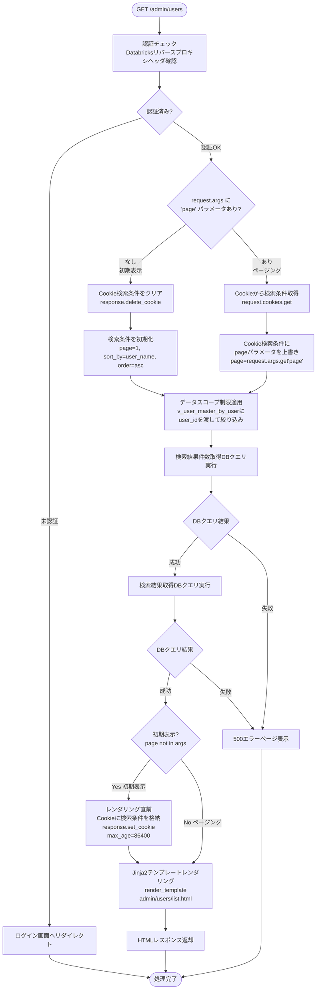
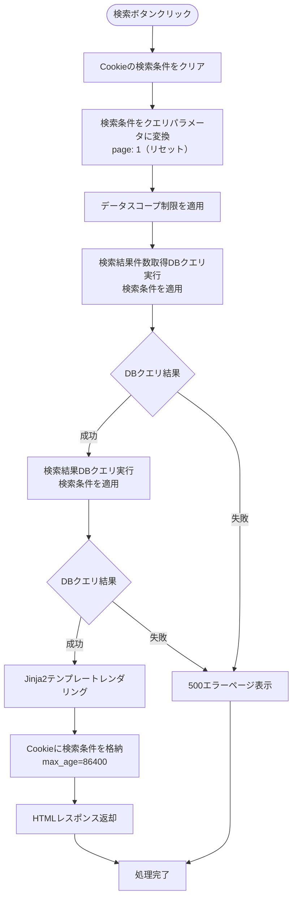
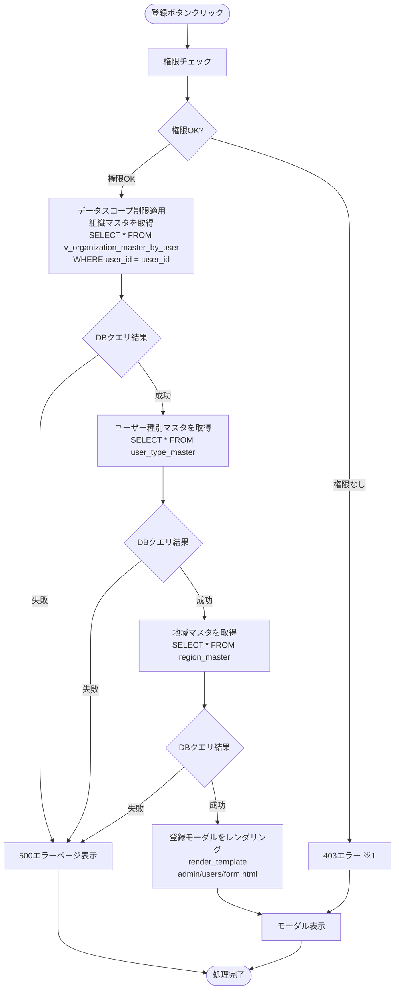
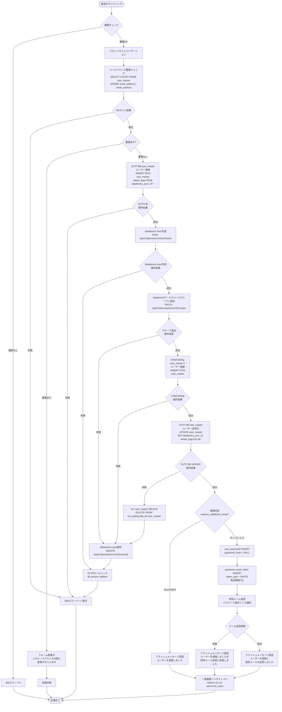
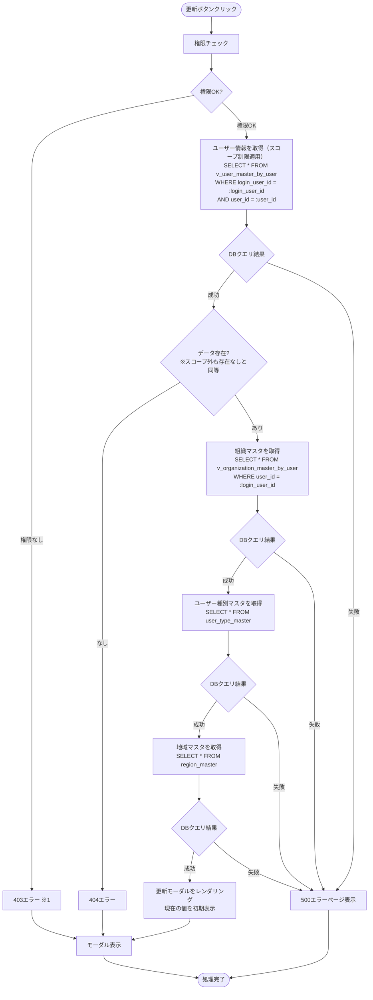
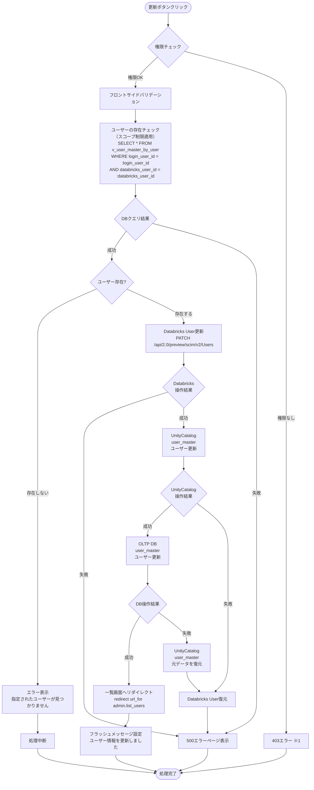
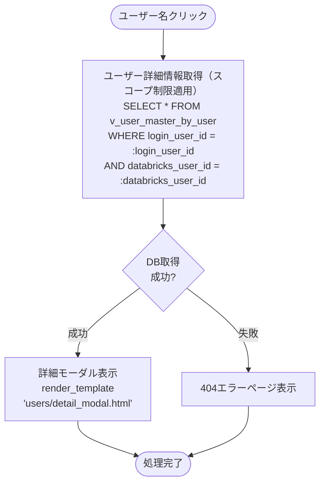
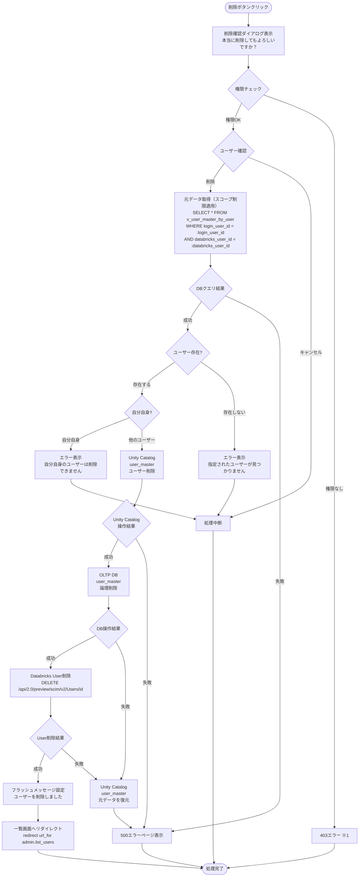

# ユーザー管理 - ワークフロー仕様書

## 📑 目次

- [ユーザー管理 - ワークフロー仕様書](#ユーザー管理---ワークフロー仕様書)
  - [📑 目次](#-目次)
  - [概要](#概要)
  - [使用するFlaskルート一覧](#使用するflaskルート一覧)
  - [ルート呼び出しマッピング](#ルート呼び出しマッピング)
  - [ワークフロー一覧](#ワークフロー一覧)
    - [初期表示](#初期表示)
      - [処理フロー](#処理フロー)
      - [Flaskルート](#flaskルート)
      - [バリデーション](#バリデーション)
      - [処理詳細（サーバーサイド）](#処理詳細サーバーサイド)
      - [表示メッセージ](#表示メッセージ)
      - [エラーハンドリング](#エラーハンドリング)
      - [ログ出力タイミング](#ログ出力タイミング)
      - [検索条件の保持方法](#検索条件の保持方法)
      - [UI状態](#ui状態)
    - [検索・絞り込み](#検索絞り込み)
      - [処理フロー](#処理フロー-1)
      - [処理詳細（サーバーサイド）](#処理詳細サーバーサイド-1)
      - [表示メッセージ](#表示メッセージ-1)
      - [エラーハンドリング](#エラーハンドリング-1)
      - [UI状態](#ui状態-1)
      - [ログ出力タイミング](#ログ出力タイミング-1)
      - [検索条件の保持方法](#検索条件の保持方法-1)
    - [全体ソート](#全体ソート)
      - [処理詳細](#処理詳細)
    - [ページ内ソート](#ページ内ソート)
      - [処理詳細](#処理詳細-1)
    - [ページング](#ページング)
      - [処理詳細](#処理詳細-2)
      - [UI状態](#ui状態-2)
    - [ユーザー登録](#ユーザー登録)
      - [登録ボタン押下](#登録ボタン押下)
        - [処理フロー](#処理フロー-2)
        - [処理詳細（サーバーサイド）](#処理詳細サーバーサイド-2)
      - [登録実行](#登録実行)
        - [処理フロー](#処理フロー-3)
        - [処理詳細（サーバーサイド）](#処理詳細サーバーサイド-3)
        - [表示メッセージ](#表示メッセージ-2)
        - [UI状態](#ui状態-3)
    - [ユーザー更新](#ユーザー更新)
      - [ユーザー更新ボタン押下](#ユーザー更新ボタン押下)
        - [処理フロー](#処理フロー-4)
        - [処理詳細（サーバーサイド）](#処理詳細サーバーサイド-4)
      - [ユーザー更新実行](#ユーザー更新実行)
        - [処理フロー](#処理フロー-5)
        - [処理詳細（サーバーサイド）](#処理詳細サーバーサイド-5)
        - [表示メッセージ](#表示メッセージ-3)
      - [ログ出力タイミング](#ログ出力タイミング-2)
        - [UI状態](#ui状態-4)
    - [ユーザー参照](#ユーザー参照)
      - [処理フロー](#処理フロー-6)
      - [処理詳細（サーバーサイド）](#処理詳細サーバーサイド-6)
      - [ログ出力タイミング](#ログ出力タイミング-3)
    - [ユーザー削除](#ユーザー削除)
      - [処理フロー](#処理フロー-7)
      - [バリデーション](#バリデーション-1)
      - [処理詳細（サーバーサイド）](#処理詳細サーバーサイド-7)
      - [表示メッセージ](#表示メッセージ-4)
      - [ログ出力タイミング](#ログ出力タイミング-4)
    - [CSVエクスポート](#csvエクスポート)
        - [処理詳細（サーバーサイド）](#処理詳細サーバーサイド-8)
  - [使用データベース詳細](#使用データベース詳細)
    - [使用テーブル一覧](#使用テーブル一覧)
    - [インデックス最適化](#インデックス最適化)
  - [トランザクション管理](#トランザクション管理)
    - [3層トランザクション整合性保証](#3層トランザクション整合性保証)
      - [基本方針](#基本方針)
      - [トランザクション開始・終了タイミング](#トランザクション開始終了タイミング)
      - [実装パターン: Sagaパターン](#実装パターン-sagaパターン)
  - [セキュリティ実装](#セキュリティ実装)
    - [認証・認可実装](#認証認可実装)
    - [入力検証](#入力検証)
    - [ログ出力ルール](#ログ出力ルール)
  - [関連ドキュメント](#関連ドキュメント)
    - [画面仕様](#画面仕様)
    - [アーキテクチャ設計](#アーキテクチャ設計)
    - [共通仕様](#共通仕様)

---

## 概要

このドキュメントは、ユーザー管理画面のユーザー操作に対する処理フロー、バリデーション実行タイミング、データベース処理、Databricks SCIM API連携の詳細を記載します。

**このドキュメントの役割:**
- ✅ ユーザー操作のトリガー条件
- ✅ 処理フローの詳細（Flaskルート呼び出しシーケンス、フォーム送信、リダイレクト）
- ✅ バリデーション実行タイミング（いつチェックするか）
- ✅ エラーハンドリングフロー（Databricks連携失敗時のロールバック含む）
- ✅ サーバーサイド処理詳細（SQL、Databricks SCIM API呼び出し、変数、条件分岐、コード例）
- ✅ データベース利用詳細（トランザクション管理、テーブル操作、インデックス）
- ✅ セキュリティ実装詳細（認証、データスコープ制限、入力検証、ログ出力）

**UI仕様書との役割分担:**
- **UI仕様書**: バリデーションルール定義（何をチェックするか）、UI要素の詳細仕様
- **ワークフロー仕様書**: バリデーション実行タイミング（いつどのようにチェックするか）、処理フロー、サーバーサイド実装詳細

**注:** UI要素の詳細やバリデーションルールは [UI仕様書](./ui-specification.md) を参照してください。

---

## 使用するFlaskルート一覧

この画面で使用するすべてのFlaskルート（エンドポイント）を記載します。

| No  | ルート名                     | エンドポイント                             | メソッド | 用途                             | レスポンス形式     | 備考                                           |
| --- | ---------------------------- | ------------------------------------------ | -------- | -------------------------------- | ------------------ | ---------------------------------------------- |
| 1   | ユーザー一覧表示・ページング | `/admin/users`                             | GET      | ユーザー一覧初期表示・ページング | HTML               | pageパラメータなし=初期表示、あり=ページング   |
| 2   | ユーザー検索                 | `/admin/users`                             | POST     | ユーザー検索実行                 | HTML               | 検索条件をCookieに格納                         |
| 3   | ユーザー登録画面             | `/admin/users/create`                      | GET      | ユーザー登録フォーム表示         | HTML（モーダル）   | 組織選択肢を含む                               |
| 4   | ユーザー登録実行             | `/admin/users/register`                    | POST     | ユーザー登録処理                 | リダイレクト (302) | 成功時: `/admin/users`、失敗時: フォーム再表示 |
| 5   | ユーザー参照画面             | `/admin/users/<databricks_user_id>`        | GET      | ユーザー詳細情報表示             | HTML（モーダル）   | -                                              |
| 6   | ユーザー更新画面             | `/admin/users/<databricks_user_id>/edit`   | GET      | ユーザー更新フォーム表示         | HTML（モーダル）   | 現在の値を初期表示                             |
| 7   | ユーザー更新実行             | `/admin/users/<databricks_user_id>/update` | POST     | ユーザー更新処理                 | リダイレクト (302) | 成功時: `/admin/users`                         |
| 8   | ユーザー削除実行             | `/admin/users/delete`                      | POST     | ユーザー削除処理（複数件対応）   | リダイレクト (302) | 成功時: `/admin/users`、削除対象IDはボディで送信 |
| 9   | CSVエクスポート              | `/admin/users/export`                      | POST     | ユーザー一覧CSVダウンロード      | CSV                | 現在の検索条件を適用                           |

**注:**
- **レスポンス形式**:
  - `HTML`: Jinja2テンプレートをレンダリングして返す（`render_template()`）
  - `リダイレクト (302)`: 成功時に別のルートへリダイレクト（`redirect(url_for())`）、失敗時はフォームを再表示
  - `CSV`: CSVファイルをダウンロードレスポンスとして返す
- **Flask Blueprint構成**: `admin_bp` として実装

---

## ルート呼び出しマッピング

| ユーザー操作     | トリガー        | 呼び出すルート                    | パラメータ                                                                                   | レスポンス                        | エラー時の挙動                         |
| ---------------- | --------------- | --------------------------------- | -------------------------------------------------------------------------------------------- | --------------------------------- | -------------------------------------- |
| 画面初期表示     | URL直接アクセス | `GET /admin/users`                | なし                                                                                         | HTML（ユーザー一覧画面）          | エラーページ表示                       |
| 検索ボタン押下   | フォーム送信    | `POST /admin/users`               | `user_name, email_address, user_type_id, organization_id, region_id, status, sort_by, order` | HTML（検索結果画面）              | エラーメッセージ表示                   |
| ページボタン押下 | リンククリック  | `GET /admin/users`                | `page`                                                                                       | HTML（検索結果画面）              | エラーメッセージ表示                   |
| 登録ボタン押下   | ボタンクリック  | `GET /admin/users/create`         | なし                                                                                         | HTML（登録モーダル）              | エラーページ表示                       |
| 登録実行         | フォーム送信    | `POST /admin/users/register`      | フォームデータ                                                                               | リダイレクト → `GET /admin/users` | フォーム再表示（エラーメッセージ付き） |
| 参照ボタン押下   | ボタンクリック  | `GET /admin/users/<user_id>`      | user_id                                                                                      | HTML（参照モーダル）              | 404エラーページ                        |
| 更新ボタン押下   | ボタンクリック  | `GET /admin/users/<user_id>/edit` | user_id                                                                                      | HTML（更新モーダル）              | 404エラーページ                        |
| 更新実行         | フォーム送信    | `POST /admin/users/update`        | フォームデータ                                                                               | リダイレクト → `GET /admin/users` | フォーム再表示（エラーメッセージ付き） |
| 削除実行         | フォーム送信    | `POST /admin/users/delete`        | databricks_user_ids（複数可）                                                                | リダイレクト → `GET /admin/users` | エラーメッセージ表示                   |
| CSVエクスポート  | ボタンクリック  | `POST /admin/users/export`        | 検索条件                                                                                     | CSVダウンロード                   | エラーメッセージ表示                   |

---

## ワークフロー一覧

### 初期表示

**トリガー:** URL直接アクセス時（ユーザーが `/admin/users` にアクセスしたとき）

**前提条件:**
- ユーザーがログイン済み（Databricks認証完了）
- 適切な権限を持っている

#### 処理フロー



**実装例:**

- `get_default_search_params()` / `search_users()` は `user_service.py` に定義
- Cookie操作は `common` の `get_search_conditions_cookie` / `set_search_conditions_cookie` / `clear_search_conditions_cookie` を使用

```python
# views/admin/users.py
@admin_bp.route('/users', methods=['GET'])
@require_role('system_admin', 'management_admin', 'sales_company_user', 'service_company_user')
def users_list():
    """初期表示・ページング（統合）"""

    if 'page' not in request.args:
        # 初期表示: デフォルト検索条件
        search_params = get_default_search_params()  # → user_service
        save_cookie = True
    else:
        # ページング: Cookie から検索条件取得 → page 上書き
        search_params = get_search_conditions_cookie('users') or get_default_search_params()
        search_params['page'] = request.args.get('page', 1, type=int)
        save_cookie = False

    try:
        users, total = search_users(search_params, g.current_user.user_id)  # → user_service
        _, user_types, _, sort_items = get_user_form_options(g.current_user.user_id, g.current_user.user_type_id)  # → user_service
    except Exception:
        abort(500)

    response = make_response(render_template(
        'admin/users/list.html',
        users=users,
        total=total,
        search_params=search_params,
        user_types=user_types,
        sort_items=sort_items,
    ))
    if save_cookie:
        response = clear_search_conditions_cookie(response, 'users')
        response = set_search_conditions_cookie(response, 'users', search_params)
    return response
```

---

#### Flaskルート

| ルート           | エンドポイント     | 詳細                     |
| ---------------- | ------------------ | ------------------------ |
| ユーザー一覧表示 | `GET /admin/users` | クエリパラメータ: `page` |

#### バリデーション

**実行タイミング:** なし（初期表示のため、デフォルト値を使用）

**データスコープ制限:**
- **フィルタリングロジックは全ユーザーで共通、実質的なアクセス可能範囲に差分あり**
- システム保守者・管理者: すべてのユーザーにアクセス可能
- 販社ユーザ・サービス利用者: ログインユーザーの `organization_id` に紐づく全子組織でフィルタリング

#### 処理詳細（サーバーサイド）

**① 認証・認可チェック**

認証はミドルウェア（`auth/middleware.py`）が `before_request` で全エンドポイントに適用済み。認可は `@require_role` デコレータで制御する。

**処理内容:**
- `g.current_user` にログインユーザー情報がセット済み（ミドルウェア処理済み）
- `@require_role` がユーザー種別に応じたアクセス制御を実施
- 組織に応じてデータスコープを決定

**② クエリパラメータ取得**

```python
page = request.args.get('page', 1, type=int)
per_page = ITEM_PER_PAGE  # 設定ファイルから取得
```

**③ データスコープ制限の適用**

`v_user_master_by_user` にログインユーザーの `user_id` を渡すことで、アクセス可能な組織配下のデータに自動的に絞り込まれます。

詳細な実装仕様は[認証・認可実装](#認証認可実装)を参照してください。

**④ データベースクエリ実行**

ユーザーマスタからデータを取得します。

**使用テーブル:** v_user_master_by_user（ユーザー一覧用VIEW）、user_type_master（ユーザー種別マスタ）、organization_master（組織マスタ）、region_master（地域マスタ）

**SQL詳細:**
TODO
- 検索結果件数取得DBクエリ
```sql
SELECT
  COUNT(user_id) AS data_count
FROM
  v_user_master_by_user
WHERE
  login_user_id = :user_id
  AND delete_flag = FALSE
```

- 検索結果取得DBクエリ
```sql
SELECT
  u.user_id,
  u.user_name,
  u.email_address,
  t.user_type_name,
  o.organization_name,
  r.region_name,
  u.status
FROM
  v_user_master_by_user u
LEFT JOIN organization_master o
  ON u.organization_id = o.organization_id
  AND o.delete_flag = FALSE
LEFT JOIN region_master r
  ON u.region_id = r.region_id
  AND r.delete_flag = FALSE
LEFT JOIN user_type_master t
  ON u.user_type_id = t.user_type_id
  AND t.delete_flag = FALSE
WHERE
  u.login_user_id = :user_id
  AND u.delete_flag = FALSE
ORDER BY
  u.user_id ASC
LIMIT :item_per_page OFFSET 0
```

**実装例:**

```python
# services/user_service.py

def get_default_search_params() -> dict:
    """ユーザー一覧検索のデフォルトパラメータを返す"""
    return {
        'page': 1,
        'per_page': ITEM_PER_PAGE,
        'sort_by': 'user_name',
        'order': 'asc',
        'user_name': '',
        'email_address': '',
        'user_type_id': None,
        'organization_id': None,
        'region_id': None,
        'status': None,
    }


def search_users(search_params: dict, user_id: int) -> tuple[list, int]:
    """ユーザー一覧をスコープ制限付きで検索する

    Args:
        search_params: 検索条件（page, per_page, sort_by, order, 各検索項目）
        user_id: ログインユーザーID（スコープ制限に使用）

    Returns:
        (users, total): ユーザーリストと総件数のタプル
    """
    page = search_params['page']
    per_page = search_params['per_page']
    sort_by = search_params['sort_by']
    order = search_params['order']
    offset = (page - 1) * per_page

    query = db.session.query(UserMasterByUser).filter(
        UserMasterByUser.login_user_id == user_id,
        UserMasterByUser.delete_flag == False,
    )

    sort_col = getattr(UserMasterByUser, sort_by)
    # 検索条件フィルタ（フロー2: 検索・絞り込みでも共用）
    if search_params.get('user_name'):
        query = query.filter(UserMasterByUser.user_name.like(f"%{search_params['user_name']}%"))
    if search_params.get('email_address'):
        query = query.filter(UserMasterByUser.email_address.like(f"%{search_params['email_address']}%"))
    if search_params.get('user_type_id') is not None:
        query = query.filter(UserMasterByUser.user_type_id == search_params['user_type_id'])
    if search_params.get('organization_id') is not None:
        query = query.filter(UserMasterByUser.organization_id == search_params['organization_id'])
    if search_params.get('region_id') is not None:
        query = query.filter(UserMasterByUser.region_id == search_params['region_id'])
    if search_params.get('status') is not None:
        query = query.filter(UserMasterByUser.status == search_params['status'])

    query = query.order_by(sort_col.asc() if order == 'asc' else sort_col.desc())

    total = query.count()
    users = query.limit(per_page).offset(offset).all()
    return users, total
```

**⑤ HTMLレンダリング**

Jinja2テンプレートをレンダリングしてHTMLレスポンスを返却します。

**実装例:**
```python
# views/admin/users.py（users_list 内）
return response  # make_response + render_template は上記ルート実装例を参照
```

#### 表示メッセージ

| メッセージID | 表示内容                   | 表示タイミング | 表示場所     |
| ------------ | -------------------------- | -------------- | ------------ |
| ERR_DB_001   | データの取得に失敗しました | DBクエリ失敗時 | エラーページ |

#### エラーハンドリング

| HTTPステータス | エラー種別         | 処理内容                   | 表示内容                   |
| -------------- | ------------------ | -------------------------- | -------------------------- |
| 401            | 認証エラー         | ログイン画面へリダイレクト | -                          |
| 500            | データベースエラー | 500エラーページ表示        | データの取得に失敗しました |

#### ログ出力タイミング
DBクエリ実行の直前、直後に操作ログを出力する

#### 検索条件の保持方法
Cookieに検索条件を保持する

#### UI状態

- 検索条件: デフォルト値（空）
- テーブル: ユーザー一覧データ表示
- ページネーション: 1ページ目を選択状態

---

### 検索・絞り込み

**トリガー:** (2.9) 検索ボタンクリック（フォーム送信）

**前提条件:**
- 検索条件が入力されている（空でも可）

#### 処理フロー



---

#### 処理詳細（サーバーサイド）

**検索クエリ実行**
**使用テーブル:** v_user_master_by_user（ユーザー一覧用VIEW）、user_type_master（ユーザー種別マスタ）、organization_master（組織マスタ）、region_master（地域マスタ）

- 検索結果件数取得DBクエリ
```sql
SELECT
  COUNT(u.user_id) AS user_count
FROM
  v_user_master_by_user u
LEFT JOIN organization_master o
  ON u.organization_id = o.organization_id
  AND o.delete_flag = FALSE
LEFT JOIN region_master r
  ON u.region_id = r.region_id
  AND r.delete_flag = FALSE
LEFT JOIN user_type_master t
  ON u.user_type_id = t.user_type_id
  AND t.delete_flag = FALSE
WHERE
  u.login_user_id = :user_id
  AND u.delete_flag = FALSE
  AND CASE WHEN :user_name IS NULL THEN TRUE ELSE u.user_name LIKE CONCAT('%', :user_name, '%') END
  AND CASE WHEN :email_address IS NULL THEN TRUE ELSE u.email_address LIKE CONCAT('%', :email_address, '%') END
  AND CASE WHEN :user_type_id < 0 THEN TRUE ELSE u.user_type_id = :user_type_id END
  AND CASE WHEN :organization_id < 0 THEN TRUE ELSE u.organization_id LIKE = :organization_id END
  AND CASE WHEN :region_id < 0 THEN TRUE ELSE u.region_id = :region_id END
  AND CASE WHEN :status < 0 THEN TRUE ELSE s.status = :status END
```

- 検索結果取得DBクエリ
**SQL詳細:**
```sql
SELECT
  u.user_id,
  u.user_name,
  u.email_address,
  t.user_type_name,
  o.organization_name,
  r.region_name,
  u.status
FROM
  v_user_master_by_user u
LEFT JOIN organization_master o
  ON u.organization_id = o.organization_id
  AND o.delete_flag = FALSE
LEFT JOIN region_master r
  ON u.region_id = r.region_id
  AND r.delete_flag = FALSE
LEFT JOIN user_type_master t
  ON u.user_type_id = t.user_type_id
  AND t.delete_flag = FALSE
WHERE
  u.login_user_id = :user_id
  AND u.delete_flag = FALSE
  AND CASE WHEN :user_name IS NULL THEN TRUE ELSE u.user_name LIKE CONCAT('%', :user_name, '%') END
  AND CASE WHEN :email_address IS NULL THEN TRUE ELSE u.email_address LIKE CONCAT('%', :email_address, '%') END
  AND CASE WHEN :user_type_id < 0 THEN TRUE ELSE u.user_type_id = :user_type_id END
  AND CASE WHEN :organization_id < 0 THEN TRUE ELSE u.organization_id LIKE = :organization_id END
  AND CASE WHEN :region_id < 0 THEN TRUE ELSE u.region_id = :region_id END
  AND CASE WHEN :status < 0 THEN TRUE ELSE s.status = :status END
ORDER BY
  {sort_by} {order}
LIMIT :item_per_page OFFSET (:page -1) * :item_per_page
```

**実装例:**

- `search_users()` はフロー1と共用（フィルタ条件はすべてサービス内で処理）
- `UserSearchForm` は `forms/user.py` に定義
- Cookie操作は共通関数を使用

```python
# forms/user.py
class UserSearchForm(FlaskForm):
    user_name       = StringField('ユーザー名')
    email_address   = StringField('メールアドレス')
    user_type_id    = SelectField('ユーザー種別', coerce=int)
    organization_id = SelectField('組織', coerce=int)
    region_id       = SelectField('地域', coerce=int)
    status          = SelectField('ステータス', coerce=int)
    sort_by         = SelectField('ソート項目', coerce=str)   # 選択肢は sort_item_master から動的取得（空白=デフォルトソート）
    order           = SelectField('ソート順', coerce=str, choices=[('', ''), ('asc', '昇順'), ('desc', '降順')])
```

```python
# views/admin/users.py
@admin_bp.route('/users', methods=['POST'])
@require_role('system_admin', 'management_admin', 'sales_company_user', 'service_company_user')
def search_users_view():
    form = UserSearchForm(request.form)
    if not form.validate():
        abort(400)

    search_params = {
        'page': 1,
        'per_page': ITEM_PER_PAGE,
        'sort_by': form.sort_by.data or 'user_name',   # 空白選択時はデフォルトソート（ユーザー名昇順）
        'order': form.order.data or 'asc',
        'user_name': form.user_name.data or '',
        'email_address': form.email_address.data or '',
        'user_type_id': form.user_type_id.data,
        'organization_id': form.organization_id.data,
        'region_id': form.region_id.data,
        'status': form.status.data,
    }

    try:
        users, total = search_users(search_params, g.current_user.user_id)  # → user_service
        _, user_types, _, sort_items = get_user_form_options(g.current_user.user_id, g.current_user.user_type_id)  # → user_service
    except Exception:
        abort(500)

    response = make_response(render_template(
        'admin/users/list.html',
        users=users,
        total=total,
        search_params=search_params,
        user_types=user_types,
        sort_items=sort_items,
    ))
    response = clear_search_conditions_cookie(response, 'users')
    response = set_search_conditions_cookie(response, 'users', search_params)
    return response
```

#### 表示メッセージ

| メッセージID | 表示内容                   | 表示タイミング | 表示場所     |
| ------------ | -------------------------- | -------------- | ------------ |
| -            | データの取得に失敗しました | DBクエリ失敗時 | エラーページ |

#### エラーハンドリング

| HTTPステータス | エラー種別         | 処理内容            | 表示内容                   |
| -------------- | ------------------ | ------------------- | -------------------------- |
| 500            | データベースエラー | 500エラーページ表示 | データの取得に失敗しました |

#### UI状態

- テーブル: 検索結果データ表示
- ページネーション: 1ページ目にリセット

#### ログ出力タイミング
DBクエリ実行の直前、直後に操作ログを出力する

#### 検索条件の保持方法
Cookieに検索条件を保持する

### 全体ソート

**トリガー:** (2) 検索条件欄でソート項目、ソート順ドロップダウンで具体値を選択し、検索を実行

#### 処理詳細
検索条件欄のソート項目ドロップダウンで選択した内容に対して、ソート順ドロップダウンで選択した順序でページをまたいだソートを行う。
詳細は[共通仕様書](../../common/common-specification.md)参照のこと。

---

### ページ内ソート

**トリガー:**（6）データテーブルのソート可能カラム（ユーザー名、メールアドレス、ユーザー種別）のヘッダをクリック

#### 処理詳細
データテーブルのヘッダをクリックすることで、ページ内で閉じたソートを行う。
詳細は[共通仕様書](../../common/common-specification.md)参照のこと

---

### ページング

**トリガー:** (6.9) ページネーションのページ番号ボタンクリック

#### 処理詳細
ページネーションのページ番号を選択することで、選択されたページ番号に対応するデータをデータテーブルに表示する。
具体的な処理は[初期表示](#初期表示)の処理と同様とする。

---

#### UI状態

- 検索条件: 保持
- テーブル: 選択ページのデータ表示
- ページネーション: 選択ページをアクティブ状態

---

### ユーザー登録

#### 登録ボタン押下

**トリガー:** (3.1) 登録ボタンクリック

**前提条件:**
- ユーザーが適切な権限を持っている（システム保守者、管理者、販社ユーザ）

##### 処理フロー



※1　403エラー発生時、ドロップダウン、テキストボックスに具体的なデータは表示せず、空で表示する。

##### 処理詳細（サーバーサイド）

**実装例:**

- `get_user_form_options()` は `user_service.py` に定義（フロー5: 更新ボタン押下でも共用）

```python
# services/user_service.py
def get_user_form_options(user_id: int, login_user_type_id: int) -> tuple[list, list, list, list]:
    """登録・更新フォーム用マスターデータを取得する

    Args:
        user_id: ログインユーザーID（組織スコープ制限に使用）
        login_user_type_id: ログインユーザーのユーザー種別ID（自分より下位のロールのみ表示）

    Returns:
        (organizations, user_types, regions, sort_items)
    """
    organizations = db.session.query(OrganizationMasterByUser).filter(
        OrganizationMasterByUser.user_id == user_id,
        OrganizationMasterByUser.delete_flag == False,
    ).order_by(OrganizationMasterByUser.organization_name).all()

    user_types = db.session.query(UserType).filter(
        UserType.delete_flag == False,
        UserType.user_type_id > login_user_type_id,  # 自分より下位ロールのみ（値が大きいほど低権限）
    ).order_by(UserType.user_type_id).all()

    regions = db.session.query(Region).filter(
        Region.delete_flag == False,
    ).order_by(Region.region_id).all()

    # TODO: ユーザー一覧画面の view_id を sort_item_master 初期データに追加後、定数化すること
    USER_LIST_VIEW_ID = None  # TODO: view_id 未定義。app-database-specification.md の sort_item_master 初期データに追加が必要
    sort_items = db.session.query(SortItem).filter(
        SortItem.view_id == USER_LIST_VIEW_ID,
        SortItem.delete_flag == False,
    ).order_by(SortItem.sort_order).all()

    return organizations, user_types, regions, sort_items
```

```python
# views/admin/users.py
@admin_bp.route('/users/create', methods=['GET'])
@require_role('system_admin', 'management_admin', 'sales_company_user')
def create_user_form():
    try:
        organizations, user_types, regions, _ = get_user_form_options(g.current_user.user_id, g.current_user.user_type_id)  # → user_service（sort_itemsは登録フォームでは不要）
    except Exception:
        abort(500)

    return render_template(
        'admin/users/form.html',
        mode='create',
        organizations=organizations,
        user_types=user_types,
        regions=regions,
    )
```

---

#### 登録実行

**トリガー:** (7.11) 登録ボタン（モーダル内）クリック後に表示される登録実施確認モーダルで「はい」を選択

##### 処理フロー


※1　403エラー発生時、登録モーダルを閉じる。
※2　環境判定は`auth_provider.requires_additional_setup()`で行います。オンプレミス環境（`AUTH_TYPE=local`）の場合のみ招待メール送信処理を実行します。

##### 処理詳細（サーバーサイド）

**実装例:**
```python
# forms/user.py
class UserCreateForm(FlaskForm):
    email_address = StringField('メールアドレス', validators=[
        DataRequired(message='メールアドレスは必須です'),
        Email(message='メールアドレスの形式が正しくありません'),
        Length(max=254, message='メールアドレスは254文字以内で入力してください')
    ])
    user_name = StringField('ユーザー名', validators=[
        DataRequired(message='ユーザー名は必須です'),
        Length(max=20, message='ユーザー名は20文字以内で入力してください')
    ])
    user_type_id    = SelectField('ユーザー種別', coerce=int, validators=[DataRequired(message='ユーザー種別は必須です')])
    organization_id = SelectField('所属組織', validators=[DataRequired(message='所属組織は必須です')])
    region_id       = SelectField('地域', coerce=int, validators=[DataRequired(message='地域は必須です')])
    address         = StringField('住所', validators=[Length(max=500, message='住所は500文字以内で入力してください')])
    status          = SelectField('ステータス', coerce=int, validators=[DataRequired(message='ステータスは必須です')])
    alert_notification_flag  = BooleanField('アラート通知', default=True)
    system_notification_flag = BooleanField('システム通知', default=True)


# services/user_service.py
def check_email_duplicate(email_address: str) -> bool:
    """メールアドレス重複チェック

    Args:
        email_address: チェック対象のメールアドレス

    Returns:
        True=重複あり, False=重複なし
    """
    return User.query.filter_by(
        email_address=email_address,
        delete_flag=False,
    ).first() is not None


def _insert_unity_catalog_user(user_id: int, databricks_user_id: str, user_data: dict, creator_id: int) -> None:
    """UC user_master に新規レコードを INSERT する"""
    uc = UnityCatalogConnector()
    uc.execute_dml(
        """
        INSERT INTO iot_catalog.oltp_db.user_master (
            user_id, databricks_user_id, user_name, organization_id, email_address,
            user_type_id, region_id, address, status,
            alert_notification_flag, system_notification_flag,
            create_date, creator, update_date, modifier, delete_flag
        ) VALUES (
            :user_id, :databricks_user_id, :user_name, :organization_id, :email_address,
            :user_type_id, :region_id, :address, :status,
            :alert_notification_flag, :system_notification_flag,
            CURRENT_TIMESTAMP(), :creator_id, CURRENT_TIMESTAMP(), :creator_id, FALSE
        )
        """,
        {
            'user_id':                    user_id,
            'databricks_user_id':         databricks_user_id,
            'user_name':                  user_data['user_name'],
            'organization_id':            user_data['organization_id'],
            'email_address':              user_data['email_address'],
            'user_type_id':               user_data['user_type_id'],
            'region_id':                  user_data['region_id'],
            'address':                    user_data['address'],
            'status':                     user_data['status'],
            'alert_notification_flag':    user_data['alert_notification_flag'],
            'system_notification_flag':   user_data['system_notification_flag'],
            'creator_id':                 creator_id,
        },
        operation="UC user_master INSERT",
    )


def _rollback_create_user(
    user_id: int | None,
    databricks_user_id: str | None,
    uc_inserted: bool,
) -> None:
    """登録失敗時の補償トランザクション（ベストエフォート）

    db.session.rollback() 後に呼び出す。
    OLTP は rollback() で自動巻き戻し済みのため、Databricks と UC のみ削除する。
    UC INSERTが完了していない場合は UC DELETE は行わない。

    Args:
        user_id:             OLTP に INSERT したユーザーID（INSERT前に失敗した場合は None）
        databricks_user_id:  Databricks に作成したユーザーID（作成前に失敗した場合は None）
        uc_inserted:         UC user_master INSERT が完了済みかどうか
    """
    try:
        if databricks_user_id:
            scim_client = ScimClient()
            scim_client.delete_user(databricks_user_id)
    except Exception:
        logger.error("登録ロールバック失敗: Databricks User削除", exc_info=True)

    try:
        if uc_inserted and user_id:
            uc = UnityCatalogConnector()
            uc.execute_dml(
                "DELETE FROM iot_catalog.oltp_db.user_master WHERE user_id = :user_id",
                {'user_id': user_id},
                operation="UC user_master 登録ロールバック",
            )
    except Exception:
        logger.error("登録ロールバック失敗: UC user_master DELETE", exc_info=True)


def create_user(user_data: dict, creator_id: int, auth_provider) -> dict:
    """ユーザー登録（Sagaパターン）

    Args:
        user_data: フォームから取得したユーザーデータ
        creator_id: 登録者のユーザーID
        auth_provider: 認証プロバイダー（環境判定に使用）

    Returns:
        {'invite_sent': bool, 'invite_failed': bool}

    Raises:
        Exception: 登録処理失敗時（ロールバック済み）
    """
    databricks_user_id = None
    user_id = None
    uc_inserted = False

    try:
        # ① OLTP DB INSERT（delete_flag=TRUE）
        user = User(
            databricks_user_id='',
            user_name=user_data['user_name'],
            email_address=user_data['email_address'],
            user_type_id=user_data['user_type_id'],
            organization_id=user_data['organization_id'],
            language_code='ja',
            region_id=user_data['region_id'],
            address=user_data['address'],
            status=user_data['status'],
            alert_notification_flag=user_data['alert_notification_flag'],
            system_notification_flag=user_data['system_notification_flag'],
            delete_flag=True,
            creator=creator_id,
            modifier=creator_id,
        )
        db.session.add(user)
        db.session.flush()
        user_id = user.user_id

        # ② Databricks User作成
        scim_client = ScimClient()
        databricks_user_id = scim_client.create_user(
            email=user_data['email_address'],
            display_name=user_data['user_name'],
        )

        # ③ Databricksワークスペースグループへ追加
        scim_client.add_user_to_group(DATABRICKS_WORKSPACE_GROUP_ID, databricks_user_id)

        # ④ Unity Catalog user_master INSERT
        _insert_unity_catalog_user(user_id, databricks_user_id, user_data, creator_id)
        uc_inserted = True

        # ⑤ OLTP DB UPDATE（活性化）
        user.databricks_user_id = databricks_user_id
        user.delete_flag = False
        db.session.flush()

        db.session.commit()

        # ⑥ オンプレミス環境：招待処理
        if auth_provider.requires_additional_setup():
            try:
                _send_invite(user)
                return {'invite_sent': True, 'invite_failed': False}
            except Exception:
                return {'invite_sent': False, 'invite_failed': True}

        return {'invite_sent': False, 'invite_failed': False}

    except Exception:
        db.session.rollback()
        _rollback_create_user(user_id, databricks_user_id, uc_inserted)
        raise


# views/admin/users.py
from iot_app.auth.middleware import auth_provider  # モジュールレベルのシングルトン

@admin_bp.route('/users/register', methods=['POST'])
@require_role('system_admin', 'management_admin', 'sales_company_user')
def create_user_view():
    form = UserCreateForm(request.form)
    if not form.validate():
        return render_template('admin/users/form.html', mode='create', form=form), 422

    try:
        is_duplicate = check_email_duplicate(form.email_address.data)  # → user_service
    except Exception:
        abort(500)
    if is_duplicate:
        form.email_address.errors.append('このメールアドレスは既に使用されています')
        return render_template('admin/users/form.html', mode='create', form=form), 422

    user_data = {
        'email_address': form.email_address.data,
        'user_name': form.user_name.data,
        'user_type_id': form.user_type_id.data,
        'organization_id': form.organization_id.data,
        'region_id': form.region_id.data,
        'address': form.address.data,
        'status': form.status.data if form.status.data is not None else 1,
        'alert_notification_flag': form.alert_notification_flag.data,
        'system_notification_flag': form.system_notification_flag.data,
    }

    try:
        result = create_user(user_data, g.current_user.user_id, auth_provider)  # → user_service
    except Exception:
        abort(500)

    if result['invite_failed']:
        flash('ユーザーを登録しましたが、招待メール送信に失敗しました', 'warning')
    elif result['invite_sent']:
        flash('ユーザーを登録し、招待メールを送信しました', 'success')
    else:
        flash('ユーザーを登録しました', 'success')

    return redirect(url_for('admin.users.users_list'))
```

##### 表示メッセージ

| メッセージID | 表示内容                                               | 表示タイミング                           | 表示場所                               |
| ------------ | ------------------------------------------------------ | ---------------------------------------- | -------------------------------------- |
| -            | ユーザーを登録しました                                 | ユーザー登録成功時（Azure/AWS環境）      | ステータスメッセージモーダル（成功）   |
| -            | ユーザーを登録し、招待メールを送信しました             | ユーザー登録成功時（オンプレミス環境）   | ステータスメッセージモーダル（成功）   |
| -            | ユーザーを登録しましたが、招待メール送信に失敗しました | 招待メール送信失敗時（オンプレミス環境） | ステータスメッセージモーダル（警告）   |
| -            | ユーザーの登録に失敗しました                           | API呼び出し失敗時、DB操作失敗時          | ステータスメッセージモーダル（エラー） |

**注**: オンプレミス環境（`AUTH_TYPE=local`）では、ユーザー登録時に招待メールが送信されます。詳細は[認証仕様書 5.6節](../../common/authentication-specification.md#56-ユーザー新規登録時の認証処理)を参照してください。

##### UI状態

- モーダル: 閉じる（成功時/エラー時）

---

### ユーザー更新

#### ユーザー更新ボタン押下

**トリガー:** (6.8) 更新ボタンクリック

##### 処理フロー



※1　403エラー発生時、ドロップダウン、テキストボックスに具体的なデータは表示せず、空で表示する。

##### 処理詳細（サーバーサイド）

**実装例:**
```python
# services/user_service.py
def get_user_by_databricks_id(databricks_user_id: str, login_user_id: int):
    """ユーザー情報を取得（スコープ制限適用）

    フロー5（更新ボタン押下）・フロー6（更新実行）で共用。

    Args:
        databricks_user_id: 取得対象のDatabricksユーザーID
        login_user_id: ログインユーザーID（スコープ制限に使用）

    Returns:
        UserMasterByUser or None（スコープ外・存在しない場合）
    """
    return db.session.query(UserMasterByUser).filter(
        UserMasterByUser.login_user_id == login_user_id,
        UserMasterByUser.databricks_user_id == databricks_user_id,
        UserMasterByUser.delete_flag == False,
    ).first()

# get_user_form_options(user_id, login_user_type_id) → フロー3定義済み、共用


# views/admin/users.py
@admin_bp.route('/users/<databricks_user_id>/edit', methods=['GET'])
@require_role('system_admin', 'management_admin', 'sales_company_user', 'service_company_user')
def edit_user_form(databricks_user_id):
    try:
        user = get_user_by_databricks_id(databricks_user_id, g.current_user.user_id)  # → user_service
    except Exception:
        abort(500)
    if not user:
        abort(404)

    try:
        organizations, user_types, regions, _ = get_user_form_options(g.current_user.user_id, g.current_user.user_type_id)  # → user_service（フロー3と共用、sort_itemsは更新フォームでは不要）
    except Exception:
        abort(500)

    return render_template(
        'admin/users/form.html',
        mode='edit',
        user=user,
        organizations=organizations,
        user_types=user_types,
        regions=regions,
    )
```

---

#### ユーザー更新実行

**トリガー:** (7.11) 更新ボタンクリック（フォーム送信）

**前提条件:**
- すべての必須項目が入力されている
- データスコープ制限内のユーザーである

##### 処理フロー



※1　403エラー発生時、更新モーダルを閉じる。

##### 処理詳細（サーバーサイド）

**実装例:**
```python
# forms/user.py
class UserUpdateForm(FlaskForm):
    user_name                   = StringField('ユーザー名', validators=[DataRequired(message='ユーザー名は必須です'), Length(max=20)])
    region_id                   = SelectField('地域', coerce=int, validators=[DataRequired(message='地域は必須です')])
    address                     = StringField('住所', validators=[Length(max=500)])
    status                      = SelectField('ステータス', coerce=int, validators=[DataRequired(message='ステータスは必須です')])
    alert_notification_flag  = BooleanField('アラート通知')
    system_notification_flag = BooleanField('システム通知')


# services/user_service.py
# get_user_by_databricks_id(databricks_user_id, login_user_id) → フロー5定義済み、共用

def _update_unity_catalog_user(user_id: int, user_data: dict, modifier_id: int) -> None:
    """UC user_master の更新可能項目を UPDATE する"""
    uc = UnityCatalogConnector()
    uc.execute_dml(
        """
        UPDATE iot_catalog.oltp_db.user_master
        SET user_name=:user_name, region_id=:region_id, address=:address,
            status=:status, alert_notification_flag=:alert_notification_flag,
            system_notification_flag=:system_notification_flag,
            update_date=CURRENT_TIMESTAMP(), modifier=:modifier_id
        WHERE user_id=:user_id
        """,
        {
            'user_name':                  user_data['user_name'],
            'region_id':                  user_data['region_id'],
            'address':                    user_data['address'],
            'status':                     user_data['status'],
            'alert_notification_flag':    user_data['alert_notification_flag'],
            'system_notification_flag':   user_data['system_notification_flag'],
            'modifier_id':                modifier_id,
            'user_id':                    user_id,
        },
        operation="UC user_master UPDATE",
    )


def _update_oltp_user(user_id: int, user_data: dict, modifier_id: int) -> None:
    """OLTP user_master の更新可能項目を UPDATE する"""
    user = User.query.get(user_id)
    user.user_name                = user_data['user_name']
    user.region_id                = user_data['region_id']
    user.address                  = user_data['address']
    user.status                   = user_data['status']
    user.alert_notification_flag  = user_data['alert_notification_flag']
    user.system_notification_flag = user_data['system_notification_flag']
    user.modifier                 = modifier_id
    db.session.flush()


def _rollback_update_user(databricks_user_id: str, user_id: int) -> None:
    """Databricks/UC を元データで復元する（db.session.rollback() 後に呼ぶこと）

    db.session.rollback() 後は OLTP が元データに戻っているため、
    OLTP から元値を取得して Databricks と UC を復元する。
    ロールバック自体の失敗はログ出力のみでエラーを握りつぶす（ベストエフォート）。
    """
    try:
        original = User.query.get(user_id)
        if not original:
            return
        scim_client = ScimClient()
        scim_client.update_user(databricks_user_id, original.user_name, original.status)
        uc = UnityCatalogConnector()
        uc.execute_dml(
            """
            UPDATE iot_catalog.oltp_db.user_master
            SET user_name=:user_name, region_id=:region_id, address=:address,
                status=:status, alert_notification_flag=:alert_notification_flag,
                system_notification_flag=:system_notification_flag,
                update_date=CURRENT_TIMESTAMP(), modifier=:modifier
            WHERE user_id=:user_id
            """,
            {
                'user_name':                  original.user_name,
                'region_id':                  original.region_id,
                'address':                    original.address,
                'status':                     original.status,
                'alert_notification_flag':    original.alert_notification_flag,
                'system_notification_flag':   original.system_notification_flag,
                'modifier':                   original.modifier,
                'user_id':                    user_id,
            },
            operation="UC user_master 更新ロールバック",
        )
    except Exception:
        logger.error("ユーザー更新ロールバック失敗", exc_info=True)


def update_user(user_id: int, databricks_user_id: str, user_data: dict, modifier_id: int) -> None:
    """ユーザー更新（Sagaパターン）

    Args:
        user_id: 対象ユーザーID（OLTP/UC更新に使用）
        databricks_user_id: DatabricksユーザーID（SCIM更新・ロールバックに使用）
        user_data: 更新データ（新値）
        modifier_id: 更新者ID

    Raises:
        Exception: 更新失敗時（ロールバック済み）
    """
    try:
        # ① Databricks User更新（displayName, activeのみ）
        scim_client = ScimClient()
        scim_client.update_user(databricks_user_id, user_data['user_name'], user_data['status'])

        # ② UC user_master更新
        _update_unity_catalog_user(user_id, user_data, modifier_id)

        # ③ OLTP DB更新
        _update_oltp_user(user_id, user_data, modifier_id)
        db.session.commit()

    except Exception:
        db.session.rollback()  # OLTPは自動巻き戻し（元データに復元済み）
        _rollback_update_user(databricks_user_id, user_id)  # rollback後にOLTPから元データ取得してDatabricks/UC復元
        raise


# views/admin/users.py
@admin_bp.route('/users/<databricks_user_id>/update', methods=['POST'])
@require_role('system_admin', 'management_admin', 'sales_company_user', 'service_company_user')
def update_user_view(databricks_user_id):
    form = UserUpdateForm(request.form)
    if not form.validate():
        return render_template('admin/users/form.html', mode='edit', form=form), 422

    try:
        user = get_user_by_databricks_id(databricks_user_id, g.current_user.user_id)  # → user_service（フロー5と共用）
    except Exception:
        abort(500)
    if not user:
        flash('指定されたユーザーが見つかりません', 'error')
        return redirect(url_for('admin.users.users_list'))

    user_data = {
        'user_name':                form.user_name.data,
        'email_address':            user.email_address,        # 不変
        'user_type_id':             user.user_type_id,         # 不変
        'organization_id':          user.organization_id,      # 不変
        'language_code':            user.language_code,        # 不変
        'region_id':                form.region_id.data,
        'address':                  form.address.data,
        'status':                   form.status.data if form.status.data is not None else 1,
        'alert_notification_flag':  form.alert_notification_flag.data,
        'system_notification_flag': form.system_notification_flag.data,
    }

    try:
        update_user(user.user_id, databricks_user_id, user_data, g.current_user.user_id)  # → user_service
    except Exception:
        abort(500)

    flash('ユーザー情報を更新しました', 'success')
    return redirect(url_for('admin.users.users_list'))
```

##### 表示メッセージ

| メッセージID | 表示内容                     | 表示タイミング                  | 表示場所                               |
| ------------ | ---------------------------- | ------------------------------- | -------------------------------------- |
| -            | ユーザー情報を更新しました   | ユーザー更新成功時              | ステータスメッセージモーダル（成功）   |
| -            | ユーザーの更新に失敗しました | API呼び出し失敗時、DB操作失敗時 | ステータスメッセージモーダル（エラー） |

#### ログ出力タイミング

DBクエリ実行の直前、直後に操作ログを出力する

##### UI状態

- モーダル: 閉じる（成功時/エラー時）

---

### ユーザー参照

**トリガー:** (6.8) 参照ボタンクリック

**前提条件:**
- データスコープ制限内のユーザーである

#### 処理フロー



#### 処理詳細（サーバーサイド）

**実装例:**
```python
# services/user_service.py
# get_user_by_databricks_id(databricks_user_id, login_user_id) → フロー5定義済み、共用


# views/admin/users.py
@admin_bp.route('/users/<databricks_user_id>', methods=['GET'])
@require_role('system_admin', 'management_admin', 'sales_company_user', 'service_company_user')
def view_user_detail(databricks_user_id):
    try:
        user = get_user_by_databricks_id(databricks_user_id, g.current_user.user_id)  # → user_service（フロー5と共用）
    except Exception:
        abort(404)  # フロー図通り：DB失敗→404
    if not user:
        abort(404)
    return render_template('admin/users/detail.html', user=user)
```
#### ログ出力タイミング
DBクエリ実行の直前、直後に操作ログを出力する

---

### ユーザー削除

**トリガー:** (3.2) 削除ボタンクリック（確認モーダル経由）

**前提条件:**
- ユーザーが適切な権限を持っている（システム保守者、管理者、販社ユーザ）
- データスコープ制限内のユーザーである
- 1件以上のユーザーが選択されている

#### 処理フロー



#### バリデーション

**実行タイミング:** 削除実行前（データスコープチェック）

#### 処理詳細（サーバーサイド）

**実装例:**
```python
# services/user_service.py
# get_user_by_databricks_id(databricks_user_id, login_user_id) → フロー5定義済み、共用

def _delete_unity_catalog_user(user_id: int) -> None:
    """UC user_master から対象ユーザーを DELETE する"""
    uc = UnityCatalogConnector()
    uc.execute_dml(
        "DELETE FROM iot_catalog.oltp_db.user_master WHERE user_id = :user_id",
        {'user_id': user_id},
        operation="UC user_master DELETE",
    )


def _rollback_delete_user(user_id: int) -> None:
    """UC user_master を元データで復元する（db.session.rollback() 後に呼ぶこと）

    db.session.rollback() 後は OLTP に削除前のレコードが残っているため、
    OLTP から元値を取得して UC に再 INSERT する。
    ロールバック自体の失敗はログ出力のみでエラーを握りつぶす（ベストエフォート）。
    """
    try:
        original = User.query.get(user_id)
        if not original:
            return
        uc = UnityCatalogConnector()
        uc.execute_dml(
            """
            INSERT INTO iot_catalog.oltp_db.user_master (
                user_id, databricks_user_id, user_name, organization_id, email_address,
                user_type_id, language_code, region_id, address, status,
                alert_notification_flag, system_notification_flag,
                create_date, creator, update_date, modifier, delete_flag
            ) VALUES (
                :user_id, :databricks_user_id, :user_name, :organization_id, :email_address,
                :user_type_id, :language_code, :region_id, :address, :status,
                :alert_notification_flag, :system_notification_flag,
                :create_date, :creator, CURRENT_TIMESTAMP(), :modifier, FALSE
            )
            """,
            {
                'user_id':                    original.user_id,
                'databricks_user_id':         original.databricks_user_id,
                'user_name':                  original.user_name,
                'organization_id':            original.organization_id,
                'email_address':              original.email_address,
                'user_type_id':               original.user_type_id,
                'language_code':              original.language_code,
                'region_id':                  original.region_id,
                'address':                    original.address,
                'status':                     original.status,
                'alert_notification_flag':    original.alert_notification_flag,
                'system_notification_flag':   original.system_notification_flag,
                'create_date':                original.create_date,
                'creator':                    original.creator,
                'modifier':                   original.modifier,
            },
            operation="UC user_master 削除ロールバック",
        )
    except Exception:
        logger.error("ユーザー削除ロールバック失敗", exc_info=True)


def delete_user(user: UserMasterByUser, deleter_id: int) -> None:
    """ユーザー削除（Sagaパターン）1件分

    Args:
        user: 削除対象ユーザー（UserMasterByUser）
        deleter_id: 削除実行者のユーザーID

    Raises:
        Exception: 削除失敗時（ロールバック済み）
    """
    uc_deleted = False
    try:
        # ① UC user_master削除
        _delete_unity_catalog_user(user.user_id)
        uc_deleted = True

        # ② OLTP DB論理削除
        user.delete_flag = True
        user.modifier = deleter_id
        db.session.flush()

        # ③ Databricks User削除
        scim_client = ScimClient()
        scim_client.delete_user(user.databricks_user_id)

        db.session.commit()  # 全成功後にコミット

    except Exception:
        db.session.rollback()  # OLTPは自動巻き戻し
        if uc_deleted:
            _rollback_delete_user(user.user_id)  # UCのみ補償トランザクション
        raise


# views/admin/users.py
@admin_bp.route('/users/delete', methods=['POST'])
@require_role('system_admin', 'management_admin', 'sales_company_user')
def delete_users_view():
    databricks_user_ids = request.form.getlist('databricks_user_ids')
    if not databricks_user_ids:
        flash('削除するユーザーを選択してください', 'error')
        return redirect(url_for('admin.users.users_list'))

    deleted_count = 0
    for databricks_user_id in databricks_user_ids:
        try:
            user = get_user_by_databricks_id(databricks_user_id, g.current_user.user_id)  # → user_service（フロー5と共用）
        except Exception:
            abort(500)

        if not user:
            flash('指定されたユーザーが見つかりません', 'error')
            continue

        if user.user_id == g.current_user.user_id:
            flash(f'ユーザー「{user.user_name}」: 自分自身を削除できません', 'error')
            continue

        try:
            delete_user(user, g.current_user.user_id)  # → user_service
        except Exception:
            abort(500)

        deleted_count += 1

    if deleted_count > 0:
        flash(f'{deleted_count}件のユーザーを削除しました', 'success')
    return redirect(url_for('admin.users.users_list'))
```

#### 表示メッセージ

| メッセージID | 表示内容                           | 表示タイミング                                                        | 表示場所                               |
| ------------ | ---------------------------------- | --------------------------------------------------------------------- | -------------------------------------- |
| -            | ユーザーを削除しました             | 削除成功時                                                            | ステータスメッセージモーダル（成功）   |
| -            | ユーザーの削除に失敗しました       | Unity Catalog削除失敗時、OLTP DB操作失敗時、Databricks User削除失敗時 | ステータスメッセージモーダル（エラー） |
| -            | 指定されたユーザーが見つかりません | 存在チェック時                                                        | ステータスメッセージモーダル（エラー） |
| -            | 自分自身のユーザーは削除できません | 自分自身チェック時                                                    | ステータスメッセージモーダル（エラー） |

#### ログ出力タイミング
DBクエリ実行の直前、直後に操作ログを出力する

---

### CSVエクスポート

**トリガー:** (3.3) CSVエクスポートボタンクリック

##### 処理詳細（サーバーサイド）

**実装例:**
```python
# services/user_service.py

def get_all_users_for_export(search_params: dict, user_id: int) -> list:
    """CSVエクスポート用：検索条件を適用しつつ全件取得（ページングなし）

    Args:
        search_params: 検索条件（page/per_page は無視）
        user_id: ログインユーザーID（スコープ制限に使用）

    Returns:
        ユーザーリスト（全件）
    """
    query = db.session.query(UserMasterByUser).filter(
        UserMasterByUser.login_user_id == user_id,
        UserMasterByUser.delete_flag == False,
    )
    if search_params.get('user_name'):
        query = query.filter(UserMasterByUser.user_name.like(f"%{search_params['user_name']}%"))
    if search_params.get('email_address'):
        query = query.filter(UserMasterByUser.email_address.like(f"%{search_params['email_address']}%"))
    if search_params.get('user_type_id') is not None:
        query = query.filter(UserMasterByUser.user_type_id == search_params['user_type_id'])
    if search_params.get('organization_id') is not None:
        query = query.filter(UserMasterByUser.organization_id == search_params['organization_id'])
    if search_params.get('region_id') is not None:
        query = query.filter(UserMasterByUser.region_id == search_params['region_id'])
    if search_params.get('status') is not None:
        query = query.filter(UserMasterByUser.status == search_params['status'])
    sort_col = getattr(UserMasterByUser, search_params.get('sort_by', 'user_name'))
    query = query.order_by(sort_col.asc() if search_params.get('order', 'asc') == 'asc' else sort_col.desc())
    return query.all()  # limitなし・全件取得


def generate_users_csv(users: list) -> bytes:
    """ユーザーリストをCSV形式に変換する（BOM付きUTF-8）

    Args:
        users: ユーザーリスト

    Returns:
        CSV データ（bytes）
    """
    output = StringIO()
    writer = csv.writer(output)
    writer.writerow(['ユーザーID', 'ユーザー名', 'メールアドレス', 'ユーザー種別',
                     '所属組織ID', '所属組織名', '作成日時'])
    for user in users:
        writer.writerow([
            user.user_id,
            user.user_name,
            user.email_address,
            user.user_type.user_type_name if user.user_type else '',
            user.organization_id,
            user.organization.organization_name if user.organization else '',
            user.create_date.strftime('%Y-%m-%d %H:%M:%S') if user.create_date else '',
        ])
    return output.getvalue().encode('utf-8-sig')


# views/admin/users.py
@admin_bp.route('/users/export', methods=['POST'])
@require_role('system_admin', 'management_admin', 'sales_company_user', 'service_company_user')
def export_users_csv_view():
    search_params = get_search_conditions_cookie('users') or get_default_search_params()

    try:
        users = get_all_users_for_export(search_params, g.current_user.user_id)  # → user_service
        csv_data = generate_users_csv(users)  # → user_service
    except Exception:
        abort(500)

    timestamp = datetime.now().strftime('%Y%m%d_%H%M%S')
    response = make_response(csv_data)
    response.headers['Content-Type'] = 'text/csv; charset=utf-8-sig'
    response.headers['Content-Disposition'] = f'attachment; filename="users_{timestamp}.csv"'
    return response
```

---

## 使用データベース詳細

### 使用テーブル一覧

| No  | テーブル名           | 論理名                     | 操作種別 | ワークフロー                                    | 目的                               | インデックス利用                                 |
| --- | -------------------- | -------------------------- | -------- | ----------------------------------------------- | ---------------------------------- | ------------------------------------------------ |
| 1   | user_master          | ユーザーマスタ             | SELECT   | 初期表示、検索、参照                            | ユーザー情報の一覧取得             | PRIMARY KEY (user_id)<br>INDEX (organization_id) |
| 2   | user_master          | ユーザーマスタ             | INSERT   | ユーザー登録                                    | ユーザー情報の新規登録             | -                                                |
| 3   | user_master          | ユーザーマスタ             | UPDATE   | ユーザー更新、削除                              | ユーザー情報の更新・論理削除       | PRIMARY KEY (user_id)                            |
| 4   | organization_master  | 組織マスタ                 | SELECT   | 初期表示、登録/更新画面表示、検索条件           | 組織選択肢取得                     | PRIMARY KEY (organization_id)                    |
| 5   | organization_closure | 組織閉包テーブル           | SELECT   | 全ワークフロー（VIEW経由）                      | データスコープ制限（VIEWの内部実装で使用。アプリから直接アクセスしない） | PRIMARY KEY (parent_org_id, subsidiary_org_id)   |
| 6   | user_type_master     | ユーザー種別マスタ         | SELECT   | 初期表示、登録/更新画面表示、検索条件、一覧表示 | ユーザー種別選択肢取得             | PRIMARY KEY (user_type_id)                       |
| 7   | region_master        | 地域マスタ                 | SELECT   | 初期表示、登録/更新画面表示、検索条件           | 地域選択肢取得                     | PRIMARY KEY (region_id)                          |
| 8   | user_password        | ユーザーパスワード         | INSERT   | ユーザー登録（オンプレミス環境のみ）            | パスワード管理レコード作成         | PRIMARY KEY (user_id)                            |
| 9   | password_reset_token | パスワードリセットトークン | INSERT   | ユーザー登録（オンプレミス環境のみ）            | 招待トークン発行                   | PRIMARY KEY (token_hash)                         |

**注**: No.8, 9はオンプレミス環境（`AUTH_TYPE=local`）でのみ使用します。Azure/AWS環境ではIdP（Entra ID/Cognito）がユーザー認証を管理するため、これらのテーブルは使用しません。詳細は[認証仕様書](../../common/authentication-specification.md)を参照してください。

### インデックス最適化

**使用するインデックス:**
- **user_master.user_id**: PRIMARY KEY - ユーザー一意識別
- **user_master.organization_id**: INDEX - データスコープ制限による検索高速化
- **user_master.user_type_id**: INDEX - ユーザー種別による絞り込み高速化
- **user_master.region_id**: INDEX - 地域による絞り込み高速化
- **user_master.delete_flag**: INDEX - 論理削除フラグによるフィルタリング高速化

---

## ScimClient（Databricks SCIM APIクライアント）

`databricks/scim_client.py` に定義するクラス。Databricks SCIM API（`/api/2.0/preview/scim/v2/`）を通じてユーザー・グループを管理する。

**認証トークン:** サービスプリンシパルの管理者権限トークン（`DATABRICKS_SERVICE_PRINCIPAL_TOKEN` 環境変数）を使用。エンドユーザーのトークンは使用しない。

**実装例:**

```python
# databricks/scim_client.py
import requests
from flask import current_app


class ScimClient:
    def __init__(self):
        self.host  = current_app.config['DATABRICKS_HOST'].rstrip('/')
        self.token = current_app.config['DATABRICKS_SERVICE_PRINCIPAL_TOKEN']
        self.headers = {
            'Authorization': f'Bearer {self.token}',
            'Content-Type':  'application/json',
        }

    def create_user(self, email: str, display_name: str) -> str:
        """Databricksユーザーを作成し、databricks_user_id を返す。

        Args:
            email:        メールアドレス（userName として登録）
            display_name: 表示名

        Returns:
            str: 作成されたDatabricksユーザーID

        Raises:
            requests.HTTPError: API呼び出し失敗時
        """
        payload = {
            'schemas':     ['urn:ietf:params:scim:schemas:core:2.0:User'],
            'userName':    email,
            'displayName': display_name,
        }
        resp = requests.post(
            f'{self.host}/api/2.0/preview/scim/v2/Users',
            headers=self.headers,
            json=payload,
        )
        resp.raise_for_status()
        return resp.json()['id']

    def update_user(self, databricks_user_id: str, display_name: str, status: int) -> None:
        """Databricksユーザーの表示名・有効状態を更新する。

        Args:
            databricks_user_id: DatabricksユーザーID
            display_name:       新しい表示名
            status:             ユーザーステータス（1=有効, 0=無効）

        Raises:
            requests.HTTPError: API呼び出し失敗時
        """
        payload = {
            'schemas': ['urn:ietf:params:scim:api:messages:2.0:PatchOp'],
            'Operations': [
                {'op': 'replace', 'path': 'displayName', 'value': display_name},
                {'op': 'replace', 'path': 'active',      'value': status == 1},
            ],
        }
        resp = requests.patch(
            f'{self.host}/api/2.0/preview/scim/v2/Users/{databricks_user_id}',
            headers=self.headers,
            json=payload,
        )
        resp.raise_for_status()

    def delete_user(self, databricks_user_id: str) -> None:
        """Databricksユーザーを物理削除する。

        Args:
            databricks_user_id: DatabricksユーザーID

        Raises:
            requests.HTTPError: API呼び出し失敗時
        """
        resp = requests.delete(
            f'{self.host}/api/2.0/preview/scim/v2/Users/{databricks_user_id}',
            headers=self.headers,
        )
        resp.raise_for_status()

    def add_user_to_group(self, group_id: str, databricks_user_id: str) -> None:
        """指定グループにユーザーを追加する。

        Args:
            group_id:           DatabricksグループID（DATABRICKS_WORKSPACE_GROUP_ID）
            databricks_user_id: DatabricksユーザーID

        Raises:
            requests.HTTPError: API呼び出し失敗時
        """
        payload = {
            'schemas': ['urn:ietf:params:scim:api:messages:2.0:PatchOp'],
            'Operations': [
                {
                    'op':    'add',
                    'path':  'members',
                    'value': [{'value': databricks_user_id}],
                }
            ],
        }
        resp = requests.patch(
            f'{self.host}/api/2.0/preview/scim/v2/Groups/{group_id}',
            headers=self.headers,
            json=payload,
        )
        resp.raise_for_status()
```

---

## トランザクション管理

### 3層トランザクション整合性保証

本機能では、Unity Catalog、OLTP DB、Databricks SCIM APIの3層の操作で構成されています。
これらすべての層で整合性を保証するため、以下のトランザクション管理方針を採用します。

#### 基本方針

**全体コミット条件（すべて成功時のみ確定）:**
```
Unity Catalog操作が成功
  AND
OLTP DB操作が成功
  AND
Databricks SCIM API操作が成功
  ↓
すべての変更を確定
```

**ロールバック条件（いずれか1つでも失敗）:**
```
Unity Catalog操作が失敗
  OR
OLTP DB操作が失敗
  OR
Databricks SCIM API操作が失敗
  ↓
すでに完了した処理を逆順でロールバック
```

#### トランザクション開始・終了タイミング

**トランザクション開始:**
- ワークフロー: ユーザー登録/更新/削除実行
- 開始タイミング: バリデーション完了後、DB操作開始前
- 開始条件: バリデーションが成功

**トランザクション終了（コミット）:**
- 終了タイミング: Unity Catalog、OLTP DB、Databricks SCIM APIの**3層すべて**が成功した後
- 終了条件: 以下の全てが成功
  - ユーザー登録:  Databricks User作成 + Unity CatalogへのINSERT + OLTP DBへのINSERT
  - ユーザー更新:  Unity CatalogへのUPDATE + OLTP DBへのUPDATE + Databricks User更新
  - ユーザー削除: Unity CatalogへのDELETE + OLTP DBへのUPDATE（論理削除） + Databricks User削除

**トランザクション終了（ロールバック）:**
- ロールバックタイミング: Unity Catalog、OLTP DB、Databricks SCIM APIの**いずれか1つでも失敗**した時
- ロールバック方法: **Sagaパターン**による補償トランザクション実行（逆順で復元）
- ロールバック対象:
  - ユーザー登録:
    - Unity Catalog INSERT失敗 → Databricks User削除
    - OLTP DB INSERT失敗 → Unity Catalog DELETE + Databricks User削除
  - ユーザー更新:
    - Unity Catalog UPDATE失敗 → 処理中断
    - OLTP DB UPDATE失敗 → Unity Catalog復元
    - Databricks User更新失敗 → Unity Catalog復元 + OLTP DB復元
  - ユーザー削除:
    - Unity Catalog DELETE失敗 → 処理中断
    - OLTP DB UPDATE失敗 → Unity Catalog復元（INSERT）
    - Databricks User削除失敗 → Unity Catalog復元（INSERT） + OLTP DB復元
- ロールバック条件: 重複エラー、データベースエラー、Databricks APIエラー

#### 実装パターン: Sagaパターン

各操作には対応する補償トランザクション（逆操作）を定義します:

| 操作                 | 補償トランザクション                              |
| -------------------- | ------------------------------------------------- |
| Databricks User作成  | Databricks User削除                               |
| Unity Catalog INSERT | Unity Catalog DELETE                              |
| Unity Catalog UPDATE | Unity Catalog復元（元データでUPDATE）             |
| Unity Catalog DELETE | Unity Catalog復元（元データでINSERT）             |
| OLTP DB INSERT       | OLTP DB DELETE（ロールバック）                    |
| OLTP DB UPDATE       | OLTP DB復元（元データでUPDATE、ロールバック）     |
| Databricks User更新  | Databricks User復元（元データでPATCH）            |
| Databricks User削除  | Databricks User復元（不可、物理削除のため要注意） |

**重要**: Databricks Userの物理削除は復元不可のため、削除は最後に実行し、失敗時のみロールバックを実施します。

---

## セキュリティ実装

### 認証・認可実装

**認証方式:**
- Databricksリバースプロキシヘッダ認証（`X-Forwarded-User`）

**認可ロジック:**

組織階層に基づいて、ユーザーがアクセスできるデータを制限します。

**処理内容:**
- **全ユーザー共通**: 各リソース用VIEW（`v_user_master_by_user` 等）に `user_id` を渡すことでスコープ制限を自動適用
  - VIEWが内部で `organization_closure` を参照し、アクセス可能な組織配下のデータのみ返す
  - **ロールによる条件分岐は一切行わない**

**注**: システム保守者・管理者が全データにアクセスできるのは、
ルート組織（すべての組織を子組織に持つ）に所属しているため

**実装例:**
```python
# 使用例: ユーザー一覧取得
@admin_bp.route('/users', methods=['GET'])
@require_role('system_admin', 'management_admin', 'sales_company_user', 'service_company_user')
def list_users():
    # v_user_master_by_user に login_user_id を渡すだけでスコープ制限が自動適用される
    users = db.session.query(UserMasterByUser).filter(
        UserMasterByUser.login_user_id == g.current_user.user_id,
        UserMasterByUser.delete_flag == False,
    ).all()
    return render_template('users/list.html', users=users)
```

### 入力検証

**検証項目:**
- **email**: メールアドレス形式、最大254文字、重複チェック、必須
- **name**: 最大20文字、必須
- **role**: 存在するユーザータイプIDのみ、必須
- **organization**: 存在する組織IDのみ、必須
- **region**: 存在する地域IDのみ、必須
- **address**: 最大500文字
- **status**: 許可された値のみ（設定ファイルで管理）

**実装例:**
```python
from flask_wtf import FlaskForm
from wtforms import StringField, SelectField
from wtforms.validators import DataRequired, Email, Length, ValidationError

class UserCreateForm(FlaskForm):
    email = StringField('メールアドレス', validators=[
        DataRequired(message='メールアドレスは必須です'),
        Email(message='メールアドレスの形式が正しくありません'),
        Length(max=254, message='メールアドレスは254文字以内で入力してください')
    ])
    name = StringField('ユーザー名', validators=[
        DataRequired(message='ユーザー名は必須です'),
        Length(min=1, max=255, message='ユーザー名は20文字で入力してください')
    ])
    role = SelectField('権限', validators=[
        DataRequired(message='権限は必須です')
    ], choices=[
        ('システム保守者', 'システム保守者'),
        ('管理者', '管理者'),
        ('販社ユーザ', '販社ユーザ'),
        ('サービス利用者', 'サービス利用者')
    ])
    organization_id = SelectField('所属組織', validators=[
        DataRequired(message='所属組織は必須です')
    ])

    def validate_organization_id(self, field):
        """組織IDの存在チェック"""
        if field.data:
            org = Organization.query.filter_by(organization_id=field.data, delete_flag=FALSE).first()
            if not org:
                raise ValidationError('指定された組織が存在しません')
```

### ログ出力ルール

**出力する情報:**
- リクエストID
- ユーザーID（操作者）
- 操作種別（ユーザー登録、更新、削除等）
- 対象リソースID（user_id）
- 処理結果（成功/失敗）
- エラー種別（バリデーションエラー、DBエラー、Databricks連携エラー等）
- タイムスタンプ（UTC）

**出力しない情報（機密情報）:**
- 認証トークン
- 機密情報

---

## 関連ドキュメント

### 画面仕様
- [機能概要 README](./README.md) - 画面の概要、データモデル、使用するテーブル一覧
- [UI仕様書](./ui-specification.md) - UI要素の詳細、バリデーションルール定義

### アーキテクチャ設計
- [バックエンド設計](../../../01-architecture/backend.md) - Flask/LDP設計、Blueprint構成
- [データベース設計](../../../01-architecture/database.md) - テーブル定義、インデックス設計

### 共通仕様
- [共通仕様書](../../common/common-specification.md) - HTTPステータスコード、エラーコード、トランザクション管理、セキュリティ等
- [認証仕様書](../../common/authentication-specification.md) - 認証アーキテクチャ、Token Exchange、Unity Catalog接続
- [UI共通仕様書](../../common/ui-common-specification.md) - すべての画面に共通するUI仕様

---

**このワークフロー仕様書は、実装前に必ずレビューを受けてください。**

---
