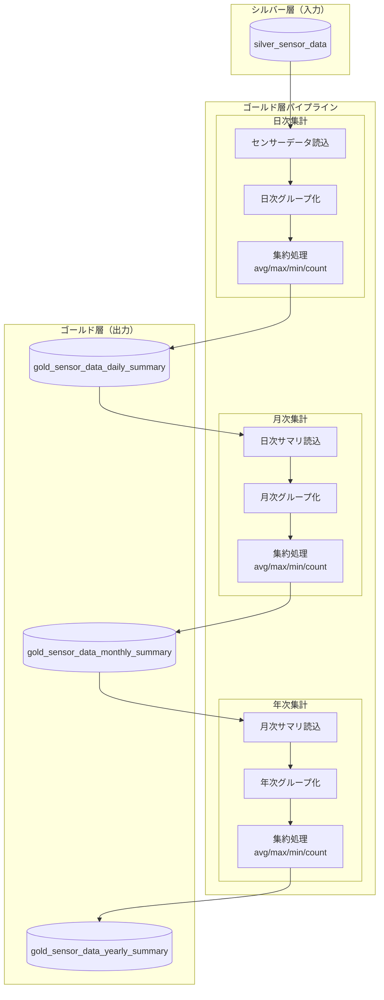

# ゴールド層LDPパイプライン

## 概要

ゴールド層LDPパイプラインは、シルバー層で構造化されたセンサーデータを日次・月次・年次で集計し、ダッシュボード表示用のサマリデータを生成するLakeflow宣言型パイプライン（LDP）機能です。

### 主な責務

1. **データ集計**: シルバー層センサーデータの日次・月次・年次集計
2. **サマリ生成**: 集約対象項目ごとの統計値（平均、最大、最小等）算出
3. **長期保存**: 10年間のデータ保持

---

## 機能ID

| 機能ID   | 機能名                   | 説明                                       |
| -------- | ------------------------ | ------------------------------------------ |
| FR-002-2 | データ処理（ゴールド層） | シルバー層データの集計・サマリテーブル作成 |

---

## データモデル

### 入力テーブル（Silver Layer）

| テーブル名         | スキーマ           | 説明                       |
| ------------------ | ------------------ | -------------------------- |
| silver_sensor_data | iot_catalog.silver | 構造化されたセンサーデータ |

### 出力テーブル（Gold Layer）

| テーブル名                       | スキーマ         | 説明                     | 集計単位 |
| -------------------------------- | ---------------- | ------------------------ | -------- |
| gold_sensor_data_daily_summary   | iot_catalog.gold | センサーデータ日次サマリ | 1日      |
| gold_sensor_data_monthly_summary | iot_catalog.gold | センサーデータ月次サマリ | 1か月    |
| gold_sensor_data_yearly_summary  | iot_catalog.gold | センサーデータ年次サマリ | 1年      |

---

## テーブル定義

### 日次サマリカラム一覧（gold_sensor_data_daily_summary）

| #   | カラム物理名    | カラム論理名 | データ型  | NULL     | PK  | 説明                                 |
| --- | --------------- | ------------ | --------- | -------- | --- | ------------------------------------ |
| 1   | device_id       | デバイスID   | INT       | NOT NULL | ○   | IoTデバイスの一意識別子              |
| 2   | organization_id | 組織ID       | INT       | NOT NULL | ○   | 所属組織ID                           |
| 3   | collection_date | 集約日       | DATE      | NOT NULL | ○   | センサーデータを集約した日           |
| 4   | summary_item    | 集約対象項目 | INT       | NOT NULL | ○   | 集約対象の項目（測定項目ID）         |
| 5   | summary_method  | 集約方法     | INT       | NOT NULL |     | 集約方法（1:平均、2:最大、3:最小等） |
| 6   | summary_value   | 集約値       | DOUBLE    | NOT NULL |     | 集約結果                             |
| 7   | data_count      | データ数     | INT       | NOT NULL |     | 集約したデータ数                     |
| 8   | create_time     | 作成日時     | TIMESTAMP | NOT NULL |     | レコード作成日時                     |

### 月次サマリカラム一覧（gold_sensor_data_monthly_summary）

| #   | カラム物理名          | カラム論理名 | データ型   | NULL     | PK  | 説明                                    |
| --- | --------------------- | ------------ | ---------- | -------- | --- | --------------------------------------- |
| 1   | device_id             | デバイスID   | INT        | NOT NULL | ○   | IoTデバイスの一意識別子                 |
| 2   | organization_id       | 組織ID       | INT        | NOT NULL | ○   | 所属組織ID                              |
| 3   | collection_year_month | 集約年月     | VARCHAR(7) | NOT NULL | ○   | センサーデータを集約した年月（YYYY/MM） |
| 4   | summary_item          | 集約対象項目 | INT        | NOT NULL | ○   | 集約対象の項目（測定項目ID）            |
| 5   | summary_method        | 集約方法     | INT        | NOT NULL |     | 集約方法（1:平均、2:最大、3:最小等）    |
| 6   | summary_value         | 集約値       | DOUBLE     | NOT NULL |     | 集約結果                                |
| 7   | data_count            | データ数     | INT        | NOT NULL |     | 集約したデータ数                        |
| 8   | create_time           | 作成日時     | TIMESTAMP  | NOT NULL |     | レコード作成日時                        |

### 年次サマリカラム一覧（gold_sensor_data_yearly_summary）

| #   | カラム物理名    | カラム論理名 | データ型  | NULL     | PK  | 説明                                 |
| --- | --------------- | ------------ | --------- | -------- | --- | ------------------------------------ |
| 1   | device_id       | デバイスID   | INT       | NOT NULL | ○   | IoTデバイスの一意識別子              |
| 2   | organization_id | 組織ID       | INT       | NOT NULL | ○   | 所属組織ID                           |
| 3   | collection_year | 集約年       | INT       | NOT NULL | ○   | センサーデータを集約した年（YYYY）   |
| 4   | summary_item    | 集約対象項目 | INT       | NOT NULL | ○   | 集約対象の項目（測定項目ID）         |
| 5   | summary_method  | 集約方法     | INT       | NOT NULL |     | 集約方法（1:平均、2:最大、3:最小等） |
| 6   | summary_value   | 集約値       | DOUBLE    | NOT NULL |     | 集約結果                             |
| 7   | data_count      | データ数     | INT       | NOT NULL |     | 集約したデータ数                     |
| 8   | create_time     | 作成日時     | TIMESTAMP | NOT NULL |     | レコード作成日時                     |

### クラスタリングキー

```sql
-- 日次サマリ
CLUSTER BY (collection_date, device_id)

-- 月次サマリ
CLUSTER BY (collection_year_month, device_id)

-- 年次サマリ
CLUSTER BY (collection_year, device_id)
```

---

## 使用テーブル一覧

### 読み取りテーブル（Unity Catalog）

| テーブル名         | スキーマ           | 用途                 |
| ------------------ | ------------------ | -------------------- |
| silver_sensor_data | iot_catalog.silver | センサーデータ集計元 |

### 書き込みテーブル（Unity Catalog）

| カタログ    | スキーマ | テーブル名                       | 用途       |
| ----------- | -------- | -------------------------------- | ---------- |
| iot_catalog | gold     | gold_sensor_data_daily_summary   | 日次サマリ |
| iot_catalog | gold     | gold_sensor_data_monthly_summary | 月次サマリ |
| iot_catalog | gold     | gold_sensor_data_yearly_summary  | 年次サマリ |

---

## 処理フロー



---

## 集約対象項目（summary_item）

| summary_item | 測定項目名                  | センサーカラム名                 |
| ------------ | --------------------------- | -------------------------------- |
| 1            | 外気温度[℃]                 | external_temp                    |
| 2            | 第1冷凍 設定温度[℃]         | set_temp_freezer_1               |
| 3            | 第1冷凍 庫内センサー温度[℃] | internal_sensor_temp_freezer_1   |
| 4            | 第1冷凍 庫内温度[℃]         | internal_temp_freezer_1          |
| 5            | 第1冷凍 DF温度[℃]           | df_temp_freezer_1                |
| 6            | 第1冷凍 凝縮温度[℃]         | condensing_temp_freezer_1        |
| 7            | 第1冷凍 微調整後庫内温度[℃] | adjusted_internal_temp_freezer_1 |
| 8            | 第2冷凍 設定温度[℃]         | set_temp_freezer_2               |
| 9            | 第2冷凍 庫内センサー温度[℃] | internal_sensor_temp_freezer_2   |
| 10           | 第2冷凍 庫内温度[℃]         | internal_temp_freezer_2          |
| 11           | 第2冷凍 DF温度[℃]           | df_temp_freezer_2                |
| 12           | 第2冷凍 凝縮温度[℃]         | condensing_temp_freezer_2        |
| 13           | 第2冷凍 微調整後庫内温度[℃] | adjusted_internal_temp_freezer_2 |
| 14           | 第1冷凍 圧縮機[rpm]         | compressor_freezer_1             |
| 15           | 第2冷凍 圧縮機[rpm]         | compressor_freezer_2             |
| 16           | 第1ファンモータ[rpm]        | fan_motor_1                      |
| 17           | 第2ファンモータ[rpm]        | fan_motor_2                      |
| 18           | 第3ファンモータ[rpm]        | fan_motor_3                      |
| 19           | 第4ファンモータ[rpm]        | fan_motor_4                      |
| 20           | 第5ファンモータ[rpm]        | fan_motor_5                      |
| 21           | 防露ヒータ出力(1)[%]        | defrost_heater_output_1          |
| 22           | 防露ヒータ出力(2)[%]        | defrost_heater_output_2          |

## 集約方法（summary_method）

| summary_method | 集約方法     | 説明                 | 集約結果格納先                   |
| -------------- | ------------ | -------------------- | -------------------------------- |
| 1              | AVG_DAY      | 平均値               | gold_sensor_data_daily_summary   |
| 2              | MAX_DAY      | 最大値               | gold_sensor_data_daily_summary   |
| 3              | MIN_DAY      | 最小値               | gold_sensor_data_daily_summary   |
| 4              | P25          | 第1四分位数          | gold_sensor_data_daily_summary   |
| 5              | MEDIAN       | 中央値               | gold_sensor_data_daily_summary   |
| 6              | P75          | 第3四分位数          | gold_sensor_data_daily_summary   |
| 7              | STDDEV       | 標準偏差             | gold_sensor_data_daily_summary   |
| 8              | P95          | 上側5％値            | gold_sensor_data_daily_summary   |
| 9              | AVG_MONTH    | 日次平均の月間の平均 | gold_sensor_data_monthly_summary |
| 10             | MAX_MONTH    | 月間の最大値         | gold_sensor_data_monthly_summary |
| 11             | MIN_MONTH    | 月間の最小値         | gold_sensor_data_monthly_summary |
| 12             | STDDEV_MONTH | 日間の平均の標準偏差 | gold_sensor_data_monthly_summary |
| 13              | AVG_YEAR     | 月次平均の年間の平均 | gold_sensor_data_yearly_summary  |
| 14             | MAX_YEAR     | 年間の最大値         | gold_sensor_data_yearly_summary  |
| 15             | MIN_YEAR     | 年間の最小値         | gold_sensor_data_yearly_summary  |
| 16             | STDDEV_YEAR  | 月間の平均の標準偏差 | gold_sensor_data_yearly_summary  |


---

## パフォーマンス要件

| 要件         | 値                          | 対応策                                  |
| ------------ | --------------------------- | --------------------------------------- |
| 処理時間     | 日次バッチ完了まで1時間以内 | インクリメンタル処理                    |
| スループット | 10,000デバイス × 1分間隔    | 水平スケーリング、最適クラスタ構成      |
| データ量     | 10GB/日                     | Liquid Clustering、インクリメンタル処理 |

---

## データ保持ポリシー

| 項目           | 値              |
| -------------- | --------------- |
| 保持期間       | 10年間          |
| タイムトラベル | 7日間           |
| 削除方式       | DELETE + VACUUM |

---

## 関連ドキュメント

### 機能仕様

- [LDPパイプライン仕様書](./ldp-pipeline-specification.md) - 処理フロー・データ変換・エラーハンドリング詳細

### 関連パイプライン

- [Silver Layer README](../silver-layer/README.md) - 入力データ元のシルバー層仕様

### 要件定義

- [機能要件定義書](../../../02-requirements/functional-requirements.md) - FR-002
- [非機能要件定義書](../../../02-requirements/non-functional-requirements.md) - NFR-PERF, NFR-SCALE
- [技術要件定義書](../../../02-requirements/technical-requirements.md) - TR-DB-001, TR-DB-002

### データベース設計

- [Unity Catalogデータベース設計書](../../common/unity-catalog-database-specification.md) - テーブル定義・DDL

---

## 変更履歴

| 日付       | 版数 | 変更内容                 | 担当者 |
| ---------- | ---- | ------------------------ | ------ |
| 2026-01-26 | 1.0  | 初版作成                 | Claude |
| 2026-01-26 | 2.0  | UC設計書に準拠して再設計 | Claude |
