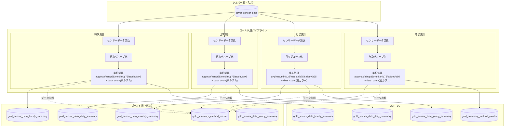

# ゴールド層LDPパイプライン

## 概要

ゴールド層LDPパイプラインは、シルバー層で構造化されたセンサーデータを時次・日次・月次・年次で集計し、ダッシュボード表示用のサマリデータを生成するLakeflow宣言型パイプライン（LDP）機能です。

### 主な責務

1. **データ集計**: シルバー層センサーデータの時次・日次・月次・年次集計
2. **サマリ生成**: 集約対象項目ごとの統計値（平均、最大、最小等）算出
3. **長期保存**: 10年間のデータ保持
4. **障害通知**: エラー発生時のTeams通知

---

## 機能ID

| 機能ID   | 機能名                   | 説明                                       |
| -------- | ------------------------ | ------------------------------------------ |
| FR-002-2 | データ処理（ゴールド層） | シルバー層データの集計・サマリテーブル作成 |

---

## データモデル

### 入力テーブル（Silver Layer）

| テーブル名         | スキーマ           | 説明                       |
| ------------------ | ------------------ | -------------------------- |
| silver_sensor_data | iot_catalog.silver | 構造化されたセンサーデータ |

### 出力テーブル（UnityCatalog Gold Layer）

| テーブル名                       | スキーマ         | 説明                     | 集計単位 |
| -------------------------------- | ---------------- | ------------------------ | -------- |
| gold_sensor_data_hourly_summary  | iot_catalog.gold | センサーデータ時次サマリ | 1時間    |
| gold_sensor_data_daily_summary   | iot_catalog.gold | センサーデータ日次サマリ | 1日      |
| gold_sensor_data_monthly_summary | iot_catalog.gold | センサーデータ月次サマリ | 1か月    |
| gold_sensor_data_yearly_summary  | iot_catalog.gold | センサーデータ年次サマリ | 1年      |

### 出力テーブル（OLTP DB）

| テーブル名                       | スキーマ   | 説明                     | 集計単位 |
| -------------------------------- | ---------- | ------------------------ | -------- |
| gold_sensor_data_hourly_summary  | iot_app_db | センサーデータ時次サマリ | 1時間    |
| gold_sensor_data_daily_summary   | iot_app_db | センサーデータ日次サマリ | 1日      |
| gold_sensor_data_monthly_summary | iot_app_db | センサーデータ月次サマリ | 1か月    |
| gold_sensor_data_yearly_summary  | iot_app_db | センサーデータ年次サマリ | 1年      |

---

## テーブル定義

### 時次サマリカラム一覧（gold_sensor_data_hourly_summary）

| #   | カラム物理名        | カラム論理名 | データ型  | NULL     | PK  | 説明                                                        |
| --- | ------------------- | ------------ | --------- | -------- | --- | ----------------------------------------------------------- |
| 1   | device_id           | デバイスID   | INT       | NOT NULL | 〇  | システム内でのIoTデバイスの一意識別子                       |
| 2   | organization_id     | 組織ID       | INT       | NOT NULL | 〇  | 所属組織ID                                                  |
| 3   | collection_datetime | 集約日時     | DATETIME  | NOT NULL | 〇  | センサーデータを集約した日時。形式は「YYYY/MM/DD HH:00:00」 |
| 4   | summary_item        | 集約対象項目 | INT       | NOT NULL | 〇  | 集約対象の項目                                              |
| 5   | summary_method_id   | 集約方法ID   | INT       | NOT NULL |     | 集約方法ID（平均、分散など）                                |
| 6   | summary_value       | 集約値       | DOUBLE    | NOT NULL |     | 集約結果                                                    |
| 7   | data_count          | データ数     | INT       | NOT NULL |     | 集約したデータ数                                            |
| 8   | create_time         | 作成日時     | TIMESTAMP | NOT NULL |     | レコード作成日時                                            |

### 日次サマリカラム一覧（gold_sensor_data_daily_summary）

| #   | カラム物理名      | カラム論理名 | データ型  | NULL     | PK  | 説明                                         |
| --- | ----------------- | ------------ | --------- | -------- | --- | -------------------------------------------- |
| 1   | device_id         | デバイスID   | INT       | NOT NULL | ○   | IoTデバイスの一意識別子                      |
| 2   | organization_id   | 組織ID       | INT       | NOT NULL | ○   | 所属組織ID                                   |
| 3   | collection_date   | 集約日       | DATE      | NOT NULL | ○   | センサーデータを集約した日                   |
| 4   | summary_item      | 集約対象項目 | INT       | NOT NULL | ○   | 集約対象の項目（測定項目ID）                 |
| 5   | summary_method_id | 集約方法ID   | INT       | NOT NULL |     | 集約方法ID（gold_summary_method_master参照） |
| 6   | summary_value     | 集約値       | DOUBLE    | NULL     |     | 集約結果                                     |
| 7   | data_count        | データ数     | INT       | NOT NULL |     | 集約したデータ数                             |
| 8   | create_time       | 作成日時     | TIMESTAMP | NOT NULL |     | レコード作成日時                             |

### 月次サマリカラム一覧（gold_sensor_data_monthly_summary）

| #   | カラム物理名          | カラム論理名 | データ型   | NULL     | PK  | 説明                                                     |
| --- | --------------------- | ------------ | ---------- | -------- | --- | -------------------------------------------------------- |
| 1   | device_id             | デバイスID   | INT        | NOT NULL | ○   | IoTデバイスの一意識別子                                  |
| 2   | organization_id       | 組織ID       | INT        | NOT NULL | ○   | 所属組織ID                                               |
| 3   | collection_year_month | 集約年月     | VARCHAR(7) | NOT NULL | ○   | センサーデータを集約した年月（YYYY/MM形式、例: 2026/01） |
| 4   | summary_item          | 集約対象項目 | INT        | NOT NULL | ○   | 集約対象の項目（測定項目ID）                             |
| 5   | summary_method_id     | 集約方法ID   | INT        | NOT NULL |     | 集約方法ID（gold_summary_method_master参照）             |
| 6   | summary_value         | 集約値       | DOUBLE     | NULL     |     | 集約結果                                                 |
| 7   | data_count            | データ数     | INT        | NOT NULL |     | 集約したデータ数                                         |
| 8   | create_time           | 作成日時     | TIMESTAMP  | NOT NULL |     | レコード作成日時                                         |

### 年次サマリカラム一覧（gold_sensor_data_yearly_summary）

| #   | カラム物理名      | カラム論理名 | データ型  | NULL     | PK  | 説明                                             |
| --- | ----------------- | ------------ | --------- | -------- | --- | ------------------------------------------------ |
| 1   | device_id         | デバイスID   | INT       | NOT NULL | ○   | IoTデバイスの一意識別子                          |
| 2   | organization_id   | 組織ID       | INT       | NOT NULL | ○   | 所属組織ID                                       |
| 3   | collection_year   | 集約年       | INT       | NOT NULL | ○   | センサーデータを集約した年（YYYY形式、例: 2026） |
| 4   | summary_item      | 集約対象項目 | INT       | NOT NULL | ○   | 集約対象の項目（測定項目ID）                     |
| 5   | summary_method_id | 集約方法ID   | INT       | NOT NULL |     | 集約方法ID（gold_summary_method_master参照）     |
| 6   | summary_value     | 集約値       | DOUBLE    | NULL     |     | 集約結果                                         |
| 7   | data_count        | データ数     | INT       | NOT NULL |     | 集約したデータ数                                 |
| 8   | create_time       | 作成日時     | TIMESTAMP | NOT NULL |     | レコード作成日時                                 |

### サマリー計算手法マスタカラム一覧（gold_summary_method_master）

| #   | カラム物理名        | カラム論理名   | データ型    | NULL     | PK  | 説明                                           |
| --- | ------------------- | -------------- | ----------- | -------- | --- | ---------------------------------------------- |
| 1   | summary_method_id   | 集約方法ID     | INT         | NOT NULL | ○   | システム内での一意識別子                       |
| 2   | summary_method_code | 集約方法コード | VARCHAR(20) | NOT NULL |     | 集約方法をコードで表現したもの（MAX、MINなど） |
| 3   | summary_method_name | 集約方法名     | VARCHAR(30) | NOT NULL |     | 集約方法名（最大値、最小値など）               |
| 4   | delete_flag         | 削除フラグ     | BOOLEAN     | NOT NULL |     | 論理削除時使用                                 |
| 5   | create_time         | 作成日時       | TIMESTAMP   | NOT NULL |     | レコード作成日時                               |
| 6   | creator             | 作成者ID       | INT         | NOT NULL |     | レコード作成ユーザのユーザID                   |
| 7   | update_time         | 更新日時       | TIMESTAMP   | NOT NULL |     | レコード更新日時                               |
| 8   | updater             | 更新者ID       | INT         | NOT NULL |     | レコード更新ユーザのユーザID                   |

### クラスタリングキー

```sql
-- 時次サマリ
CLUSTER BY (collection_datetime, device_id)

-- 日次サマリ
CLUSTER BY (collection_date, device_id)

-- 月次サマリ
CLUSTER BY (collection_year_month, device_id)

-- 年次サマリ
CLUSTER BY (collection_year, device_id)
```

---

## 使用テーブル一覧

### 読み取りテーブル（Unity Catalog）

| テーブル名                 | スキーマ           | 用途                   |
| -------------------------- | ------------------ | ---------------------- |
| silver_sensor_data         | iot_catalog.silver | センサーデータ集計元   |
| gold_summary_method_master | iot_catalog.gold   | サマリー計算手法マスタ |

### 書き込みテーブル（Unity Catalog）

| カタログ    | スキーマ | テーブル名                       | 用途       |
| ----------- | -------- | -------------------------------- | ---------- |
| iot_catalog | gold     | gold_sensor_data_hourly_summary  | 時次サマリ |
| iot_catalog | gold     | gold_sensor_data_daily_summary   | 日次サマリ |
| iot_catalog | gold     | gold_sensor_data_monthly_summary | 月次サマリ |
| iot_catalog | gold     | gold_sensor_data_yearly_summary  | 年次サマリ |

### 書き込みテーブル（OLTP DB）

| スキーマ   | テーブル名                       | 用途       |
| ---------- | -------------------------------- | ---------- |
| iot_app_db | gold_sensor_data_hourly_summary  | 時次サマリ |
| iot_app_db | gold_sensor_data_daily_summary   | 日次サマリ |
| iot_app_db | gold_sensor_data_monthly_summary | 月次サマリ |
| iot_app_db | gold_sensor_data_yearly_summary  | 年次サマリ |

OLTP DBへの書き込みの際、INSERT ... ON DUPLICATE KEY UPDATEを用いて、OLTP DB上のサマリデータに対して冪等性を確保する。

---

## 処理フロー



---

## 集約対象項目（summary_item）

| summary_item | 測定項目名                  | センサーカラム名                 |
| ------------ | --------------------------- | -------------------------------- |
| 1            | 外気温度[℃]                 | external_temp                    |
| 2            | 第1冷凍 設定温度[℃]         | set_temp_freezer_1               |
| 3            | 第1冷凍 庫内センサー温度[℃] | internal_sensor_temp_freezer_1   |
| 4            | 第1冷凍 庫内温度[℃]         | internal_temp_freezer_1          |
| 5            | 第1冷凍 DF温度[℃]           | df_temp_freezer_1                |
| 6            | 第1冷凍 凝縮温度[℃]         | condensing_temp_freezer_1        |
| 7            | 第1冷凍 微調整後庫内温度[℃] | adjusted_internal_temp_freezer_1 |
| 8            | 第2冷凍 設定温度[℃]         | set_temp_freezer_2               |
| 9            | 第2冷凍 庫内センサー温度[℃] | internal_sensor_temp_freezer_2   |
| 10           | 第2冷凍 庫内温度[℃]         | internal_temp_freezer_2          |
| 11           | 第2冷凍 DF温度[℃]           | df_temp_freezer_2                |
| 12           | 第2冷凍 凝縮温度[℃]         | condensing_temp_freezer_2        |
| 13           | 第2冷凍 微調整後庫内温度[℃] | adjusted_internal_temp_freezer_2 |
| 14           | 第1冷凍 圧縮機[rpm]         | compressor_freezer_1             |
| 15           | 第2冷凍 圧縮機[rpm]         | compressor_freezer_2             |
| 16           | 第1ファンモータ[rpm]        | fan_motor_1                      |
| 17           | 第2ファンモータ[rpm]        | fan_motor_2                      |
| 18           | 第3ファンモータ[rpm]        | fan_motor_3                      |
| 19           | 第4ファンモータ[rpm]        | fan_motor_4                      |
| 20           | 第5ファンモータ[rpm]        | fan_motor_5                      |
| 21           | 防露ヒータ出力\(1)[%]       | defrost_heater_output_1          |
| 22           | 防露ヒータ出力\(2)[%]       | defrost_heater_output_2          |

## 集約方法（summary_method_id）

集約方法はサマリー計算手法マスタ（gold_summary_method_master）で管理されます。日次・月次・年次サマリで共通の集約方法IDを使用します。

| summary_method_id | summary_method_code | 集約方法名    | 計算ロジック                            |
| ----------------- | ------------------- | ------------- | --------------------------------------- |
| 1                 | AVG                 | 平均値        | `AVG(sensor_value)`                     |
| 2                 | MAX                 | 最大値        | `MAX(sensor_value)`                     |
| 3                 | MIN                 | 最小値        | `MIN(sensor_value)`                     |
| 4                 | P25                 | 第1四分位数   | `PERCENTILE_APPROX(sensor_value, 0.25)` |
| 5                 | MEDIAN              | 中央値        | `PERCENTILE_APPROX(sensor_value, 0.5)`  |
| 6                 | P75                 | 第3四分位数   | `PERCENTILE_APPROX(sensor_value, 0.75)` |
| 7                 | STDDEV              | 標準偏差      | `STDDEV(sensor_value)`                  |
| 8                 | P95                 | 上側5％境界値 | `PERCENTILE_APPROX(sensor_value, 0.95)` |

### 各サマリテーブルでの集約対象

| サマリテーブル                   | 集約元データ       | 説明                             |
| -------------------------------- | ------------------ | -------------------------------- |
| gold_sensor_data_hourly_summary  | silver_sensor_data | シルバー層の生データを時次で集約 |
| gold_sensor_data_daily_summary   | silver_sensor_data | シルバー層の生データを日次で集約 |
| gold_sensor_data_monthly_summary | silver_sensor_data | シルバー層の生データを月次で集約 |
| gold_sensor_data_yearly_summary  | silver_sensor_data | シルバー層の生データを年次で集約 |

---

## パフォーマンス要件

| 要件         | 値                          | 対応策                                  |
| ------------ | --------------------------- | --------------------------------------- |
| 処理時間     | 日次バッチ完了まで1時間以内 | インクリメンタル処理                    |
| スループット | 10,000デバイス × 1分間隔    | インクリメンタル処理、Liquid Clustering |
| データ量     | 10GB/日                     | Liquid Clustering、インクリメンタル処理 |

---

## データ保持ポリシー

| 項目           | 値              |
| -------------- | --------------- |
| 保持期間       | 10年間          |
| タイムトラベル | 7日間           |
| 削除方式       | DELETE + VACUUM |

---

## 障害時のTeams通知

以下のエラー発生時、Teamsのシステム保守者連絡チャネルに通知を行い、運用担当者が迅速に対応できるようにする。

### 通知方式

| 項目           | 内容                                  |
| -------------- | ------------------------------------- |
| 通知先         | システム保守者用Teams管理チャネル     |
| 通知方式       | Teamsワークフロー（Incoming Webhook） |
| メッセージ形式 | Adaptive Card                         |

### 通知対象

| 対象             | 通知有無 | 説明                          |
| ---------------- | -------- | ----------------------------- |
| データ読込エラー | ✓        | シルバー層からの読込失敗      |
| データ変換エラー | ✓        | 集計処理中のエラー            |
| データ書込エラー | ✓        | ゴールド層への書込失敗        |
| タイムアウト     | ✓        | 処理時間超過                  |
| 大量スキップ     | △        | 100件以上のレコードスキップ時 |

### 通知内容

- エラーコード・エラーメッセージ
- 発生日時
- 対象パイプライン名
- 処理対象日
- 詳細情報（スタックトレース）

詳細は[LDPパイプライン仕様書](./ldp-pipeline-specification.md)のエラー通知（Teams）セクションを参照。

---

## 関連ドキュメント

### 機能仕様

- [LDPパイプライン仕様書](./ldp-pipeline-specification.md) - 処理フロー・データ変換・エラーハンドリング詳細

### 関連パイプライン

- [Silver Layer README](../silver-layer/README.md) - 入力データ元のシルバー層仕様

### 要件定義

- [機能要件定義書](../../../02-requirements/functional-requirements.md) - FR-002
- [非機能要件定義書](../../../02-requirements/non-functional-requirements.md) - NFR-PERF, NFR-SCALE
- [技術要件定義書](../../../02-requirements/technical-requirements.md) - TR-DB-001, TR-DB-002

### データベース設計

- [Unity Catalogデータベース設計書](../../common/unity-catalog-database-specification.md) - テーブル定義・DDL
- [アプリケーションデータベース設計書](../../common/app-database-specification.md) - テーブル定義・DDL

---

## 変更履歴

| 日付       | 版数 | 変更内容                    | 担当者       |
| ---------- | ---- | --------------------------- | ------------ |
| 2026-01-26 | 1.0  | 初版作成                    | Kei Sugiyama |
| 2026-04-01 | 1.1  | データ出力先にOLTP DBを追加 | Kei Sugiyama |
