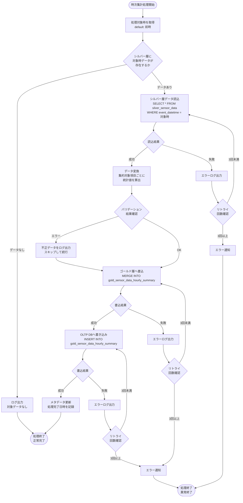
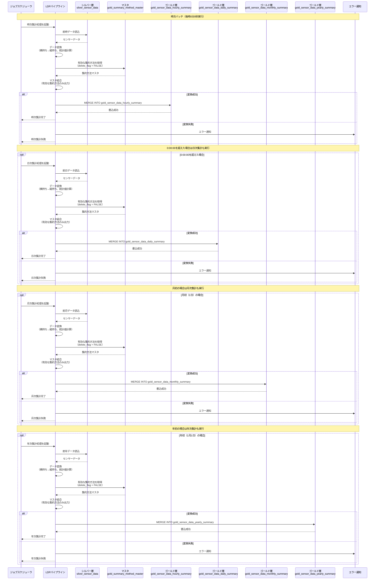
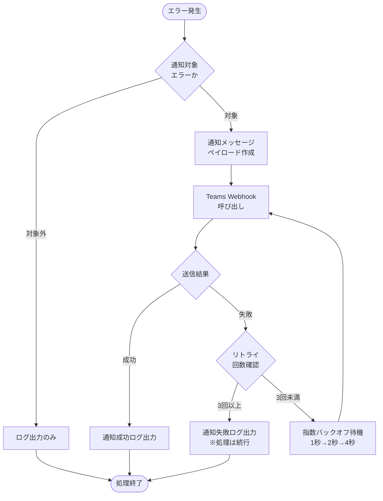

# ゴールド層LDPパイプライン - ワークフロー仕様書

## 📑 目次

- [ゴールド層LDPパイプライン - ワークフロー仕様書](#ゴールド層ldpパイプライン---ワークフロー仕様書)
  - [📑 目次](#-目次)
  - [概要](#概要)
  - [処理一覧](#処理一覧)
  - [ワークフロー詳細](#ワークフロー詳細)
    - [時次集計処理](#時次集計処理)
      - [処理フロー](#処理フロー)
      - [処理詳細](#処理詳細)
      - [バリデーション](#バリデーション)
    - [日次集計処理](#日次集計処理)
      - [処理フロー](#処理フロー-1)
      - [処理詳細](#処理詳細-1)
      - [バリデーション](#バリデーション-1)
    - [月次集計処理](#月次集計処理)
      - [処理フロー](#処理フロー-2)
      - [処理詳細](#処理詳細-2)
    - [年次集計処理](#年次集計処理)
      - [処理フロー](#処理フロー-3)
      - [処理詳細](#処理詳細-3)
  - [データ変換仕様](#データ変換仕様)
    - [共通集約方法（gold\_summary\_method\_master）](#共通集約方法gold_summary_method_master)
    - [マスタテーブル結合方式](#マスタテーブル結合方式)
    - [時次集計変換ロジック](#時次集計変換ロジック)
    - [日次集計変換ロジック](#日次集計変換ロジック)
    - [月次集計変換ロジック](#月次集計変換ロジック)
    - [年次集計変換ロジック](#年次集計変換ロジック)
    - [共通集計処理の実装](#共通集計処理の実装)
      - [共通部分と差分](#共通部分と差分)
      - [設定クラス定義](#設定クラス定義)
      - [センサーカラム定義](#センサーカラム定義)
      - [共通集計処理](#共通集計処理)
      - [MERGE処理（共通）](#merge処理共通)
      - [集計処理の実行](#集計処理の実行)
      - [共通化のメリット](#共通化のメリット)
  - [シーケンス図](#シーケンス図)
    - [バッチ処理全体フロー](#バッチ処理全体フロー)
  - [エラーハンドリング](#エラーハンドリング)
    - [エラー分類とハンドリング](#エラー分類とハンドリング)
    - [エラーメッセージ一覧](#エラーメッセージ一覧)
    - [エラー通知（Teams）](#エラー通知teams)
      - [通知対象エラー](#通知対象エラー)
      - [通知フロー](#通知フロー)
      - [通知メッセージ仕様](#通知メッセージ仕様)
      - [Webhook設定](#webhook設定)
      - [通知実装例（Python）](#通知実装例python)
      - [パイプラインへの組み込み例](#パイプラインへの組み込み例)
    - [例外処理実装例（Python）](#例外処理実装例python)
  - [トランザクション管理](#トランザクション管理)
    - [トランザクション方針](#トランザクション方針)
    - [Delta Lakeトランザクション保証](#delta-lakeトランザクション保証)
    - [MERGE処理の冪等性](#merge処理の冪等性)
    - [INSERT処理の冪等性](#insert処理の冪等性)
  - [パフォーマンス最適化](#パフォーマンス最適化)
    - [パフォーマンス要件](#パフォーマンス要件)
    - [クラスタリング戦略](#クラスタリング戦略)
    - [インクリメンタル処理](#インクリメンタル処理)
    - [並列処理最適化](#並列処理最適化)
  - [データ保持・削除ポリシー](#データ保持削除ポリシー)
    - [保持期間](#保持期間)
    - [削除処理](#削除処理)
    - [削除スケジュール](#削除スケジュール)
  - [関連ドキュメント](#関連ドキュメント)
    - [機能仕様](#機能仕様)
    - [関連パイプライン](#関連パイプライン)
    - [要件定義](#要件定義)
    - [共通仕様](#共通仕様)
    - [データベース設計](#データベース設計)
  - [変更履歴](#変更履歴)

---

## 概要

このドキュメントは、ゴールド層LDPパイプラインの処理フロー、データ変換ロジック、エラーハンドリングの詳細を記載します。

**このドキュメントの役割:**

- ✅ 処理フローの詳細（時次・日次・月次・年次集計処理）
- ✅ データ変換ロジック（集約対象項目・集約方法）
- ✅ エラーハンドリングフロー
- ✅ トランザクション管理
- ✅ パフォーマンス最適化

**パイプライン概要:**

| 項目     | 値                                                 |
| -------- | -------------------------------------------------- |
| 機能ID   | FR-002-2                                           |
| 機能名   | データ処理（ゴールド層）                           |
| 処理方式 | インクリメンタル処理                               |
| 実行頻度 | 定時バッチ（1時間に1回）                           |
| 入力     | シルバー層センサーデータ                           |
| 出力     | ゴールド層サマリテーブル（時次・日次・月次・年次） |

**注:** テーブル定義・カラム仕様の詳細は [README.md](./README.md) を参照してください。

---

## 処理一覧

| No  | 処理名       | 処理タイプ | 入力               | 出力                                                      | 説明                         |
| --- | ------------ | ---------- | ------------------ | --------------------------------------------------------- | ---------------------------- |
| 1   | 時次集計処理 | Batch      | silver_sensor_data | gold_sensor_data_hourly_summary（UnityCatalog, OLTP DB）  | シルバー層データを時次で集計 |
| 2   | 日次集計処理 | Batch      | silver_sensor_data | gold_sensor_data_daily_summary（UnityCatalog, OLTP DB）   | シルバー層データを日次で集計 |
| 3   | 月次集計処理 | Batch      | silver_sensor_data | gold_sensor_data_monthly_summary（UnityCatalog, OLTP DB） | シルバー層データを月次で集計 |
| 4   | 年次集計処理 | Batch      | silver_sensor_data | gold_sensor_data_yearly_summary（UnityCatalog, OLTP DB）  | シルバー層データを年次で集計 |

OLTP DBのgold_sensor_data_hourly_summary、gold_sensor_data_daily_summary、gold_sensor_data_monthly_summary、gold_sensor_data_yearly_summaryテーブルの定義については、アプリケーションデータベース仕様書を参照のこと。

---

## ワークフロー詳細

### 時次集計処理

**トリガー:** 時次バッチスケジュール

**前提条件:**

- シルバー層テーブル `silver_sensor_data` にデータが存在する
- 対象時の全データがシルバー層に取り込み完了している

#### 処理フロー



#### 処理詳細

時次集計処理は[共通集計処理](#共通集計処理の実装)を使用して実行します。

**実行例:**

```python
from datetime import date, timedelta

# 前時の時刻を取得
target_datetime = datetime.now() - timedelta(hour=1)

# 時次集計を実行
run_aggregation(
    period=AggregationPeriod.DAILY,
    target_filter=f"event_datetime = '{target_datetime}'"
)
```

**処理ステップ:**

| ステップ | 処理内容             | 詳細                                 |
| -------- | -------------------- | ------------------------------------ |
| ①        | シルバー層データ読込 | `event_datetime = 対象時` でフィルタ |
| ②        | 共通集計処理         | `aggregate_sensor_data()` を呼び出し |
| ③        | ゴールド層へ書込     | `merge_to_gold()` でMERGE処理        |
| ④        | OLTP DBへ書込        | `insert_to_gold()` でinsert処理      |

**設定値:**

| 項目         | 値                                                                                               |
| ------------ | ------------------------------------------------------------------------------------------------ |
| 出力テーブル | `iot_catalog.gold.gold_sensor_data_hourly_summary`, `iot_app_db.gold_sensor_data_hourly_summary` |
| 時間カラム   | `collection_datetime`                                                                            |
| 時間式       | `event_datetime`                                                                                 |

#### バリデーション

| 項目                | ルール                                    | エラー時の処理                       |
| ------------------- | ----------------------------------------- | ------------------------------------ |
| device_id           | NOT NULL                                  | 該当レコードをスキップ、ログ出力     |
| organization_id     | NOT NULL                                  | 該当レコードをスキップ、ログ出力     |
| collection_datetime | 有効な時刻                                | 該当レコードをスキップ、ログ出力     |
| summary_item        | 1〜22の範囲                               | 該当レコードをスキップ、ログ出力     |
| summary_method_id   | マスタテーブルに存在（delete_flag=FALSE） | マスタ結合時に自動除外               |
| summary_value       | 数値型                                    | NULL値を許容（データ欠損として記録） |

---

### 日次集計処理

**トリガー:** 日次バッチスケジュール（深夜実行）

**前提条件:**

- シルバー層テーブル `silver_sensor_data` にデータが存在する
- 対象日の全データがシルバー層に取り込み完了している

#### 処理フロー


#### 処理詳細

日次集計処理は[共通集計処理](#共通集計処理の実装)を使用して実行します。

**実行例:**

```python
from datetime import date, timedelta

# 前日の日付を取得
target_date = date.today() - timedelta(days=1)

# 日次集計を実行
run_aggregation(
    period=AggregationPeriod.DAILY,
    target_filter=f"event_date = '{target_date}'"
)
```

**処理ステップ:**

| ステップ | 処理内容             | 詳細                                 |
| -------- | -------------------- | ------------------------------------ |
| ①        | シルバー層データ読込 | `event_date = 対象日` でフィルタ     |
| ②        | 共通集計処理         | `aggregate_sensor_data()` を呼び出し |
| ③        | ゴールド層へ書込     | `merge_to_gold()` でMERGE処理        |
| ④        | OLTP DBへ書込        | `insert_to_gold()` でinsert処理      |

**設定値:**

| 項目         | 値                                                                                             |
| ------------ | ---------------------------------------------------------------------------------------------- |
| 出力テーブル | `iot_catalog.gold.gold_sensor_data_daily_summary`, `iot_app_db.gold_sensor_data_daily_summary` |
| 時間カラム   | `collection_date`                                                                              |
| 時間式       | `event_date`                                                                                   |

#### バリデーション

| 項目              | ルール                                    | エラー時の処理                       |
| ----------------- | ----------------------------------------- | ------------------------------------ |
| device_id         | NOT NULL                                  | 該当レコードをスキップ、ログ出力     |
| organization_id   | NOT NULL                                  | 該当レコードをスキップ、ログ出力     |
| collection_date   | 有効な日付                                | 該当レコードをスキップ、ログ出力     |
| summary_item      | 1〜22の範囲                               | 該当レコードをスキップ、ログ出力     |
| summary_method_id | マスタテーブルに存在（delete_flag=FALSE） | マスタ結合時に自動除外               |
| summary_value     | 数値型                                    | NULL値を許容（データ欠損として記録） |

---

### 月次集計処理

**トリガー:** 月初バッチスケジュール（毎月1日深夜実行）

**前提条件:**

- シルバー層テーブル `silver_sensor_data` に前月のデータが存在する

#### 処理フロー


> **注記:** バリデーション処理（device_id・organization_id・event_date の NOT NULL チェック）は[共通集計処理](#共通集計処理の実装)内で日次と共通して実施します。

#### 処理詳細

月次集計処理は[共通集計処理](#共通集計処理の実装)を使用して実行します。

**実行例:**

```python
from datetime import date
from dateutil.relativedelta import relativedelta

# 前月の年月を取得
last_month = date.today() - relativedelta(months=1)
month_start = last_month.replace(day=1)
month_end = (month_start + relativedelta(months=1)) - relativedelta(days=1)

# 月次集計を実行
run_aggregation(
    period=AggregationPeriod.MONTHLY,
    target_filter=f"event_date BETWEEN '{month_start}' AND '{month_end}'"
)
```

**処理ステップ:**

| ステップ | 処理内容             | 詳細                                          |
| -------- | -------------------- | --------------------------------------------- |
| ①        | シルバー層データ読込 | `event_date BETWEEN 月初 AND 月末` でフィルタ |
| ②        | 共通集計処理         | `aggregate_sensor_data()` を呼び出し          |
| ③        | ゴールド層へ書込     | `merge_to_gold()` でMERGE処理                 |
| ④        | ゴールド層へ書込     | `insert_to_gold()` でMERGE処理                |

**設定値:**

| 項目         | 値                                                                                                 |
| ------------ | -------------------------------------------------------------------------------------------------- |
| 出力テーブル | `iot_catalog.gold.gold_sensor_data_monthly_summary`, `iot_app_db.gold_sensor_data_monthly_summary` |
| 時間カラム   | `collection_year_month`                                                                            |
| 時間式       | `DATE_FORMAT(event_date, 'yyyy/MM') AS collection_year_month`                                      |

---

### 年次集計処理

**トリガー:** 年初バッチスケジュール（毎年1月1日深夜実行）

**前提条件:**

- シルバー層テーブル `silver_sensor_data` に前年のデータが存在する

#### 処理フロー

```mermaid
flowchart TD
    Start([年次集計処理開始]) --> GetDate[処理対象年を取得<br>default: 前年]
    GetDate --> CheckSource{シルバー層に<br>対象年データが<br>存在するか}

    CheckSource -->|データなし| LogNoData[ログ出力<br>対象データなし]
    LogNoData --> EndSuccess([処理終了<br>正常完了])
    CheckSource -->|データあり| ReadSilver[シルバー層データ読込<br>SELECT * FROM silver_sensor_data<br>WHERE YEAR(event_date) = 対象年]
    ReadSilver --> CheckRead{読込結果}

    CheckRead -->|成功| Transform[データ変換<br>集約対象項目ごとに<br>統計値を算出]
    CheckRead -->|失敗| ErrorRead[エラーログ出力]
    ErrorRead --> RetryRead{リトライ<br>回数確認}
    RetryRead -->|3回未満| ReadSilver
    RetryRead -->|3回以上| AlertRead[エラー通知]
    AlertRead --> EndError([処理終了<br>異常終了])

    Transform --> Validate{バリデーション<br>結果確認}
    Validate -->|エラー| ErrorValidate[不正データをログ出力<br>スキップして続行]
    ErrorValidate --> WriteGold

    Validate -->|OK| WriteGold[ゴールド層へ書込<br>MERGE INTO gold_sensor_data_yearly_summary]
    WriteGold --> CheckWrite{書込結果}

    CheckWrite -->|成功| WriteOLTP[OLTP DBへ書き込み<br>INSERT INTO gold_sensor_data_yearly_summary]
    WriteOLTP --> CheckWrite1{書込結果}
    CheckWrite1 --> |成功| UpdateMeta[メタデータ更新<br>処理完了日時を記録]
    UpdateMeta --> EndSuccess

    CheckWrite1 --> |失敗| ErrorWrite1[エラーログ出力]
    ErrorWrite1 --> RetryWrite1{リトライ<br>回数確認}
    RetryWrite1 -->|3回未満| WriteOLTP
    RetryWrite1 -->|3回以上| AlertWrite[エラー通知]

    CheckWrite -->|失敗| ErrorWrite[エラーログ出力]
    ErrorWrite --> RetryWrite{リトライ<br>回数確認}
    RetryWrite -->|3回未満| WriteGold
    RetryWrite -->|3回以上| AlertWrite[エラー通知]
    AlertWrite --> EndError
```

> **注記:** バリデーション処理（device_id・organization_id・event_date の NOT NULL チェック）は[共通集計処理](#共通集計処理の実装)内で日次と共通して実施します。

#### 処理詳細

年次集計処理は[共通集計処理](#共通集計処理の実装)を使用して実行します。

**実行例:**

```python
from datetime import date

# 前年を取得
target_year = date.today().year - 1

# 年次集計を実行
run_aggregation(
    period=AggregationPeriod.YEARLY,
    target_filter=f"YEAR(event_date) = {target_year}"
)
```

**処理ステップ:**

| ステップ | 処理内容             | 詳細                                   |
| -------- | -------------------- | -------------------------------------- |
| ①        | シルバー層データ読込 | `YEAR(event_date) = 対象年` でフィルタ |
| ②        | 共通集計処理         | `aggregate_sensor_data()` を呼び出し   |
| ③        | ゴールド層へ書込     | `merge_to_gold()` でMERGE処理          |
| ④        | ゴールド層へ書込     | `insert_to_gold()` でMERGE処理         |

**設定値:**

| 項目         | 値                                                                                               |
| ------------ | ------------------------------------------------------------------------------------------------ |
| 出力テーブル | `iot_catalog.gold.gold_sensor_data_yearly_summary`, `iot_app_db.gold_sensor_data_yearly_summary` |
| 時間カラム   | `collection_year`                                                                                |
| 時間式       | `YEAR(event_date) AS collection_year`                                                            |

---

## データ変換仕様

### 共通集約方法（gold_summary_method_master）

日次・月次・年次サマリで共通の集約方法をマスタテーブルで管理します。集計処理時にマスタテーブルと結合し、**delete_flag = FALSE**の有効な集約方法のみを出力します。

| summary_method_id | summary_method_code | 集約方法名    | 計算ロジック                            |
| ----------------- | ------------------- | ------------- | --------------------------------------- |
| 1                 | AVG                 | 平均値        | `AVG(sensor_value)`                     |
| 2                 | MAX                 | 最大値        | `MAX(sensor_value)`                     |
| 3                 | MIN                 | 最小値        | `MIN(sensor_value)`                     |
| 4                 | P25                 | 第1四分位数   | `PERCENTILE_APPROX(sensor_value, 0.25)` |
| 5                 | MEDIAN              | 中央値        | `PERCENTILE_APPROX(sensor_value, 0.5)`  |
| 6                 | P75                 | 第3四分位数   | `PERCENTILE_APPROX(sensor_value, 0.75)` |
| 7                 | STDDEV              | 標準偏差      | `STDDEV(sensor_value)`                  |
| 8                 | P95                 | 上側5％境界値 | `PERCENTILE_APPROX(sensor_value, 0.95)` |

**初期データ投入SQL:**

```sql
-- gold_summary_method_master 初期データ
INSERT INTO iot_catalog.gold.gold_summary_method_master
(summary_method_id, summary_method_code, summary_method_name, delete_flag, create_time, creator, update_time, updater)
VALUES
    (1, 'AVG',    '平均値',        FALSE, CURRENT_TIMESTAMP(), -999, CURRENT_TIMESTAMP(), -999),
    (2, 'MAX',    '最大値',        FALSE, CURRENT_TIMESTAMP(), -999, CURRENT_TIMESTAMP(), -999),
    (3, 'MIN',    '最小値',        FALSE, CURRENT_TIMESTAMP(), -999, CURRENT_TIMESTAMP(), -999),
    (4, 'P25',    '第1四分位数',   FALSE, CURRENT_TIMESTAMP(), -999, CURRENT_TIMESTAMP(), -999),
    (5, 'MEDIAN', '中央値',        FALSE, CURRENT_TIMESTAMP(), -999, CURRENT_TIMESTAMP(), -999),
    (6, 'P75',    '第3四分位数',   FALSE, CURRENT_TIMESTAMP(), -999, CURRENT_TIMESTAMP(), -999),
    (7, 'STDDEV', '標準偏差',      FALSE, CURRENT_TIMESTAMP(), -999, CURRENT_TIMESTAMP(), -999),
    (8, 'P95',    '上側5％境界値', FALSE, CURRENT_TIMESTAMP(), -999, CURRENT_TIMESTAMP(), -999);
```

作成者ユーザID、更新者ユーザIDはシステム保守者を表す仮想のユーザIDを記入する。

### マスタテーブル結合方式

集約方法の制御をマスタテーブルで行うことで、以下のメリットがあります。

| 観点         | 説明                                                           |
| ------------ | -------------------------------------------------------------- |
| 柔軟性       | マスタテーブルの更新のみで集約方法の追加・削除が可能           |
| 論理削除対応 | delete_flagをTRUEにすることで特定の集約方法を無効化可能        |
| 保守性       | SQLコードの変更なしに集約方法を制御可能                        |
| 一貫性       | 日次・月次・年次で同一のマスタを参照し、集約方法の一貫性を保証 |

**結合条件:**

```sql
INNER JOIN iot_catalog.gold.gold_summary_method_master m
    ON u.method_code = m.summary_method_code
WHERE m.delete_flag = FALSE
```

### 時次集計変換ロジック

シルバー層センサーデータを時次で集計し、マスタテーブルで有効な集約方法のレコードを生成します。

| 入力データ         | 集約キー                                                 | 出力                                                  |
| ------------------ | -------------------------------------------------------- | ----------------------------------------------------- |
| silver_sensor_data | device_id, organization_id, event_datetime, summary_item | マスタで有効な集約方法（delete_flag=FALSE）のレコード |

sensor_value が全件 NULL のグループはサマリレコードが生成されない

### 日次集計変換ロジック

シルバー層センサーデータを日次で集計し、マスタテーブルで有効な集約方法のレコードを生成します。

| 入力データ         | 集約キー                                             | 出力                                                  |
| ------------------ | ---------------------------------------------------- | ----------------------------------------------------- |
| silver_sensor_data | device_id, organization_id, event_date, summary_item | マスタで有効な集約方法（delete_flag=FALSE）のレコード |

sensor_value が全件 NULL のグループはサマリレコードが生成されない

### 月次集計変換ロジック

シルバー層センサーデータを月次で集計し、マスタテーブルで有効な集約方法のレコードを生成します。

| 入力データ         | 集約キー                                                        | 出力                                                  |
| ------------------ | --------------------------------------------------------------- | ----------------------------------------------------- |
| silver_sensor_data | device_id, organization_id, collection_year_month, summary_item | マスタで有効な集約方法（delete_flag=FALSE）のレコード |

sensor_value が全件 NULL のグループはサマリレコードが生成されない

### 年次集計変換ロジック

シルバー層センサーデータを年次で集計し、マスタテーブルで有効な集約方法のレコードを生成します。

| 入力データ         | 集約キー                                                  | 出力                                                  |
| ------------------ | --------------------------------------------------------- | ----------------------------------------------------- |
| silver_sensor_data | device_id, organization_id, collection_year, summary_item | マスタで有効な集約方法（delete_flag=FALSE）のレコード |

sensor_value が全件 NULL のグループはサマリレコードが生成されない

### 共通集計処理の実装

時次・日次・月次・年次集計処理は構造が共通（約90%）のため、パラメータ化された共通関数として実装します。

#### 共通部分と差分

| 項目                   | 共通/差分 | 説明                                                                                                         |
| ---------------------- | --------- | ------------------------------------------------------------------------------------------------------------ |
| stack関数によるunpivot | 共通      | 22項目の横持ち→縦持ち変換                                                                                    |
| 統計値計算             | 共通      | AVG/MAX/MIN/P25/MEDIAN/P75/STDDEV/P95                                                                        |
| マスタテーブル結合     | 共通      | gold_summary_method_masterとのINNER JOIN                                                                     |
| MERGE処理              | 共通      | upsert処理                                                                                                   |
| 集約キー               | **差分**  | event_datetime / event_date / colecction_datetime / collecton_date / collection_year_month / collection_year |
| 出力テーブル           | **差分**  | hourly / daily / monthly / yearly                                                                            |
| WHERE条件              | **差分**  | 日付条件                                                                                                     |

#### 設定クラス定義

```python
from enum import Enum
from dataclasses import dataclass
from typing import Callable
from pyspark.sql import DataFrame
from pyspark.sql import functions as F
from pyspark.sql.utils import AnalysisException  # リトライ対象外例外（テーブル未存在・権限不足等）

class AggregationPeriod(Enum):
    """集計期間"""
    HOURLY = "hourly"
    DAILY = "daily"
    MONTHLY = "monthly"
    YEARLY = "yearly"

@dataclass
class AggregationConfig:
    """集計設定"""
    period: AggregationPeriod
    output_table: str          # 出力テーブル名
    time_column: str           # 出力カラム名
    time_expr: str             # 時間集約のSQL式

# 設定定義
AGGREGATION_CONFIGS = {
    AggregationPeriod.HOURLY: AggregationConfig(
        period=AggregationPeriod.HOURLY,
        output_table="iot_catalog.gold.gold_sensor_data_hourly_summary",
        time_column="collection_datetime",
        time_expr="event_datetime"
    ),
    AggregationPeriod.DAILY: AggregationConfig(
        period=AggregationPeriod.DAILY,
        output_table="iot_catalog.gold.gold_sensor_data_daily_summary",
        time_column="collection_date",
        time_expr="event_date"
    ),
    AggregationPeriod.MONTHLY: AggregationConfig(
        period=AggregationPeriod.MONTHLY,
        output_table="iot_catalog.gold.gold_sensor_data_monthly_summary",
        time_column="collection_year_month",
        time_expr="DATE_FORMAT(event_date, 'yyyy/MM')"
    ),
    AggregationPeriod.YEARLY: AggregationConfig(
        period=AggregationPeriod.YEARLY,
        output_table="iot_catalog.gold.gold_sensor_data_yearly_summary",
        time_column="collection_year",
        time_expr="YEAR(event_date)"
    )
}
```

#### センサーカラム定義

```python
# センサーカラム定義（summary_itemとカラム名のマッピング）
SENSOR_COLUMNS = [
    (1, "external_temp"),
    (2, "set_temp_freezer_1"),
    (3, "internal_sensor_temp_freezer_1"),
    (4, "internal_temp_freezer_1"),
    (5, "df_temp_freezer_1"),
    (6, "condensing_temp_freezer_1"),
    (7, "adjusted_internal_temp_freezer_1"),
    (8, "set_temp_freezer_2"),
    (9, "internal_sensor_temp_freezer_2"),
    (10, "internal_temp_freezer_2"),
    (11, "df_temp_freezer_2"),
    (12, "condensing_temp_freezer_2"),
    (13, "adjusted_internal_temp_freezer_2"),
    (14, "compressor_freezer_1"),
    (15, "compressor_freezer_2"),
    (16, "fan_motor_1"),
    (17, "fan_motor_2"),
    (18, "fan_motor_3"),
    (19, "fan_motor_4"),
    (20, "fan_motor_5"),
    (21, "defrost_heater_output_1"),
    (22, "defrost_heater_output_2")
]

def create_unpivot_expr() -> str:
    """
    stack関数の式を生成

    stack関数は横持ちデータを縦持ちに変換する。
    stack(n, key1, val1, key2, val2, ...) は n 行を生成し、
    各行に (key, val) のペアを出力する。
    """
    items = ", ".join([f"{id}, {col}" for id, col in SENSOR_COLUMNS])
    return f"stack({len(SENSOR_COLUMNS)}, {items}) AS (summary_item, sensor_value)"
```

#### 共通集計処理

```python
def aggregate_sensor_data(
    silver_df: DataFrame,
    config: AggregationConfig
) -> DataFrame:
    """
    センサーデータ集計処理（共通ロジック）

    Args:
        silver_df: フィルタ済みシルバー層データ
        config: 集計設定（DAILY/MONTHLY/YEARLY）

    Returns:
        集計済みデータフレーム
    """
    # 1. 横持ち→縦持ち変換（stack関数）
    unpivoted = silver_df.selectExpr(
        "device_id",
        "organization_id",
        f"{config.time_expr} AS {config.time_column}",
        # → DATE_FORMAT(event_date, 'yyyy/MM') AS collection_year_month（月次）
        # → YEAR(event_date) AS collection_year（年次）
        
        create_unpivot_expr()
    ).filter("sensor_value IS NOT NULL")

    # 2. 統計値計算（全集約方法を事前計算）
    stats = unpivoted.groupBy(
        "device_id",
        "organization_id",
        config.time_column,
        "summary_item"
    ).agg(
        F.avg("sensor_value").alias("AVG"),
        F.max("sensor_value").alias("MAX"),
        F.min("sensor_value").alias("MIN"),
        F.expr("PERCENTILE_APPROX(sensor_value, 0.25)").alias("P25"),
        F.expr("PERCENTILE_APPROX(sensor_value, 0.5)").alias("MEDIAN"),
        F.expr("PERCENTILE_APPROX(sensor_value, 0.75)").alias("P75"),
        F.stddev("sensor_value").alias("STDDEV"),
        F.expr("PERCENTILE_APPROX(sensor_value, 0.95)").alias("P95"),
        F.count("*").alias("data_count")
    )

    # 3. 統計値を縦持ちに変換（集約方法コードをキーとして使用）
    unpivoted_stats = stats.selectExpr(
        "device_id",
        "organization_id",
        config.time_column,
        "summary_item",
        "data_count",
        """stack(8,
            'AVG', AVG,
            'MAX', MAX,
            'MIN', MIN,
            'P25', P25,
            'MEDIAN', MEDIAN,
            'P75', P75,
            'STDDEV', STDDEV,
            'P95', P95
        ) AS (method_code, summary_value)"""
    )

    # 4. マスタテーブル結合（有効な集約方法のみ出力）
    method_master = spark.table("iot_catalog.gold.gold_summary_method_master") \
        .filter("delete_flag = FALSE")

    result = unpivoted_stats.join(
        F.broadcast(method_master),
        unpivoted_stats.method_code == method_master.summary_method_code,
        "inner"
    ).select(
        "device_id",
        "organization_id",
        config.time_column,
        "summary_item",
        "summary_method_id", # gold_summary_method_master から取得
        "summary_value",
        "data_count",
        F.current_timestamp().alias("create_time")
    )

    return result
```

#### MERGE処理（共通）

```python
def merge_to_gold(aggregated_df: DataFrame, config: AggregationConfig):
    """
    ゴールド層へのMERGE処理（共通）

    Args:
        aggregated_df: 集計済みデータ
        config: 集計設定
    """
    from delta.tables import DeltaTable

    gold_table = DeltaTable.forName(spark, config.output_table)

    # MERGEキー（時間カラム以外は共通）
    merge_condition = f"""
        target.device_id = source.device_id
        AND target.organization_id = source.organization_id
        AND target.{config.time_column} = source.{config.time_column}
        AND target.summary_item = source.summary_item
        AND target.summary_method_id = source.summary_method_id
    """

    gold_table.alias("target").merge(
        aggregated_df.alias("source"),
        merge_condition
    ).whenMatchedUpdate(
        set={
            "summary_value": "source.summary_value",
            "data_count": "source.data_count"
        }
    ).whenNotMatchedInsertAll().execute()
```

#### 集計処理の実行

```python
import logging
logger = logging.getLogger(__name__)

def run_aggregation(period: AggregationPeriod, target_filter: str):
    """
    集計処理の実行

    Args:
        period: 集計期間（HOURLY/DAILY/MONTHLY/YEARLY）
        target_filter: WHERE条件

    Examples:
        # 時次集計（前時）
        run_aggregation(AggregationPeriod.HOURLY, "event_datetime = '2026-01-28 0:00:00'")

        # 日次集計（前日）
        run_aggregation(AggregationPeriod.DAILY, "event_date = '2026-01-28'")

        # 月次集計（前月）
        run_aggregation(AggregationPeriod.MONTHLY,
                       "event_date BETWEEN '2026-01-01' AND '2026-01-31'")

        # 年次集計（前年）
        run_aggregation(AggregationPeriod.YEARLY, "YEAR(event_date) = 2025")
    """
    config = AGGREGATION_CONFIGS[period]

    # フェーズ1: シルバー層データ読込（最大3回リトライ）
    MAX_READ_RETRY = 3
    silver_df = None
    for attempt in range(1, MAX_READ_RETRY + 1):
        try:
            silver_df = spark.table("iot_catalog.silver.silver_sensor_data") \
                .filter(target_filter)
            break  # 読込成功
        except (AnalysisException, PermissionError) as e:
            # リトライ対象外（テーブル未存在・権限不足・不正なクエリ等）
            error_msg = f"シルバー層からのデータ読込に失敗しました（リトライ不可）: {str(e)}"
            logger.error(f"GOLD_ERR_001: {error_msg}")
            notify_error(
                error_code="GOLD_ERR_001",
                error_message=error_msg,
                pipeline_name=config.output_table,
                target_date=target_filter
            )
            raise
        except Exception as e:
            # リトライ対象（ネットワーク・タイムアウト等の一時的エラー）
            error_msg = f"シルバー層からのデータ読込に失敗しました (試行 {attempt}/{MAX_READ_RETRY}): {str(e)}"
            logger.error(f"GOLD_ERR_001: {error_msg}")
            if attempt >= MAX_READ_RETRY:
                notify_error(
                    error_code="GOLD_ERR_001",
                    error_message=error_msg,
                    pipeline_name=config.output_table,
                    target_date=target_filter
                )
                raise

    if silver_df.isEmpty():
        logger.warning(f"GOLD_WARN_001: 対象期間のデータが存在しません ({period.value})")
        return

    # フェーズ2: 集計処理
    try:
        aggregated = aggregate_sensor_data(silver_df, config)
    except Exception as e:
        error_msg = f"データ変換中にエラーが発生しました: {str(e)}"
        logger.error(f"GOLD_ERR_002: {error_msg}")
        notify_error(
            error_code="GOLD_ERR_002",
            error_message=error_msg,
            pipeline_name=config.output_table,
            target_date=target_filter
        )
        raise

    # フェーズ3: MERGE処理（書込）
    try:
        merge_to_gold(aggregated, config)
        logger.info(f"{period.value}集計完了: {aggregated.count()} レコード")
    except Exception as e:
        error_msg = f"ゴールド層への書込に失敗しました: {str(e)}"
        logger.error(f"GOLD_ERR_003: {error_msg}")
        notify_error(
            error_code="GOLD_ERR_003",
            error_message=error_msg,
            pipeline_name=config.output_table,
            target_date=target_filter
        )
        raise
```

#### 共通化のメリット

| 観点     | 効果                                       |
| -------- | ------------------------------------------ |
| コード量 | 約60%削減（3つの処理→1つの共通関数）       |
| 保守性   | 統計値追加時、1箇所の修正で全期間に反映    |
| テスト   | 共通ロジックのテストで3処理をカバー        |
| バグ修正 | 1箇所の修正で全期間に適用                  |
| 一貫性   | 時次・日次・月次・年次で同一ロジックを保証 |

---

## シーケンス図

### バッチ処理全体フロー



> **日次・月初・年初判定の責務分担:**
> 日次・月次・年次集計の起動判断（日次=0:00:00を超えたか、月初=1日か、年初=1月1日か）は**スケジューラが行う**。
> パイプラインは `run_aggregation()` を受動的に呼び出すだけであり、日付判定ロジックを内包しない。
> スケジューラは毎時に時次集計を起動し、0:00:00を超えていたら日次集計も、当日が月初であれば月次集計も、1月1日であれば年次集計も追加で起動する。

---

## エラーハンドリング

### エラー分類とハンドリング

| エラー種別               | 発生箇所       | 検出方法     | 処理内容                         | リトライ | アラート        |
| ------------------------ | -------------- | ------------ | -------------------------------- | -------- | --------------- |
| データ読込エラー         | シルバー層読込 | 例外キャッチ | リトライ後にアラート             | ✓（3回） | ✓               |
| 変換エラー（データ欠損） | 集計処理       | NULL値検出   | 該当レコードをスキップ、ログ出力 | ×        | ×               |
| 変換エラー（型不正）     | 集計処理       | 型変換失敗   | 該当レコードをスキップ、ログ出力 | ×        | △（大量発生時） |
| 書込エラー               | ゴールド層書込 | 例外キャッチ | リトライ後にアラート             | ✓（3回） | ✓               |
| タイムアウト             | 全処理         | 処理時間監視 | 処理中断、アラート               | ×        | ✓               |

### エラーメッセージ一覧

| エラーコード  | メッセージ                               | 発生条件                           | 対処方法                     |
| ------------- | ---------------------------------------- | ---------------------------------- | ---------------------------- |
| GOLD_ERR_001  | シルバー層からのデータ読込に失敗しました | シルバー層テーブルへのアクセス失敗 | シルバー層の状態を確認       |
| GOLD_ERR_002  | データ変換中にエラーが発生しました       | 変換処理の例外                     | 入力データの品質を確認       |
| GOLD_ERR_003  | ゴールド層への書込に失敗しました         | ゴールド層テーブルへの書込失敗     | ゴールド層の状態を確認       |
| GOLD_ERR_004  | 処理がタイムアウトしました               | 1時間以内に完了しなかった          | データ量・クラスタ構成を確認 |
| GOLD_WARN_001 | 対象期間のデータが存在しません           | 入力データなし                     | 正常終了（警告ログのみ）     |
| GOLD_WARN_002 | 一部レコードの変換をスキップしました     | 変換不可データあり                 | スキップされたデータを確認   |

### エラー通知（Teams）

エラー発生時、システム保守者が属するTeamsの管理チャネルに対して通知を行います。通知はTeamsチャネルに登録されたワークフロー（Incoming Webhook）を実行することで実現します。

#### 通知対象エラー

| エラーコード  | 通知有無 | 優先度 | 説明                            |
| ------------- | -------- | ------ | ------------------------------- |
| GOLD_ERR_001  | ✓        | 高     | シルバー層からのデータ読込失敗  |
| GOLD_ERR_002  | ✓        | 高     | データ変換中のエラー            |
| GOLD_ERR_003  | ✓        | 高     | ゴールド層への書込失敗          |
| GOLD_ERR_004  | ✓        | 高     | 処理タイムアウト                |
| GOLD_WARN_001 | ×        | -      | 対象データなし（正常終了）      |
| GOLD_WARN_002 | △        | 中     | 大量発生時（100件以上）のみ通知 |

#### 通知フロー



#### 通知メッセージ仕様

| 項目           | 内容                                  |
| -------------- | ------------------------------------- |
| 宛先           | システム保守者用Teams管理チャネル     |
| 通知方式       | Teamsワークフロー（Incoming Webhook） |
| メッセージ形式 | Adaptive Card（JSON）                 |

**通知内容:**

| 項目         | 説明                            | 例                                |
| ------------ | ------------------------------- | --------------------------------- |
| タイトル     | アラート種別と優先度            | [高] ゴールド層パイプラインエラー |
| エラーコード | 発生したエラーのコード          | GOLD_ERR_001                      |
| エラー内容   | エラーメッセージ                | シルバー層からのデータ読込に失敗  |
| 発生日時     | エラー発生のタイムスタンプ      | 2026-01-27 03:15:42 JST           |
| パイプライン | 対象パイプライン名              | gold_sensor_data_daily_summary    |
| 処理対象日   | 処理対象の日付                  | 2026-01-26                        |
| 詳細情報     | スタックトレース（先頭500文字） | -                                 |
| 対処リンク   | 運用手順書へのリンク            | -                                 |

#### Webhook設定

**環境変数:**

| 変数名                    | 説明                              | 設定場所                |
| ------------------------- | --------------------------------- | ----------------------- |
| TEAMS_WEBHOOK_URL         | TeamsワークフローのWebhook URL    | Databricks Secret Scope |
| TEAMS_WEBHOOK_TIMEOUT_SEC | Webhook呼び出しタイムアウト（秒） | パイプライン設定        |
| TEAMS_WEBHOOK_RETRY_COUNT | リトライ回数                      | パイプライン設定        |

**Secret Scope設定:**

```python
# Databricks Secret Scopeからwebhook URLを取得
webhook_url = dbutils.secrets.get(scope="iot-pipeline-secrets", key="teams-webhook-url")
```

#### 通知実装例（Python）

```python
import requests
import json
from datetime import datetime
import logging

logger = logging.getLogger(__name__)

class TeamsNotifier:
    """Teams通知クラス"""

    def __init__(self, webhook_url: str, timeout: int = 30, retry_count: int = 3):
        self.webhook_url = webhook_url
        self.timeout = timeout
        self.retry_count = retry_count

    def send_error_notification(
        self,
        error_code: str,
        error_message: str,
        pipeline_name: str,
        target_date: str,
        stack_trace: str = None
    ) -> bool:
        """
        エラー通知をTeamsに送信

        Args:
            error_code: エラーコード（例: GOLD_ERR_001）
            error_message: エラーメッセージ
            pipeline_name: パイプライン名
            target_date: 処理対象日
            stack_trace: スタックトレース（オプション）

        Returns:
            bool: 送信成功時True
        """
        payload = self._build_adaptive_card(
            error_code=error_code,
            error_message=error_message,
            pipeline_name=pipeline_name,
            target_date=target_date,
            stack_trace=stack_trace
        )

        for attempt in range(self.retry_count):
            try:
                response = requests.post(
                    self.webhook_url,
                    json=payload,
                    timeout=self.timeout,
                    headers={"Content-Type": "application/json"}
                )

                if response.status_code == 200:
                    logger.info(f"Teams通知送信成功: {error_code}")
                    return True
                else:
                    logger.warning(
                        f"Teams通知送信失敗 (試行 {attempt + 1}/{self.retry_count}): "
                        f"status={response.status_code}"
                    )
            except requests.exceptions.RequestException as e:
                logger.warning(
                    f"Teams通知送信エラー (試行 {attempt + 1}/{self.retry_count}): {str(e)}"
                )

            if attempt < self.retry_count - 1:
                import time
                # 指数バックオフ（1秒、2秒、4秒）
                wait_time = 2 ** attempt
                time.sleep(wait_time)

        logger.error(f"Teams通知送信失敗（リトライ上限）: {error_code}")
        return False

    def _build_adaptive_card(
        self,
        error_code: str,
        error_message: str,
        pipeline_name: str,
        target_date: str,
        stack_trace: str = None
    ) -> dict:
        """Adaptive Cardペイロードを構築"""

        priority = "高" if error_code.startswith("GOLD_ERR") else "中"
        priority_color = "attention" if priority == "高" else "warning"

        card = {
            "type": "message",
            "attachments": [
                {
                    "contentType": "application/vnd.microsoft.card.adaptive",
                    "content": {
                        "$schema": "http://adaptivecards.io/schemas/adaptive-card.json",
                        "type": "AdaptiveCard",
                        "version": "1.4",
                        "body": [
                            {
                                "type": "TextBlock",
                                "size": "Large",
                                "weight": "Bolder",
                                "text": f"[{priority}] ゴールド層パイプラインエラー",
                                "color": priority_color
                            },
                            {
                                "type": "FactSet",
                                "facts": [
                                    {"title": "エラーコード", "value": error_code},
                                    {"title": "エラー内容", "value": error_message},
                                    {"title": "発生日時", "value": datetime.now().strftime("%Y-%m-%d %H:%M:%S JST")},
                                    {"title": "パイプライン", "value": pipeline_name},
                                    {"title": "処理対象日", "value": target_date}
                                ]
                            }
                        ]
                    }
                }
            ]
        }

        # スタックトレースがある場合は追加（先頭500文字）
        if stack_trace:
            card["attachments"][0]["content"]["body"].append({
                "type": "TextBlock",
                "text": f"**詳細情報:**\n```\n{stack_trace[:500]}\n```",
                "wrap": True,
                "size": "Small"
            })

        return card


# 使用例
def notify_error(error_code: str, error_message: str, pipeline_name: str, target_date: str):
    """エラー通知のヘルパー関数"""
    webhook_url = dbutils.secrets.get(scope="iot-pipeline-secrets", key="teams-webhook-url")
    notifier = TeamsNotifier(webhook_url)
    notifier.send_error_notification(
        error_code=error_code,
        error_message=error_message,
        pipeline_name=pipeline_name,
        target_date=target_date
    )
```

#### パイプラインへの組み込み例

```python
from datetime import date, timedelta

def run_daily_aggregation():
    """日次集計処理（Teams通知付き）"""
    target_date = (date.today() - timedelta(days=1)).strftime("%Y-%m-%d")

    try:
        # シルバー層からデータ読込
        silver_df = spark.table("iot_catalog.silver.silver_sensor_data")
        daily_data = silver_df.filter(
            col("event_date") == target_date
        )

        if daily_data.isEmpty():
            logger.warning("GOLD_WARN_001: 対象期間のデータが存在しません")
            return

        # 集計処理
        config = AGGREGATION_CONFIGS[AggregationPeriod.DAILY]
        aggregated = aggregate_sensor_data(daily_data, config)
        merge_to_gold(aggregated, config)
        logger.info(f"日次集計完了: {aggregated.count()} レコード")

    except Exception as e:
        # エラー通知をTeamsに送信
        notify_error(
            error_code="GOLD_ERR_002",
            error_message=f"データ変換中にエラーが発生しました: {str(e)}",
            pipeline_name="gold_sensor_data_daily_summary",
            target_date=target_date
        )
        raise
```

### 例外処理実装例（Python）

```python
from datetime import date, timedelta
from pyspark.sql.functions import col
import logging

logger = logging.getLogger(__name__)

def run_daily_aggregation():
    """日次集計処理"""
    target_date = (date.today() - timedelta(days=1)).strftime("%Y-%m-%d")

    try:
        # シルバー層からデータ読込
        silver_df = spark.table("iot_catalog.silver.silver_sensor_data")

        # 対象日のデータをフィルタ
        daily_data = silver_df.filter(
            col("event_date") == target_date
        )

        # データが存在しない場合
        if daily_data.isEmpty():
            logger.warning("GOLD_WARN_001: 対象期間のデータが存在しません")
            return

        # バリデーション前後の件数差分を取得してスキップ数をログ出力
        count_before = daily_data.count()
        validated_data = daily_data.filter(
            "device_id IS NOT NULL "
            "AND organization_id IS NOT NULL "
            "AND event_date IS NOT NULL"
        )
        count_after = validated_data.count()
        skip_count = count_before - count_after

        if skip_count > 0:
            logger.warning(
                f"GOLD_WARN_002候補: バリデーション失敗により {skip_count} 件をスキップしました "
                f"（全 {count_before} 件中）"
            )
            if skip_count >= 100:
                notify_error(
                    error_code="GOLD_WARN_002",
                    error_message=f"バリデーション失敗により {skip_count} 件をスキップしました",
                    pipeline_name="gold_sensor_data_daily_summary",
                    target_date=target_date
                )

        # 集計処理（バリデーション済みデータのみ使用）
        config = AGGREGATION_CONFIGS[AggregationPeriod.DAILY]
        aggregated = aggregate_sensor_data(validated_data, config)
        merge_to_gold(aggregated, config)

        logger.info(f"日次集計完了: {aggregated.count()} レコード")

    except Exception as e:
        logger.error(f"GOLD_ERR_002: データ変換中にエラーが発生しました: {str(e)}")
        raise
```

---

## トランザクション管理

### トランザクション方針

| 処理     | トランザクション範囲 | コミットタイミング   | ロールバック条件 |
| -------- | -------------------- | -------------------- | ---------------- |
| 時次集計 | 1時間分のデータ単位  | 全レコード書込完了後 | 書込エラー発生時 |
| 日次集計 | 1日分のデータ単位    | 全レコード書込完了後 | 書込エラー発生時 |
| 月次集計 | 1か月分のデータ単位  | 全レコード書込完了後 | 書込エラー発生時 |
| 年次集計 | 1年分のデータ単位    | 全レコード書込完了後 | 書込エラー発生時 |

### Delta Lakeトランザクション保証

- **ACID保証**: Delta Lakeのトランザクションログによりデータ整合性を保証
- **タイムトラベル**: 過去のバージョンへのロールバックが可能（7日間）
- **オプティミスティック同時実行制御**: 複数のジョブが同時実行された場合の整合性保証

### MERGE処理の冪等性

```sql
-- MERGE文による冪等性の確保
-- 同じデータで再実行しても結果が変わらない
MERGE INTO gold_sensor_data_daily_summary AS target
USING aggregated_data AS source
ON target.device_id = source.device_id
   AND target.organization_id = source.organization_id
   AND target.collection_date = source.collection_date
   AND target.summary_item = source.summary_item
   AND target.summary_method_id = source.summary_method_id
WHEN MATCHED THEN UPDATE SET *
WHEN NOT MATCHED THEN INSERT *
```

### INSERT処理の冪等性

```sql
-- INSERT文による冪等性の確保
-- 同じデータで再実行してもデータ重複が発生しない
INSERT INTO gold_sensor_data_daily_summary AS target
VALUES (
    ...
)
ON DUPLICATE KEY UPDATE gold_sensor_data_daily_summary
...
```

---

## パフォーマンス最適化

### パフォーマンス要件

| 要件         | 値                          | 対応策                                 |
| ------------ | --------------------------- | -------------------------------------- |
| 処理時間     | 時次バッチ完了まで1時間以内 | インクリメンタル処理、クラスタ最適化   |
| スループット | 10,000デバイス × 1分間隔    | 水平スケーリング、パーティション最適化 |
| データ量     | 10GB/日                     | Liquid Clustering                      |

### クラスタリング戦略

各テーブルに対して、クエリパターンに応じたクラスタリングキーを設定します。

```sql
-- 時次サマリ：時刻っとデバイスIDでの検索が多い
ALTER TABLE gold_sensor_data_hourly_summary
CLUSTER BY (collection_datetime, device_id);

-- 日次サマリ：日付とデバイスIDでの検索が多い
ALTER TABLE gold_sensor_data_daily_summary
CLUSTER BY (collection_date, device_id);

-- 月次サマリ：年月とデバイスIDでの検索が多い
ALTER TABLE gold_sensor_data_monthly_summary
CLUSTER BY (collection_year_month, device_id);

-- 年次サマリ：年とデバイスIDでの検索が多い
ALTER TABLE gold_sensor_data_yearly_summary
CLUSTER BY (collection_year, device_id);
```

### インクリメンタル処理

- **時次集計**: 前時のデータのみを処理（フルスキャン不要）
- **日次集計**: 前日のデータのみを処理（フルスキャン不要）
- **月次集計**: 前月のデータのみを処理
- **年次集計**: 前年のデータのみを処理

```python
# インクリメンタル処理の実装例（バッチ処理）
from datetime import date, timedelta

def run_daily_aggregation():
    # 前日のデータのみを対象
    target_date = (date.today() - timedelta(days=1)).strftime("%Y-%m-%d")
    config = AGGREGATION_CONFIGS[AggregationPeriod.DAILY]

    silver_df = spark.table("iot_catalog.silver.silver_sensor_data") \
        .filter(col("event_date") == target_date)
    aggregated = aggregate_sensor_data(silver_df, config)
    merge_to_gold(aggregated, config)
```

### 並列処理最適化

```python
# Spark設定の最適化
spark.conf.set("spark.sql.shuffle.partitions", "200")
spark.conf.set("spark.sql.adaptive.enabled", "true")
spark.conf.set("spark.sql.adaptive.coalescePartitions.enabled", "true")
spark.conf.set("spark.sql.adaptive.skewJoin.enabled", "true")
```

---

## データ保持・削除ポリシー

### 保持期間

| テーブル                         | 保持期間 | タイムトラベル | 削除方式        |
| -------------------------------- | -------- | -------------- | --------------- |
| gold_sensor_data_hourly_summary  | 10年間   | 7日間          | DELETE + VACUUM |
| gold_sensor_data_daily_summary   | 10年間   | 7日間          | DELETE + VACUUM |
| gold_sensor_data_monthly_summary | 10年間   | 7日間          | DELETE + VACUUM |
| gold_sensor_data_yearly_summary  | 10年間   | 7日間          | DELETE + VACUUM |

gold_summary_method_masterについては、恒久保持とし、データ削除は行わない。

### 削除処理

```sql
-- 時次サマリ削除例（10年以上前）
DELETE FROM iot_catalog.gold.gold_sensor_data_hourly_volume
WHERE collection_datetime < CURRENT_TIMESTAMP() - INTERVAL 10 YEAR;

-- 10年以上前のデータを削除（日次サマリ）
DELETE FROM iot_catalog.gold.gold_sensor_data_daily_summary
WHERE collection_date < DATE_SUB(CURRENT_DATE(), 3650);

-- 削除後のVACUUM処理（7日以上前の履歴を物理削除）
VACUUM iot_catalog.gold.gold_sensor_data_daily_summary
RETAIN 168 HOURS;  -- 7日間

-- 月次サマリ削除例（10年以上前）
DELETE FROM iot_catalog.gold.gold_sensor_data_monthly_summary
WHERE collection_year_month < DATE_FORMAT(DATE_SUB(CURRENT_DATE(), 3650), 'yyyy/MM');

-- 年次サマリ削除例（10年以上前）
DELETE FROM iot_catalog.gold.gold_sensor_data_yearly_summary
WHERE collection_year < YEAR(DATE_SUB(CURRENT_DATE(), 3650));
```

### 削除スケジュール

| 処理           | 実行頻度           | 実行時間           |
| -------------- | ------------------ | ------------------ |
| 時次サマリ削除 | 日次（毎日）       | 深夜（集計処理後） |
| 日次サマリ削除 | 月次（毎月1日）    | 深夜（集計処理後） |
| 月次サマリ削除 | 年次（毎年1月1日） | 深夜（集計処理後） |
| 年次サマリ削除 | 年次（毎年1月1日） | 深夜（集計処理後） |
| VACUUM処理     | 週次（毎週日曜）   | 深夜               |

---

## 関連ドキュメント

### 機能仕様

- [機能概要 README](./README.md) - テーブル定義・集約項目・集約方法の詳細

### 関連パイプライン

- [Silver Layer README](../silver-layer/README.md) - 入力データ元のシルバー層仕様

### 要件定義

- [機能要件定義書](../../../02-requirements/functional-requirements.md) - FR-002
- [非機能要件定義書](../../../02-requirements/non-functional-requirements.md) - NFR-PERF, NFR-SCALE
- [技術要件定義書](../../../02-requirements/technical-requirements.md) - TR-DB-001, TR-DB-002

### 共通仕様

- [共通仕様書](../../common/common-specification.md) - エラーコード、トランザクション管理、セキュリティ等

### データベース設計

- [Unity Catalogデータベース設計書](../../common/unity-catalog-database-specification.md) - テーブル定義・DDL
- [アプリケーションデータベース設計書](../../common/app-database-specification.md) - テーブル定義・DDL

---

## 変更履歴

| 日付       | 版数 | 変更内容                                      | 担当者       |
| ---------- | ---- | --------------------------------------------- | ------------ |
| 2026-01-26 | 1.0  | 初版作成                                      | Kei Sugiyama |
| 2026-04-01 | 1.1  | データ登録対象にOLTP DBを追加、処理フロー修正 | Kei Sugiyama |
