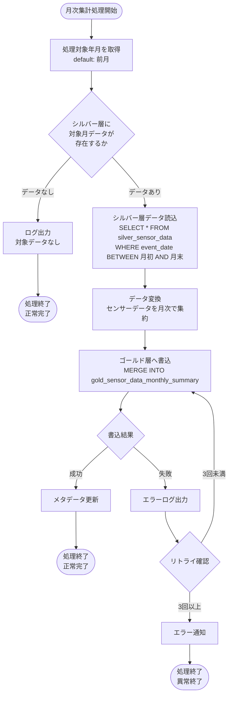
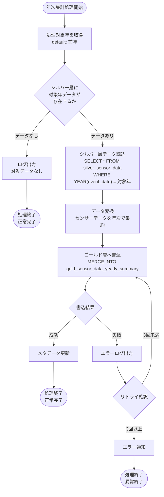
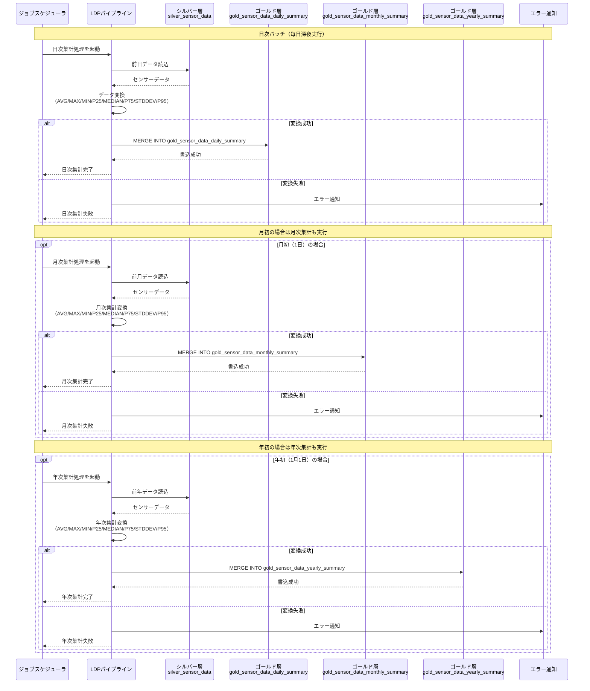
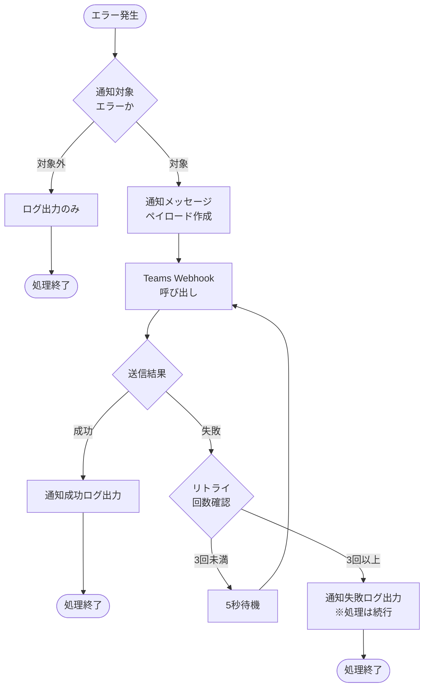

# ゴールド層LDPパイプライン - ワークフロー仕様書

## 📑 目次

- [ゴールド層LDPパイプライン - ワークフロー仕様書](#ゴールド層ldpパイプライン---ワークフロー仕様書)
  - [📑 目次](#-目次)
  - [概要](#概要)
  - [処理一覧](#処理一覧)
  - [ワークフロー詳細](#ワークフロー詳細)
    - [日次集計処理](#日次集計処理)
      - [処理フロー](#処理フロー)
      - [処理詳細](#処理詳細)
      - [バリデーション](#バリデーション)
    - [月次集計処理](#月次集計処理)
      - [処理フロー](#処理フロー-1)
      - [処理詳細](#処理詳細-1)
    - [年次集計処理](#年次集計処理)
      - [処理フロー](#処理フロー-2)
      - [処理詳細](#処理詳細-2)
  - [データ変換仕様](#データ変換仕様)
    - [共通集約方法（gold\_summary\_method\_master）](#共通集約方法gold_summary_method_master)
    - [マスタテーブル結合方式](#マスタテーブル結合方式)
    - [日次集計変換ロジック](#日次集計変換ロジック)
    - [月次集計変換ロジック](#月次集計変換ロジック)
    - [年次集計変換ロジック](#年次集計変換ロジック)
  - [シーケンス図](#シーケンス図)
    - [日次バッチ処理全体フロー](#日次バッチ処理全体フロー)
  - [エラーハンドリング](#エラーハンドリング)
    - [エラー分類とハンドリング](#エラー分類とハンドリング)
    - [エラーメッセージ一覧](#エラーメッセージ一覧)
    - [エラー通知（Teams）](#エラー通知teams)
      - [通知対象エラー](#通知対象エラー)
      - [通知フロー](#通知フロー)
      - [通知メッセージ仕様](#通知メッセージ仕様)
      - [Webhook設定](#webhook設定)
      - [通知実装例（Python）](#通知実装例python)
      - [パイプラインへの組み込み例](#パイプラインへの組み込み例)
    - [例外処理実装例（Python）](#例外処理実装例python)
  - [トランザクション管理](#トランザクション管理)
    - [トランザクション方針](#トランザクション方針)
    - [Delta Lakeトランザクション保証](#delta-lakeトランザクション保証)
    - [MERGE処理の冪等性](#merge処理の冪等性)
  - [パフォーマンス最適化](#パフォーマンス最適化)
    - [パフォーマンス要件](#パフォーマンス要件)
    - [クラスタリング戦略](#クラスタリング戦略)
    - [インクリメンタル処理](#インクリメンタル処理)
    - [並列処理最適化](#並列処理最適化)
  - [データ保持・削除ポリシー](#データ保持削除ポリシー)
    - [保持期間](#保持期間)
    - [削除処理](#削除処理)
    - [削除スケジュール](#削除スケジュール)
  - [関連ドキュメント](#関連ドキュメント)
    - [機能仕様](#機能仕様)
    - [関連パイプライン](#関連パイプライン)
    - [要件定義](#要件定義)
    - [共通仕様](#共通仕様)
  - [変更履歴](#変更履歴)

---

## 概要

このドキュメントは、ゴールド層LDPパイプラインの処理フロー、データ変換ロジック、エラーハンドリングの詳細を記載します。

**このドキュメントの役割:**
- ✅ 処理フローの詳細（日次・月次・年次集計処理）
- ✅ データ変換ロジック（集約対象項目・集約方法）
- ✅ エラーハンドリングフロー
- ✅ トランザクション管理
- ✅ パフォーマンス最適化

**パイプライン概要:**

| 項目     | 値                                           |
| -------- | -------------------------------------------- |
| 機能ID   | FR-002-2                                     |
| 機能名   | データ処理（ゴールド層）                     |
| 処理方式 | インクリメンタル処理                         |
| 実行頻度 | 日次バッチ                                   |
| 入力     | シルバー層センサーデータ                     |
| 出力     | ゴールド層サマリテーブル（日次・月次・年次） |

**注:** テーブル定義・カラム仕様の詳細は [README.md](./README.md) を参照してください。

---

## 処理一覧

| No  | 処理名       | 処理タイプ | 入力               | 出力                             | 説明                         |
| --- | ------------ | ---------- | ------------------ | -------------------------------- | ---------------------------- |
| 1   | 日次集計処理 | Batch      | silver_sensor_data | gold_sensor_data_daily_summary   | シルバー層データを日次で集計 |
| 2   | 月次集計処理 | Batch      | silver_sensor_data | gold_sensor_data_monthly_summary | シルバー層データを月次で集計 |
| 3   | 年次集計処理 | Batch      | silver_sensor_data | gold_sensor_data_yearly_summary  | シルバー層データを年次で集計 |

---

## ワークフロー詳細

### 日次集計処理

**トリガー:** 日次バッチスケジュール（深夜実行）

**前提条件:**
- シルバー層テーブル `silver_sensor_data` にデータが存在する
- 対象日の全データがシルバー層に取り込み完了している

#### 処理フロー


#### 処理詳細

**① シルバー層データ読込**

```sql
-- 処理対象日のデータを読込
WITH silver_data AS (
    SELECT
        device_id,
        organization_id,
        event_timestamp,
        event_date,
        external_temp,
        set_temp_freezer_1,
        internal_sensor_temp_freezer_1,
        internal_temp_freezer_1,
        df_temp_freezer_1,
        condensing_temp_freezer_1,
        adjusted_internal_temp_freezer_1,
        set_temp_freezer_2,
        internal_sensor_temp_freezer_2,
        internal_temp_freezer_2,
        df_temp_freezer_2,
        condensing_temp_freezer_2,
        adjusted_internal_temp_freezer_2,
        compressor_freezer_1,
        compressor_freezer_2,
        fan_motor_1,
        fan_motor_2,
        fan_motor_3,
        fan_motor_4,
        fan_motor_5,
        defrost_heater_output_1,
        defrost_heater_output_2
    FROM
        iot_catalog.silver.silver_sensor_data
    WHERE
        event_date = :target_date
)
```

**② 日次集計変換**

各集約対象項目（summary_item）と集約方法ID（summary_method_id）の組み合わせごとに統計値を算出します。集約方法はgold_summary_method_masterテーブルと結合し、delete_flag = FALSEの有効な集約方法のみを出力します。

```sql
-- 日次集計（マスタテーブル結合方式）
WITH sensor_unpivot AS (
    -- 横持ちデータを縦持ちに変換
    SELECT
        device_id,
        organization_id,
        event_date AS collection_date,
        stack(22,
            1, external_temp,
            2, set_temp_freezer_1,
            3, internal_sensor_temp_freezer_1,
            4, internal_temp_freezer_1,
            5, df_temp_freezer_1,
            6, condensing_temp_freezer_1,
            7, adjusted_internal_temp_freezer_1,
            8, set_temp_freezer_2,
            9, internal_sensor_temp_freezer_2,
            10, internal_temp_freezer_2,
            11, df_temp_freezer_2,
            12, condensing_temp_freezer_2,
            13, adjusted_internal_temp_freezer_2,
            14, compressor_freezer_1,
            15, compressor_freezer_2,
            16, fan_motor_1,
            17, fan_motor_2,
            18, fan_motor_3,
            19, fan_motor_4,
            20, fan_motor_5,
            21, defrost_heater_output_1,
            22, defrost_heater_output_2
        ) AS (summary_item, sensor_value)
    FROM silver_data
),
daily_stats AS (
    -- 全ての統計値を事前計算
    SELECT
        device_id,
        organization_id,
        collection_date,
        summary_item,
        AVG(sensor_value) AS AVG,
        MAX(sensor_value) AS MAX,
        MIN(sensor_value) AS MIN,
        PERCENTILE_APPROX(sensor_value, 0.25) AS P25,
        PERCENTILE_APPROX(sensor_value, 0.5) AS MEDIAN,
        PERCENTILE_APPROX(sensor_value, 0.75) AS P75,
        STDDEV(sensor_value) AS STDDEV,
        PERCENTILE_APPROX(sensor_value, 0.95) AS P95,
        COUNT(*) AS data_count
    FROM sensor_unpivot
    WHERE sensor_value IS NOT NULL
    GROUP BY device_id, organization_id, collection_date, summary_item
),
unpivoted_stats AS (
    -- 統計値を縦持ちに変換（集約方法コードをキーとして使用）
    SELECT
        device_id,
        organization_id,
        collection_date,
        summary_item,
        data_count,
        stack(8,
            'AVG', AVG,
            'MAX', MAX,
            'MIN', MIN,
            'P25', P25,
            'MEDIAN', MEDIAN,
            'P75', P75,
            'STDDEV', STDDEV,
            'P95', P95
        ) AS (method_code, summary_value)
    FROM daily_stats
)
-- マスタテーブルと結合して有効な集約方法のみ出力
SELECT
    u.device_id,
    u.organization_id,
    u.collection_date,
    u.summary_item,
    m.summary_method_id,
    u.summary_value,
    u.data_count,
    CURRENT_TIMESTAMP() AS create_time
FROM unpivoted_stats u
INNER JOIN iot_catalog.gold.gold_summary_method_master m
    ON u.method_code = m.summary_method_code
WHERE m.delete_flag = FALSE
```

**マスタテーブル結合方式のメリット:**

| 観点         | 説明                                                    |
| ------------ | ------------------------------------------------------- |
| 柔軟性       | マスタテーブルの更新のみで集約方法の追加・削除が可能    |
| 論理削除対応 | delete_flagをTRUEにすることで特定の集約方法を無効化可能 |
| 保守性       | SQLコードの変更なしに集約方法を制御可能                 |

**③ ゴールド層へ書込**

```sql
MERGE INTO iot_catalog.gold.gold_sensor_data_daily_summary AS target
USING daily_aggregated AS source
ON target.device_id = source.device_id
   AND target.organization_id = source.organization_id
   AND target.collection_date = source.collection_date
   AND target.summary_item = source.summary_item
   AND target.summary_method_id = source.summary_method_id
WHEN MATCHED THEN
    UPDATE SET
        summary_value = source.summary_value,
        data_count = source.data_count,
        create_time = source.create_time
WHEN NOT MATCHED THEN
    INSERT (device_id, organization_id, collection_date, summary_item, summary_method_id, summary_value, data_count, create_time)
    VALUES (source.device_id, source.organization_id, source.collection_date, source.summary_item, source.summary_method_id, source.summary_value, source.data_count, source.create_time)
```

#### バリデーション

| 項目              | ルール                                    | エラー時の処理                       |
| ----------------- | ----------------------------------------- | ------------------------------------ |
| device_id         | NOT NULL                                  | 該当レコードをスキップ、ログ出力     |
| organization_id   | NOT NULL                                  | 該当レコードをスキップ、ログ出力     |
| collection_date   | 有効な日付                                | 該当レコードをスキップ、ログ出力     |
| summary_item      | 1〜22の範囲                               | 該当レコードをスキップ、ログ出力     |
| summary_method_id | マスタテーブルに存在（delete_flag=FALSE） | マスタ結合時に自動除外               |
| summary_value     | 数値型                                    | NULL値を許容（データ欠損として記録） |

---

### 月次集計処理

**トリガー:** 月初バッチスケジュール（毎月1日深夜実行）

**前提条件:**
- シルバー層テーブル `silver_sensor_data` に前月のデータが存在する

#### 処理フロー



#### 処理詳細

**① シルバー層データ読込**

```sql
-- 対象月のデータを読込
WITH silver_data AS (
    SELECT
        device_id,
        organization_id,
        event_timestamp,
        event_date,
        DATE_FORMAT(event_date, 'yyyy/MM') AS collection_year_month,
        external_temp,
        set_temp_freezer_1,
        internal_sensor_temp_freezer_1,
        internal_temp_freezer_1,
        df_temp_freezer_1,
        condensing_temp_freezer_1,
        adjusted_internal_temp_freezer_1,
        set_temp_freezer_2,
        internal_sensor_temp_freezer_2,
        internal_temp_freezer_2,
        df_temp_freezer_2,
        condensing_temp_freezer_2,
        adjusted_internal_temp_freezer_2,
        compressor_freezer_1,
        compressor_freezer_2,
        fan_motor_1,
        fan_motor_2,
        fan_motor_3,
        fan_motor_4,
        fan_motor_5,
        defrost_heater_output_1,
        defrost_heater_output_2
    FROM
        iot_catalog.silver.silver_sensor_data
    WHERE
        event_date BETWEEN :month_start AND :month_end
)
```

**② 月次集計変換**

集約方法はgold_summary_method_masterテーブルと結合し、delete_flag = FALSEの有効な集約方法のみを出力します。

```sql
-- 月次集計（マスタテーブル結合方式）
WITH sensor_unpivot AS (
    -- 横持ちデータを縦持ちに変換
    SELECT
        device_id,
        organization_id,
        collection_year_month,
        stack(22,
            1, external_temp,
            2, set_temp_freezer_1,
            3, internal_sensor_temp_freezer_1,
            4, internal_temp_freezer_1,
            5, df_temp_freezer_1,
            6, condensing_temp_freezer_1,
            7, adjusted_internal_temp_freezer_1,
            8, set_temp_freezer_2,
            9, internal_sensor_temp_freezer_2,
            10, internal_temp_freezer_2,
            11, df_temp_freezer_2,
            12, condensing_temp_freezer_2,
            13, adjusted_internal_temp_freezer_2,
            14, compressor_freezer_1,
            15, compressor_freezer_2,
            16, fan_motor_1,
            17, fan_motor_2,
            18, fan_motor_3,
            19, fan_motor_4,
            20, fan_motor_5,
            21, defrost_heater_output_1,
            22, defrost_heater_output_2
        ) AS (summary_item, sensor_value)
    FROM silver_data
),
monthly_stats AS (
    -- 全ての統計値を事前計算
    SELECT
        device_id,
        organization_id,
        collection_year_month,
        summary_item,
        AVG(sensor_value) AS AVG,
        MAX(sensor_value) AS MAX,
        MIN(sensor_value) AS MIN,
        PERCENTILE_APPROX(sensor_value, 0.25) AS P25,
        PERCENTILE_APPROX(sensor_value, 0.5) AS MEDIAN,
        PERCENTILE_APPROX(sensor_value, 0.75) AS P75,
        STDDEV(sensor_value) AS STDDEV,
        PERCENTILE_APPROX(sensor_value, 0.95) AS P95,
        COUNT(*) AS data_count
    FROM sensor_unpivot
    WHERE sensor_value IS NOT NULL
    GROUP BY device_id, organization_id, collection_year_month, summary_item
),
unpivoted_stats AS (
    -- 統計値を縦持ちに変換（集約方法コードをキーとして使用）
    SELECT
        device_id,
        organization_id,
        collection_year_month,
        summary_item,
        data_count,
        stack(8,
            'AVG', AVG,
            'MAX', MAX,
            'MIN', MIN,
            'P25', P25,
            'MEDIAN', MEDIAN,
            'P75', P75,
            'STDDEV', STDDEV,
            'P95', P95
        ) AS (method_code, summary_value)
    FROM monthly_stats
)
-- マスタテーブルと結合して有効な集約方法のみ出力
SELECT
    u.device_id,
    u.organization_id,
    u.collection_year_month,
    u.summary_item,
    m.summary_method_id,
    u.summary_value,
    u.data_count,
    CURRENT_TIMESTAMP() AS create_time
FROM unpivoted_stats u
INNER JOIN iot_catalog.gold.gold_summary_method_master m
    ON u.method_code = m.summary_method_code
WHERE m.delete_flag = FALSE
```

**③ ゴールド層へ書込**

```sql
MERGE INTO iot_catalog.gold.gold_sensor_data_monthly_summary AS target
USING monthly_aggregated AS source
ON target.device_id = source.device_id
   AND target.organization_id = source.organization_id
   AND target.collection_year_month = source.collection_year_month
   AND target.summary_item = source.summary_item
   AND target.summary_method_id = source.summary_method_id
WHEN MATCHED THEN
    UPDATE SET
        summary_value = source.summary_value,
        data_count = source.data_count,
        create_time = source.create_time
WHEN NOT MATCHED THEN
    INSERT (device_id, organization_id, collection_year_month, summary_item, summary_method_id, summary_value, data_count, create_time)
    VALUES (source.device_id, source.organization_id, source.collection_year_month, source.summary_item, source.summary_method_id, source.summary_value, source.data_count, source.create_time)
```

---

### 年次集計処理

**トリガー:** 年初バッチスケジュール（毎年1月1日深夜実行）

**前提条件:**
- シルバー層テーブル `silver_sensor_data` に前年のデータが存在する

#### 処理フロー



#### 処理詳細

**① シルバー層データ読込**

```sql
-- 対象年のデータを読込
WITH silver_data AS (
    SELECT
        device_id,
        organization_id,
        event_timestamp,
        event_date,
        YEAR(event_date) AS collection_year,
        external_temp,
        set_temp_freezer_1,
        internal_sensor_temp_freezer_1,
        internal_temp_freezer_1,
        df_temp_freezer_1,
        condensing_temp_freezer_1,
        adjusted_internal_temp_freezer_1,
        set_temp_freezer_2,
        internal_sensor_temp_freezer_2,
        internal_temp_freezer_2,
        df_temp_freezer_2,
        condensing_temp_freezer_2,
        adjusted_internal_temp_freezer_2,
        compressor_freezer_1,
        compressor_freezer_2,
        fan_motor_1,
        fan_motor_2,
        fan_motor_3,
        fan_motor_4,
        fan_motor_5,
        defrost_heater_output_1,
        defrost_heater_output_2
    FROM
        iot_catalog.silver.silver_sensor_data
    WHERE
        YEAR(event_date) = :target_year
)
```

**② 年次集計変換**

集約方法はgold_summary_method_masterテーブルと結合し、delete_flag = FALSEの有効な集約方法のみを出力します。

```sql
-- 年次集計（マスタテーブル結合方式）
WITH sensor_unpivot AS (
    -- 横持ちデータを縦持ちに変換
    SELECT
        device_id,
        organization_id,
        collection_year,
        stack(22,
            1, external_temp,
            2, set_temp_freezer_1,
            3, internal_sensor_temp_freezer_1,
            4, internal_temp_freezer_1,
            5, df_temp_freezer_1,
            6, condensing_temp_freezer_1,
            7, adjusted_internal_temp_freezer_1,
            8, set_temp_freezer_2,
            9, internal_sensor_temp_freezer_2,
            10, internal_temp_freezer_2,
            11, df_temp_freezer_2,
            12, condensing_temp_freezer_2,
            13, adjusted_internal_temp_freezer_2,
            14, compressor_freezer_1,
            15, compressor_freezer_2,
            16, fan_motor_1,
            17, fan_motor_2,
            18, fan_motor_3,
            19, fan_motor_4,
            20, fan_motor_5,
            21, defrost_heater_output_1,
            22, defrost_heater_output_2
        ) AS (summary_item, sensor_value)
    FROM silver_data
),
yearly_stats AS (
    -- 全ての統計値を事前計算
    SELECT
        device_id,
        organization_id,
        collection_year,
        summary_item,
        AVG(sensor_value) AS AVG,
        MAX(sensor_value) AS MAX,
        MIN(sensor_value) AS MIN,
        PERCENTILE_APPROX(sensor_value, 0.25) AS P25,
        PERCENTILE_APPROX(sensor_value, 0.5) AS MEDIAN,
        PERCENTILE_APPROX(sensor_value, 0.75) AS P75,
        STDDEV(sensor_value) AS STDDEV,
        PERCENTILE_APPROX(sensor_value, 0.95) AS P95,
        COUNT(*) AS data_count
    FROM sensor_unpivot
    WHERE sensor_value IS NOT NULL
    GROUP BY device_id, organization_id, collection_year, summary_item
),
unpivoted_stats AS (
    -- 統計値を縦持ちに変換（集約方法コードをキーとして使用）
    SELECT
        device_id,
        organization_id,
        collection_year,
        summary_item,
        data_count,
        stack(8,
            'AVG', AVG,
            'MAX', MAX,
            'MIN', MIN,
            'P25', P25,
            'MEDIAN', MEDIAN,
            'P75', P75,
            'STDDEV', STDDEV,
            'P95', P95
        ) AS (method_code, summary_value)
    FROM yearly_stats
)
-- マスタテーブルと結合して有効な集約方法のみ出力
SELECT
    u.device_id,
    u.organization_id,
    u.collection_year,
    u.summary_item,
    m.summary_method_id,
    u.summary_value,
    u.data_count,
    CURRENT_TIMESTAMP() AS create_time
FROM unpivoted_stats u
INNER JOIN iot_catalog.gold.gold_summary_method_master m
    ON u.method_code = m.summary_method_code
WHERE m.delete_flag = FALSE
```

**③ ゴールド層へ書込**

```sql
MERGE INTO iot_catalog.gold.gold_sensor_data_yearly_summary AS target
USING yearly_aggregated AS source
ON target.device_id = source.device_id
   AND target.organization_id = source.organization_id
   AND target.collection_year = source.collection_year
   AND target.summary_item = source.summary_item
   AND target.summary_method_id = source.summary_method_id
WHEN MATCHED THEN
    UPDATE SET
        summary_value = source.summary_value,
        data_count = source.data_count,
        create_time = source.create_time
WHEN NOT MATCHED THEN
    INSERT (device_id, organization_id, collection_year, summary_item, summary_method_id, summary_value, data_count, create_time)
    VALUES (source.device_id, source.organization_id, source.collection_year, source.summary_item, source.summary_method_id, source.summary_value, source.data_count, source.create_time)
```

---

## データ変換仕様

### 共通集約方法（gold_summary_method_master）

日次・月次・年次サマリで共通の集約方法をマスタテーブルで管理します。集計処理時にマスタテーブルと結合し、**delete_flag = FALSE**の有効な集約方法のみを出力します。

| summary_method_id | summary_method_code | 集約方法名    | 計算ロジック                            |
| ----------------- | ------------------- | ------------- | --------------------------------------- |
| 1                 | AVG                 | 平均値        | `AVG(sensor_value)`                     |
| 2                 | MAX                 | 最大値        | `MAX(sensor_value)`                     |
| 3                 | MIN                 | 最小値        | `MIN(sensor_value)`                     |
| 4                 | P25                 | 第1四分位数   | `PERCENTILE_APPROX(sensor_value, 0.25)` |
| 5                 | MEDIAN              | 中央値        | `PERCENTILE_APPROX(sensor_value, 0.5)`  |
| 6                 | P75                 | 第3四分位数   | `PERCENTILE_APPROX(sensor_value, 0.75)` |
| 7                 | STDDEV              | 標準偏差      | `STDDEV(sensor_value)`                  |
| 8                 | P95                 | 上側5％境界値 | `PERCENTILE_APPROX(sensor_value, 0.95)` |

### マスタテーブル結合方式

集約方法の制御をマスタテーブルで行うことで、以下のメリットがあります。

| 観点         | 説明                                                           |
| ------------ | -------------------------------------------------------------- |
| 柔軟性       | マスタテーブルの更新のみで集約方法の追加・削除が可能           |
| 論理削除対応 | delete_flagをTRUEにすることで特定の集約方法を無効化可能        |
| 保守性       | SQLコードの変更なしに集約方法を制御可能                        |
| 一貫性       | 日次・月次・年次で同一のマスタを参照し、集約方法の一貫性を保証 |

**結合条件:**
```sql
INNER JOIN iot_catalog.gold.gold_summary_method_master m
    ON u.method_code = m.summary_method_code
WHERE m.delete_flag = FALSE
```

### 日次集計変換ロジック

シルバー層センサーデータを日次で集計し、マスタテーブルで有効な集約方法のレコードを生成します。

| 入力データ         | 集約キー                                             | 出力                                                  |
| ------------------ | ---------------------------------------------------- | ----------------------------------------------------- |
| silver_sensor_data | device_id, organization_id, event_date, summary_item | マスタで有効な集約方法（delete_flag=FALSE）のレコード |

### 月次集計変換ロジック

シルバー層センサーデータを月次で集計し、マスタテーブルで有効な集約方法のレコードを生成します。

| 入力データ         | 集約キー                                                        | 出力                                                  |
| ------------------ | --------------------------------------------------------------- | ----------------------------------------------------- |
| silver_sensor_data | device_id, organization_id, collection_year_month, summary_item | マスタで有効な集約方法（delete_flag=FALSE）のレコード |

### 年次集計変換ロジック

シルバー層センサーデータを年次で集計し、マスタテーブルで有効な集約方法のレコードを生成します。

| 入力データ         | 集約キー                                                  | 出力                                                  |
| ------------------ | --------------------------------------------------------- | ----------------------------------------------------- |
| silver_sensor_data | device_id, organization_id, collection_year, summary_item | マスタで有効な集約方法（delete_flag=FALSE）のレコード |

---

## シーケンス図

### 日次バッチ処理全体フロー



---

## エラーハンドリング

### エラー分類とハンドリング

| エラー種別               | 発生箇所       | 検出方法     | 処理内容                         | リトライ | アラート        |
| ------------------------ | -------------- | ------------ | -------------------------------- | -------- | --------------- |
| データ読込エラー         | シルバー層読込 | 例外キャッチ | リトライ後にアラート             | ✓（3回） | ✓               |
| 変換エラー（データ欠損） | 集計処理       | NULL値検出   | 該当レコードをスキップ、ログ出力 | ×        | ×               |
| 変換エラー（型不正）     | 集計処理       | 型変換失敗   | 該当レコードをスキップ、ログ出力 | ×        | △（大量発生時） |
| 書込エラー               | ゴールド層書込 | 例外キャッチ | リトライ後にアラート             | ✓（3回） | ✓               |
| タイムアウト             | 全処理         | 処理時間監視 | 処理中断、アラート               | ×        | ✓               |

### エラーメッセージ一覧

| エラーコード  | メッセージ                               | 発生条件                           | 対処方法                     |
| ------------- | ---------------------------------------- | ---------------------------------- | ---------------------------- |
| GOLD_ERR_001  | シルバー層からのデータ読込に失敗しました | シルバー層テーブルへのアクセス失敗 | シルバー層の状態を確認       |
| GOLD_ERR_002  | データ変換中にエラーが発生しました       | 変換処理の例外                     | 入力データの品質を確認       |
| GOLD_ERR_003  | ゴールド層への書込に失敗しました         | ゴールド層テーブルへの書込失敗     | ゴールド層の状態を確認       |
| GOLD_ERR_004  | 処理がタイムアウトしました               | 1時間以内に完了しなかった          | データ量・クラスタ構成を確認 |
| GOLD_WARN_001 | 対象期間のデータが存在しません           | 入力データなし                     | 正常終了（警告ログのみ）     |
| GOLD_WARN_002 | 一部レコードの変換をスキップしました     | 変換不可データあり                 | スキップされたデータを確認   |

### エラー通知（Teams）

エラー発生時、システム保守者が属するTeamsの管理チャネルに対して通知を行います。通知はTeamsチャネルに登録されたワークフロー（Incoming Webhook）を実行することで実現します。

#### 通知対象エラー

| エラーコード  | 通知有無 | 優先度 | 説明                            |
| ------------- | -------- | ------ | ------------------------------- |
| GOLD_ERR_001  | ✓        | 高     | シルバー層からのデータ読込失敗  |
| GOLD_ERR_002  | ✓        | 高     | データ変換中のエラー            |
| GOLD_ERR_003  | ✓        | 高     | ゴールド層への書込失敗          |
| GOLD_ERR_004  | ✓        | 高     | 処理タイムアウト                |
| GOLD_WARN_001 | ×        | -      | 対象データなし（正常終了）      |
| GOLD_WARN_002 | △        | 中     | 大量発生時（100件以上）のみ通知 |

#### 通知フロー



#### 通知メッセージ仕様

| 項目           | 内容                                  |
| -------------- | ------------------------------------- |
| 宛先           | システム保守者用Teams管理チャネル     |
| 通知方式       | Teamsワークフロー（Incoming Webhook） |
| メッセージ形式 | Adaptive Card（JSON）                 |

**通知内容:**

| 項目         | 説明                            | 例                                |
| ------------ | ------------------------------- | --------------------------------- |
| タイトル     | アラート種別と優先度            | [高] ゴールド層パイプラインエラー |
| エラーコード | 発生したエラーのコード          | GOLD_ERR_001                      |
| エラー内容   | エラーメッセージ                | シルバー層からのデータ読込に失敗  |
| 発生日時     | エラー発生のタイムスタンプ      | 2026-01-27 03:15:42 JST           |
| パイプライン | 対象パイプライン名              | gold_sensor_data_daily_summary    |
| 処理対象日   | 処理対象の日付                  | 2026-01-26                        |
| 詳細情報     | スタックトレース（先頭500文字） | -                                 |
| 対処リンク   | 運用手順書へのリンク            | -                                 |

#### Webhook設定

**環境変数:**

| 変数名                    | 説明                              | 設定場所                |
| ------------------------- | --------------------------------- | ----------------------- |
| TEAMS_WEBHOOK_URL         | TeamsワークフローのWebhook URL    | Databricks Secret Scope |
| TEAMS_WEBHOOK_TIMEOUT_SEC | Webhook呼び出しタイムアウト（秒） | パイプライン設定        |
| TEAMS_WEBHOOK_RETRY_COUNT | リトライ回数                      | パイプライン設定        |

**Secret Scope設定:**

```python
# Databricks Secret Scopeからwebhook URLを取得
webhook_url = dbutils.secrets.get(scope="iot-pipeline-secrets", key="teams-webhook-url")
```

#### 通知実装例（Python）

```python
import requests
import json
from datetime import datetime
import logging

logger = logging.getLogger(__name__)

class TeamsNotifier:
    """Teams通知クラス"""

    def __init__(self, webhook_url: str, timeout: int = 30, retry_count: int = 3):
        self.webhook_url = webhook_url
        self.timeout = timeout
        self.retry_count = retry_count

    def send_error_notification(
        self,
        error_code: str,
        error_message: str,
        pipeline_name: str,
        target_date: str,
        stack_trace: str = None
    ) -> bool:
        """
        エラー通知をTeamsに送信

        Args:
            error_code: エラーコード（例: GOLD_ERR_001）
            error_message: エラーメッセージ
            pipeline_name: パイプライン名
            target_date: 処理対象日
            stack_trace: スタックトレース（オプション）

        Returns:
            bool: 送信成功時True
        """
        payload = self._build_adaptive_card(
            error_code=error_code,
            error_message=error_message,
            pipeline_name=pipeline_name,
            target_date=target_date,
            stack_trace=stack_trace
        )

        for attempt in range(self.retry_count):
            try:
                response = requests.post(
                    self.webhook_url,
                    json=payload,
                    timeout=self.timeout,
                    headers={"Content-Type": "application/json"}
                )

                if response.status_code == 200:
                    logger.info(f"Teams通知送信成功: {error_code}")
                    return True
                else:
                    logger.warning(
                        f"Teams通知送信失敗 (試行 {attempt + 1}/{self.retry_count}): "
                        f"status={response.status_code}"
                    )
            except requests.exceptions.RequestException as e:
                logger.warning(
                    f"Teams通知送信エラー (試行 {attempt + 1}/{self.retry_count}): {str(e)}"
                )

            if attempt < self.retry_count - 1:
                import time
                time.sleep(5)  # 5秒待機してリトライ

        logger.error(f"Teams通知送信失敗（リトライ上限）: {error_code}")
        return False

    def _build_adaptive_card(
        self,
        error_code: str,
        error_message: str,
        pipeline_name: str,
        target_date: str,
        stack_trace: str = None
    ) -> dict:
        """Adaptive Cardペイロードを構築"""

        priority = "高" if error_code.startswith("GOLD_ERR") else "中"
        priority_color = "attention" if priority == "高" else "warning"

        card = {
            "type": "message",
            "attachments": [
                {
                    "contentType": "application/vnd.microsoft.card.adaptive",
                    "content": {
                        "$schema": "http://adaptivecards.io/schemas/adaptive-card.json",
                        "type": "AdaptiveCard",
                        "version": "1.4",
                        "body": [
                            {
                                "type": "TextBlock",
                                "size": "Large",
                                "weight": "Bolder",
                                "text": f"[{priority}] ゴールド層パイプラインエラー",
                                "color": priority_color
                            },
                            {
                                "type": "FactSet",
                                "facts": [
                                    {"title": "エラーコード", "value": error_code},
                                    {"title": "エラー内容", "value": error_message},
                                    {"title": "発生日時", "value": datetime.now().strftime("%Y-%m-%d %H:%M:%S JST")},
                                    {"title": "パイプライン", "value": pipeline_name},
                                    {"title": "処理対象日", "value": target_date}
                                ]
                            }
                        ]
                    }
                }
            ]
        }

        # スタックトレースがある場合は追加（先頭500文字）
        if stack_trace:
            card["attachments"][0]["content"]["body"].append({
                "type": "TextBlock",
                "text": f"**詳細情報:**\n```\n{stack_trace[:500]}\n```",
                "wrap": True,
                "size": "Small"
            })

        return card


# 使用例
def notify_error(error_code: str, error_message: str, pipeline_name: str, target_date: str):
    """エラー通知のヘルパー関数"""
    webhook_url = dbutils.secrets.get(scope="iot-pipeline-secrets", key="teams-webhook-url")
    notifier = TeamsNotifier(webhook_url)
    notifier.send_error_notification(
        error_code=error_code,
        error_message=error_message,
        pipeline_name=pipeline_name,
        target_date=target_date
    )
```

#### パイプラインへの組み込み例

```python
@dlt.table(name="gold_sensor_data_daily_summary")
def gold_sensor_data_daily_summary():
    """日次集計処理（Teams通知付き）"""
    target_date = date_sub(current_date(), 1)

    try:
        # シルバー層からデータ読込
        silver_df = dlt.read("silver_sensor_data")
        daily_data = silver_df.filter(
            to_date(col("collection_timestamp")) == target_date
        )

        if daily_data.isEmpty():
            logger.warning("GOLD_WARN_001: 対象期間のデータが存在しません")
            return spark.createDataFrame([], schema)

        # 集計処理
        aggregated = perform_daily_aggregation(daily_data)
        logger.info(f"日次集計完了: {aggregated.count()} レコード")
        return aggregated

    except Exception as e:
        # エラー通知をTeamsに送信
        notify_error(
            error_code="GOLD_ERR_002",
            error_message=f"データ変換中にエラーが発生しました: {str(e)}",
            pipeline_name="gold_sensor_data_daily_summary",
            target_date=str(target_date)
        )
        raise
```

### 例外処理実装例（Python）

```python
import dlt
from pyspark.sql import SparkSession
from pyspark.sql.functions import *
from pyspark.sql.types import *
import logging

logger = logging.getLogger(__name__)

@dlt.table(
    name="gold_sensor_data_daily_summary",
    comment="日次センサーデータサマリ",
    table_properties={
        "quality": "gold",
        "pipelines.autoOptimize.managed": "true"
    }
)
@dlt.expect_all({
    "valid_device_id": "device_id IS NOT NULL",
    "valid_organization_id": "organization_id IS NOT NULL",
    "valid_collection_date": "collection_date IS NOT NULL",
    "valid_summary_item": "summary_item BETWEEN 1 AND 22"
    # summary_method_idはマスタテーブル結合により自動的に有効な値のみ出力
})
def gold_sensor_data_daily_summary():
    """日次集計処理"""
    try:
        # シルバー層からデータ読込
        silver_df = dlt.read("silver_sensor_data")

        # 対象日のデータをフィルタ
        target_date = date_sub(current_date(), 1)
        daily_data = silver_df.filter(
            to_date(col("collection_timestamp")) == target_date
        )

        # データが存在しない場合
        if daily_data.isEmpty():
            logger.warning("GOLD_WARN_001: 対象期間のデータが存在しません")
            return spark.createDataFrame([], schema)

        # 集計処理
        aggregated = perform_daily_aggregation(daily_data)

        logger.info(f"日次集計完了: {aggregated.count()} レコード")
        return aggregated

    except Exception as e:
        logger.error(f"GOLD_ERR_002: データ変換中にエラーが発生しました: {str(e)}")
        raise
```

---

## トランザクション管理

### トランザクション方針

| 処理     | トランザクション範囲 | コミットタイミング   | ロールバック条件 |
| -------- | -------------------- | -------------------- | ---------------- |
| 日次集計 | 1日分のデータ単位    | 全レコード書込完了後 | 書込エラー発生時 |
| 月次集計 | 1か月分のデータ単位  | 全レコード書込完了後 | 書込エラー発生時 |
| 年次集計 | 1年分のデータ単位    | 全レコード書込完了後 | 書込エラー発生時 |

### Delta Lakeトランザクション保証

- **ACID保証**: Delta Lakeのトランザクションログによりデータ整合性を保証
- **タイムトラベル**: 過去のバージョンへのロールバックが可能（7日間）
- **オプティミスティック同時実行制御**: 複数のジョブが同時実行された場合の整合性保証

### MERGE処理の冪等性

```sql
-- MERGE文による冪等性の確保
-- 同じデータで再実行しても結果が変わらない
MERGE INTO gold_sensor_data_daily_summary AS target
USING aggregated_data AS source
ON target.device_id = source.device_id
   AND target.organization_id = source.organization_id
   AND target.collection_date = source.collection_date
   AND target.summary_item = source.summary_item
   AND target.summary_method_id = source.summary_method_id
WHEN MATCHED THEN UPDATE SET *
WHEN NOT MATCHED THEN INSERT *
```

---

## パフォーマンス最適化

### パフォーマンス要件

| 要件         | 値                          | 対応策                                 |
| ------------ | --------------------------- | -------------------------------------- |
| 処理時間     | 日次バッチ完了まで1時間以内 | インクリメンタル処理、クラスタ最適化   |
| スループット | 10,000デバイス × 1分間隔    | 水平スケーリング、パーティション最適化 |
| データ量     | 10GB/日                     | Liquid Clustering                      |

### クラスタリング戦略

各テーブルに対して、クエリパターンに応じたクラスタリングキーを設定します。

```sql
-- 日次サマリ：日付とデバイスIDでの検索が多い
ALTER TABLE gold_sensor_data_daily_summary
CLUSTER BY (collection_date, device_id);

-- 月次サマリ：年月とデバイスIDでの検索が多い
ALTER TABLE gold_sensor_data_monthly_summary
CLUSTER BY (collection_year_month, device_id);

-- 年次サマリ：年とデバイスIDでの検索が多い
ALTER TABLE gold_sensor_data_yearly_summary
CLUSTER BY (collection_year, device_id);
```

### インクリメンタル処理

- **日次集計**: 前日のデータのみを処理（フルスキャン不要）
- **月次集計**: 前月のデータのみを処理
- **年次集計**: 前年のデータのみを処理

```python
# インクリメンタル処理の実装例
@dlt.table(
    name="gold_sensor_data_daily_summary"
)
def gold_sensor_data_daily_summary():
    # 前日のデータのみを対象
    target_date = date_sub(current_date(), 1)

    return (
        dlt.read_stream("silver_sensor_data")
        .filter(to_date(col("collection_timestamp")) == target_date)
        .transform(perform_daily_aggregation)
    )
```

### 並列処理最適化

```python
# Spark設定の最適化
spark.conf.set("spark.sql.shuffle.partitions", "200")
spark.conf.set("spark.sql.adaptive.enabled", "true")
spark.conf.set("spark.sql.adaptive.coalescePartitions.enabled", "true")
spark.conf.set("spark.sql.adaptive.skewJoin.enabled", "true")
```

---

## データ保持・削除ポリシー

### 保持期間

| テーブル                         | 保持期間 | タイムトラベル | 削除方式        |
| -------------------------------- | -------- | -------------- | --------------- |
| gold_sensor_data_daily_summary   | 10年間   | 7日間          | DELETE + VACUUM |
| gold_sensor_data_monthly_summary | 10年間   | 7日間          | DELETE + VACUUM |
| gold_sensor_data_yearly_summary  | 10年間   | 7日間          | DELETE + VACUUM |

### 削除処理

```sql
-- 10年以上前のデータを削除（日次サマリ）
DELETE FROM iot_catalog.gold.gold_sensor_data_daily_summary
WHERE collection_date < DATE_SUB(CURRENT_DATE(), 3650);

-- 削除後のVACUUM処理（7日以上前の履歴を物理削除）
VACUUM iot_catalog.gold.gold_sensor_data_daily_summary
RETAIN 168 HOURS;  -- 7日間
```

### 削除スケジュール

| 処理           | 実行頻度           | 実行時間           |
| -------------- | ------------------ | ------------------ |
| 日次サマリ削除 | 月次（毎月1日）    | 深夜（集計処理後） |
| 月次サマリ削除 | 年次（毎年1月1日） | 深夜（集計処理後） |
| 年次サマリ削除 | 年次（毎年1月1日） | 深夜（集計処理後） |
| VACUUM処理     | 週次（毎週日曜）   | 深夜               |

---

## 関連ドキュメント

### 機能仕様

- [機能概要 README](./README.md) - テーブル定義・集約項目・集約方法の詳細

### 関連パイプライン

- [Silver Layer README](../silver-layer/README.md) - 入力データ元のシルバー層仕様

### 要件定義

- [機能要件定義書](../../../02-requirements/functional-requirements.md) - FR-002
- [非機能要件定義書](../../../02-requirements/non-functional-requirements.md) - NFR-PERF, NFR-SCALE
- [技術要件定義書](../../../02-requirements/technical-requirements.md) - TR-DB-001, TR-DB-002

### 共通仕様

- [共通仕様書](../../common/common-specification.md) - エラーコード、トランザクション管理、セキュリティ等

---

## 変更履歴

| 日付       | 版数 | 変更内容                                                                | 担当者       |
| ---------- | ---- | ----------------------------------------------------------------------- | ------------ |
| 2026-01-26 | 1.0  | 初版作成                                                                | Kei Sugiyama |
| 2026-01-27 | 2.0  | UCデータベース設計書に準拠（summary_method_id、共通集約方法マスタ対応） | Claude       |
| 2026-01-27 | 2.1  | データフロー変更（日次・月次・年次すべてシルバー層から直接集計）        | Claude       |
| 2026-01-27 | 2.2  | マスタテーブル結合方式に変更（集約方法の動的制御、delete_flag対応）     | Claude       |
