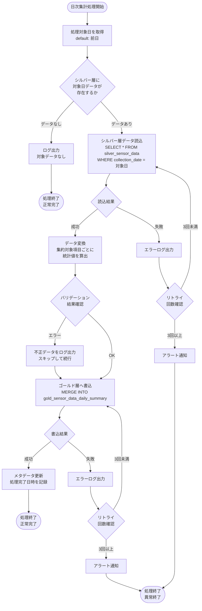
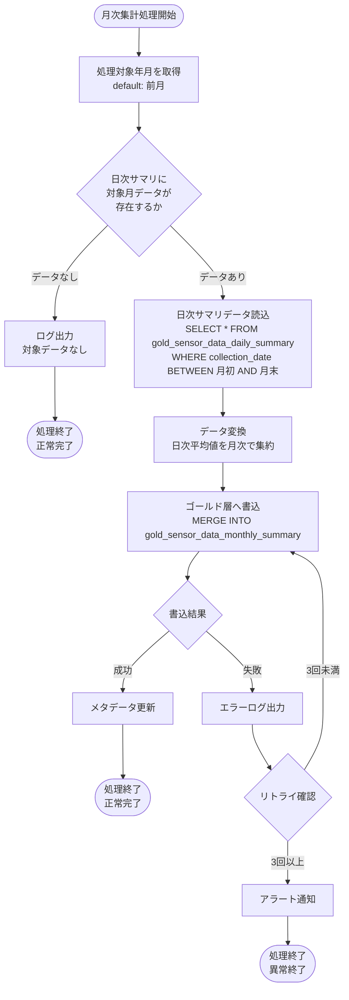
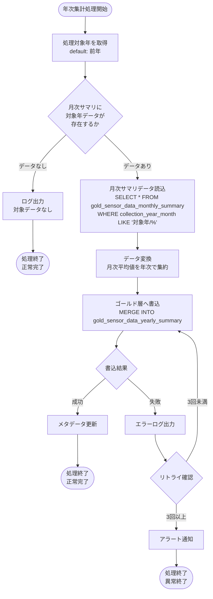
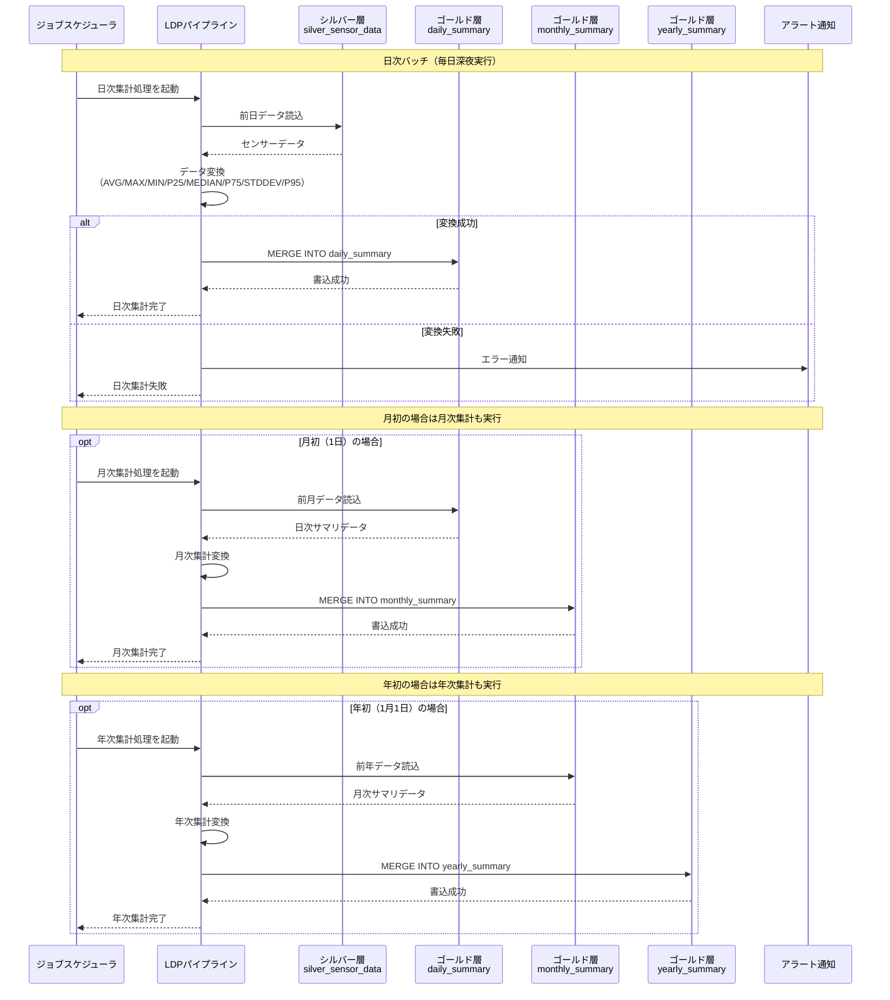

# ゴールド層LDPパイプライン - ワークフロー仕様書

## 📑 目次

- [概要](#概要)
- [処理一覧](#処理一覧)
- [ワークフロー詳細](#ワークフロー詳細)
  - [日次集計処理](#日次集計処理)
  - [月次集計処理](#月次集計処理)
  - [年次集計処理](#年次集計処理)
- [データ変換仕様](#データ変換仕様)
  - [日次集計変換ロジック](#日次集計変換ロジック)
  - [月次集計変換ロジック](#月次集計変換ロジック)
  - [年次集計変換ロジック](#年次集計変換ロジック)
- [シーケンス図](#シーケンス図)
- [エラーハンドリング](#エラーハンドリング)
- [トランザクション管理](#トランザクション管理)
- [パフォーマンス最適化](#パフォーマンス最適化)
- [データ保持・削除ポリシー](#データ保持削除ポリシー)
- [関連ドキュメント](#関連ドキュメント)

---

## 概要

このドキュメントは、ゴールド層LDPパイプラインの処理フロー、データ変換ロジック、エラーハンドリングの詳細を記載します。

**このドキュメントの役割:**
- ✅ 処理フローの詳細（日次・月次・年次集計処理）
- ✅ データ変換ロジック（集約対象項目・集約方法）
- ✅ エラーハンドリングフロー
- ✅ トランザクション管理
- ✅ パフォーマンス最適化

**パイプライン概要:**

| 項目 | 値 |
|------|-----|
| 機能ID | FR-002-2 |
| 機能名 | データ処理（ゴールド層） |
| 処理方式 | インクリメンタル処理 |
| 実行頻度 | 日次バッチ |
| 入力 | シルバー層センサーデータ |
| 出力 | ゴールド層サマリテーブル（日次・月次・年次） |

**注:** テーブル定義・カラム仕様の詳細は [README.md](./README.md) を参照してください。

---

## 処理一覧

| No | 処理名 | 処理タイプ | 入力 | 出力 | 説明 |
|----|--------|-----------|------|------|------|
| 1 | 日次集計処理 | Streaming/Batch | silver_sensor_data | gold_sensor_data_daily_summary | シルバー層データを日次で集計 |
| 2 | 月次集計処理 | Batch | gold_sensor_data_daily_summary | gold_sensor_data_monthly_summary | 日次サマリを月次で集計 |
| 3 | 年次集計処理 | Batch | gold_sensor_data_monthly_summary | gold_sensor_data_yearly_summary | 月次サマリを年次で集計 |

---

## ワークフロー詳細

### 日次集計処理

**トリガー:** 日次バッチスケジュール（深夜実行）またはストリーミング処理

**前提条件:**
- シルバー層テーブル `silver_sensor_data` にデータが存在する
- 対象日の全データがシルバー層に取り込み完了している

#### 処理フロー



#### 処理詳細

**① シルバー層データ読込**

```sql
-- 処理対象日のデータを読込
SELECT
    device_id,
    organization_id,
    collection_timestamp,
    DATE(collection_timestamp) AS collection_date,
    external_temp,
    set_temp_freezer_1,
    internal_sensor_temp_freezer_1,
    internal_temp_freezer_1,
    df_temp_freezer_1,
    condensing_temp_freezer_1,
    adjusted_internal_temp_freezer_1,
    set_temp_freezer_2,
    internal_sensor_temp_freezer_2,
    internal_temp_freezer_2,
    df_temp_freezer_2,
    condensing_temp_freezer_2,
    adjusted_internal_temp_freezer_2,
    compressor_freezer_1,
    compressor_freezer_2,
    fan_motor_1,
    fan_motor_2,
    fan_motor_3,
    fan_motor_4,
    fan_motor_5,
    defrost_heater_output_1,
    defrost_heater_output_2
FROM
    iot_catalog.silver.silver_sensor_data
WHERE
    DATE(collection_timestamp) = :target_date
```

**② 日次集計変換**

各集約対象項目（summary_item）と集約方法（summary_method）の組み合わせごとに統計値を算出します。

```sql
-- 日次集計（summary_method: 1-8）
WITH sensor_unpivot AS (
    -- 横持ちデータを縦持ちに変換
    SELECT
        device_id,
        organization_id,
        collection_date,
        stack(22,
            1, external_temp,
            2, set_temp_freezer_1,
            3, internal_sensor_temp_freezer_1,
            4, internal_temp_freezer_1,
            5, df_temp_freezer_1,
            6, condensing_temp_freezer_1,
            7, adjusted_internal_temp_freezer_1,
            8, set_temp_freezer_2,
            9, internal_sensor_temp_freezer_2,
            10, internal_temp_freezer_2,
            11, df_temp_freezer_2,
            12, condensing_temp_freezer_2,
            13, adjusted_internal_temp_freezer_2,
            14, compressor_freezer_1,
            15, compressor_freezer_2,
            16, fan_motor_1,
            17, fan_motor_2,
            18, fan_motor_3,
            19, fan_motor_4,
            20, fan_motor_5,
            21, defrost_heater_output_1,
            22, defrost_heater_output_2
        ) AS (summary_item, sensor_value)
    FROM silver_data
),
daily_stats AS (
    SELECT
        device_id,
        organization_id,
        collection_date,
        summary_item,
        AVG(sensor_value) AS avg_value,
        MAX(sensor_value) AS max_value,
        MIN(sensor_value) AS min_value,
        PERCENTILE_APPROX(sensor_value, 0.25) AS p25_value,
        PERCENTILE_APPROX(sensor_value, 0.5) AS median_value,
        PERCENTILE_APPROX(sensor_value, 0.75) AS p75_value,
        STDDEV(sensor_value) AS stddev_value,
        PERCENTILE_APPROX(sensor_value, 0.95) AS p95_value,
        COUNT(*) AS data_count
    FROM sensor_unpivot
    WHERE sensor_value IS NOT NULL
    GROUP BY device_id, organization_id, collection_date, summary_item
)
-- 集約方法ごとにレコードを生成
SELECT
    device_id,
    organization_id,
    collection_date,
    summary_item,
    summary_method,
    summary_value,
    data_count,
    CURRENT_TIMESTAMP() AS create_time
FROM daily_stats
CROSS JOIN (
    SELECT stack(8,
        1, avg_value,
        2, max_value,
        3, min_value,
        4, p25_value,
        5, median_value,
        6, p75_value,
        7, stddev_value,
        8, p95_value
    ) AS (summary_method, summary_value)
)
```

**③ ゴールド層へ書込**

```sql
MERGE INTO iot_catalog.gold.gold_sensor_data_daily_summary AS target
USING daily_aggregated AS source
ON target.device_id = source.device_id
   AND target.organization_id = source.organization_id
   AND target.collection_date = source.collection_date
   AND target.summary_item = source.summary_item
   AND target.summary_method = source.summary_method
WHEN MATCHED THEN
    UPDATE SET
        summary_value = source.summary_value,
        data_count = source.data_count,
        create_time = source.create_time
WHEN NOT MATCHED THEN
    INSERT (device_id, organization_id, collection_date, summary_item, summary_method, summary_value, data_count, create_time)
    VALUES (source.device_id, source.organization_id, source.collection_date, source.summary_item, source.summary_method, source.summary_value, source.data_count, source.create_time)
```

#### バリデーション

| 項目 | ルール | エラー時の処理 |
|------|--------|---------------|
| device_id | NOT NULL | 該当レコードをスキップ、ログ出力 |
| organization_id | NOT NULL | 該当レコードをスキップ、ログ出力 |
| collection_date | 有効な日付 | 該当レコードをスキップ、ログ出力 |
| summary_item | 1〜22の範囲 | 該当レコードをスキップ、ログ出力 |
| summary_value | 数値型 | NULL値を許容（データ欠損として記録） |

---

### 月次集計処理

**トリガー:** 月初バッチスケジュール（毎月1日深夜実行）

**前提条件:**
- 日次サマリテーブル `gold_sensor_data_daily_summary` に前月のデータが存在する

#### 処理フロー



#### 処理詳細

**① 日次サマリデータ読込**

```sql
-- 対象月の日次平均値（summary_method = 1: AVG_DAY）を読込
SELECT
    device_id,
    organization_id,
    DATE_FORMAT(collection_date, 'yyyy/MM') AS collection_year_month,
    summary_item,
    summary_value AS daily_avg_value,
    data_count
FROM
    iot_catalog.gold.gold_sensor_data_daily_summary
WHERE
    collection_date BETWEEN :month_start AND :month_end
    AND summary_method = 1  -- AVG_DAY のみ対象
```

**② 月次集計変換**

```sql
-- 月次集計（summary_method: 9-12）
WITH monthly_stats AS (
    SELECT
        device_id,
        organization_id,
        collection_year_month,
        summary_item,
        AVG(daily_avg_value) AS avg_month,           -- 日次平均の月間平均
        MAX(daily_avg_value) AS max_month,           -- 月間最大値
        MIN(daily_avg_value) AS min_month,           -- 月間最小値
        STDDEV(daily_avg_value) AS stddev_month,     -- 日間平均の標準偏差
        SUM(data_count) AS total_data_count
    FROM daily_data
    GROUP BY device_id, organization_id, collection_year_month, summary_item
)
SELECT
    device_id,
    organization_id,
    collection_year_month,
    summary_item,
    summary_method,
    summary_value,
    total_data_count AS data_count,
    CURRENT_TIMESTAMP() AS create_time
FROM monthly_stats
CROSS JOIN (
    SELECT stack(4,
        9, avg_month,
        10, max_month,
        11, min_month,
        12, stddev_month
    ) AS (summary_method, summary_value)
)
```

**③ ゴールド層へ書込**

```sql
MERGE INTO iot_catalog.gold.gold_sensor_data_monthly_summary AS target
USING monthly_aggregated AS source
ON target.device_id = source.device_id
   AND target.organization_id = source.organization_id
   AND target.collection_year_month = source.collection_year_month
   AND target.summary_item = source.summary_item
   AND target.summary_method = source.summary_method
WHEN MATCHED THEN
    UPDATE SET
        summary_value = source.summary_value,
        data_count = source.data_count,
        create_time = source.create_time
WHEN NOT MATCHED THEN
    INSERT (device_id, organization_id, collection_year_month, summary_item, summary_method, summary_value, data_count, create_time)
    VALUES (source.device_id, source.organization_id, source.collection_year_month, source.summary_item, source.summary_method, source.summary_value, source.data_count, source.create_time)
```

---

### 年次集計処理

**トリガー:** 年初バッチスケジュール（毎年1月1日深夜実行）

**前提条件:**
- 月次サマリテーブル `gold_sensor_data_monthly_summary` に前年のデータが存在する

#### 処理フロー



#### 処理詳細

**① 月次サマリデータ読込**

```sql
-- 対象年の月次平均値（summary_method = 9: AVG_MONTH）を読込
SELECT
    device_id,
    organization_id,
    YEAR(TO_DATE(collection_year_month, 'yyyy/MM')) AS collection_year,
    summary_item,
    summary_value AS monthly_avg_value,
    data_count
FROM
    iot_catalog.gold.gold_sensor_data_monthly_summary
WHERE
    collection_year_month LIKE :target_year || '/%'
    AND summary_method = 9  -- AVG_MONTH のみ対象
```

**② 年次集計変換**

```sql
-- 年次集計（summary_method: 13-16）
WITH yearly_stats AS (
    SELECT
        device_id,
        organization_id,
        collection_year,
        summary_item,
        AVG(monthly_avg_value) AS avg_year,          -- 月次平均の年間平均
        MAX(monthly_avg_value) AS max_year,          -- 年間最大値
        MIN(monthly_avg_value) AS min_year,          -- 年間最小値
        STDDEV(monthly_avg_value) AS stddev_year,    -- 月間平均の標準偏差
        SUM(data_count) AS total_data_count
    FROM monthly_data
    GROUP BY device_id, organization_id, collection_year, summary_item
)
SELECT
    device_id,
    organization_id,
    collection_year,
    summary_item,
    summary_method,
    summary_value,
    total_data_count AS data_count,
    CURRENT_TIMESTAMP() AS create_time
FROM yearly_stats
CROSS JOIN (
    SELECT stack(4,
        13, avg_year,
        14, max_year,
        15, min_year,
        16, stddev_year
    ) AS (summary_method, summary_value)
)
```

**③ ゴールド層へ書込**

```sql
MERGE INTO iot_catalog.gold.gold_sensor_data_yearly_summary AS target
USING yearly_aggregated AS source
ON target.device_id = source.device_id
   AND target.organization_id = source.organization_id
   AND target.collection_year = source.collection_year
   AND target.summary_item = source.summary_item
   AND target.summary_method = source.summary_method
WHEN MATCHED THEN
    UPDATE SET
        summary_value = source.summary_value,
        data_count = source.data_count,
        create_time = source.create_time
WHEN NOT MATCHED THEN
    INSERT (device_id, organization_id, collection_year, summary_item, summary_method, summary_value, data_count, create_time)
    VALUES (source.device_id, source.organization_id, source.collection_year, source.summary_item, source.summary_method, source.summary_value, source.data_count, source.create_time)
```

---

## データ変換仕様

### 日次集計変換ロジック

| summary_method | 集約方法 | 計算ロジック | 説明 |
|----------------|---------|-------------|------|
| 1 | AVG_DAY | `AVG(sensor_value)` | 1日のセンサー値の平均 |
| 2 | MAX_DAY | `MAX(sensor_value)` | 1日のセンサー値の最大値 |
| 3 | MIN_DAY | `MIN(sensor_value)` | 1日のセンサー値の最小値 |
| 4 | P25 | `PERCENTILE_APPROX(sensor_value, 0.25)` | 第1四分位数（下位25%値） |
| 5 | MEDIAN | `PERCENTILE_APPROX(sensor_value, 0.5)` | 中央値（50%値） |
| 6 | P75 | `PERCENTILE_APPROX(sensor_value, 0.75)` | 第3四分位数（上位25%値） |
| 7 | STDDEV | `STDDEV(sensor_value)` | 標準偏差 |
| 8 | P95 | `PERCENTILE_APPROX(sensor_value, 0.95)` | 上側5%値（95パーセンタイル） |

### 月次集計変換ロジック

| summary_method | 集約方法 | 入力データ | 計算ロジック | 説明 |
|----------------|---------|-----------|-------------|------|
| 9 | AVG_MONTH | 日次AVG_DAY | `AVG(daily_avg)` | 日次平均値の月間平均 |
| 10 | MAX_MONTH | 日次AVG_DAY | `MAX(daily_avg)` | 日次平均値の月間最大値 |
| 11 | MIN_MONTH | 日次AVG_DAY | `MIN(daily_avg)` | 日次平均値の月間最小値 |
| 12 | STDDEV_MONTH | 日次AVG_DAY | `STDDEV(daily_avg)` | 日次平均値の標準偏差 |

### 年次集計変換ロジック

| summary_method | 集約方法 | 入力データ | 計算ロジック | 説明 |
|----------------|---------|-----------|-------------|------|
| 13 | AVG_YEAR | 月次AVG_MONTH | `AVG(monthly_avg)` | 月次平均値の年間平均 |
| 14 | MAX_YEAR | 月次AVG_MONTH | `MAX(monthly_avg)` | 月次平均値の年間最大値 |
| 15 | MIN_YEAR | 月次AVG_MONTH | `MIN(monthly_avg)` | 月次平均値の年間最小値 |
| 16 | STDDEV_YEAR | 月次AVG_MONTH | `STDDEV(monthly_avg)` | 月次平均値の標準偏差 |

---

## シーケンス図

### 日次バッチ処理全体フロー



---

## エラーハンドリング

### エラー分類とハンドリング

| エラー種別 | 発生箇所 | 検出方法 | 処理内容 | リトライ | アラート |
|-----------|---------|---------|---------|---------|---------|
| データ読込エラー | シルバー層読込 | 例外キャッチ | リトライ後にアラート | ✓（3回） | ✓ |
| 変換エラー（データ欠損） | 集計処理 | NULL値検出 | 該当レコードをスキップ、ログ出力 | × | × |
| 変換エラー（型不正） | 集計処理 | 型変換失敗 | 該当レコードをスキップ、ログ出力 | × | △（大量発生時） |
| 書込エラー | ゴールド層書込 | 例外キャッチ | リトライ後にアラート | ✓（3回） | ✓ |
| タイムアウト | 全処理 | 処理時間監視 | 処理中断、アラート | × | ✓ |

### エラーメッセージ一覧

| エラーコード | メッセージ | 発生条件 | 対処方法 |
|-------------|-----------|---------|---------|
| GOLD_ERR_001 | シルバー層からのデータ読込に失敗しました | シルバー層テーブルへのアクセス失敗 | シルバー層の状態を確認 |
| GOLD_ERR_002 | データ変換中にエラーが発生しました | 変換処理の例外 | 入力データの品質を確認 |
| GOLD_ERR_003 | ゴールド層への書込に失敗しました | ゴールド層テーブルへの書込失敗 | ゴールド層の状態を確認 |
| GOLD_ERR_004 | 処理がタイムアウトしました | 1時間以内に完了しなかった | データ量・クラスタ構成を確認 |
| GOLD_WARN_001 | 対象期間のデータが存在しません | 入力データなし | 正常終了（警告ログのみ） |
| GOLD_WARN_002 | 一部レコードの変換をスキップしました | 変換不可データあり | スキップされたデータを確認 |

### 例外処理実装例（Python）

```python
import dlt
from pyspark.sql import SparkSession
from pyspark.sql.functions import *
from pyspark.sql.types import *
import logging

logger = logging.getLogger(__name__)

@dlt.table(
    name="gold_sensor_data_daily_summary",
    comment="日次センサーデータサマリ",
    table_properties={
        "quality": "gold",
        "pipelines.autoOptimize.managed": "true"
    }
)
@dlt.expect_all({
    "valid_device_id": "device_id IS NOT NULL",
    "valid_organization_id": "organization_id IS NOT NULL",
    "valid_collection_date": "collection_date IS NOT NULL",
    "valid_summary_item": "summary_item BETWEEN 1 AND 22",
    "valid_summary_method": "summary_method BETWEEN 1 AND 8"
})
def gold_sensor_data_daily_summary():
    """日次集計処理"""
    try:
        # シルバー層からデータ読込
        silver_df = dlt.read("silver_sensor_data")

        # 対象日のデータをフィルタ
        target_date = date_sub(current_date(), 1)
        daily_data = silver_df.filter(
            to_date(col("collection_timestamp")) == target_date
        )

        # データが存在しない場合
        if daily_data.isEmpty():
            logger.warning("GOLD_WARN_001: 対象期間のデータが存在しません")
            return spark.createDataFrame([], schema)

        # 集計処理
        aggregated = perform_daily_aggregation(daily_data)

        logger.info(f"日次集計完了: {aggregated.count()} レコード")
        return aggregated

    except Exception as e:
        logger.error(f"GOLD_ERR_002: データ変換中にエラーが発生しました: {str(e)}")
        raise
```

---

## トランザクション管理

### トランザクション方針

| 処理 | トランザクション範囲 | コミットタイミング | ロールバック条件 |
|------|---------------------|-------------------|-----------------|
| 日次集計 | 1日分のデータ単位 | 全レコード書込完了後 | 書込エラー発生時 |
| 月次集計 | 1か月分のデータ単位 | 全レコード書込完了後 | 書込エラー発生時 |
| 年次集計 | 1年分のデータ単位 | 全レコード書込完了後 | 書込エラー発生時 |

### Delta Lakeトランザクション保証

- **ACID保証**: Delta Lakeのトランザクションログによりデータ整合性を保証
- **タイムトラベル**: 過去のバージョンへのロールバックが可能（7日間）
- **オプティミスティック同時実行制御**: 複数のジョブが同時実行された場合の整合性保証

### MERGE処理の冪等性

```sql
-- MERGE文による冪等性の確保
-- 同じデータで再実行しても結果が変わらない
MERGE INTO gold_sensor_data_daily_summary AS target
USING aggregated_data AS source
ON target.device_id = source.device_id
   AND target.organization_id = source.organization_id
   AND target.collection_date = source.collection_date
   AND target.summary_item = source.summary_item
   AND target.summary_method = source.summary_method
WHEN MATCHED THEN UPDATE SET *
WHEN NOT MATCHED THEN INSERT *
```

---

## パフォーマンス最適化

### パフォーマンス要件

| 要件 | 値 | 対応策 |
|------|-----|-------|
| 処理時間 | 日次バッチ完了まで1時間以内 | インクリメンタル処理、クラスタ最適化 |
| スループット | 10,000デバイス × 1分間隔 | 水平スケーリング、パーティション最適化 |
| データ量 | 10GB/日 | Liquid Clustering、Z-Ordering |

### クラスタリング戦略

各テーブルに対して、クエリパターンに応じたクラスタリングキーを設定します。

```sql
-- 日次サマリ：日付とデバイスIDでの検索が多い
ALTER TABLE gold_sensor_data_daily_summary
CLUSTER BY (collection_date, device_id);

-- 月次サマリ：年月とデバイスIDでの検索が多い
ALTER TABLE gold_sensor_data_monthly_summary
CLUSTER BY (collection_year_month, device_id);

-- 年次サマリ：年とデバイスIDでの検索が多い
ALTER TABLE gold_sensor_data_yearly_summary
CLUSTER BY (collection_year, device_id);
```

### インクリメンタル処理

- **日次集計**: 前日のデータのみを処理（フルスキャン不要）
- **月次集計**: 前月のデータのみを処理
- **年次集計**: 前年のデータのみを処理

```python
# インクリメンタル処理の実装例
@dlt.table(
    name="gold_sensor_data_daily_summary"
)
def gold_sensor_data_daily_summary():
    # 前日のデータのみを対象
    target_date = date_sub(current_date(), 1)

    return (
        dlt.read_stream("silver_sensor_data")
        .filter(to_date(col("collection_timestamp")) == target_date)
        .transform(perform_daily_aggregation)
    )
```

### 並列処理最適化

```python
# Spark設定の最適化
spark.conf.set("spark.sql.shuffle.partitions", "200")
spark.conf.set("spark.sql.adaptive.enabled", "true")
spark.conf.set("spark.sql.adaptive.coalescePartitions.enabled", "true")
spark.conf.set("spark.sql.adaptive.skewJoin.enabled", "true")
```

---

## データ保持・削除ポリシー

### 保持期間

| テーブル | 保持期間 | タイムトラベル | 削除方式 |
|---------|---------|---------------|---------|
| gold_sensor_data_daily_summary | 5年間 | 7日間 | DELETE + VACUUM |
| gold_sensor_data_monthly_summary | 5年間 | 7日間 | DELETE + VACUUM |
| gold_sensor_data_yearly_summary | 5年間 | 7日間 | DELETE + VACUUM |

### 削除処理

```sql
-- 5年以上前のデータを削除（日次サマリ）
DELETE FROM iot_catalog.gold.gold_sensor_data_daily_summary
WHERE collection_date < DATE_SUB(CURRENT_DATE(), 1825);

-- 削除後のVACUUM処理（7日以上前の履歴を物理削除）
VACUUM iot_catalog.gold.gold_sensor_data_daily_summary
RETAIN 168 HOURS;  -- 7日間
```

### 削除スケジュール

| 処理 | 実行頻度 | 実行時間 |
|------|---------|---------|
| 日次サマリ削除 | 月次（毎月1日） | 深夜（集計処理後） |
| 月次サマリ削除 | 年次（毎年1月1日） | 深夜（集計処理後） |
| 年次サマリ削除 | 年次（毎年1月1日） | 深夜（集計処理後） |
| VACUUM処理 | 週次（毎週日曜） | 深夜 |

---

## 関連ドキュメント

### 機能仕様

- [機能概要 README](./README.md) - テーブル定義・集約項目・集約方法の詳細

### 関連パイプライン

- [Silver Layer README](../silver-layer/README.md) - 入力データ元のシルバー層仕様

### 要件定義

- [機能要件定義書](../../../02-requirements/functional-requirements.md) - FR-002
- [非機能要件定義書](../../../02-requirements/non-functional-requirements.md) - NFR-PERF, NFR-SCALE
- [技術要件定義書](../../../02-requirements/technical-requirements.md) - TR-DB-001, TR-DB-002

### 共通仕様

- [共通仕様書](../../common/common-specification.md) - エラーコード、トランザクション管理、セキュリティ等

---

## 変更履歴

| 日付 | 版数 | 変更内容 | 担当者 |
|------|------|---------|--------|
| 2026-01-26 | 1.0 | 初版作成 | Claude |
| 2026-01-27 | 2.0 | README.mdの仕様に合わせて全面改訂（日次・月次・年次サマリ構成に変更） | Claude |
