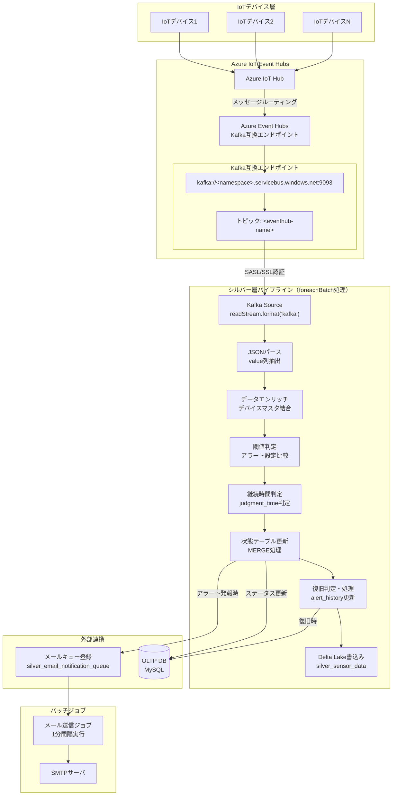
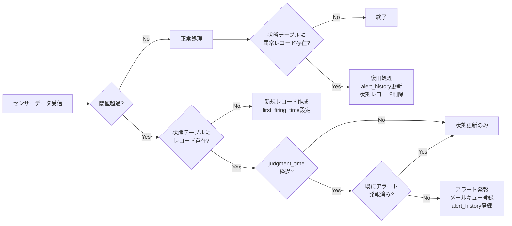

# シルバー層LDPパイプライン

## 概要

シルバー層LDPパイプラインは、Azure Event Hubs（Kafka互換エンドポイント）からIoTデバイスのテレメトリデータをストリーミング取得し、構造化してDelta Lakeテーブルに格納するパイプラインです。

### 主な責務

1. **データ取込み**: Kafka互換エンドポイントからテレメトリデータをストリーミング取得
2. **データ構造化**: JSON形式のセンサーデータをパースし、構造化スキーマに変換
3. **異常検出**: アラート設定マスタの閾値に基づく異常値検出（継続時間判定含む）
4. **状態管理**: 異常状態テーブル（`silver_alert_abnormal_state`）によるアラート状態追跡
5. **メールキュー登録**: 異常検出時のメール送信キューへの登録（実送信は別バッチ）
6. **外部DB更新**: デバイスステータス・アラート履歴のOLTP DB更新

---

## 機能ID

| 機能ID   | 機能名                   | 説明                                                   |
| -------- | ------------------------ | ------------------------------------------------------ |
| FR-002-2 | データ処理（シルバー層） | Event Hubsからのデータ取込み、構造化、Delta Lake格納   |
| FR-003-1 | 異常検出                 | センサー値の閾値比較・継続時間判定によるアラート判定   |
| FR-003-2 | アラート通知             | 異常検出時のメール送信キュー登録（バッチジョブで送信） |
| FR-003-3 | 履歴記録                 | デバイスステータス・アラート履歴の更新                 |

---

## データモデル

### 入力データ

| データソース                      | 形式                  | 説明                                                                                      |
| --------------------------------- | --------------------- | ----------------------------------------------------------------------------------------- |
| Azure Event Hubs (Kafka Endpoint) | Binary / JSON (UTF-8) | IoTデバイスから送信されるテレメトリデータをKafka互換APIで取得。Databricksでデコード処理。 |

### 出力テーブル（Unity Catalog）

| テーブル名                      | スキーマ           | 説明                               |
| ------------------------------- | ------------------ | ---------------------------------- |
| silver_sensor_data              | iot_catalog.silver | 構造化されたセンサーデータ         |
| silver_alert_abnormal_state     | iot_catalog.silver | アラート異常状態（継続時間判定用） |
| silver_email_notification_queue | iot_catalog.silver | メール送信キュー                   |

### センサーデータカラム一覧

| #   | カラム物理名                     | カラム論理名             | データ型  | NULL     | 説明                                                                 |
| --- | -------------------------------- | ------------------------ | --------- | -------- | -------------------------------------------------------------------- |
| 1   | device_id                        | デバイスID               | INT       | NOT NULL | システム内でのIoTデバイスの一意識別子                                |
| 2   | organization_id                  | 組織ID                   | INT       | NOT NULL | 所属組織ID                                                           |
| 3   | event_timestamp                  | イベント発生日時         | TIMESTAMP | NOT NULL | センサーがデータを取得した日時（ダッシュボード内グラフ横軸表示項目） |
| 4   | event_date                       | イベント発生日           | DATE      | NOT NULL | センサーがデータを取得した日（クラスタリングキー）                   |
| 5   | external_temp                    | 外気温度                 | DOUBLE    | NULL     | 冷蔵冷凍庫の外気温度[℃]（ダッシュボード内グラフ縦軸表示項目）        |
| 6   | set_temp_freezer_1               | 第1冷凍 設定温度         | DOUBLE    | NULL     | 第1冷凍庫の設定温度[℃]（ダッシュボード内グラフ縦軸表示項目）         |
| 7   | internal_sensor_temp_freezer_1   | 第1冷凍 庫内センサー温度 | DOUBLE    | NULL     | 第1冷凍庫の庫内センサー温度[℃]（ダッシュボード内グラフ縦軸表示項目） |
| 8   | internal_temp_freezer_1          | 第1冷凍 庫内温度         | DOUBLE    | NULL     | 第1冷凍庫の庫内温度[℃]（ダッシュボード内グラフ縦軸表示項目）         |
| 9   | df_temp_freezer_1                | 第1冷凍 DF温度           | DOUBLE    | NULL     | 第1冷凍庫のDF温度[℃]（ダッシュボード内グラフ縦軸表示項目）           |
| 10  | condensing_temp_freezer_1        | 第1冷凍 凝縮温度         | DOUBLE    | NULL     | 第1冷凍庫の凝縮温度[℃]（ダッシュボード内グラフ縦軸表示項目）         |
| 11  | adjusted_internal_temp_freezer_1 | 第1冷凍 微調整後庫内温度 | DOUBLE    | NULL     | 第1冷凍庫の微調整後庫内温度[℃]（ダッシュボード内グラフ縦軸表示項目） |
| 12  | set_temp_freezer_2               | 第2冷凍 設定温度         | DOUBLE    | NULL     | 第2冷凍庫の設定温度[℃]（ダッシュボード内グラフ縦軸表示項目）         |
| 13  | internal_sensor_temp_freezer_2   | 第2冷凍 庫内センサー温度 | DOUBLE    | NULL     | 第2冷凍庫の庫内センサー温度[℃]（ダッシュボード内グラフ縦軸表示項目） |
| 14  | internal_temp_freezer_2          | 第2冷凍 庫内温度         | DOUBLE    | NULL     | 第2冷凍庫の庫内温度[℃]（ダッシュボード内グラフ縦軸表示項目）         |
| 15  | df_temp_freezer_2                | 第2冷凍 DF温度           | DOUBLE    | NULL     | 第2冷凍庫のDF温度[℃]（ダッシュボード内グラフ縦軸表示項目）           |
| 16  | condensing_temp_freezer_2        | 第2冷凍 凝縮温度         | DOUBLE    | NULL     | 第2冷凍庫の凝縮温度[℃]（ダッシュボード内グラフ縦軸表示項目）         |
| 17  | adjusted_internal_temp_freezer_2 | 第2冷凍 微調整後庫内温度 | DOUBLE    | NULL     | 第2冷凍庫の微調整後庫内温度[℃]（ダッシュボード内グラフ縦軸表示項目） |
| 18  | compressor_freezer_1             | 第1冷凍 圧縮機           | DOUBLE    | NULL     | 第1冷凍庫の圧縮機の回転数[rpm]（ダッシュボード内グラフ縦軸表示項目） |
| 19  | compressor_freezer_2             | 第2冷凍 圧縮機           | DOUBLE    | NULL     | 第2冷凍庫の圧縮機の回転数[rpm]（ダッシュボード内グラフ縦軸表示項目） |
| 20  | fan_motor_1                      | 第1ファンモータ回転数    | DOUBLE    | NULL     | 第1ファンモータの回転数[rpm]（ダッシュボード内グラフ縦軸表示項目）   |
| 21  | fan_motor_2                      | 第2ファンモータ回転数    | DOUBLE    | NULL     | 第2ファンモータの回転数[rpm]（ダッシュボード内グラフ縦軸表示項目）   |
| 22  | fan_motor_3                      | 第3ファンモータ回転数    | DOUBLE    | NULL     | 第3ファンモータの回転数[rpm]（ダッシュボード内グラフ縦軸表示項目）   |
| 23  | fan_motor_4                      | 第4ファンモータ回転数    | DOUBLE    | NULL     | 第4ファンモータの回転数[rpm]（ダッシュボード内グラフ縦軸表示項目）   |
| 24  | fan_motor_5                      | 第5ファンモータ回転数    | DOUBLE    | NULL     | 第5ファンモータの回転数[rpm]（ダッシュボード内グラフ縦軸表示項目）   |
| 25  | defrost_heater_output_1          | 防露ヒータ出力(1)        | DOUBLE    | NULL     | 防露ヒータ(1)の出力[％]（ダッシュボード内グラフ縦軸表示項目）        |
| 26  | defrost_heater_output_2          | 防露ヒータ出力(2)        | DOUBLE    | NULL     | 防露ヒータ(2)の出力[％]（ダッシュボード内グラフ縦軸表示項目）        |
| 27  | sensor_data_json                 | センサーデータ本体       | VARIANT   | NOT NULL | 構造化以前のJSON形式のセンサーデータ                                 |
| 28  | create_time                      | 作成日時                 | TIMESTAMP | NOT NULL | レコード作成日時                                                     |

### クラスタリングキー

```sql
CLUSTER BY (event_date, device_id)
```

---

## 使用テーブル一覧

### 読み取りテーブル（Unity Catalog）

| テーブル名                  | 用途                                     |
| --------------------------- | ---------------------------------------- |
| device_master               | デバイス情報・組織ID取得                 |
| organization_closure        | 組織階層情報取得                         |
| organization_master         | アラートメール通知先と紐づく組織IDを取得 |
| user_master                 | アラートメール通知先取得                 |
| silver_alert_abnormal_state | アラート継続状態の参照・更新             |

センサーデータはAzure Event HubsからKafka互換エンドポイント経由で取得する。

### 書き込みテーブル（Unity Catalog）

| カタログ    | スキーマ | テーブル名                      | 用途                         |
| ----------- | -------- | ------------------------------- | ---------------------------- |
| iot_catalog | silver   | silver_sensor_data              | シルバー層センサーデータ格納 |
| iot_catalog | silver   | silver_alert_abnormal_state     | アラート異常状態管理         |
| iot_catalog | silver   | silver_email_notification_queue | メール送信キュー             |

### 読み取りテーブル（OLTP DB）

| テーブル名              | 用途                   |
| ----------------------- | ---------------------- |
| alert_setting_master    | アラート閾値設定取得   |
| measurement_item_master | 測定項目取得           |
| alert_level_master      | アラートレベル取得     |
| alert_status_master     | アラートステータス取得 |


### 書き込みテーブル（OLTP DB）

| テーブル名         | 用途                       |
| ------------------ | -------------------------- |
| device_status_data | デバイス最新ステータス更新 |
| alert_history      | アラート履歴記録           |

---

## 処理フロー



### アラート判定フロー



---

## パフォーマンス要件

| 要件         | 値                        | 対応策                                             |
| ------------ | ------------------------- | -------------------------------------------------- |
| 処理時間     | Event Hubs受信から1分以内 | ストリーミング処理、foreachBatch（10秒間隔）で実行 |
| スループット | 10,000デバイス × 1分間隔  | 水平スケーリング、最適クラスタ構成                 |
| データ量     | 10GB/日                   | Delta Lake圧縮、Liquid Clustering                  |

---

## データ保持ポリシー

| 項目           | 値              |
| -------------- | --------------- |
| 保持期間       | 5年間           |
| タイムトラベル | 7日間           |
| 削除方式       | DELETE + VACUUM |

---

## 関連ドキュメント

### 機能仕様

- [LDPパイプライン仕様書](./ldp-pipeline-specification.md) - 処理フロー・データ変換・エラーハンドリング詳細
- [バッチジョブ仕様書](./batch-job-specification.md) - メール送信・クリーンアップ・メンテナンスジョブ

### 要件定義

- [機能要件定義書](../../02-requirements/functional-requirements.md) - FR-002, FR-003
- [非機能要件定義書](../../02-requirements/non-functional-requirements.md) - NFR-PERF, NFR-AVAIL
- [技術要件定義書](../../02-requirements/technical-requirements.md) - TR-DB-001, TR-DB-002

### データベース設計

- [Unity Catalogデータベース設計書](../common/unity-catalog-database-specification.md) - テーブル定義・DDL
- [アプリケーションデータベース設計書](../common/app-database-specification.md) - OLTP DBテーブル定義

### 共通仕様

- [共通仕様書](../common/common-specification.md) - エラーコード、トランザクション管理

---


## 変更履歴

| 日付       | 版数 | 変更内容           | 担当者       |
| ---------- | ---- | ------------------ | ------------ |
| 2026-01-19 | 1.0  | 初版作成           | Kei Sugiyama |
| 2026-01-26 | 1.1  | AIレビュー指摘修正 | Kei Sugiyama |