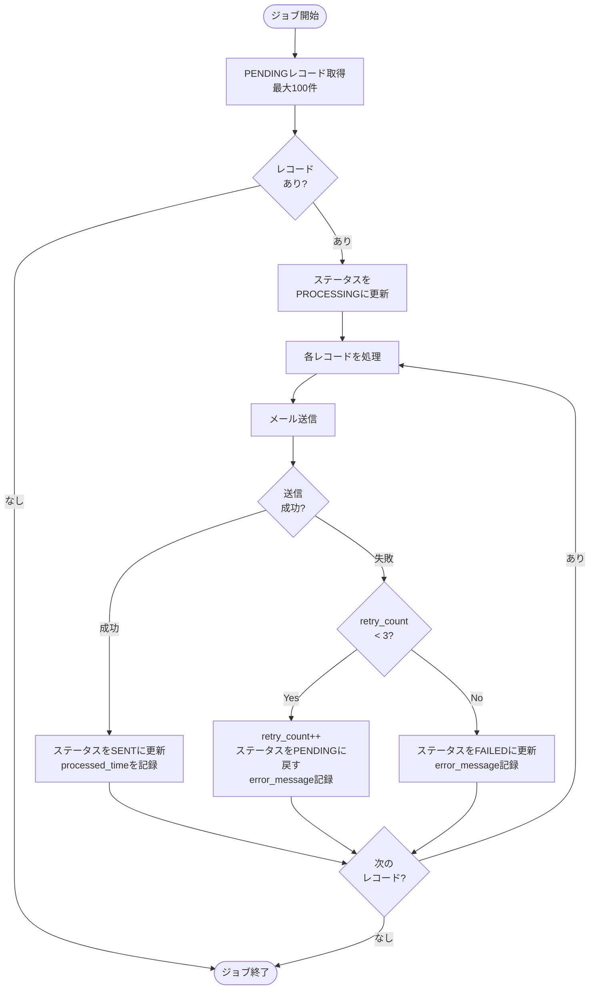

# バッチジョブ仕様書

## 目次

- [バッチジョブ仕様書](#バッチジョブ仕様書)
  - [目次](#目次)
  - [概要](#概要)
    - [このドキュメントの役割](#このドキュメントの役割)
    - [対象機能](#対象機能)
    - [ジョブ一覧](#ジョブ一覧)
  - [メール送信バッチジョブ仕様](#メール送信バッチジョブ仕様)
    - [ジョブ概要](#ジョブ概要)
    - [処理フロー](#処理フロー)
    - [バッチ処理コード](#バッチ処理コード)
    - [リトライ戦略](#リトライ戦略)
  - [キュークリーンアップジョブ仕様](#キュークリーンアップジョブ仕様)
    - [ジョブ概要](#ジョブ概要-1)
    - [処理コード](#処理コード)
    - [クリーンアップ設定](#クリーンアップ設定)
  - [Delta Lakeメンテナンスジョブ仕様](#delta-lakeメンテナンスジョブ仕様)
    - [日次OPTIMIZEジョブ](#日次optimizeジョブ)
      - [ジョブ概要](#ジョブ概要-2)
      - [処理コード](#処理コード-1)
      - [OPTIMIZE設定](#optimize設定)
    - [週次VACUUMジョブ](#週次vacuumジョブ)
      - [ジョブ概要](#ジョブ概要-3)
      - [処理コード](#処理コード-2)
      - [VACUUM設定](#vacuum設定)
    - [チェックポイントクリーンアップジョブ](#チェックポイントクリーンアップジョブ)
      - [ジョブ概要](#ジョブ概要-4)
      - [処理コード](#処理コード-3)
      - [クリーンアップ設定](#クリーンアップ設定-1)
  - [関連ドキュメント](#関連ドキュメント)
  - [変更履歴](#変更履歴)

---

## 概要

このドキュメントは、Databricks Workflowとして実装するバッチ機能の詳細を記載します。

### このドキュメントの役割

- アラート通知処理（メール送信バッチジョブ）
- データクリーンアップ処理（キュークリーンアップジョブ）
- Delta Lakeメンテナンス処理（OPTIMIZE、VACUUM、チェックポイントクリーンアップ）

### 対象機能

| 機能ID   | 機能名             | 処理内容                           |
| -------- | ------------------ | ---------------------------------- |
| FR-003-2 | アラート通知       | メール送信キューからのメール送信   |
| OP-001   | データメンテナンス | Delta Lakeテーブルの最適化・圧縮   |
| OP-002   | クリーンアップ     | 古いデータ・チェックポイントの削除 |

### ジョブ一覧

| ジョブ名                  | 実行間隔           | 説明                                    |
| ------------------------- | ------------------ | --------------------------------------- |
| email_notification_sender | 1分間隔            | メール送信キューからメールを送信        |
| email_queue_cleanup       | 日次（03:00）      | 30日経過した送信済み/失敗レコードを削除 |
| silver_table_optimize     | 日次（02:00）      | Silver層テーブルのOPTIMIZE実行          |
| silver_table_vacuum       | 週次（日曜 04:00） | Silver層テーブルのVACUUM実行            |
| checkpoint_cleanup        | 週次（日曜 05:00） | 古いチェックポイントファイルの削除      |

---

## メール送信バッチジョブ仕様

### ジョブ概要

| 項目             | 設定値                                        |
| ---------------- | --------------------------------------------- |
| ジョブ名         | email_notification_sender                     |
| 実行方式         | Databricks Workflow                           |
| 実行間隔         | 1分間隔（cron: `* * * * *`）                  |
| クラスタ         | Jobs Compute（サーバーレス推奨）              |
| タイムアウト     | 5分                                           |
| リトライポリシー | 失敗時、ジッター付き指数バックオフを設けて再実行 |

### 処理フロー



### バッチ処理コード

```python
import smtplib
from email.mime.text import MIMEText
from email.mime.multipart import MIMEMultipart
from datetime import datetime
import time
import random

# =============================================================================
# 定数定義
# =============================================================================
MAX_BATCH_SIZE = 100
MAX_RETRY_COUNT = 3
RETRY_INTERVALS = [random.uniform(10, 12), random.uniform(10, 14), random.uniform(10, 18)]  # ジッター付き指数バックオフ（秒）

# =============================================================================
# SMTP設定取得
# =============================================================================
SMTP_CONFIG = {
    "host": dbutils.secrets.get("scope", "smtp-host"),
    "port": int(dbutils.secrets.get("scope", "smtp-port")),
    "user": dbutils.secrets.get("scope", "smtp-user"),
    "password": dbutils.secrets.get("scope", "smtp-password"),
    "from_address": "noreply@iot-system.example.com"
}

def send_email(recipient: str, subject: str, body: str) -> tuple[bool, str]:
    """
    メール送信を実行

    Returns:
        tuple[bool, str]: (成功フラグ, エラーメッセージ)
    """
    try:
        msg = MIMEMultipart()
        msg["Subject"] = subject
        msg["From"] = SMTP_CONFIG["from_address"]
        msg["To"] = recipient
        msg.attach(MIMEText(body, "plain", "utf-8"))

        with smtplib.SMTP(SMTP_CONFIG["host"], SMTP_CONFIG["port"], timeout=30) as server:
            server.starttls()
            server.login(SMTP_CONFIG["user"], SMTP_CONFIG["password"])
            server.send_message(msg)

        return True, None

    except smtplib.SMTPException as e:
        return False, f"SMTP Error: {str(e)}"
    except Exception as e:
        return False, f"Unexpected Error: {str(e)}"


def cleanup_stale_processing_records():
    """
    PROCESSING状態のまま15分経過したレコードを削除する。
    ジョブ異常終了時のリカバリ処理として実行。
    """
    from delta.tables import DeltaTable
    from pyspark.sql import functions as F

    STALE_THRESHOLD_MINUTES = 15

    queue_table = DeltaTable.forName(spark, "iot_catalog.silver.silver_email_notification_queue")

    # 削除対象件数を確認
    stale_count = spark.sql(f"""
        SELECT COUNT(*) as cnt
        FROM iot_catalog.silver.silver_email_notification_queue
        WHERE status = 'PROCESSING'
          AND update_time < DATEADD(MINUTE, -{STALE_THRESHOLD_MINUTES}, CURRENT_TIMESTAMP())
    """).first()["cnt"]

    if stale_count > 0:
        print(f"PROCESSING状態で{STALE_THRESHOLD_MINUTES}分経過したレコード: {stale_count}件を削除します")

        # 削除実行
        queue_table.delete(
            condition=(F.col("status") == "PROCESSING") &
                      (F.col("update_time") < F.expr(f"DATEADD(MINUTE, -{STALE_THRESHOLD_MINUTES}, CURRENT_TIMESTAMP())"))
        )
        print(f"削除完了: {stale_count}件")
    else:
        print("PROCESSING状態の滞留レコードなし")


def process_email_queue():
    """メール送信キューを処理"""
    from delta.tables import DeltaTable
    from pyspark.sql import functions as F

    # STEP 0: PROCESSING状態で滞留しているレコードを削除（リカバリ処理）
    cleanup_stale_processing_records()

    current_time = datetime.now()

    # STEP 1: PENDINGレコードを取得
    pending_records = spark.sql(f"""
        SELECT *
        FROM iot_catalog.silver.silver_email_notification_queue
        WHERE status = 'PENDING'
        ORDER BY queued_time ASC
        LIMIT {MAX_BATCH_SIZE}
    """).collect()

    if not pending_records:
        print("処理対象レコードなし")
        return

    print(f"処理対象: {len(pending_records)}件")

    # DeltaTableオブジェクトを取得
    queue_table = DeltaTable.forName(spark, "iot_catalog.silver.silver_email_notification_queue")

    # STEP 2: ステータスをPROCESSINGに更新
    queue_ids = [r["queue_id"] for r in pending_records]
    queue_table.update(
        condition=F.col("queue_id").isin(queue_ids),
        set={
            "status": F.lit("PROCESSING"),
            "update_time": F.current_timestamp()
        }
    )

    # STEP 3: 各レコードを処理
    for record in pending_records:
        queue_id = record["queue_id"]
        retry_count = record["retry_count"]

        # リトライ間隔の適用（リトライ時）
        if retry_count > 0 and retry_count <= len(RETRY_INTERVALS):
            time.sleep(RETRY_INTERVALS[retry_count - 1])

        # メール送信実行
        success, error_msg = send_email(
            recipient=record["recipient_email"],
            subject=record["subject"],
            body=record["body"]
        )

        if success:
            # 送信成功（DataFrame APIでSQLインジェクション対策）
            queue_table.update(
                condition=F.col("queue_id") == queue_id,
                set={
                    "status": F.lit("SENT"),
                    "processed_time": F.current_timestamp(),
                    "update_time": F.current_timestamp()
                }
            )
            print(f"queue_id={queue_id}: 送信成功")

        else:
            # 送信失敗
            new_retry_count = retry_count + 1

            if new_retry_count >= MAX_RETRY_COUNT:
                # リトライ上限到達 → FAILED（DataFrame APIでSQLインジェクション対策）
                queue_table.update(
                    condition=F.col("queue_id") == queue_id,
                    set={
                        "status": F.lit("FAILED"),
                        "retry_count": F.lit(new_retry_count),
                        "error_message": F.lit(error_msg),
                        "processed_time": F.current_timestamp(),
                        "update_time": F.current_timestamp()
                    }
                )
                print(f"queue_id={queue_id}: 最大リトライ超過、FAILED")
            else:
                # リトライ可能 → PENDINGに戻す（DataFrame APIでSQLインジェクション対策）
                queue_table.update(
                    condition=F.col("queue_id") == queue_id,
                    set={
                        "status": F.lit("PENDING"),
                        "retry_count": F.lit(new_retry_count),
                        "error_message": F.lit(error_msg),
                        "update_time": F.current_timestamp()
                    }
                )
                print(f"queue_id={queue_id}: 送信失敗、リトライ待ち (retry={new_retry_count})")


# ジョブ実行
process_email_queue()
```

### リトライ戦略

| 項目               | 値                                                      | 説明                                                                                   |
| ------------------ | ------------------------------------------------------- | -------------------------------------------------------------------------------------- |
| 最大リトライ回数   | 3回                                                     | retry_countが3に達したらFAILEDに遷移                                                   |
| リトライ間隔       | ジッター付き指数バックオフ（10～12秒、10～14秒、10～18秒） | 送信失敗時の待機時間                                                                   |
| タイムアウト       | 30秒                                                    | SMTP接続タイムアウト                                                                   |
| 失敗時処理         | FAILED更新、error_message記録                           | 原因調査・手動対応用にエラー内容を保存                                                 |
| PROCESSING滞留対応 | 15分経過で削除                                          | ジョブ異常終了時のリカバリとして、ジョブ開始時に15分以上PROCESSING状態のレコードを削除 |

---

## キュークリーンアップジョブ仕様

### ジョブ概要

| 項目             | 設定値                              |
| ---------------- | ----------------------------------- |
| ジョブ名         | email_queue_cleanup                 |
| 実行方式         | Databricks Workflow                 |
| 実行間隔         | 日次（cron: `0 3 * * *`）毎日 03:00 |
| クラスタ         | Jobs Compute（サーバーレス推奨）    |
| タイムアウト     | 30分                                |
| リトライポリシー | 失敗時リトライなし                  |

### 処理コード

送信完了または失敗したレコードを定期的に削除する。

```python
def cleanup_email_queue():
    """30日経過したSENT/FAILEDレコードを削除"""

    # 削除対象件数を確認
    count_before = spark.sql("""
        SELECT COUNT(*) as cnt
        FROM iot_catalog.silver.silver_email_notification_queue
        WHERE status IN ('SENT', 'FAILED')
          AND processed_time < DATEADD(DAY, -30, CURRENT_TIMESTAMP())
    """).first()["cnt"]

    print(f"削除対象レコード数: {count_before}")

    if count_before == 0:
        print("削除対象レコードなし")
        return

    # レコード削除
    spark.sql("""
        DELETE FROM iot_catalog.silver.silver_email_notification_queue
        WHERE status IN ('SENT', 'FAILED')
          AND processed_time < DATEADD(DAY, -30, CURRENT_TIMESTAMP())
    """)

    print(f"削除完了: {count_before}件")

    # VACUUM実行（削除ファイルの物理削除）
    spark.sql("VACUUM iot_catalog.silver.silver_email_notification_queue RETAIN 168 HOURS")
    print("VACUUM完了")


# ジョブ実行
cleanup_email_queue()
```

### クリーンアップ設定

| 項目     | 設定値                | 説明                                   |
| -------- | --------------------- | -------------------------------------- |
| 保持期間 | 30日                  | 処理完了から30日経過したレコードを削除 |
| 対象     | SENT/FAILEDステータス | 処理済みレコードのみ削除               |

---

## Delta Lakeメンテナンスジョブ仕様

Delta Lakeテーブルのパフォーマンスを維持するための定期メンテナンスジョブ。

### 日次OPTIMIZEジョブ

小ファイルを最適なサイズに統合し、クエリパフォーマンスを向上させる。

#### ジョブ概要

| 項目             | 設定値                         |
| ---------------- | ------------------------------ |
| ジョブ名         | silver_table_optimize          |
| 実行方式         | Databricks Workflow            |
| 実行間隔         | 日次（cron: `0 2 * * *`）02:00 |
| クラスタ         | Jobs Compute                   |
| タイムアウト     | 2時間                          |
| リトライポリシー | 失敗時1回リトライ              |

#### 処理コード

```python
def optimize_silver_tables():
    """Silver層テーブルのOPTIMIZE実行"""

    # 対象テーブル一覧
    tables = [
        "iot_catalog.silver.silver_sensor_data"
    ]

    for table in tables:
        print(f"OPTIMIZE開始: {table}")
        try:
            result = spark.sql(f"OPTIMIZE {table}")
            metrics = result.first()
            print(f"  - 統合ファイル数: {metrics['numFilesAdded']}")
            print(f"  - 削除ファイル数: {metrics['numFilesRemoved']}")
            print(f"OPTIMIZE完了: {table}")
        except Exception as e:
            print(f"OPTIMIZEエラー: {table} - {str(e)}")

    print("全テーブルのOPTIMIZE完了")


# ジョブ実行
optimize_silver_tables()
```

#### OPTIMIZE設定

| 項目               | 設定値                     | 説明                             |
| ------------------ | -------------------------- | -------------------------------- |
| 対象テーブル       | Silver層全テーブル         | センサーデータ、状態、キュー     |
| 実行タイミング     | 毎日 02:00（低負荷時間帯） | ストリーミング処理への影響を軽減 |
| 自動コンパクション | 有効（テーブル設定）       | 日次に加えて自動実行も併用       |

### 週次VACUUMジョブ

削除済みファイルを物理的に削除し、ストレージ使用量を削減する。

#### ジョブ概要

| 項目             | 設定値                             |
| ---------------- | ---------------------------------- |
| ジョブ名         | silver_table_vacuum                |
| 実行方式         | Databricks Workflow                |
| 実行間隔         | 週次（cron: `0 4 * * 0`）日曜04:00 |
| クラスタ         | Jobs Compute                       |
| タイムアウト     | 4時間                              |
| リトライポリシー | 失敗時1回リトライ                  |

#### 処理コード

```python
def vacuum_silver_tables():
    """Silver層テーブルのVACUUM実行"""

    # 保持期間（時間）
    RETAIN_HOURS = 168  # 7日

    # 対象テーブル一覧
    tables = [
        "iot_catalog.silver.silver_sensor_data"
    ]

    for table in tables:
        print(f"VACUUM開始: {table}")
        try:
            # VACUUM実行前のファイル数を取得
            before_files = spark.sql(f"DESCRIBE DETAIL {table}").first()["numFiles"]

            # VACUUM実行
            spark.sql(f"VACUUM {table} RETAIN {RETAIN_HOURS} HOURS")

            # VACUUM実行後のファイル数を取得
            after_files = spark.sql(f"DESCRIBE DETAIL {table}").first()["numFiles"]

            print(f"  - 削除前ファイル数: {before_files}")
            print(f"  - 削除後ファイル数: {after_files}")
            print(f"VACUUM完了: {table}")
        except Exception as e:
            print(f"VACUUMエラー: {table} - {str(e)}")

    print("全テーブルのVACUUM完了")


# ジョブ実行
vacuum_silver_tables()
```

#### VACUUM設定

| 項目           | 設定値             | 説明                                 |
| -------------- | ------------------ | ------------------------------------ |
| 保持期間       | 168時間（7日）     | Time Travel用に7日分のファイルを保持 |
| 対象テーブル   | Silver層全テーブル | センサーデータ、状態、キュー         |
| 実行タイミング | 日曜 04:00         | 週末の低負荷時間帯に実行             |

**注意事項:**
- VACUUMを実行すると、保持期間より古いバージョンへのTime Travelができなくなる
- 保持期間はテーブルプロパティ `delta.deletedFileRetentionDuration` と一致させる

### チェックポイントクリーンアップジョブ

ストリーミングパイプラインのチェックポイントファイルを定期的にクリーンアップする。

#### ジョブ概要

| 項目             | 設定値                             |
| ---------------- | ---------------------------------- |
| ジョブ名         | checkpoint_cleanup                 |
| 実行方式         | Databricks Workflow                |
| 実行間隔         | 週次（cron: `0 5 * * 0`）日曜05:00 |
| クラスタ         | Jobs Compute                       |
| タイムアウト     | 1時間                              |
| リトライポリシー | 失敗時リトライなし                 |

#### 処理コード

```python
from datetime import datetime, timedelta

def cleanup_old_checkpoints():
    """7日以上経過したチェックポイントファイルを削除"""

    # チェックポイント保存先
    CHECKPOINT_BASE_PATH = "abfss://checkpoints@{storage_account}.dfs.core.windows.net/"

    # 保持期間（日）
    RETAIN_DAYS = 7

    # 対象パイプラインのチェックポイントディレクトリ
    checkpoint_dirs = [
        f"{CHECKPOINT_BASE_PATH}silver_pipeline/",
    ]

    cutoff_date = datetime.now() - timedelta(days=RETAIN_DAYS)

    for checkpoint_dir in checkpoint_dirs:
        print(f"チェックポイントクリーンアップ開始: {checkpoint_dir}")
        try:
            # ディレクトリ内のファイル一覧を取得
            files = dbutils.fs.ls(checkpoint_dir)

            deleted_count = 0
            for file_info in files:
                # ファイルの更新日時を確認
                if hasattr(file_info, 'modificationTime'):
                    file_time = datetime.fromtimestamp(file_info.modificationTime / 1000)
                    if file_time < cutoff_date:
                        dbutils.fs.rm(file_info.path, recurse=True)
                        deleted_count += 1

            print(f"  - 削除ファイル/ディレクトリ数: {deleted_count}")
            print(f"クリーンアップ完了: {checkpoint_dir}")
        except Exception as e:
            print(f"クリーンアップエラー: {checkpoint_dir} - {str(e)}")

    print("全チェックポイントのクリーンアップ完了")


# ジョブ実行
cleanup_old_checkpoints()
```

#### クリーンアップ設定

| 項目           | 設定値                       | 説明                                         |
| -------------- | ---------------------------- | -------------------------------------------- |
| 保持期間       | 7日                          | 障害復旧に必要な期間を確保                   |
| 対象           | チェックポイントディレクトリ | ストリーミングパイプラインのチェックポイント |
| 実行タイミング | 日曜 05:00                   | VACUUM後に実行                               |

---

## 関連ドキュメント

- [LDPパイプライン仕様書](./ldp-pipeline-specification.md) - ストリーミング処理仕様
- [Unity Catalogデータベース設計書](../common/unity-catalog-database-specification.md) - テーブル定義
- [README.md](./README.md) - シルバー層パイプライン概要

---

## 変更履歴

| 日付       | 版数 | 変更内容 | 担当者       |
| ---------- | ---- | -------- | ------------ |
| 2026-01-19 | 1.0  | 初版作成 | Kei Sugiyama |