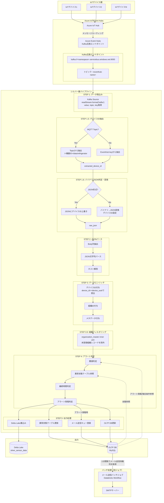
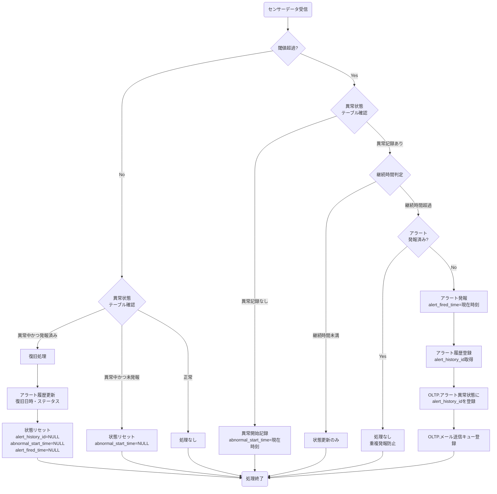

# シルバー層LDPパイプライン仕様書

## 目次

- [シルバー層LDPパイプライン仕様書](#シルバー層ldpパイプライン仕様書)
  - [目次](#目次)
  - [概要](#概要)
    - [このドキュメントの役割](#このドキュメントの役割)
    - [対象機能](#対象機能)
  - [ストリーミング処理仕様](#ストリーミング処理仕様)
    - [処理モード](#処理モード)
    - [パイプライン構成](#パイプライン構成)
    - [処理フロー全体図](#処理フロー全体図)
  - [入力ソース仕様](#入力ソース仕様)
    - [Kafka接続設定](#kafka接続設定)
    - [入力データスキーマ（Kafka互換エンドポイントの基本スキーマ）](#入力データスキーマkafka互換エンドポイントの基本スキーマ)
      - [デバイスID取得元の優先順位](#デバイスid取得元の優先順位)
    - [value列のJSON構造（テレメトリデータ）](#value列のjson構造テレメトリデータ)
    - [テレメトリデータフィールド定義](#テレメトリデータフィールド定義)
  - [データ変換仕様](#データ変換仕様)
    - [デバイスID抽出処理](#デバイスid抽出処理)
      - [MQTT TopicからのデバイスID抽出](#mqtt-topicからのデバイスid抽出)
      - [EventHub keyからのデバイスID抽出](#eventhub-keyからのデバイスid抽出)
      - [デバイスID抽出の統合処理](#デバイスid抽出の統合処理)
      - [パイプラインへの組み込み（デバイスID抽出）](#パイプラインへの組み込みデバイスid抽出)
    - [バイナリ/JSON判定・変換処理](#バイナリjson判定変換処理)
      - [フォーマット判定ロジック](#フォーマット判定ロジック)
      - [バイナリフォーマット定義](#バイナリフォーマット定義)
      - [バイナリ→JSON変換処理](#バイナリjson変換処理)
      - [JSON形式へのデバイスID上書き処理](#json形式へのデバイスid上書き処理)
      - [フォーマット判定・変換の統合処理](#フォーマット判定変換の統合処理)
      - [パイプラインへの組み込み（フォーマット判定・変換）](#パイプラインへの組み込みフォーマット判定変換)
      - [変換エラー時の処理](#変換エラー時の処理)
    - [JSONパース処理](#jsonパース処理)
    - [データエンリッチ処理](#データエンリッチ処理)
    - [データ型変換ルール](#データ型変換ルール)
  - [アラート処理仕様](#アラート処理仕様)
    - [アラート判定概要](#アラート判定概要)
    - [判定時間ベースのアラート判定フロー](#判定時間ベースのアラート判定フロー)
    - [マスタデータ取得](#マスタデータ取得)
    - [閾値判定ロジック](#閾値判定ロジック)
    - [継続時間判定ロジック（アラート発報判定）](#継続時間判定ロジックアラート発報判定)
    - [異常状態テーブル更新処理](#異常状態テーブル更新処理)
    - [アラート判定条件](#アラート判定条件)
    - [測定項目IDとセンサーカラムの対応](#測定項目idとセンサーカラムの対応)
    - [アラート詳細JSON構造](#アラート詳細json構造)
  - [外部連携仕様](#外部連携仕様)
    - [OLTP DB接続設定](#oltp-db接続設定)
    - [OLTPリトライ戦略](#oltpリトライ戦略)
    - [メール送信キュー登録処理](#メール送信キュー登録処理)
    - [キュー登録の設計方針](#キュー登録の設計方針)
    - [メール送信バッチジョブ](#メール送信バッチジョブ)
    - [MySQL センサーデータ書き込み（STEP 5a-2）](#mysql-センサーデータ書き込みstep-5a-2)
    - [デバイスステータス更新](#デバイスステータス更新)
    - [アラート履歴登録処理（アラート発報時）](#アラート履歴登録処理アラート発報時)
    - [アラート履歴更新処理（復旧時）](#アラート履歴更新処理復旧時)
    - [アラート履歴処理の設計方針](#アラート履歴処理の設計方針)
    - [整合性方針](#整合性方針)
  - [出力仕様](#出力仕様)
    - [出力テーブル定義](#出力テーブル定義)
    - [出力カラム仕様](#出力カラム仕様)
    - [Liquid Clustering設定](#liquid-clustering設定)
    - [テーブルプロパティ](#テーブルプロパティ)
  - [エラーハンドリング](#エラーハンドリング)
    - [エラー分類](#エラー分類)
    - [エラーメッセージ一覧](#エラーメッセージ一覧)
    - [エラー通知（Teams）](#エラー通知teams)
      - [通知対象エラー](#通知対象エラー)
    - [エラーレコード処理方針](#エラーレコード処理方針)
    - [エラー破棄の理由](#エラー破棄の理由)
  - [障害復旧仕様](#障害復旧仕様)
    - [チェックポイント設定](#チェックポイント設定)
    - [再処理手順](#再処理手順)
  - [パフォーマンス設計](#パフォーマンス設計)
    - [パイプラインモード](#パイプラインモード)
    - [クラスタ構成](#クラスタ構成)
    - [処理最適化](#処理最適化)
    - [スループット設計](#スループット設計)
    - [レイテンシ設計](#レイテンシ設計)
    - [パフォーマンスモニタリング](#パフォーマンスモニタリング)
    - [負荷テスト基準](#負荷テスト基準)
  - [セキュリティ設計](#セキュリティ設計)
    - [認証・認可](#認証認可)
    - [シークレット管理](#シークレット管理)
    - [データアクセス制御](#データアクセス制御)
  - [運用設計](#運用設計)
    - [監視項目](#監視項目)
    - [ログ出力](#ログ出力)
    - [定期メンテナンス](#定期メンテナンス)
  - [関連ドキュメント](#関連ドキュメント)
    - [機能概要](#機能概要)
    - [要件定義](#要件定義)
    - [データベース設計](#データベース設計)
    - [共通仕様](#共通仕様)
  - [変更履歴](#変更履歴)

---

## 概要

このドキュメントは、シルバー層LDPパイプラインの処理フロー、データ変換、エラーハンドリングの詳細を記載します。

### このドキュメントの役割

- ストリーミング処理の設定・動作仕様
- Kafkaストリーム経由でのテレメトリデータの取得仕様
- JSONパース・データ変換ロジック
- アラート判定・通知処理
- OLTP DB連携処理
- エラーハンドリング・障害復旧

### 対象機能

| 機能ID   | 機能名       | 処理内容                        |
| -------- | ------------ | ------------------------------- |
| FR-002-1 | データ処理   | テレメトリデータ→シルバー層変換 |
| FR-003-1 | 異常検出     | センサー値閾値比較              |
| FR-003-2 | アラート通知 | メール送信                      |
| FR-003-3 | 履歴記録     | OLTP DB更新                     |

---

## ストリーミング処理仕様

### 処理モード

| 項目               | 設定値         | 説明                                       |
| ------------------ | -------------- | ------------------------------------------ |
| 処理方式           | foreachBatch   | マイクロバッチ処理（Delta Lake MERGE対応） |
| トリガー間隔       | 10秒           | processingTime="10 seconds"                |
| データ取得方式     | ストリーミング | readStreamによるリアルタイム取得           |
| 最大レイテンシ目安 | 10〜20秒       | トリガー間隔 + 処理時間                    |

**foreachBatchを採用した理由:**

| 要件              | Continuous | foreachBatch | 備考                         |
| ----------------- | ---------- | ------------ | ---------------------------- |
| Delta Lake MERGE  | ✗          | ✓            | 状態テーブル更新に必須       |
| JDBC/MySQL書込み  | ✗          | ✓            | OLTP DB連携に必須            |
| 複数テーブル出力  | ✗          | ✓            | センサー/状態/キュー同時出力 |
| レイテンシ1分以内 | ✓          | ✓            | 10秒間隔で十分達成可能       |

### パイプライン構成

```python
from pyspark.sql import functions as F

# ストリーミング処理の実行（foreachBatchでマイクロバッチ処理）
query = (
    kafka_stream
    .writeStream
    .foreachBatch(process_sensor_batch)
    .option("checkpointLocation", CHECKPOINT_LOCATION)
    .trigger(processingTime="10 seconds")
    .start()
)

# パイプライン実行
query.awaitTermination()
```

### 処理フロー全体図



---

## 入力ソース仕様

### Kafka接続設定

```python
import dlt
from pyspark.sql import functions as F
from pyspark.sql.types import (
    StructType, StructField, IntegerType, DoubleType, StringType
)

# =============================================================================
# 接続設定
# =============================================================================
EVENTHUBS_NAMESPACE = dbutils.secrets.get("eventhubs_secrets", "eventhubs-namespace")
EVENTHUBS_CONNECTION_STRING = dbutils.secrets.get("eventhubs_secrets", "eventhubs-connection-string")
TOPIC_NAME = "eh-telemetry"

kafka_options = {
    "kafka.bootstrap.servers": f"{EVENTHUBS_NAMESPACE}.servicebus.windows.net:9093",
    "subscribe": TOPIC_NAME,
    "kafka.sasl.mechanism": "PLAIN",
    "kafka.security.protocol": "SASL_SSL",
    "kafka.sasl.jaas.config": (
        "kafkashaded.org.apache.kafka.common.security.plain.PlainLoginModule required "
        f'username="$ConnectionString" '
        f'password="{EVENTHUBS_CONNECTION_STRING}";'
    ),
    # チェックポイントなし初回起動時は earliest から開始（チェックポイントがあれば自動でそこから再開）
    "startingOffsets": "earliest",
    # "startingOffsets": "latest",
    "failOnDataLoss": "false",
    "kafka.session.timeout.ms": "30000",       # 30秒（デフォルト600秒を短縮）
    "kafka.heartbeat.interval.ms": "10000",    # 10秒（session.timeout の1/3以下）
    "kafka.request.timeout.ms": "60000",       # 60秒
    "kafka.max.poll.interval.ms": "600000",    # 10分（foreachBatch の処理時間上限）
}

# ----------------------------------

# STEP 1: Kafkaからデータ取込み
# valueカラムはバイナリのまま取得（後続のフォーマット判定・変換処理で使用）
# topicカラムはMQTTの場合にデバイスID抽出に使用
# keyカラムはEventHub経由の場合にデバイスID抽出に使用
spark.readStream
.format("kafka")
.options(**kafka_options)
.load()
.select(
    F.col("value"),  # バイナリ形式のまま取得
    F.col("topic"),  # MQTT Topic（デバイスID抽出用）
    F.col("key").cast("string").alias("message_key"),  # EventHubデバイスID
    F.col("timestamp").alias("kafka_timestamp")
)
```

### 入力データスキーマ（Kafka互換エンドポイントの基本スキーマ）

| カラム名      | データ型  | 説明                                                                                 |
| ------------- | --------- | ------------------------------------------------------------------------------------ |
| key           | BINARY    | メッセージのキー。EventHub経由の場合、デバイスIDが格納される（デバイスID抽出に使用） |
| value         | BINARY    | メッセージの本体（ペイロード）。テレメトリデータなどはここに格納される               |
| topic         | STRING    | Event Hubs（Kafkaトピック）の名前。MQTT経由の場合、TopicからデバイスIDを抽出する     |
| partition     | INT       | データが格納されているパーティション番号                                             |
| offset        | long      | パーティション内のデータの位置                                                       |
| timestamp     | TIMESTAMP | メッセージのタイムスタンプ                                                           |
| timestampType | INT       | タイムスタンプの種類（0: CreateTime, 1: LogAppendTime）                              |

#### デバイスID取得元の優先順位

テレメトリデータに格納するデバイスIDは、以下の優先順位で取得する：

| 優先度 | 取得元                | 形式                                 | 説明                                                      |
| ------ | --------------------- | ------------------------------------ | --------------------------------------------------------- |
| 1      | MQTT Topic            | `/<機器ID>/data/refrigerator`        | MQTT経由の場合、Topicパスから機器IDを抽出                 |
| 2      | EventHub key          | デバイスID文字列                     | EventHub直接接続の場合、keyカラムにデバイスIDが格納される |
| 3      | ペイロード内device_id | JSON/バイナリ内のdevice_idフィールド | Topic/keyから取得できない場合のフォールバック             |

**MQTT Topic形式:**
```
/<機器ID>/data/refrigerator
```

例: `/12345/data/refrigerator` → デバイスID: `"12345"`、`/dev-001/data/refrigerator` → デバイスID: `"dev-001"`

> **注意:** 機器IDは文字列であり、数値に限らない。スラッシュを含まない任意の文字列を許容する。

### value列のJSON構造（テレメトリデータ）

IoTデバイスから送信されるテレメトリデータは、以下のJSON構造でKafkaメッセージのvalue列に格納される。

```json
{
    "device_id": "12345",
    "event_timestamp": "2026-01-23T10:30:00.000Z",
    "external_temp": 25.5,
    "set_temp_freezer_1": -20.0,
    "internal_sensor_temp_freezer_1": -19.8,
    "internal_temp_freezer_1": -19.5,
    "df_temp_freezer_1": -15.2,
    "condensing_temp_freezer_1": 35.0,
    "adjusted_internal_temp_freezer_1": -19.7,
    "set_temp_freezer_2": -25.0,
    "internal_sensor_temp_freezer_2": -24.6,
    "internal_temp_freezer_2": -24.3,
    "df_temp_freezer_2": -18.5,
    "condensing_temp_freezer_2": 38.0,
    "adjusted_internal_temp_freezer_2": -24.5,
    "compressor_freezer_1": 2800.0,
    "compressor_freezer_2": 3100.0,
    "fan_motor_1": 1200.0,
    "fan_motor_2": 1180.0,
    "fan_motor_3": 1150.0,
    "fan_motor_4": 1220.0,
    "fan_motor_5": 1190.0,
    "defrost_heater_output_1": 0.0,
    "defrost_heater_output_2": 0.0
}
```

### テレメトリデータフィールド定義

| フィールド名                     | データ型 | 必須 | 単位 | 説明                             |
| -------------------------------- | -------- | ---- | ---- | -------------------------------- |
| device_id                        | INTEGER  | ○    | -    | デバイス識別ID                   |
| event_timestamp                  | STRING   | ○    | -    | イベント発生日時（ISO 8601形式） |
| external_temp                    | DOUBLE   | -    | ℃    | 外気温度                         |
| set_temp_freezer_1               | DOUBLE   | -    | ℃    | 第1冷凍設定温度                  |
| internal_sensor_temp_freezer_1   | DOUBLE   | -    | ℃    | 第1冷凍庫内センサー温度          |
| internal_temp_freezer_1          | DOUBLE   | -    | ℃    | 第1冷凍表示温度                  |
| df_temp_freezer_1                | DOUBLE   | -    | ℃    | 第1冷凍DF温度                    |
| condensing_temp_freezer_1        | DOUBLE   | -    | ℃    | 第1冷凍凝縮温度                  |
| adjusted_internal_temp_freezer_1 | DOUBLE   | -    | ℃    | 第1冷凍微調整後庫内温度          |
| set_temp_freezer_2               | DOUBLE   | -    | ℃    | 第2冷凍設定温度                  |
| internal_sensor_temp_freezer_2   | DOUBLE   | -    | ℃    | 第2冷凍庫内センサー温度          |
| internal_temp_freezer_2          | DOUBLE   | -    | ℃    | 第2冷凍表示温度                  |
| df_temp_freezer_2                | DOUBLE   | -    | ℃    | 第2冷凍DF温度                    |
| condensing_temp_freezer_2        | DOUBLE   | -    | ℃    | 第2冷凍凝縮温度                  |
| adjusted_internal_temp_freezer_2 | DOUBLE   | -    | ℃    | 第2冷凍微調整後庫内温度          |
| compressor_freezer_1             | DOUBLE   | -    | rpm  | 第1冷凍圧縮機回転数              |
| compressor_freezer_2             | DOUBLE   | -    | rpm  | 第2冷凍圧縮機回転数              |
| fan_motor_1                      | DOUBLE   | -    | rpm  | 第1ファンモータ回転数            |
| fan_motor_2                      | DOUBLE   | -    | rpm  | 第2ファンモータ回転数            |
| fan_motor_3                      | DOUBLE   | -    | rpm  | 第3ファンモータ回転数            |
| fan_motor_4                      | DOUBLE   | -    | rpm  | 第4ファンモータ回転数            |
| fan_motor_5                      | DOUBLE   | -    | rpm  | 第5ファンモータ回転数            |
| defrost_heater_output_1          | DOUBLE   | -    | %    | 防露ヒータ出力(1)                |
| defrost_heater_output_2          | DOUBLE   | -    | %    | 防露ヒータ出力(2)                |

**備考:**
- `event_timestamp`はISO 8601形式（例: `2026-01-23T10:30:00.000Z`）で送信される
- 温度系フィールドは摂氏（℃）、回転数はrpm、出力は%で表される
- オプションフィールド（必須でないもの）はデバイスの構成により欠損する場合がある

---

## データ変換仕様

### デバイスID抽出処理

Kafkaから取得したテレメトリデータに対して、デバイスIDを以下の優先順位で抽出し、JSONデータに格納する。

#### MQTT TopicからのデバイスID抽出

MQTT経由でデータが送信された場合、Topicは`/<機器ID>/data/refrigerator`形式となる。正規表現でTopicパスから機器IDを抽出する。

```python
import re
from pyspark.sql import functions as F
from pyspark.sql.types import StringType

def extract_device_id_from_topic(topic: str) -> str:
    """
    MQTT Topicから機器IDを抽出する

    Args:
        topic: MQTT Topic文字列（例: "/12345/data/refrigerator", "/dev-001/data/refrigerator"）

    Returns:
        str: 機器ID（文字列）。抽出失敗時はNone
    """
    if topic is None:
        return None

    # MQTT Topic形式: /<機器ID>/data/refrigerator
    # 機器IDは文字列（数値に限らない）。スラッシュを含まない任意の文字列を許容する。
    pattern = r'^/([^/]+)/data/refrigerator$'
    match = re.match(pattern, topic)

    if match:
        return match.group(1)
    return None

# UDF登録
extract_device_id_from_topic_udf = F.udf(extract_device_id_from_topic, StringType())
```

#### EventHub keyからのデバイスID抽出

EventHub直接接続の場合、メッセージのkeyカラムにデバイスIDが格納される。

```python
def extract_device_id_from_key(message_key: str) -> str:
    """
    EventHubメッセージのkeyからデバイスIDを抽出する

    Args:
        message_key: Kafkaメッセージのkey（文字列）

    Returns:
        str: デバイスID（文字列）。抽出失敗時はNone
    """
    if message_key is None or message_key.strip() == "":
        return None

    # keyは文字列（数値に限らない）。空文字・空白のみの場合はNoneを返す。
    return message_key.strip()

# UDF登録
extract_device_id_from_key_udf = F.udf(extract_device_id_from_key, StringType())
```

#### デバイスID抽出の統合処理

```python
def extract_device_id(topic: str, message_key: str, payload_device_id: str) -> str:
    """
    優先順位に従ってデバイスIDを抽出する

    優先順位:
    1. MQTT Topic（/<機器ID>/data/refrigerator形式）
    2. EventHub key
    3. ペイロード内のdevice_id

    Args:
        topic: MQTT Topic文字列
        message_key: Kafkaメッセージのkey
        payload_device_id: ペイロード内のdevice_id

    Returns:
        str: デバイスID。すべて失敗時はNone
    """
    # 優先度1: MQTT Topicから抽出
    device_id = extract_device_id_from_topic(topic)
    if device_id is not None:
        return device_id

    # 優先度2: EventHub keyから抽出
    device_id = extract_device_id_from_key(message_key)
    if device_id is not None:
        return device_id

    # 優先度3: ペイロード内のdevice_id（フォールバック）
    if payload_device_id is not None and str(payload_device_id).strip() != "":
        return str(payload_device_id).strip()

    return None

# UDF登録
extract_device_id_udf = F.udf(extract_device_id, StringType())
```

#### パイプラインへの組み込み（デバイスID抽出）

```python
# ----------------------------------

# STEP 1.5: デバイスID抽出
# MQTT Topic、EventHub key、ペイロードの優先順位でデバイスIDを取得
.withColumn(
    "extracted_device_id",
    extract_device_id_udf(
        F.col("topic"),
        F.col("message_key"),
        F.get_json_object(F.col("value").cast("string"), "$.device_id")
    )
)
.filter(F.col("extracted_device_id").isNotNull())  # デバイスID取得失敗レコードを除外
```

---

### バイナリ/JSON判定・変換処理

Kafkaから取得したテレメトリデータは、送信元デバイスやゲートウェイの設定によりJSON形式またはバイナリ形式で届く可能性がある。データ処理の前に、フォーマットを判定し、バイナリ形式の場合はJSONに変換する。

#### フォーマット判定ロジック

```python
import json
from pyspark.sql import functions as F
from pyspark.sql.types import StringType

def is_valid_json(data: str) -> bool:
    """
    文字列が有効なJSONかどうかを判定する

    Args:
        data: 判定対象の文字列

    Returns:
        bool: 有効なJSONならTrue、それ以外はFalse
    """
    if data is None:
        return False
    try:
        json.loads(data)
        return True
    except (json.JSONDecodeError, TypeError):
        return False

# UDF登録
is_valid_json_udf = F.udf(is_valid_json, "boolean")
```

#### バイナリフォーマット定義

バイナリ形式のテレメトリデータは以下の構造を持つ（リトルエンディアン）：

| オフセット | サイズ(bytes) | フィールド名                     | データ型       | 説明                    |
| ---------- | ------------- | -------------------------------- | -------------- | ----------------------- |
| 0          | 4             | device_id                        | INT32          | デバイス識別ID          |
| 4          | 8             | event_timestamp                  | INT64 (millis) | イベント発生日時（UTC） |
| 12         | 8             | external_temp                    | FLOAT64        | 外気温度                |
| 20         | 8             | set_temp_freezer_1               | FLOAT64        | 第1冷凍設定温度         |
| 28         | 8             | internal_sensor_temp_freezer_1   | FLOAT64        | 第1冷凍庫内センサー温度 |
| 36         | 8             | internal_temp_freezer_1          | FLOAT64        | 第1冷凍表示温度         |
| 44         | 8             | df_temp_freezer_1                | FLOAT64        | 第1冷凍DF温度           |
| 52         | 8             | condensing_temp_freezer_1        | FLOAT64        | 第1冷凍凝縮温度         |
| 60         | 8             | adjusted_internal_temp_freezer_1 | FLOAT64        | 第1冷凍微調整後庫内温度 |
| 68         | 8             | set_temp_freezer_2               | FLOAT64        | 第2冷凍設定温度         |
| 76         | 8             | internal_sensor_temp_freezer_2   | FLOAT64        | 第2冷凍庫内センサー温度 |
| 84         | 8             | internal_temp_freezer_2          | FLOAT64        | 第2冷凍表示温度         |
| 92         | 8             | df_temp_freezer_2                | FLOAT64        | 第2冷凍DF温度           |
| 100        | 8             | condensing_temp_freezer_2        | FLOAT64        | 第2冷凍凝縮温度         |
| 108        | 8             | adjusted_internal_temp_freezer_2 | FLOAT64        | 第2冷凍微調整後庫内温度 |
| 116        | 8             | compressor_freezer_1             | FLOAT64        | 第1冷凍圧縮機回転数     |
| 124        | 8             | compressor_freezer_2             | FLOAT64        | 第2冷凍圧縮機回転数     |
| 132        | 8             | fan_motor_1                      | FLOAT64        | 第1ファンモータ回転数   |
| 140        | 8             | fan_motor_2                      | FLOAT64        | 第2ファンモータ回転数   |
| 148        | 8             | fan_motor_3                      | FLOAT64        | 第3ファンモータ回転数   |
| 156        | 8             | fan_motor_4                      | FLOAT64        | 第4ファンモータ回転数   |
| 164        | 8             | fan_motor_5                      | FLOAT64        | 第5ファンモータ回転数   |
| 172        | 8             | defrost_heater_output_1          | FLOAT64        | 防露ヒータ出力(1)       |
| 180        | 8             | defrost_heater_output_2          | FLOAT64        | 防露ヒータ出力(2)       |
| **合計**   | **188**       |                                  |                |                         |

#### バイナリ→JSON変換処理

```python
import struct
from datetime import datetime, timezone

def parse_binary_telemetry(binary_data: bytes, override_device_id: str = None) -> str:
    """
    バイナリ形式のテレメトリデータをJSON文字列に変換する

    Args:
        binary_data: バイナリ形式のテレメトリデータ（188バイト）
        override_device_id: 上書き用デバイスID（MQTT Topic/EventHub keyから抽出したID）

    Returns:
        str: JSON形式の文字列。パース失敗時はNone
    """
    if binary_data is None or len(binary_data) != 188:
        return None

    try:
        # リトルエンディアンでアンパック
        # フォーマット: i=int32, q=int64, d=double(float64)
        # device_id(i), event_timestamp(q), 22個のdouble値(d*22)
        unpacked = struct.unpack('<iq22d', binary_data)

        device_id = unpacked[0]
        event_timestamp_ms = unpacked[1]
        sensor_values = unpacked[2:]

        # デバイスIDの上書き（MQTT Topic/EventHub keyから抽出したIDを優先）
        if override_device_id is not None:
            device_id = override_device_id
        else:
            device_id = str(device_id)

        # タイムスタンプをISO 8601形式に変換
        event_timestamp = datetime.fromtimestamp(
            event_timestamp_ms / 1000.0,
            tz=timezone.utc
        ).strftime('%Y-%m-%dT%H:%M:%S.') + f'{event_timestamp_ms % 1000:03d}Z'

        # センサーフィールド名（順序固定）
        sensor_fields = [
            "external_temp",
            "set_temp_freezer_1",
            "internal_sensor_temp_freezer_1",
            "internal_temp_freezer_1",
            "df_temp_freezer_1",
            "condensing_temp_freezer_1",
            "adjusted_internal_temp_freezer_1",
            "set_temp_freezer_2",
            "internal_sensor_temp_freezer_2",
            "internal_temp_freezer_2",
            "df_temp_freezer_2",
            "condensing_temp_freezer_2",
            "adjusted_internal_temp_freezer_2",
            "compressor_freezer_1",
            "compressor_freezer_2",
            "fan_motor_1",
            "fan_motor_2",
            "fan_motor_3",
            "fan_motor_4",
            "fan_motor_5",
            "defrost_heater_output_1",
            "defrost_heater_output_2"
        ]

        # JSON構造を構築
        result = {
            "device_id": device_id,
            "event_timestamp": event_timestamp
        }

        for i, field_name in enumerate(sensor_fields):
            value = sensor_values[i]
            # NaN値はnullとして扱う
            if value != value:  # NaNチェック
                result[field_name] = None
            else:
                result[field_name] = value

        return json.dumps(result)

    except (struct.error, ValueError, OverflowError):
        return None

# UDF登録
parse_binary_telemetry_udf = F.udf(parse_binary_telemetry, StringType())
```

#### JSON形式へのデバイスID上書き処理

```python
def update_json_device_id(json_str: str, override_device_id: str) -> str:
    """
    JSON文字列内のdevice_idを上書きする

    Args:
        json_str: JSON形式のテレメトリデータ
        override_device_id: 上書き用デバイスID

    Returns:
        str: device_idを更新したJSON文字列
    """
    if json_str is None:
        return None

    if override_device_id is None:
        return json_str

    try:
        data = json.loads(json_str)
        data["device_id"] = str(override_device_id)  # str型に変換してdevice_idを上書き
        return json.dumps(data)
    except (json.JSONDecodeError, TypeError, ValueError):
        return json_str

# UDF登録
update_json_device_id_udf = F.udf(update_json_device_id, StringType())
```

#### フォーマット判定・変換の統合処理

```python
def convert_to_json_with_device_id(raw_value: bytes, override_device_id: str) -> str:
    """
    テレメトリデータをJSON形式に変換し、デバイスIDを設定する

    処理フロー:
    1. バイナリデータを文字列にデコード試行
    2. 文字列がJSON形式ならデバイスIDを上書きして返却
    3. JSON形式でなければバイナリとしてパースしてJSONに変換（デバイスID上書き）

    Args:
        raw_value: Kafkaメッセージのvalue（バイナリ）
        override_device_id: 上書き用デバイスID（MQTT Topic/EventHub keyから抽出）

    Returns:
        str: JSON形式の文字列。変換失敗時はNone
    """
    if raw_value is None:
        return None

    # Step 1: 文字列としてデコード試行（UTF-8）
    try:
        decoded_str = raw_value.decode('utf-8')

        # Step 2: JSONとして有効か判定
        if is_valid_json(decoded_str):
            # デバイスIDを上書き
            return update_json_device_id(decoded_str, override_device_id)
    except (UnicodeDecodeError, AttributeError):
        pass

    # Step 3: バイナリ形式としてパース（デバイスID上書き）
    return parse_binary_telemetry(raw_value, override_device_id)

# UDF登録
convert_to_json_with_device_id_udf = F.udf(convert_to_json_with_device_id, StringType())
```

#### パイプラインへの組み込み（フォーマット判定・変換）

```python
# ----------------------------------

# STEP 1.6: バイナリ/JSON判定・変換
# Kafkaから取得したvalueカラムに対して、フォーマット判定と変換を実施
# 抽出済みのデバイスIDでJSONデータを更新
.withColumn(
    "raw_json",
    convert_to_json_with_device_id_udf(
        F.col("value"),
        F.col("extracted_device_id")
    )
)
.filter(F.col("raw_json").isNotNull() & F.col("raw_json").rlike(r'^\{.*\}'))  # 変換失敗・JSON非オブジェクトレコードを除外
```

#### 変換エラー時の処理

バイナリ/JSON変換に失敗したレコードは以下の条件で発生する：

| エラー条件                              | 原因                           | 処理         |
| --------------------------------------- | ------------------------------ | ------------ |
| バイナリデータが188バイトでない         | 不正なデータサイズ             | レコード破棄 |
| UTF-8デコード失敗かつバイナリパース失敗 | 不正なデータ形式               | レコード破棄 |
| structアンパックエラー                  | バイナリフォーマット不整合     | レコード破棄 |
| デバイスID抽出失敗                      | Topic/key/ペイロードすべて無効 | レコード破棄 |

変換失敗レコードはfilter条件で除外され、後続のJSONパース処理には渡されない。これはエラーレコード処理方針（本仕様書「エラーレコード処理方針」参照）に準拠する。

---

### JSONパース処理

```python
from pyspark.sql.types import StructType, StructField, StringType, DoubleType, IntegerType

# =============================================================================
# センサーデータスキーマ
# =============================================================================
sensor_schema = StructType([
    StructField("device_id", IntegerType(), False),
    StructField("event_timestamp", StringType(), False),
    StructField("external_temp", DoubleType(), True),
    StructField("set_temp_freezer_1", DoubleType(), True),
    StructField("internal_sensor_temp_freezer_1", DoubleType(), True),
    StructField("internal_temp_freezer_1", DoubleType(), True),
    StructField("df_temp_freezer_1", DoubleType(), True),
    StructField("condensing_temp_freezer_1", DoubleType(), True),
    StructField("adjusted_internal_temp_freezer_1", DoubleType(), True),
    StructField("set_temp_freezer_2", DoubleType(), True),
    StructField("internal_sensor_temp_freezer_2", DoubleType(), True),
    StructField("internal_temp_freezer_2", DoubleType(), True),
    StructField("df_temp_freezer_2", DoubleType(), True),
    StructField("condensing_temp_freezer_2", DoubleType(), True),
    StructField("adjusted_internal_temp_freezer_2", DoubleType(), True),
    StructField("compressor_freezer_1", DoubleType(), True),
    StructField("compressor_freezer_2", DoubleType(), True),
    StructField("fan_motor_1", DoubleType(), True),
    StructField("fan_motor_2", DoubleType(), True),
    StructField("fan_motor_3", DoubleType(), True),
    StructField("fan_motor_4", DoubleType(), True),
    StructField("fan_motor_5", DoubleType(), True),
    StructField("defrost_heater_output_1", DoubleType(), True),
    StructField("defrost_heater_output_2", DoubleType(), True)
])

# ---------------------------------------------------------------------------------

# STEP 2: JSONパース
.withColumn("parsed", F.from_json(F.col("raw_json"), sensor_schema))
.select(
    F.col("parsed.device_id").alias("device_id"),
    F.to_timestamp(F.col("parsed.event_timestamp")).alias("event_timestamp"),
    F.col("parsed.external_temp").alias("external_temp"),
    F.col("parsed.set_temp_freezer_1").alias("set_temp_freezer_1"),
    F.col("parsed.internal_sensor_temp_freezer_1").alias("internal_sensor_temp_freezer_1"),
    F.col("parsed.internal_temp_freezer_1").alias("internal_temp_freezer_1"),
    F.col("parsed.df_temp_freezer_1").alias("df_temp_freezer_1"),
    F.col("parsed.condensing_temp_freezer_1").alias("condensing_temp_freezer_1"),
    F.col("parsed.adjusted_internal_temp_freezer_1").alias("adjusted_internal_temp_freezer_1"),
    F.col("parsed.set_temp_freezer_2").alias("set_temp_freezer_2"),
    F.col("parsed.internal_sensor_temp_freezer_2").alias("internal_sensor_temp_freezer_2"),
    F.col("parsed.internal_temp_freezer_2").alias("internal_temp_freezer_2"),
    F.col("parsed.df_temp_freezer_2").alias("df_temp_freezer_2"),
    F.col("parsed.condensing_temp_freezer_2").alias("condensing_temp_freezer_2"),
    F.col("parsed.adjusted_internal_temp_freezer_2").alias("adjusted_internal_temp_freezer_2"),
    F.col("parsed.compressor_freezer_1").alias("compressor_freezer_1"),
    F.col("parsed.compressor_freezer_2").alias("compressor_freezer_2"),
    F.col("parsed.fan_motor_1").alias("fan_motor_1"),
    F.col("parsed.fan_motor_2").alias("fan_motor_2"),
    F.col("parsed.fan_motor_3").alias("fan_motor_3"),
    F.col("parsed.fan_motor_4").alias("fan_motor_4"),
    F.col("parsed.fan_motor_5").alias("fan_motor_5"),
    F.col("parsed.defrost_heater_output_1").alias("defrost_heater_output_1"),
    F.col("parsed.defrost_heater_output_2").alias("defrost_heater_output_2"),
    F.col("raw_json")
)
```

### データエンリッチ処理

データエンリッチ処理はセンサーデータの`device_id`（文字列）をデバイスマスタの`device_uuid`と照合し、システム内`device_id`（整数）・`organization_id`を取得する。さらに組織マスタとの内部結合で未登録組織のレコードを除外することで達成する。

```python
# STEP 3: デバイスマスタ結合（device_id（整数）・organization_id付与）
# センサーデータのdevice_id（文字列）とデバイスマスタのdevice_uuidで照合する
.join(
    F.broadcast(get_device_master()),
    F.col("device_id") == F.col("device_uuid"),
    "left"
)

# STEP 3.5: 組織マスタ存在チェック（organization_idが存在しないレコードは除外）
.join(
    F.broadcast(get_organization_master().select("organization_id")),
    "organization_id",
    "inner",
)
```

### データ型変換ルール

| 入力                   | 出力カラム        | 変換ロジック                                               |
| ---------------------- | ----------------- | ---------------------------------------------------------- |
| parsed.event_timestamp | event_timestamp   | to_timestamp()でTIMESTAMP型に変換                          |
| parsed.device_id       | device_id         | デバイスマスタのdevice_uuidと照合し、マスタ側のdevice_id（整数）に置換 |
| -                      | raw_json          | そのまま文字列型として抽出                                 |
| 上記以外の項目         | external_tempなど | DOUBLE型として抽出                                         |


---

## アラート処理仕様

### アラート判定概要

アラート判定は以下の2段階で行う：

1. **閾値判定**: センサー値がアラート設定の閾値条件を満たすかチェック
2. **継続時間判定**: 異常状態が判定時間（judgment_time）以上継続した場合にアラートを発報

この方式により、一時的な閾値超過ではアラートを発報せず、継続的な異常のみを検知できる。

### 判定時間ベースのアラート判定フロー



### マスタデータ取得

```python
def get_alert_settings():
    """OLTP DBからアラート設定を取得（Spark JDBC経由）"""
    return (
        builtins.spark.read.format("jdbc").options(
            url=OLTP_JDBC_URL,
            # driver="com.mysql.cj.jdbc.Driver",
            dbtable="alert_setting_master",
            user=builtins.dbutils.secrets.get("my_sql_secrets", "username"),
            password=builtins.dbutils.secrets.get("my_sql_secrets", "password"),
        ).load()
        .filter("delete_flag = FALSE")
    )

# get_measurement_items() は独立関数として存在しない。
# enqueue_email_notification() 内でインライン JDBC クエリとして実装されている。

_ALERT_ABNORMAL_STATE_SCHEMA = StructType([
    StructField("device_id",           IntegerType(),   True),
    StructField("alert_id",            IntegerType(),   True),
    StructField("abnormal_start_time", TimestampType(), True),
    StructField("last_event_time",     TimestampType(), True),
    StructField("last_sensor_value",   DoubleType(),    True),
    StructField("alert_fired_time",    TimestampType(), True),
    StructField("alert_history_id",    IntegerType(),   True),
    # 派生カラム（DBには存在しない。ロード後に付与）
    StructField("is_abnormal",         BooleanType(),   True),
    StructField("alert_fired",         BooleanType(),   True),
])

def get_alert_abnormal_state():
    """
    異常状態テーブルを OLTP DB から取得する。

    DBテーブル上に is_abnormal / alert_fired カラムは存在しないため、
    ロード後に派生カラムとして追加する:
        is_abnormal = abnormal_start_time IS NOT NULL
        alert_fired  = alert_fired_time  IS NOT NULL
    """
    try:
        df = builtins.spark.read.format("jdbc").options(
            url=OLTP_JDBC_URL,
            # driver="com.mysql.cj.jdbc.Driver",
            dbtable="alert_abnormal_state",
            user=builtins.dbutils.secrets.get("my_sql_secrets", "username"),
            password=builtins.dbutils.secrets.get("my_sql_secrets", "password"),
        ).load()
        return (
            df
            .withColumn("is_abnormal", F.col("abnormal_start_time").isNotNull())
            .withColumn("alert_fired",  F.col("alert_fired_time").isNotNull())
        )
    except Exception as e:
        print(f"[WARN] alert_abnormal_state 取得失敗（空DataFrameで代替）: {str(e).splitlines()[0]}")
        return builtins.spark.createDataFrame([], schema=_ALERT_ABNORMAL_STATE_SCHEMA)

# 測定項目IDとセンサーカラム名のマッピング
MEASUREMENT_COLUMN_MAP = {
    1: "external_temp",                      # 共通外気温度
    2: "set_temp_freezer_1",                 # 第1冷凍設定温度
    3: "internal_sensor_temp_freezer_1",     # 第1冷凍庫内センサー温度
    4: "internal_temp_freezer_1",            # 第1冷凍表示温度
    5: "df_temp_freezer_1",                  # 第1冷凍DF温度
    6: "condensing_temp_freezer_1",          # 第1冷凍凝縮温度
    7: "adjusted_internal_temp_freezer_1",   # 第1冷凍微調整後庫内温度
    8: "set_temp_freezer_2",                 # 第2冷凍設定温度
    9: "internal_sensor_temp_freezer_2",     # 第2冷凍庫内センサー温度
    10: "internal_temp_freezer_2",           # 第2冷凍表示温度
    11: "df_temp_freezer_2",                 # 第2冷凍DF温度
    12: "condensing_temp_freezer_2",         # 第2冷凍凝縮温度
    13: "adjusted_internal_temp_freezer_2",  # 第2冷凍微調整後庫内温度
    14: "compressor_freezer_1",              # 第1冷凍圧縮機回転数
    15: "compressor_freezer_2",              # 第2冷凍圧縮機回転数
    16: "fan_motor_1",                       # 第1ファンモータ回転数
    17: "fan_motor_2",                       # 第2ファンモータ回転数
    18: "fan_motor_3",                       # 第3ファンモータ回転数
    19: "fan_motor_4",                       # 第4ファンモータ回転数
    20: "fan_motor_5",                       # 第5ファンモータ回転数
    21: "defrost_heater_output_1",           # 防露ヒータ出力(1)
    22: "defrost_heater_output_2",           # 防露ヒータ出力(2)
}
```

### 閾値判定ロジック

```python
def evaluate_threshold(sensor_df, alert_settings_df):
    """
    センサーデータに対して閾値判定を実行（単一レコード単位）

    アラート設定マスタの構造:
    - device_id: 対象デバイスID
    - alert_id: アラート設定ID
    - alert_conditions_measurement_item_id: 判定対象の測定項目ID
    - alert_conditions_operator: 比較演算子 (>, >=, <, <=, ==, !=)
    - alert_conditions_threshold: 閾値
    - judgment_time: 判定時間（分）
    - alert_notification_flag: 通知フラグ
    - alert_email_flag: メール送信フラグ
    """
    # デバイスごとのアラート設定を結合
    joined = sensor_df.join(
        F.broadcast(alert_settings_df),
        sensor_df.device_id == alert_settings_df.device_id,
        "left"
    )

    # 動的にアラート条件を評価
    # 各測定項目IDに対応するカラム値と閾値を比較
    threshold_exceeded = F.lit(False)
    sensor_value_expr = F.lit(None).cast("double")

    for item_id, column_name in MEASUREMENT_COLUMN_MAP.items():
        condition = (
            (F.col("alert_conditions_measurement_item_id") == item_id) &
            (
                F.when(F.col("alert_conditions_operator") == ">",
                       F.col(column_name) > F.col("alert_conditions_threshold"))
                .when(F.col("alert_conditions_operator") == ">=",
                       F.col(column_name) >= F.col("alert_conditions_threshold"))
                .when(F.col("alert_conditions_operator") == "<",
                       F.col(column_name) < F.col("alert_conditions_threshold"))
                .when(F.col("alert_conditions_operator") == "<=",
                       F.col(column_name) <= F.col("alert_conditions_threshold"))
                .when(F.col("alert_conditions_operator") == "==",
                       F.col(column_name) == F.col("alert_conditions_threshold"))
                .when(F.col("alert_conditions_operator") == "!=",
                       F.col(column_name) != F.col("alert_conditions_threshold"))
                .otherwise(F.lit(False))
            )
        )
        threshold_exceeded = threshold_exceeded | condition

        # 該当する測定項目のセンサー値を取得
        sensor_value_expr = F.when(
            F.col("alert_conditions_measurement_item_id") == item_id,
            F.col(column_name)
        ).otherwise(sensor_value_expr)

    return joined.withColumn("threshold_exceeded", threshold_exceeded) \
                 .withColumn("current_sensor_value", sensor_value_expr)
```

### 継続時間判定ロジック（アラート発報判定）

```python
def check_alerts_with_duration(threshold_df, alert_state_df):
    """
    継続時間を考慮したアラート判定

    判定ロジック:
    1. 閾値超過かつ異常状態テーブルで異常中の場合、継続時間をチェック
    2. 継続時間がjudgment_time以上かつ未発報の場合、アラートを発報
    3. 閾値正常の場合、異常状態をリセット
    """
    # 異常状態テーブルと結合
    with_state = threshold_df.join(
        alert_state_df.select(
            F.col("device_id").alias("state_device_id"),
            F.col("alert_id").alias("state_alert_id"),
            "is_abnormal",
            "abnormal_start_time",
            "alert_fired"
        ),
        (threshold_df.device_id == F.col("state_device_id")) &
        (threshold_df.alert_id == F.col("state_alert_id")),
        "left"
    )

    # アラート発報判定
    # 条件: 閾値超過 AND 異常継続中 AND 継続時間 >= judgment_time AND 未発報
    alert_triggered = (
        (F.col("threshold_exceeded") == True) &
        (F.col("is_abnormal") == True) &
        (
            (F.unix_timestamp(F.col("event_timestamp")) -
             F.unix_timestamp(F.col("abnormal_start_time")))
            >= (F.col("judgment_time") * 60)  # judgment_timeは分単位、秒に変換
        ) &
        (F.coalesce(F.col("alert_fired"), F.lit(False)) == False)
    )

    return with_state.withColumn("alert_triggered", alert_triggered)
```

### 異常状態テーブル更新処理

```python
def update_alert_abnormal_state(batch_df, batch_id):
    """
    異常状態テーブルの更新（foreachBatchで呼び出し）
    ※ OLTP DB（MySQL）に対してUPSERT処理を実行

    更新パターン:
    1. 新規異常開始: 閾値超過 AND 状態テーブルに未登録または正常状態
       → abnormal_start_time=event_timestamp
    2. 異常継続: 閾値超過 AND 異常状態継続中
       → last_event_time, last_sensor_valueを更新
    3. アラート発報: alert_triggered=TRUE
       → alert_fired_time=current_timestamp
       （alert_history_idは別途insert_alert_history()で更新）
    4. 復旧: 閾値正常 AND 異常状態中
       → abnormal_start_time=NULL, alert_fired_time=NULL, alert_history_id=NULL
       （復旧時のアラート履歴更新は別途update_alert_history_on_recovery()で実行）
    """
    # デバイス×アラートごとに最新のレコードを取得
    latest_per_alert = batch_df.groupBy("device_id", "alert_id").agg(
        F.max("event_timestamp").alias("max_event_timestamp")
    )

    update_records = batch_df.join(
        latest_per_alert,
        (batch_df.device_id == latest_per_alert.device_id) &
        (batch_df.alert_id == latest_per_alert.alert_id) &
        (batch_df.event_timestamp == latest_per_alert.max_event_timestamp),
        "inner"
    ).select(
        batch_df.device_id,
        batch_df.alert_id,
        "threshold_exceeded",
        "current_sensor_value",
        "event_timestamp",
        "alert_triggered",
        "abnormal_start_time"
    ).distinct().collect()

    if not update_records:
        return

    with get_mysql_connection() as conn:
        with conn.cursor() as cursor:
            for record in update_records:
                if not record["threshold_exceeded"]:
                    # 復旧: 状態リセット（alert_history_idもクリア）
                    cursor.execute("""
                        INSERT INTO alert_abnormal_state
                            (device_id, alert_id, abnormal_start_time, last_event_time,
                             last_sensor_value, alert_fired_time, alert_history_id,
                             create_time, update_time)
                        VALUES (%s, %s, NULL, %s, %s, NULL, NULL, NOW(), NOW())
                        ON DUPLICATE KEY UPDATE
                            abnormal_start_time = NULL,
                            last_event_time = VALUES(last_event_time),
                            last_sensor_value = VALUES(last_sensor_value),
                            alert_fired_time = NULL,
                            alert_history_id = NULL,
                            update_time = NOW()
                    """, (
                        record["device_id"],
                        record["alert_id"],
                        record["event_timestamp"],
                        record["current_sensor_value"]
                    ))
                elif record["alert_triggered"]:
                    # アラート発報（alert_history_idは別途更新）
                    cursor.execute("""
                        INSERT INTO alert_abnormal_state
                            (device_id, alert_id, abnormal_start_time, last_event_time,
                             last_sensor_value, alert_fired_time, alert_history_id,
                             create_time, update_time)
                        VALUES (%s, %s, %s, %s, %s, NOW(), NULL, NOW(), NOW())
                        ON DUPLICATE KEY UPDATE
                            last_event_time = VALUES(last_event_time),
                            last_sensor_value = VALUES(last_sensor_value),
                            alert_fired_time = NOW(),
                            update_time = NOW()
                    """, (
                        record["device_id"],
                        record["alert_id"],
                        record["abnormal_start_time"],
                        record["event_timestamp"],
                        record["current_sensor_value"]
                    ))
                else:
                    # 新規異常開始 または 異常継続
                    # abnormal_start_timeがNULLの場合は新規異常開始として現在時刻を設定
                    cursor.execute("""
                        INSERT INTO alert_abnormal_state
                            (device_id, alert_id, abnormal_start_time, last_event_time,
                             last_sensor_value, alert_fired_time, alert_history_id,
                             create_time, update_time)
                        VALUES (%s, %s, %s, %s, %s, NULL, NULL, NOW(), NOW())
                        ON DUPLICATE KEY UPDATE
                            abnormal_start_time = COALESCE(abnormal_start_time, VALUES(abnormal_start_time)),
                            last_event_time = VALUES(last_event_time),
                            last_sensor_value = VALUES(last_sensor_value),
                            update_time = NOW()
                    """, (
                        record["device_id"],
                        record["alert_id"],
                        record["event_timestamp"],  # 新規の場合はevent_timestampが異常開始時刻
                        record["event_timestamp"],
                        record["current_sensor_value"]
                    ))

            conn.commit()
```

### アラート判定条件

OLTP DBからアラート設定マスタを取得し、以下の項目に基づいてアラート判定を行う。

| 項目                                 | 説明                                                         |
| ------------------------------------ | ------------------------------------------------------------ |
| alert_conditions_measurement_item_id | 判定対象の測定項目ID（測定項目マスタ参照）                   |
| alert_conditions_operator            | 比較演算子（>, >=, <, <=, ==, !=）                           |
| alert_conditions_threshold           | 閾値                                                         |
| judgment_time                        | 判定時間（分）。異常がこの時間以上継続した場合にアラート発報 |
| alert_notification_flag              | ダッシュボード画面上等での通知を行うか（TRUE/FALSE）         |
| alert_email_flag                     | メール送信を行うか（TRUE/FALSE）                             |

**判定時間（judgment_time）による継続判定:**

アラートは単一レコードの閾値超過では発報されず、以下の条件をすべて満たした場合に発報される：

1. センサー値が閾値条件を満たしている（閾値超過）
2. 異常状態が`judgment_time`分以上継続している
3. 今回の異常期間でまだアラートを発報していない

これにより、一時的なノイズや瞬間的な異常値ではアラートが発報されず、継続的な異常のみが検知される。

**アラート発報後の動作:**

- 一度アラートを発報すると、異常状態が復旧するまで同一アラートは再発報されない
- 正常値に復旧した時点で状態がリセットされ、再度異常が発生した場合は新たな判定時間カウントが開始される

アラート設定マスタの詳細についてはアプリケーションデータベース設計書のアラート設定マスタの章を参照。

### 測定項目IDとセンサーカラムの対応

| 測定項目ID | 測定項目名                 | センサーカラム名                 |
| ---------- | -------------------------- | -------------------------------- |
| 1          | 共通外気温度[℃]            | external_temp                    |
| 2          | 第1冷凍設定温度[℃]         | set_temp_freezer_1               |
| 3          | 第1冷凍庫内センサー温度[℃] | internal_sensor_temp_freezer_1   |
| 4          | 第1冷凍表示温度[℃]         | internal_temp_freezer_1          |
| 5          | 第1冷凍DF温度[℃]           | df_temp_freezer_1                |
| 6          | 第1冷凍凝縮温度[℃]         | condensing_temp_freezer_1        |
| 7          | 第1冷凍微調整後庫内温度[℃] | adjusted_internal_temp_freezer_1 |
| 8          | 第2冷凍設定温度[℃]         | set_temp_freezer_2               |
| 9          | 第2冷凍庫内センサー温度[℃] | internal_sensor_temp_freezer_2   |
| 10         | 第2冷凍表示温度[℃]         | internal_temp_freezer_2          |
| 11         | 第2冷凍DF温度[℃]           | df_temp_freezer_2                |
| 12         | 第2冷凍凝縮温度[℃]         | condensing_temp_freezer_2        |
| 13         | 第2冷凍微調整後庫内温度[℃] | adjusted_internal_temp_freezer_2 |
| 14         | 第1冷凍圧縮機回転数[rpm]   | compressor_freezer_1             |
| 15         | 第2冷凍圧縮機回転数[rpm]   | compressor_freezer_2             |
| 16         | 第1ファンモータ回転数[rpm] | fan_motor_1                      |
| 17         | 第2ファンモータ回転数[rpm] | fan_motor_2                      |
| 18         | 第3ファンモータ回転数[rpm] | fan_motor_3                      |
| 19         | 第4ファンモータ回転数[rpm] | fan_motor_4                      |
| 20         | 第5ファンモータ回転数[rpm] | fan_motor_5                      |
| 21         | 防露ヒータ出力(1)[%]       | defrost_heater_output_1          |
| 22         | 防露ヒータ出力(2)[%]       | defrost_heater_output_2          |

### アラート詳細JSON構造

```json
{
    "alert_id": 123,
    "alert_name": "第1冷凍庫温度異常",
    "measurement_item_id": 4,
    "measurement_item_name": "第1冷凍表示温度[℃]",
    "sensor_column": "internal_temp_freezer_1",
    "value": -15.5,
    "operator": ">",
    "threshold": -18.0,
    "alert_level_id": 2,
    "detected_at": "2026-01-19T10:30:00.000Z",
    "device_id": 101,
    "organization_id": 1
}
```

---

## 外部連携仕様

### OLTP DB接続設定

```python
import pymysql
import time
from contextlib import contextmanager
import random

# =============================================================================
# MySQL接続設定
# Databricks Secrets スコープ: "my_sql_secrets"
# キー: host / username / password
# =============================================================================
def get_mysql_config():
    """MySQL接続設定を返す（Spark Connect ワーカー対応のため遅延解決）"""
    _dbutils = builtins.dbutils
    return {
        "host": _dbutils.secrets.get("my_sql_secrets", "host"),
        "port": 3306,
        "user": _dbutils.secrets.get("my_sql_secrets", "username"),
        "password": _dbutils.secrets.get("my_sql_secrets", "password"),
        "database": "iot_app_db",
        "charset": "utf8mb4",
        "connect_timeout": 10,
        "read_timeout": 30,
        "write_timeout": 30,
        "ssl_ca": certifi.where(),     # certifi CA証明書でSSL有効化（Azure MySQL対応）
        "ssl_verify_cert": True,
        "ssl_verify_identity": False,  # ホスト名検証はスキップ
    }

# =============================================================================
# OLTPリトライ設定
# =============================================================================
OLTP_MAX_RETRIES = 3                    # 最大リトライ回数
OLTP_RETRY_INTERVALS = [random.uniform(1, 2), random.uniform(2, 4), random.uniform(4, 8)]        # ジッター付き指数バックオフ（秒）

@contextmanager
def get_mysql_connection():
    """
    リトライ付きMySQL接続コンテキストマネージャ

    接続失敗時にジッター付き指数バックオフでリトライを行う。
    最大リトライ回数を超えた場合は例外を再送出する。

    リトライ対象:
    - 接続タイムアウト
    - 一時的なネットワークエラー
    - MySQL接続エラー（pymysql.Error）

    使用例:
        with get_mysql_connection() as conn:
            with conn.cursor() as cursor:
                cursor.execute("SELECT ...")
            conn.commit()
    """
    conn = None
    last_error = None

    for attempt in range(OLTP_MAX_RETRIES + 1):
        try:
            conn = pymysql.connect(**get_mysql_config())
            yield conn
            return  # 正常終了

        except pymysql.Error as e:
            last_error = e

            if attempt < OLTP_MAX_RETRIES - 1:
                wait_time = OLTP_RETRY_INTERVALS[attempt]
                print(f"MySQL接続エラー（試行 {attempt + 1}/{OLTP_MAX_RETRIES}）: {e}")
                print(f"{wait_time}秒後にリトライします...")
                time.sleep(wait_time)
            else:
                print(f"MySQL接続エラー: 最大リトライ回数（{OLTP_MAX_RETRIES}回）を超過しました")
                raise last_error

        finally:
            if conn:
                conn.close()
```

### OLTPリトライ戦略

| 項目             | 値                                                   | 説明                                                                |
| ---------------- | ---------------------------------------------------- | ------------------------------------------------------------------- |
| 最大リトライ回数 | 3回                                                  | 3回失敗で例外送出、処理継続（Delta Lake書込みはロールバックしない） |
| リトライ間隔     | ジッター付き指数バックオフ（1～2秒、2～4秒、4～8秒） | 一時的なネットワーク障害からの復旧を待機                            |
| 接続タイムアウト | 10秒                                                 | MySQL接続確立のタイムアウト                                         |
| 読取タイムアウト | 30秒                                                 | クエリ実行のタイムアウト                                            |
| 書込タイムアウト | 30秒                                                 | INSERT/UPDATE実行のタイムアウト                                     |

**リトライ対象エラー:**

| エラー種別                 | 例                                 | Python例外クラス                                              | リトライ |
| -------------------------- | ---------------------------------- | ------------------------------------------------------------- | -------- |
| 接続エラー                 | Connection refused                 | `pymysql.err.OperationalError` (errno=2003, 2006)             | ○        |
| タイムアウト               | Connection timeout                 | `pymysql.err.OperationalError` (errno=2013), `socket.timeout` | ○        |
| 一時的なネットワークエラー | Network is unreachable             | `OSError`, `ConnectionResetError`, `BrokenPipeError`          | ○        |
| 認証エラー                 | Access denied                      | `pymysql.err.OperationalError` (errno=1045)                   | ×        |
| SQLエラー                  | Syntax error, Constraint violation | `pymysql.err.ProgrammingError`, `pymysql.err.IntegrityError`  | ×        |

**リトライ判定の実装例:**

```python
import pymysql
import socket

# リトライ対象の例外とエラーコード
RETRYABLE_EXCEPTIONS = (
    socket.timeout,
    ConnectionResetError,
    BrokenPipeError,
    OSError,
)

RETRYABLE_MYSQL_ERRNOS = {
    2003,  # Can't connect to MySQL server
    2006,  # MySQL server has gone away
    2013,  # Lost connection to MySQL server during query
}

def is_retryable_error(error: Exception) -> bool:
    """リトライ可能なエラーかどうかを判定"""
    # 一時的なネットワークエラー
    if isinstance(error, RETRYABLE_EXCEPTIONS):
        return True

    # MySQLの接続系エラー
    if isinstance(error, pymysql.err.OperationalError):
        errno = error.args[0] if error.args else None
        if errno in RETRYABLE_MYSQL_ERRNOS:
            return True

    return False
```

**リトライ動作シーケンス:**

```
試行1（attempt=0）: 実行 → 失敗 → 1〜2秒待機
試行2（attempt=1）: 実行 → 失敗 → 2〜4秒待機
試行3（attempt=2）: 実行 → 失敗 → 例外送出（リトライ上限）
```

### メール送信キュー登録処理

アラート検出時、LDPストリーミング処理内でメールを直接送信せず、メール送信キューテーブルにレコードを登録する。
実際のメール送信は別途Databricks Workflowで定期実行されるバッチジョブが担当する。

```python
def enqueue_email_notification(batch_df, batch_id, spark):
    """メール送信キューへの登録（foreachBatchで呼び出し）
    
    spark: foreachBatch ワーカーから受け取った SparkSession
    """

    # アラート発生レコードを抽出
    alert_records = batch_df.filter(
        (F.col("alert_triggered") == True) &
        (F.col("alert_email_flag") == True)
    )

    if alert_records.isEmpty():
        return

    # ユーザマスタを取得（送信先アドレス）
    user_mail_settings = spark.read.format("jdbc").options(
        url=OLTP_JDBC_URL,
        # driver="com.mysql.cj.jdbc.Driver",
        dbtable="user_master",
        user=builtins.dbutils.secrets.get("my_sql_secrets", "username"),
        password=builtins.dbutils.secrets.get("my_sql_secrets", "password"),
    ).load().filter("delete_flag = FALSE AND alert_notification_flag = TRUE")

    # 測定項目マスタを取得（測定項目名）— 独立関数なし、インラインで取得
    measurement_items = spark.read.format("jdbc").options(
        url=OLTP_JDBC_URL,
        # driver="com.mysql.cj.jdbc.Driver",
        dbtable="measurement_item_master",
        user=builtins.dbutils.secrets.get("my_sql_secrets", "username"),
        password=builtins.dbutils.secrets.get("my_sql_secrets", "password"),
    ).load()

    # アラートレベルマスタを取得（アラートレベル名）
    alert_levels = spark.read.format("jdbc").options(
        url=OLTP_JDBC_URL,
        # driver="com.mysql.cj.jdbc.Driver",
        dbtable="alert_level_master",
        user=builtins.dbutils.secrets.get("my_sql_secrets", "username"),
        password=builtins.dbutils.secrets.get("my_sql_secrets", "password"),
    ).load()

    # キューレコードを生成
    current_time = F.current_timestamp()

    queue_records = (
        alert_records
        .join(F.broadcast(user_mail_settings), "organization_id", "inner")
        .join(F.broadcast(measurement_items),
              alert_records.alert_conditions_measurement_item_id == measurement_items.measurement_item_id,
              "left")
        .join(
            F.broadcast(alert_levels),
            alert_records.alert_level_id == alert_levels.alert_level_id,
            "left"
        )
        .select(
            alert_records.device_id,
            alert_records.organization_id,
            alert_records.alert_id,
            F.col("email_address").alias("recipient_email"),
            F.concat(
                F.lit("[アラート] "),
                F.col("alert_name"),
                F.lit(" - デバイスID: "),
                alert_records.device_id.cast("string")
            ).alias("subject"),
            F.concat(
                F.lit("アラートが発生しました。\n\n"),
                F.lit("デバイスID: "), alert_records.device_id.cast("string"), F.lit("\n"),
                F.lit("アラート名: "), F.col("alert_name"), F.lit("\n"),
                F.lit("測定項目: "), F.col("measurement_item_name"), F.lit("\n"),
                F.lit("検出日時: "), F.col("event_timestamp").cast("string"), F.lit("\n")
            ).alias("body"),
            F.to_json(F.struct(
                alert_records.alert_id,
                F.col("alert_name"),
                F.col("alert_conditions_measurement_item_id").alias("measurement_item_id"),
                F.col("measurement_item_name"),
                F.col("alert_conditions_operator").alias("operator"),
                F.col("alert_conditions_threshold").alias("threshold"),
                alert_records.alert_level_id,
                F.col("alert_level_name"),
                F.col("event_timestamp").alias("detected_at"),
                alert_records.device_id,
                alert_records.organization_id
            )).alias("alert_detail_json"),
            F.lit("PENDING").alias("status"),
            F.lit(0).alias("retry_count"),
            F.lit(None).cast("string").alias("error_message"),
            F.col("event_timestamp"),
            current_time.alias("queued_time"),
            F.lit(None).cast("timestamp").alias("processed_time"),
            current_time.alias("create_time"),
            current_time.alias("update_time")
        )
    )

    # メール送信キューテーブル（OLTP DB）に書き込み
    queue_list = queue_records.collect()

    if not queue_list:
        return

    with get_mysql_connection() as conn:
        with conn.cursor() as cursor:
            for record in queue_list:
                cursor.execute("""
                    INSERT INTO email_notification_queue
                        (device_id, organization_id, alert_id, recipient_email, subject, body,
                         alert_detail_json, status, retry_count, error_message,
                         event_timestamp, queued_time, processed_time, create_time, update_time)
                    VALUES (%s, %s, %s, %s, %s, %s, %s, %s, %s, %s, %s, %s, %s, NOW(), NOW())
                """, (
                    record["device_id"],
                    record["organization_id"],
                    record["alert_id"],
                    record["recipient_email"],
                    record["subject"],
                    record["body"],
                    record["alert_detail_json"],
                    record["status"],
                    record["retry_count"],
                    record["error_message"],
                    record["event_timestamp"],
                    record["queued_time"],
                    record["processed_time"]
                ))

            conn.commit()
```

### キュー登録の設計方針

| 項目               | 方針                                                            |
| ------------------ | --------------------------------------------------------------- |
| 登録タイミング     | LDPストリーミング処理内（foreachBatch）                         |
| 初期ステータス     | PENDING                                                         |
| 登録条件           | alert_email_flag=TRUE, user_master.alert_notification_flag=TRUE |
| 送信先アドレス取得 | ユーザマスタから組織IDで取得                                    |
| メール本文生成     | アラート情報を含む定型フォーマット                              |
| 詳細情報           | alert_detail_jsonにJSON形式で格納                               |

### メール送信バッチジョブ

メール送信キューからPENDINGステータスのレコードを取得し、メール送信を行う。
本バッチジョブはDatabricks Workflowで1分間隔で実行される。

詳細は[バッチジョブ仕様書](./batch-job-specification.md)を参照。

### MySQL センサーデータ書き込み（STEP 5a-2）

Delta Lake 書き込み（STEP 5a）と並行して、OLTP DB（MySQL）の `silver_sensor_data` テーブルにもセンサーデータを書き込む。

```python
# STEP 5a-2: MySQL書込み（センサーデータ）
mysql_df = batch_df.select(
    F.col("device_id"),
    F.col("organization_id"),
    F.col("event_timestamp"),
    F.to_date(F.col("event_timestamp")).alias("event_date"),
    *[F.col(f) for f in [
        "external_temp", "set_temp_freezer_1",
        "internal_sensor_temp_freezer_1", "internal_temp_freezer_1",
        "df_temp_freezer_1", "condensing_temp_freezer_1",
        "adjusted_internal_temp_freezer_1", "set_temp_freezer_2",
        "internal_sensor_temp_freezer_2", "internal_temp_freezer_2",
        "df_temp_freezer_2", "condensing_temp_freezer_2",
        "adjusted_internal_temp_freezer_2", "compressor_freezer_1",
        "compressor_freezer_2", "fan_motor_1", "fan_motor_2",
        "fan_motor_3", "fan_motor_4", "fan_motor_5",
        "defrost_heater_output_1", "defrost_heater_output_2",
    ]],
)

mysql_records = mysql_df.collect()
if mysql_records:
    with get_mysql_connection() as conn:
        with conn.cursor() as cursor:
            cursor.executemany("""
                INSERT INTO silver_sensor_data (
                    device_id, organization_id, event_timestamp, event_date,
                    external_temp, set_temp_freezer_1,
                    internal_sensor_temp_freezer_1, internal_temp_freezer_1,
                    df_temp_freezer_1, condensing_temp_freezer_1,
                    adjusted_internal_temp_freezer_1, set_temp_freezer_2,
                    internal_sensor_temp_freezer_2, internal_temp_freezer_2,
                    df_temp_freezer_2, condensing_temp_freezer_2,
                    adjusted_internal_temp_freezer_2, compressor_freezer_1,
                    compressor_freezer_2, fan_motor_1, fan_motor_2,
                    fan_motor_3, fan_motor_4, fan_motor_5,
                    defrost_heater_output_1, defrost_heater_output_2,
                    create_time
                ) VALUES (
                    %s, %s, %s, %s,
                    %s, %s, %s, %s, %s, %s, %s,
                    %s, %s, %s, %s, %s, %s,
                    %s, %s, %s, %s, %s, %s, %s,
                    %s, %s, NOW(6)
                )
            """, [(
                r["device_id"], r["organization_id"],
                r["event_timestamp"], r["event_date"],
                r["external_temp"], r["set_temp_freezer_1"],
                r["internal_sensor_temp_freezer_1"], r["internal_temp_freezer_1"],
                r["df_temp_freezer_1"], r["condensing_temp_freezer_1"],
                r["adjusted_internal_temp_freezer_1"], r["set_temp_freezer_2"],
                r["internal_sensor_temp_freezer_2"], r["internal_temp_freezer_2"],
                r["df_temp_freezer_2"], r["condensing_temp_freezer_2"],
                r["adjusted_internal_temp_freezer_2"], r["compressor_freezer_1"],
                r["compressor_freezer_2"], r["fan_motor_1"], r["fan_motor_2"],
                r["fan_motor_3"], r["fan_motor_4"], r["fan_motor_5"],
                r["defrost_heater_output_1"], r["defrost_heater_output_2"],
            ) for r in mysql_records])
        conn.commit()
```

**エラーハンドリング:** STEP 5a-2 の例外は `print([SILVER_ERR_007] ...)` でログ出力し、後続の OLTP 更新処理（STEP 5b）は継続する。

### デバイスステータス更新

```python
def update_device_status(batch_df, batch_id):
    """デバイスステータス更新（foreachBatchで呼び出し）"""

    # バッチ内の全レコードを対象に、デバイスごとの最新 event_timestamp を取得
    latest_per_device = (
        batch_df
        .groupBy("device_id")
        .agg(F.max("event_timestamp").alias("last_received_time"))
        .collect()
    )

    if not latest_per_device:
        return

    with get_mysql_connection() as conn:
        with conn.cursor() as cursor:
            for record in latest_per_device:
                # デバイスステータス更新（UPSERT）
                # last_received_time が NULL の場合は未接続、値がある場合は接続済みと判定する
                cursor.execute("""
                    INSERT INTO device_status_data
                        (device_id, last_received_time, create_date, update_date)
                    VALUES (%s, %s, NOW(), NOW())
                    ON DUPLICATE KEY UPDATE
                        last_received_time = VALUES(last_received_time),
                        update_date = NOW()
                """, (
                    record["device_id"],
                    record["last_received_time"]
                ))

            conn.commit()
```

### アラート履歴登録処理（アラート発報時）

アラート発報時にOLTP DBのアラート履歴テーブルにレコードを登録し、登録されたalert_history_idを異常状態テーブルに保持する。

```python
# アラートステータスID定数
ALERT_STATUS_FIRING = 1    # 発生中
ALERT_STATUS_RECOVERED = 2  # 復旧済み

def insert_alert_history(batch_df, batch_id):
    """
    アラート履歴登録（アラート発報時）

    アラート発報時にOLTP DBのalert_historyテーブルにレコードを登録し、
    返却されたalert_history_idを異常状態テーブルに保存する。
    """
    from delta.tables import DeltaTable

    # アラート発報レコードを抽出
    fired_records = batch_df.filter(F.col("alert_triggered") == True).collect()

    if not fired_records:
        return

    current_time = F.current_timestamp()
    alert_history_updates = []

    with get_mysql_connection() as conn:
        with conn.cursor() as cursor:
            for record in fired_records:
                # アラート履歴を登録（ステータス: 発生中）
                cursor.execute("""
                    INSERT INTO alert_history
                        (alert_history_uuid, alert_id, alert_occurrence_datetime,
                         alert_recovery_datetime, alert_status_id, alert_value,
                         create_date, creator, update_date, modifier, delete_flag)
                    VALUES (UUID(), %s, %s, NULL, %s, %s, NOW(), 0, NOW(), 0, FALSE)
                """, (
                    record["alert_id"],
                    record["abnormal_start_time"],  # 異常開始時刻をアラート発生日時とする
                    ALERT_STATUS_FIRING,
                    record["current_sensor_value"]
                ))

                # 登録されたalert_history_idを取得
                alert_history_id = cursor.lastrowid

                alert_history_updates.append({
                    "device_id": record["device_id"],
                    "alert_id": record["alert_id"],
                    "alert_history_id": alert_history_id
                })

            # 異常状態テーブル（OLTP DB）にalert_history_idを更新
            for update in alert_history_updates:
                cursor.execute("""
                    UPDATE alert_abnormal_state
                    SET alert_history_id = %s,
                        update_time = NOW()
                    WHERE device_id = %s AND alert_id = %s
                """, (
                    update["alert_history_id"],
                    update["device_id"],
                    update["alert_id"]
                ))

            conn.commit()
```

### アラート履歴更新処理（復旧時）

アラート発報後に正常値に復旧した場合、OLTP DBのアラート履歴テーブルに復旧日時を記録する。

```python
def update_alert_history_on_recovery(batch_df, batch_id):
    """
    アラート履歴更新（復旧時）

    復旧条件:
    - 閾値超過していない（threshold_exceeded = FALSE）
    - 異常状態テーブルでalert_fired_time IS NOT NULL（アラート発報済み）
    - alert_history_idが存在する
    """
    # 異常状態テーブル（OLTP DB）から復旧対象を特定
    alert_state_df = get_alert_abnormal_state()

    # 復旧対象の抽出
    # バッチ内で閾値正常 AND 状態テーブルでアラート発報済み
    recovery_candidates = batch_df.filter(
        F.col("threshold_exceeded") == False
    ).select("device_id", "alert_id", "event_timestamp").distinct()

    recovery_records = recovery_candidates.join(
        alert_state_df.filter(
            (F.col("alert_fired_time").isNotNull()) &
            (F.col("alert_history_id").isNotNull())
        ).select("device_id", "alert_id", "alert_history_id"),
        ["device_id", "alert_id"],
        "inner"
    ).collect()

    if not recovery_records:
        return

    with get_mysql_connection() as conn:
        with conn.cursor() as cursor:
            for record in recovery_records:
                # アラート履歴の復旧日時を更新
                cursor.execute("""
                    UPDATE alert_history
                    SET alert_recovery_datetime = %s,
                        alert_status_id = %s,
                        update_date = NOW()
                    WHERE alert_history_id = %s
                """, (
                    record["event_timestamp"],  # 復旧時刻
                    ALERT_STATUS_RECOVERED,
                    record["alert_history_id"]
                ))

            conn.commit()

    print(f"復旧処理完了: {len(recovery_records)}件のアラート履歴を更新")
```

### アラート履歴処理の設計方針

| 項目                 | 方針                                                     |
| -------------------- | -------------------------------------------------------- |
| 登録タイミング       | アラート発報時（alert_triggered=TRUE）                   |
| 初期ステータス       | 発生中（alert_status_id=1）                              |
| 発生日時             | 異常開始時刻（abnormal_start_time）                      |
| alert_history_id保持 | 異常状態テーブルに保存し、復旧時の更新に使用             |
| 復旧タイミング       | 閾値正常 AND アラート発報済み AND alert_history_id存在時 |
| 復旧ステータス       | 復旧済み（alert_status_id=2）                            |
| 復旧日時             | 正常値を検出したセンサーデータのevent_timestamp          |

### 整合性方針

- Delta Lake書込みが最優先（センサーデータの保存）
- OLTP更新・キュー登録失敗時もDelta Lake処理はロールバックしない
- メール送信はキューテーブル経由で非同期処理（LDPストリーミング処理とは分離）
- キュー登録失敗時はエラーログに記録し、運用で対応
- メール送信失敗時はキューテーブルにエラー情報を記録し、リトライまたは手動対応

---

## 出力仕様

### 出力テーブル定義

```sql
CREATE TABLE IF NOT EXISTS iot_catalog.silver.silver_sensor_data (
    device_id INT NOT NULL,
    organization_id INT NOT NULL,
    event_timestamp TIMESTAMP NOT NULL,
    event_date DATE NOT NULL,
    external_temp DOUBLE NULL,
    set_temp_freezer_1 DOUBLE NULL,
    internal_sensor_temp_freezer_1 DOUBLE NULL,
    internal_temp_freezer_1 DOUBLE NULL,
    df_temp_freezer_1 DOUBLE NULL,
    condensing_temp_freezer_1 DOUBLE NULL,
    adjusted_internal_temp_freezer_1 DOUBLE NULL,
    set_temp_freezer_2 DOUBLE NULL,
    internal_sensor_temp_freezer_2 DOUBLE NULL,
    internal_temp_freezer_2 DOUBLE NULL,
    df_temp_freezer_2 DOUBLE NULL,
    condensing_temp_freezer_2 DOUBLE NULL,
    adjusted_internal_temp_freezer_2 DOUBLE NULL,
    compressor_freezer_1 DOUBLE NULL,
    compressor_freezer_2 DOUBLE NULL,
    fan_motor_1 DOUBLE NULL,
    fan_motor_2 DOUBLE NULL,
    fan_motor_3 DOUBLE NULL,
    fan_motor_4 DOUBLE NULL,
    fan_motor_5 DOUBLE NULL,
    defrost_heater_output_1 DOUBLE NULL,
    defrost_heater_output_2 DOUBLE NULL,
    sensor_data_json VARIANT NOT NULL,
    create_time TIMESTAMP NOT NULL
)
USING DELTA
CLUSTER BY (event_date, device_id)
TBLPROPERTIES (
    'delta.autoOptimize.optimizeWrite' = 'true',
    'delta.autoOptimize.autoCompact' = 'true',
    'delta.logRetentionDuration' = 'interval 7 days',
    'delta.deletedFileRetentionDuration' = 'interval 7 days',
    'delta.tuneFileSizesForRewrites' = 'true'
);
```

### 出力カラム仕様

| カラム名                         | データ型  | NULL許可 | 説明                                         |
| -------------------------------- | --------- | -------- | -------------------------------------------- |
| device_id                        | INT       | NOT NULL | デバイスID                                   |
| organization_id                  | INT       | NOT NULL | 組織ID                                       |
| event_timestamp                  | TIMESTAMP | NOT NULL | イベント発生日時                             |
| event_date                       | DATE      | NOT NULL | イベント発生日（クラスタリングキー用）       |
| external_temp                    | DOUBLE    | NULL     | 外気温（℃）                                  |
| set_temp_freezer_1               | DOUBLE    | NULL     | 冷凍機1設定温度（℃）                         |
| internal_sensor_temp_freezer_1   | DOUBLE    | NULL     | 冷凍機1内部センサー温度（℃）                 |
| internal_temp_freezer_1          | DOUBLE    | NULL     | 冷凍機1内部温度（℃）                         |
| df_temp_freezer_1                | DOUBLE    | NULL     | 冷凍機1デフロスト温度（℃）                   |
| condensing_temp_freezer_1        | DOUBLE    | NULL     | 冷凍機1凝縮温度（℃）                         |
| adjusted_internal_temp_freezer_1 | DOUBLE    | NULL     | 冷凍機1調整済み内部温度（℃）                 |
| set_temp_freezer_2               | DOUBLE    | NULL     | 冷凍機2設定温度（℃）                         |
| internal_sensor_temp_freezer_2   | DOUBLE    | NULL     | 冷凍機2内部センサー温度（℃）                 |
| internal_temp_freezer_2          | DOUBLE    | NULL     | 冷凍機2内部温度（℃）                         |
| df_temp_freezer_2                | DOUBLE    | NULL     | 冷凍機2デフロスト温度（℃）                   |
| condensing_temp_freezer_2        | DOUBLE    | NULL     | 冷凍機2凝縮温度（℃）                         |
| adjusted_internal_temp_freezer_2 | DOUBLE    | NULL     | 冷凍機2調整済み内部温度（℃）                 |
| compressor_freezer_1             | DOUBLE    | NULL     | 冷凍機1コンプレッサー状態                    |
| compressor_freezer_2             | DOUBLE    | NULL     | 冷凍機2コンプレッサー状態                    |
| fan_motor_1                      | DOUBLE    | NULL     | ファンモーター1状態                          |
| fan_motor_2                      | DOUBLE    | NULL     | ファンモーター2状態                          |
| fan_motor_3                      | DOUBLE    | NULL     | ファンモーター3状態                          |
| fan_motor_4                      | DOUBLE    | NULL     | ファンモーター4状態                          |
| fan_motor_5                      | DOUBLE    | NULL     | ファンモーター5状態                          |
| defrost_heater_output_1          | DOUBLE    | NULL     | デフロストヒーター1出力                      |
| defrost_heater_output_2          | DOUBLE    | NULL     | デフロストヒーター2出力                      |
| sensor_data_json                 | VARIANT   | NOT NULL | センサーデータ全体のJSON（スキーマレス格納） |
| create_time                      | TIMESTAMP | NOT NULL | レコード作成日時                             |

### Liquid Clustering設定

| 項目                | 設定値     | 理由                     |
| ------------------- | ---------- | ------------------------ |
| クラスタリングキー1 | event_date | 時系列クエリの高速化     |
| クラスタリングキー2 | device_id  | デバイス別クエリの高速化 |

### テーブルプロパティ

| プロパティ                         | 設定値          | 説明                             |
| ---------------------------------- | --------------- | -------------------------------- |
| delta.autoOptimize.optimizeWrite   | true            | 書き込み時の自動最適化           |
| delta.autoOptimize.autoCompact     | true            | 小ファイルの自動コンパクション   |
| delta.logRetentionDuration         | interval 7 days | トランザクションログ保持期間     |
| delta.deletedFileRetentionDuration | interval 7 days | 削除ファイル保持期間（VACUUM用） |
| delta.tuneFileSizesForRewrites     | true            | リライト時のファイルサイズ最適化 |

---

## エラーハンドリング

### エラー分類

| エラー種別             | 発生個所        | 例                    | 処理方針                 | リトライ                 | Teams通知 |
| ---------------------- | --------------- | --------------------- | ------------------------ | ------------------------ | --------- |
| 入力データエラー       | ストリーム読込  | JSONパース失敗        | レコード破棄             | ×                        | ×         |
| スキーマ不整合         | 集計処理        | 必須フィールド欠損    | レコード破棄             | ×                        | ×         |
| OLTP接続エラー         | OLTP接続        | MySQL接続タイムアウト | エラーログ記録、処理継続 | ✓（3回）                 | ✓         |
| キュー書込みエラー     | UnityCtalog書込 | Delta Lake書込み失敗  | エラーログ記録、処理継続 | ✓（3回）                 | ✓         |
| Delta Lake書込みエラー | UnityCtalog書込 | ストレージエラー      | 例外発生、再処理         | 自動（チェックポイント） | ✓         |

### エラーメッセージ一覧

| エラーコード    | メッセージ                                             | 発生条件                        | 対処方法                          |
| --------------- | ------------------------------------------------------ | ------------------------------- | --------------------------------- |
| SILVER_ERR_001  | OLTP DBへの接続に失敗しました                          | MySQL接続タイムアウト・接続拒否 | OLTP DBの状態・ネットワークを確認 |
| SILVER_ERR_002  | センサーデータの書込みに失敗しました                   | Delta Lake書込みエラー          | ストレージ・権限を確認            |
| SILVER_ERR_003  | メール送信キューへの書込みに失敗しました               | OLTP DB INSERT失敗              | OLTP DBの状態を確認               |
| SILVER_ERR_004  | アラート履歴の登録に失敗しました                       | OLTP DB INSERT失敗              | OLTP DBの状態を確認               |
| SILVER_ERR_005  | デバイスステータスの更新に失敗しました                 | OLTP DB UPDATE失敗              | OLTP DBの状態を確認               |
| SILVER_ERR_006  | アラート異常状態への書込みに失敗しました               | OLTP DB UPSERT失敗              | OLTP DBの状態を確認               |
| SILVER_WARN_001 | JSONパースに失敗したレコードをスキップしました         | 不正なJSON形式                  | 入力データの品質を確認            |
| SILVER_WARN_002 | 必須フィールドが欠損しているレコードをスキップしました | device_id/event_timestamp欠損   | IoTデバイスの送信データを確認     |

### エラー通知（Teams）

エラー発生時、システム保守者が属するTeamsの管理チャネルに対して通知を行います。通知はTeamsチャネルに登録されたワークフロー（Incoming Webhook）を実行することで実現します。
エラー通知処理の詳細は[共通仕様書](../../common/common-specification.md)のエラー通知の章を参照。

#### 通知対象エラー

| エラーコード    | 通知有無 | 優先度 | 説明                                |
| --------------- | -------- | ------ | ----------------------------------- |
| SILVER_ERR_001  | ✓        | 高     | OLTP DB接続失敗（3回リトライ後）    |
| SILVER_ERR_002  | ✓        | 高     | センサーデータ書込み失敗            |
| SILVER_ERR_003  | ✓        | 高     | メール送信キュー登録失敗            |
| SILVER_ERR_004  | ✓        | 中     | アラート履歴登録失敗                |
| SILVER_ERR_005  | ✓        | 中     | デバイスステータス更新失敗          |
| SILVER_ERR_006  | ✓        | 中     | アラート異常状態登録・更新失敗      |
| SILVER_WARN_001 | ×        | -      | JSONパース失敗（レコード単位）      |
| SILVER_WARN_002 | △        | 低     | 大量発生時（1000件/時以上）のみ通知 |


### エラーレコード処理方針

エラーレコード（JSONパース失敗、スキーマ不整合等）は保存せず破棄する。

```python
# パース成功レコードのみを処理対象とする
# エラーレコードはfilter条件で除外され、保存されない
.withColumn("parsed", F.from_json(F.col("raw_json"), sensor_schema))
.filter(F.col("parsed").isNotNull())  # パース失敗レコードを破棄
.filter(F.col("parsed.device_id").isNotNull())  # 必須フィールド欠損レコードを破棄
.filter(F.col("parsed.event_timestamp").isNotNull())  # 必須フィールド欠損レコードを破棄
```

### エラー破棄の理由

| 理由                 | 説明                                                     |
| -------------------- | -------------------------------------------------------- |
| ストレージコスト削減 | 不正データを保存しないことでストレージ使用量を抑制       |
| 運用負荷軽減         | エラーテーブルの管理・クリーンアップ作業が不要           |
| データ品質維持       | Silver層には正常データのみを格納し、データ品質を担保     |
| IoTデバイス特性      | センサーデータは継続的に送信されるため、欠損の影響は軽微 |

---

## 障害復旧仕様

### チェックポイント設定

| 項目                   | 設定値                                                           |
| ---------------------- | ---------------------------------------------------------------- |
| チェックポイント保存先 | abfss://checkpoints@bronze.dfs.core.windows.net/silver_pipeline/ |
| 保持期間               | 7日間                                                            |
| 保存間隔               | マイクロバッチ完了ごと                                           |

### 再処理手順

1. **パイプライン停止**: DLTパイプラインを停止
2. **原因調査**: ログ・チェックポイント確認
3. **データ修正**（必要な場合）: 不整合データの修正
4. **パイプライン再起動**: チェックポイントから自動再開
5. **動作確認**: 正常処理の確認

---

## パフォーマンス設計

### パイプラインモード

本パイプラインは**foreachBatch（マイクロバッチ）方式**で動作し、10秒間隔でKafkaからデータを取得して処理を行う。

| 項目           | 設定値         | 説明                                       |
| -------------- | -------------- | ------------------------------------------ |
| 処理方式       | foreachBatch   | マイクロバッチ処理（Delta Lake MERGE対応） |
| トリガー間隔   | 10秒           | processingTime="10 seconds"                |
| データ取得方式 | ストリーミング | Kafka readStreamによるリアルタイム取得     |
| 目標レイテンシ | 10〜20秒       | トリガー間隔 + バッチ処理時間              |

### クラスタ構成

| 項目                     | 設定値                  | 理由                           |
| ------------------------ | ----------------------- | ------------------------------ |
| ワーカーノード数         | 2-8（自動スケーリング） | 負荷に応じた動的スケーリング   |
| ワーカータイプ           | Standard_DS3_v2         | コスト効率と処理能力のバランス |
| ドライバータイプ         | Standard_DS3_v2         | ワーカーと同等                 |
| Photonアクセラレーション | 有効                    | ストリーミング処理の高速化     |

### 処理最適化

| 最適化項目           | 設定                         | 効果                                 |
| -------------------- | ---------------------------- | ------------------------------------ |
| ブロードキャスト結合 | デバイスマスタ、アラート設定 | シャッフル削減による処理高速化       |
| Liquid Clustering    | event_date, device_id        | クエリ最適化・ファイルスキップ効率化 |
| Auto Optimize        | optimizeWrite, autoCompact   | 小ファイル問題の自動解消             |
| Kafkaパーティション  | Event Hubsパーティション数   | 並列処理によるスループット向上       |

### スループット設計

| 項目              | 想定値         | 説明                           |
| ----------------- | -------------- | ------------------------------ |
| デバイス数        | 70,000台       | 最大接続デバイス数             |
| データ送信頻度    | 144件/台/日    | 10分間隔でのセンサーデータ送信 |
| 1日あたりデータ量 | 約1,000万件/日 | 70,000 × 144 = 10,080,000件    |
| ピーク時処理量    | 約700件/秒     | 全デバイス同時送信時の最大値   |
| 平均処理量        | 約120件/秒     | 24時間平均                     |

### レイテンシ設計

| 処理ステップ         | 目標レイテンシ | 説明                         |
| -------------------- | -------------- | ---------------------------- |
| Kafka → パイプライン | < 1秒          | Event Hubsからのデータ取得   |
| JSONパース・変換     | < 500ms        | スキーマ変換・エンリッチ処理 |
| アラート判定         | < 500ms        | 閾値比較・フラグ設定         |
| Delta Lake書込み     | < 2秒          | Silver層テーブルへの書込み   |
| **End-to-End合計**   | **< 5秒**      | データ到着から書込み完了まで |

### パフォーマンスモニタリング

| メトリクス              | 閾値             | アクション                         |
| ----------------------- | ---------------- | ---------------------------------- |
| End-to-Endレイテンシ    | > 10秒           | クラスタスケールアップ             |
| Kafkaコンシューマーラグ | > 10,000レコード | パーティション数・ワーカー数見直し |
| エラー率                | > 1%             | 原因調査・アラート                 |
| クラスタCPU使用率       | > 80%            | ワーカーノード追加                 |
| メモリ使用率            | > 85%            | インスタンスタイプ見直し           |

### 負荷テスト基準

| テストシナリオ | データ量                   | 期待結果           |
| -------------- | -------------------------- | ------------------ |
| 通常負荷       | 120件/秒（平均）           | レイテンシ < 5秒   |
| ピーク負荷     | 700件/秒（全デバイス同時） | レイテンシ < 10秒  |
| 障害復旧       | 1時間分のバックログ        | 30分以内に追いつき |

---

## セキュリティ設計

### 認証・認可

| 項目                  | 方式                 |
| --------------------- | -------------------- |
| Unity Catalogアクセス | サービスプリンシパル |
| OLTP DBアクセス       | Databricks Secrets   |
| SMTPアクセス          | Databricks Secrets   |

### シークレット管理

```python
# シークレット取得例
# Secretsスコープ: "eventhubs_secrets"（EventHubs）、"my_sql_secrets"（MySQL）、"storage_secrets"（Storage）
mysql_host = dbutils.secrets.get("my_sql_secrets", "host")
mysql_user = dbutils.secrets.get("my_sql_secrets", "username")
mysql_password = dbutils.secrets.get("my_sql_secrets", "password")
eventhubs_namespace = dbutils.secrets.get("eventhubs_secrets", "eventhubs-namespace")
eventhubs_connection_string = dbutils.secrets.get("eventhubs_secrets", "eventhubs-connection-string")
```

### データアクセス制御

| 層               | 制御方式                                                  |
| ---------------- | --------------------------------------------------------- |
| ブロンズ層       | ADLSアクセス制御（サービスプリンシパル）                  |
| シルバー層       | Unity Catalog GRANT（パイプライン用サービスプリンシパル） |
| ゴールド層ビュー | Row Access Policy（組織階層ベース）                       |

---

## 運用設計

### 監視項目

| 監視項目               | 監視間隔     | アラート条件       | Teams通知 |
| ---------------------- | ------------ | ------------------ | --------- |
| パイプラインステータス | 1分          | 停止・エラー状態   | あり      |
| 処理遅延               | 1分          | 60秒超過           | なし      |
| エラー率               | 5分          | 1%超過             | なし      |
| OLTP接続エラー         | リアルタイム | 3回連続失敗        | あり      |
| キュー書込みエラー     | リアルタイム | 3回連続失敗        | あり      |
| Delta Lake書込みエラー | リアルタイム | 例外発生           | あり      |
| キュー滞留数           | 5分          | PENDING 1000件超過 | なし      |

**Teams通知設定:**

システム障害を迅速に検知するため、以下のエラー発生時にTeamsのシステム保守者連絡チャネルへ通知を行う。

- **OLTP接続エラー**: MySQL接続が4回連続で失敗した場合
- **キュー書込みエラー**: メール送信キューへのDelta Lake書込みが4回連続で失敗した場合
- **Delta Lake書込みエラー**: センサーデータのDelta Lake書込み時に例外が発生した場合

通知にはエラー種別、発生日時、エラー詳細、影響範囲が含まれる。

### ログ出力

| ログ種別         | 出力先                   | 保持期間 |
| ---------------- | ------------------------ | -------- |
| パイプラインログ | Databricks Job Logs      | 30日     |
| エラーログ       | Azure Log Analytics      | 90日     |
| 監査ログ         | Unity Catalog Audit Logs | 1年      |

### 定期メンテナンス

| タスク                         | 実行頻度 | 説明                     |
| ------------------------------ | -------- | ------------------------ |
| VACUUM実行                     | 週次     | 削除ファイルの物理削除   |
| OPTIMIZE実行                   | 日次     | ファイル最適化           |
| チェックポイントクリーンアップ | 週次     | 古いチェックポイント削除 |

---

## 関連ドキュメント

### 機能概要
- [README.md](./README.md) - シルバー層パイプライン概要

### 要件定義
- [機能要件定義書](../../02-requirements/functional-requirements.md) - FR-002, FR-003
- [非機能要件定義書](../../02-requirements/non-functional-requirements.md) - NFR-PERF, NFR-AVAIL
- [技術要件定義書](../../02-requirements/technical-requirements.md) - TR-DB-001, TR-DB-002

### データベース設計
- [Unity Catalogデータベース設計書](../common/unity-catalog-database-specification.md)
- [アプリケーションデータベース設計書](../common/app-database-specification.md)

### 共通仕様
- [共通仕様書](../common/common-specification.md)

---

## 変更履歴

| 日付       | 版数 | 変更内容                                                    | 担当者       |
| ---------- | ---- | ----------------------------------------------------------- | ------------ |
| 2026-01-19 | 1.0  | 初版作成                                                    | Kei Sugiyama |
| 2026-02-02 | 1.1  | 異常状態テーブル・メール送信キューをOLTP DBに移設に伴う修正 | Kei Sugiyama |
| 2026-04-17 | 1.2  | 実装の内容を設計書に反映                                    | Kei Sugiyama |