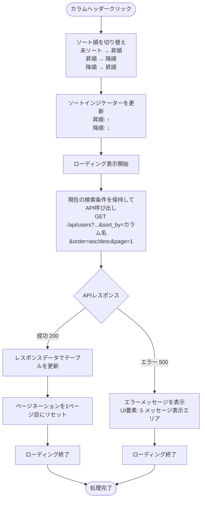
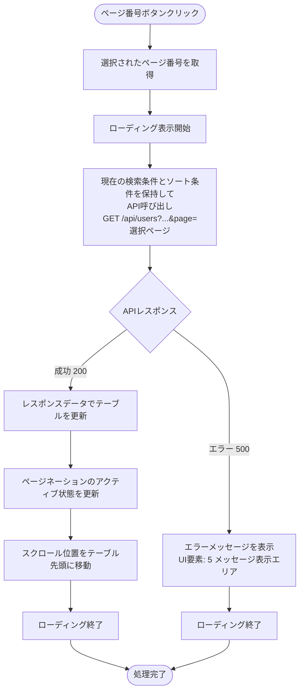
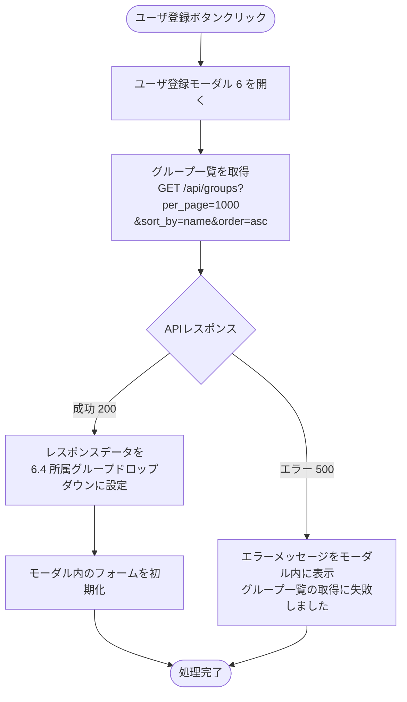
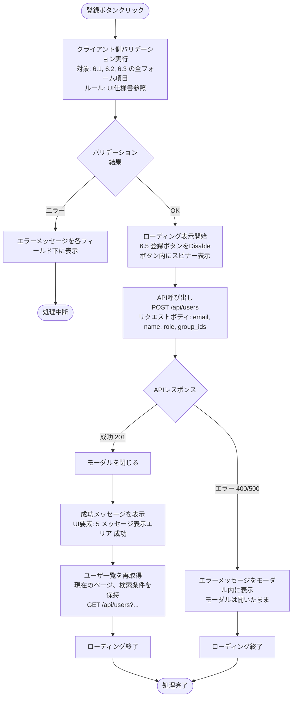
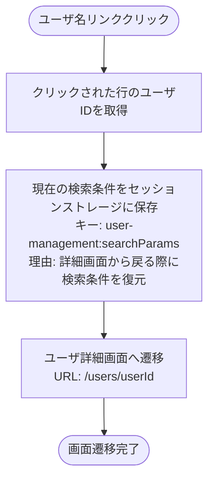
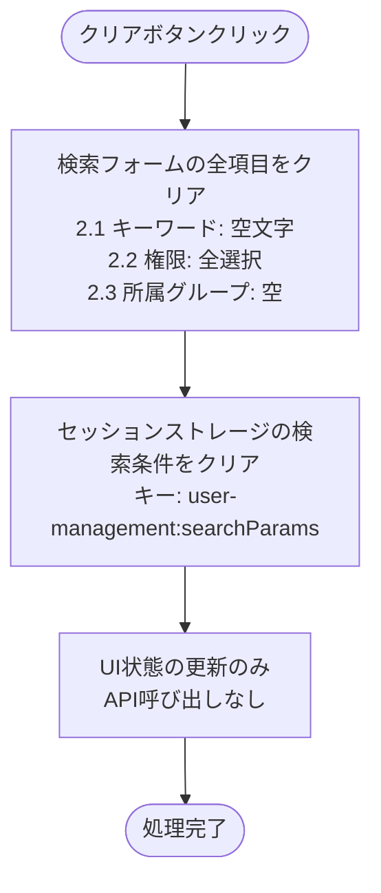
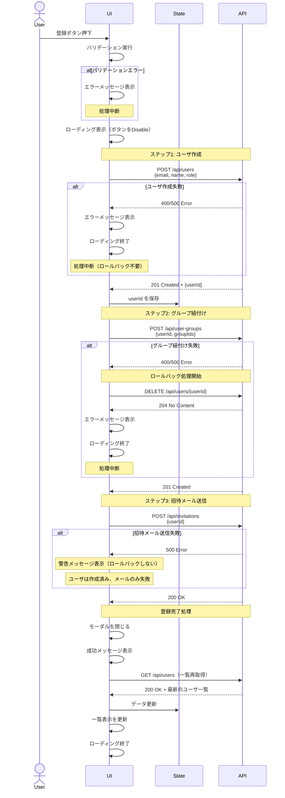
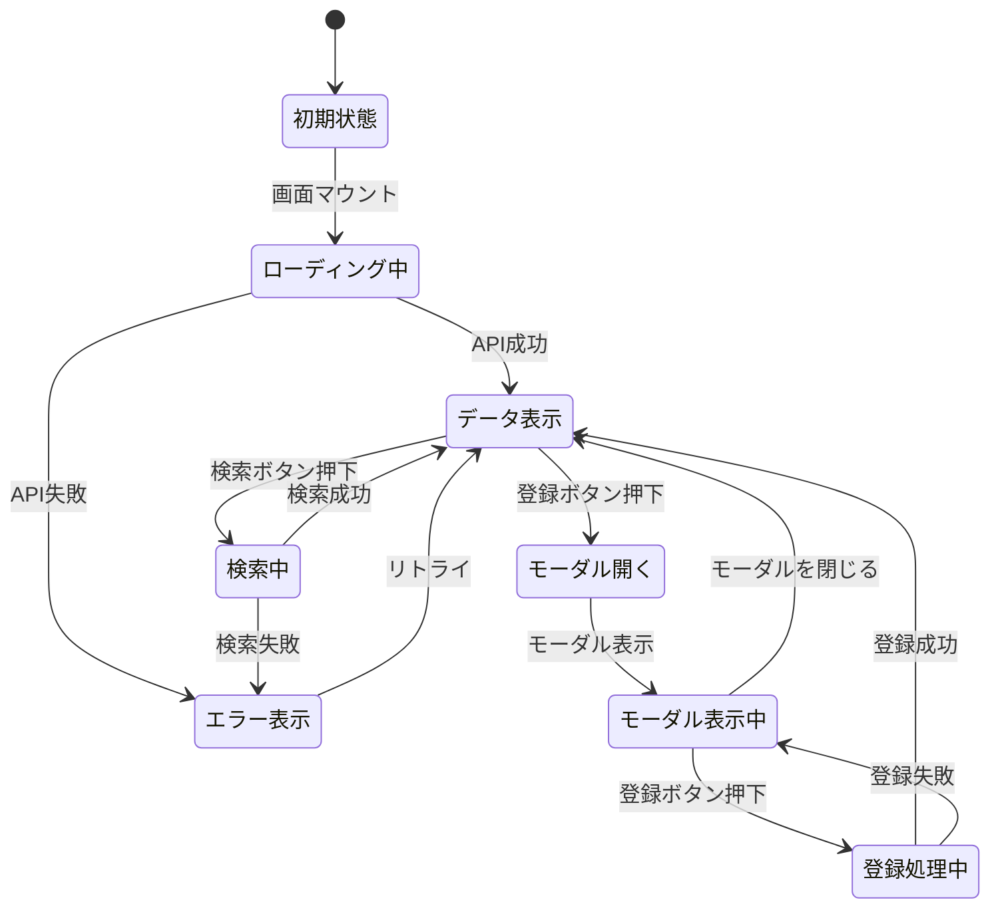

# {画面名} - ワークフロー仕様書

> **📌 このファイルはテンプレートです**
>
> - このファイルに記載されている「**例:**」や「**記入例:**」は、テンプレート使用時の参考情報です
> - 実際のワークフロー仕様書を作成する際は、これらの例示セクションは**削除**してください
> - `{プレースホルダー}` 部分を実際の値に置き換えて使用してください
> - 実際のワークフロー仕様書には具体的な値のみを記載し、例示や参考情報は含めないでください

## 📑 目次

- [概要](#概要)
- [使用するFlaskルート一覧](#使用するflaskルート一覧)
- [ルート呼び出しマッピング（複雑な場合のみ）](#ルート呼び出しマッピング複雑な場合のみ)
- [ワークフロー一覧](#ワークフロー一覧)
  - [初期表示](#初期表示)
  - [検索・絞り込み](#検索絞り込み)
  - [ソート](#ソート)
  - [ページング](#ページング)
  - [ユーザ登録](#ユーザ登録)
  - [その他の操作](#その他の操作)
- [シーケンス図（複雑な場合）](#シーケンス図複雑な場合)
  - [ロールバック実装例](#ロールバック実装例)
  - [エラー分類とハンドリング](#エラー分類とハンドリング)
- [使用データベース詳細（必要に応じて）](#使用データベース詳細必要に応じて)
  - [使用テーブル一覧](#使用テーブル一覧)
  - [SQL実行順序](#sql実行順序)
  - [インデックス最適化](#インデックス最適化)
- [トランザクション管理（必要に応じて）](#トランザクション管理必要に応じて)
- [セキュリティ実装（必要に応じて）](#セキュリティ実装必要に応じて)
  - [認証・認可実装](#認証認可実装)
  - [入力検証](#入力検証)
  - [ログ出力ルール](#ログ出力ルール)
- [状態管理（複雑な場合）](#状態管理複雑な場合)
- [パフォーマンス最適化（必要に応じて）](#パフォーマンス最適化必要に応じて)
- [関連ドキュメント](#関連ドキュメント)

---

## 概要

このドキュメントは、{画面名}のユーザー操作に対する処理フロー、バリデーション実行タイミング、データベース処理の詳細を記載します。

**このドキュメントの役割:**
- ✅ ユーザー操作のトリガー条件
- ✅ 処理フローの詳細（Flaskルート呼び出しシーケンス、フォーム送信、リダイレクト）
- ✅ バリデーション実行タイミング（いつチェックするか）
- ✅ エラーハンドリングフロー
- ✅ サーバーサイド処理詳細（SQL、変数、条件分岐、コード例）
- ✅ データベース利用詳細（トランザクション管理、テーブル操作、インデックス）
- ✅ セキュリティ実装詳細（認証、入力検証、ログ出力）

**UI仕様書との役割分担:**
- **UI仕様書**: バリデーションルール定義（何をチェックするか）、UI要素の詳細仕様
- **ワークフロー仕様書**: バリデーション実行タイミング（いつどのようにチェックするか）、処理フロー、サーバーサイド実装詳細

**セクションの記載ガイドライン:**

すべての画面で必須のセクション：
- 概要
- 使用するFlaskルート一覧
- ワークフロー一覧（各操作の詳細）

複雑な場合のみ記載するセクション：
- **ルート呼び出しマッピング**: 複数のルートを使用する場合、操作とルートの対応を一覧化すると便利
- **シーケンス図**: 複数ルートの連鎖処理、条件分岐が複雑、ロールバック処理が必要な場合
- **使用データベース詳細**: データベース操作が複雑な場合（複数テーブル、トランザクション管理が必要）
- **トランザクション管理**: 複数のデータベース操作を含む場合、トランザクション開始・終了タイミングを明記
- **セキュリティ実装**: 認証・認可、入力検証、ログ出力ルールが複雑な場合
- **状態管理**: セッションストレージの使用がある場合、フォーム状態が複雑な場合
- **パフォーマンス最適化**: 大量データの処理、SQL最適化が必要な場合

**注:** UI要素の詳細やバリデーションルールは [UI仕様書](./ui-specification.md) を参照してください。

---

## 使用するFlaskルート一覧

この画面で使用するすべてのFlaskルート（エンドポイント）を記載します。

| No | ルート名 | エンドポイント | メソッド | 用途 | レスポンス形式 | 備考 |
|----|---------|---------------|---------|------|---------------|------|
| {No} | {ルート名} | `{エンドポイント}` | GET/POST | {用途} | HTML/リダイレクト | {備考} |

**記入例:（テンプレート参考用 - 実際のワークフロー仕様書では削除）**

| No | ルート名 | エンドポイント | メソッド | 用途 | レスポンス形式 | 備考 |
|----|---------|---------------|---------|------|---------------|------|
| 1 | ユーザ一覧表示 | `/users` | GET | ユーザ検索・一覧表示 | HTML | ページング・検索対応 |
| 2 | ユーザ登録画面 | `/users/create` | GET | ユーザ登録フォーム表示 | HTML | グループ選択肢を含む |
| 3 | ユーザ登録実行 | `/users/create` | POST | ユーザ登録処理 | リダイレクト (302) | 成功時: `/users`、失敗時: フォーム再表示 |
| 4 | ユーザ詳細表示 | `/users/<user_id>` | GET | ユーザ詳細情報表示 | HTML | - |
| 5 | ユーザ更新実行 | `/users/<user_id>/update` | POST | ユーザ更新処理 | リダイレクト (302) | 成功時: `/users/<user_id>` |
| 6 | ユーザ削除実行 | `/users/<user_id>/delete` | POST | ユーザ削除処理 | リダイレクト (302) | 成功時: `/users` |

**注:**
- **レスポンス形式**:
  - `HTML`: Jinja2テンプレートをレンダリングして返す（`render_template()`）
  - `リダイレクト (302)`: 成功時に別のルートへリダイレクト（`redirect(url_for())`）、失敗時はフォームを再表示
- **Flask Blueprint構成**: 各機能は独立したBlueprintとして実装（例: `users_bp`, `devices_bp`）
- **SSR特性**: すべての処理はサーバーサイドで完結（JSONレスポンスなし）

---

## ルート呼び出しマッピング（複雑な場合のみ）

**注:** 複数のルートを使用する複雑な画面の場合、ユーザー操作とルート呼び出しの対応関係を一覧化すると便利です。単純な画面では不要です。

**このセクションを記載すべき場合:**
- ✅ 使用するルートが5個以上ある
- ✅ 1つの操作で複数のルートを連鎖的に呼び出す
- ✅ 操作とルートの対応関係が複雑

**このセクションが不要な場合:**
- ❌ 使用するルートが3個以下
- ❌ 1つの操作に1つのルート呼び出しのみ
- ❌ 対応関係が明確（ワークフロー一覧で十分）

**記入例:（テンプレート参考用 - 実際のワークフロー仕様書では削除）**

| ユーザー操作 | トリガー | 呼び出すルート | パラメータ | レスポンス | エラー時の挙動 |
|-------------|---------|-------------|-----------|-----------|---------------|
| 画面初期表示 | URL直接アクセス | `GET /users` | `page=1` | HTML（ユーザ一覧画面） | エラーページ表示 |
| 検索ボタン押下 | フォーム送信 | `GET /users` | `keyword=..., roles=..., page=1` | HTML（検索結果画面） | エラーメッセージ表示 |
| ユーザ登録ボタン押下 | リンククリック | `GET /users/create` | なし | HTML（登録フォーム） | エラーページ表示 |
| ユーザ登録実行 | フォーム送信 | `POST /users/create` | `email, name, role, group_ids` | リダイレクト → `GET /users` | フォーム再表示（エラーメッセージ付き） |

---

## ワークフロー一覧

### 初期表示

**トリガー:** URL直接アクセス時（ユーザーが画面にアクセスしたとき）

**前提条件:**
- ユーザーがログイン済み（Databricks認証完了）
- 適切な権限を持っている（`nsw_admin` または `user_admin`）

#### 処理フロー

```mermaid
flowchart TD
    Start([`URL直接アクセス`]) --> Auth[`認証チェック<br>Databricksリバースプロキシヘッダ確認`]
    Auth --> CheckAuth{`認証済み?`}
    CheckAuth -->|未認証| LoginRedirect[`ログイン画面へリダイレクト`]

    CheckAuth -->|認証済み| Permission[`権限チェック<br>nsw_admin または user_admin`]
    Permission --> CheckPerm{`権限OK?`}
    CheckPerm -->|権限なし| Error403[`403エラーページ表示`]

    CheckPerm -->|権限OK| Init[`検索条件を初期化<br>page=1, per_page=25<br>sort_by=name, order=asc`]
    Init --> Query[`DBクエリ実行<br>SELECT * FROM users<br>WHERE organization_id=現在の組織ID<br>LIMIT 25 OFFSET 0`]
    Query --> CheckDB{`DBクエリ<br>結果`}

    CheckDB -->|成功| Template[`Jinja2テンプレートレンダリング<br>render_template('users/list.html'<br>users=users, total=total, page=1)`]
    Template --> Response[`HTMLレスポンス返却`]

    CheckDB -->|失敗| Error500[`500エラーページ表示`]

    LoginRedirect --> End([`処理完了`])
    Error403 --> End
    Response --> End
    Error500 --> End
```

#### Flaskルート

| ルート | エンドポイント | 詳細 |
|-------|---------------|------|
| ユーザ一覧表示 | `GET /users` | クエリパラメータ: `page`, `keyword`, `roles`, `sort_by`, `order` |

#### バリデーション

**実行タイミング:** なし（初期表示のため、デフォルト値を使用）

**データスコープ制限:**
- ログインユーザーの `organization_id` でデータを自動的にフィルタリング
- SQL WHERE句に `organization_id = current_user.organization_id` を追加

#### 処理詳細（サーバーサイド）

**① 認証・認可チェック**

リバースプロキシヘッダから認証情報を取得し、権限を確認します。

**処理内容:**
- ヘッダ `X-Forwarded-User` からユーザーIDを取得
- ヘッダ `X-Forwarded-Email` からメールアドレスを取得
- データベースから現在ユーザー情報を取得（ロール、組織ID）

**変数・パラメータ:**
- `current_user_id`: string - リバースプロキシヘッダから取得したユーザーID
- `current_user`: User - データベースから取得したユーザーオブジェクト
- `organization_id`: string - 現在ユーザーの組織ID（データスコープ制限用）

**実装例:**
```python
from flask import request

def get_current_user():
    user_id = request.headers.get('X-Forwarded-User')
    if not user_id:
        abort(401)

    user = User.query.filter_by(user_id=user_id).first()
    if not user:
        abort(403)

    return user

current_user = get_current_user()
organization_id = current_user.organization_id
```

**② クエリパラメータ取得**

リクエストからクエリパラメータを取得し、デフォルト値を設定します。

**処理内容:**
- `page`: ページ番号（デフォルト: 1）
- `per_page`: 1ページあたりの件数（デフォルト: 25）
- `sort_by`: ソートフィールド（デフォルト: name）
- `order`: ソート順（デフォルト: asc）

**変数・パラメータ:**
- `page`: int - ページ番号
- `per_page`: int - 1ページあたりの件数
- `sort_by`: string - ソートフィールド
- `order`: string - ソート順（asc/desc）

**実装例:**
```python
page = request.args.get('page', 1, type=int)
per_page = request.args.get('per_page', 25, type=int)
sort_by = request.args.get('sort_by', 'name')
order = request.args.get('order', 'asc')
```

**③ データベースクエリ実行**

ユーザーマスタからデータを取得します。

**使用テーブル:** users（ユーザーマスタ）

**SQL詳細:**
```sql
SELECT
  user_id,
  name,
  email,
  role,
  last_login_at,
  created_at
FROM
  users
WHERE
  organization_id = :organization_id
  AND deleted_flag = 0
ORDER BY
  {sort_by} {order}
LIMIT :per_page OFFSET :offset
```

**変数・パラメータ:**
- `organization_id`: string - データスコープ制限用の組織ID
- `offset`: int - ページングオフセット（計算式: `(page - 1) * per_page`）
- `users`: list - 検索結果のユーザーリスト
- `total`: int - 総件数（ページネーション用）

**実装例:**
```python
offset = (page - 1) * per_page

users = User.query.filter_by(
    organization_id=organization_id,
    deleted_flag=0
).order_by(
    getattr(User, sort_by).asc() if order == 'asc' else getattr(User, sort_by).desc()
).limit(per_page).offset(offset).all()

total = User.query.filter_by(
    organization_id=organization_id,
    deleted_flag=0
).count()
```

**④ HTMLレンダリング**

Jinja2テンプレートをレンダリングしてHTMLレスポンスを返却します。

**処理内容:**
- テンプレート: `users/list.html`
- コンテキスト: `users`, `total`, `page`, `per_page`, `sort_by`, `order`

**実装例:**
```python
return render_template('users/list.html',
                      users=users,
                      total=total,
                      page=page,
                      per_page=per_page,
                      sort_by=sort_by,
                      order=order)
```

#### 表示メッセージ

| メッセージID | 表示内容 | 表示タイミング | 表示場所 |
|-------------|---------|---------------|---------|
| ERR_001 | データの取得に失敗しました | DBクエリ失敗時 | エラーページ |
| INFO_001 | ユーザが見つかりませんでした | 検索結果が0件 | (4) データテーブル内（情報） |

**注:** メッセージの詳細は [UI仕様書](./ui-specification.md) の要素詳細セクションを参照してください。

#### エラーハンドリング

| HTTPステータス | エラー種別 | 処理内容 | 表示内容 |
|--------------|-----------|---------|---------|
| 401 | 認証エラー | ログイン画面へリダイレクト | - |
| 403 | 権限エラー | 403エラーページ表示 | この操作を実行する権限がありません |
| 500 | データベースエラー | 500エラーページ表示 | データの取得に失敗しました |

#### UI状態

- 検索条件: デフォルト値（空）
- テーブル: ユーザ一覧データ表示
- ページネーション: 1ページ目を選択状態

---

### 検索・絞り込み

**トリガー:** (2.4) 検索ボタンクリック（フォーム送信）

**前提条件:**
- 検索条件が入力されている（空でも可）

#### 処理フロー

```mermaid
flowchart TD
    Start([検索ボタンクリック<br>フォーム送信]) --> Validate[サーバーサイドバリデーション<br>WTForms検証]
    Validate --> ValidCheck{バリデーション<br>結果}

    ValidCheck -->|エラー| ValidError[フォーム再表示<br>エラーメッセージ付き]
    ValidError --> ValidEnd([処理中断])

    ValidCheck -->|OK| Convert[検索条件をクエリパラメータに変換<br>keyword: form.keyword.data<br>roles: form.roles.data<br>page: 1（リセット）<br>per_page: 25<br>現在のソート条件を保持]
    Convert --> Query[DBクエリ実行<br>SELECT * FROM users<br>WHERE organization_id=現在の組織ID<br>AND (name LIKE '%keyword%' OR email LIKE '%keyword%')<br>AND role IN (roles)<br>LIMIT 25 OFFSET 0]
    Query --> CheckDB{DBクエリ<br>結果}

    CheckDB -->|成功| Template[Jinja2テンプレートレンダリング<br>render_template('users/list.html'<br>users=users, keyword=keyword, ...)]
    Template --> Response[HTMLレスポンス返却]

    CheckDB -->|失敗| Error500[500エラーページ表示]

    ValidEnd --> End([処理完了])
    Response --> End
    Error500 --> End
```

**パラメータ例:**
```
GET /users?keyword=山田&roles=user_admin&roles=user&page=1&per_page=25&sort_by=name&order=asc
```

#### Flaskルート

| ルート | エンドポイント | 詳細 |
|-------|---------------|------|
| ユーザ一覧表示（検索） | `GET /users` | クエリパラメータ: `keyword`, `roles`, `page`, `sort_by`, `order` |

#### バリデーション

**実行タイミング:** フォーム送信直後（サーバーサイド）

**バリデーション対象:** (2.1) キーワード入力、(2.2) 権限選択、(2.3) グループ選択

**バリデーションルール:** [UI仕様書](./ui-specification.md) の要素詳細 (2) 検索フォーム > バリデーション を参照

**エラー表示:**
- 表示場所: 各入力フィールドの下（フォーム再表示時）
- 表示方法: 赤色テキスト、入力フィールドを赤枠で囲む

#### 処理詳細（サーバーサイド）

**① フォーム検証（WTForms）**

WTFormsを使用してフォームデータを検証します。

**処理内容:**
- `keyword`: 最大長100文字
- `roles`: 許可された値のみ（user_admin, nsw_admin, user）
- `group_ids`: 存在するグループIDのみ

**変数・パラメータ:**
- `form`: SearchForm - WTFormsフォームオブジェクト
- `keyword`: string - 検索キーワード
- `roles`: list - 権限フィルタ
- `group_ids`: list - グループフィルタ

**実装例:**
```python
from flask import request, render_template

class SearchForm(FlaskForm):
    keyword = StringField('キーワード', validators=[Length(max=100)])
    roles = SelectMultipleField('権限', choices=[
        ('user_admin', 'ユーザー管理者'),
        ('nsw_admin', 'NSW管理者'),
        ('user', '一般ユーザー')
    ])

form = SearchForm(request.args)
if not form.validate():
    return render_template('users/list.html', form=form, users=[], errors=form.errors)

keyword = form.keyword.data or ''
roles = form.roles.data or []
```

**② 検索クエリ実行**

検索条件に基づいてデータベースからユーザーを取得します。

**使用テーブル:** users（ユーザーマスタ）

**SQL詳細:**
```sql
SELECT
  user_id,
  name,
  email,
  role,
  last_login_at
FROM
  users
WHERE
  organization_id = :organization_id
  AND deleted_flag = 0
  AND (
    name LIKE :keyword
    OR email LIKE :keyword
  )
  AND (
    CASE WHEN :roles IS NOT NULL THEN role IN :roles ELSE TRUE END
  )
ORDER BY
  {sort_by} {order}
LIMIT :per_page OFFSET :offset
```

**変数・パラメータ:**
- `keyword`: string - 部分一致検索用（`%keyword%`）
- `roles`: list - 権限フィルタ
- `offset`: int - ページングオフセット

**実装例:**
```python
query = User.query.filter_by(
    organization_id=current_user.organization_id,
    deleted_flag=0
)

if keyword:
    query = query.filter(
        or_(
            User.name.like(f'%{keyword}%'),
            User.email.like(f'%{keyword}%')
        )
    )

if roles:
    query = query.filter(User.role.in_(roles))

users = query.order_by(
    getattr(User, sort_by).asc() if order == 'asc' else getattr(User, sort_by).desc()
).limit(per_page).offset(offset).all()

total = query.count()
```

#### 表示メッセージ

| メッセージID | 表示内容 | 表示タイミング | 表示場所 |
|-------------|---------|---------------|---------|
| ERR_001 | データの取得に失敗しました | DBクエリ失敗時 | エラーページ |
| INFO_001 | ユーザが見つかりませんでした | 検索結果が0件 | (4) データテーブル内（情報） |

#### エラーハンドリング

| HTTPステータス | エラー種別 | 処理内容 | 表示内容 |
|--------------|-----------|---------|---------|
| 400 | バリデーションエラー | フォーム再表示（エラーメッセージ付き） | バリデーションエラーメッセージ |
| 500 | データベースエラー | 500エラーページ表示 | データの取得に失敗しました |

#### UI状態

- 検索条件: 入力値を保持（フォームに再設定）
- テーブル: 検索結果データ表示
- ページネーション: 1ページ目にリセット

---

### ソート

**トリガー:** (4) データテーブルのソート可能カラムのヘッダークリック

**前提条件:**
- ソート可能なカラム（(4.1), (4.2), (4.3), (4.5)）のヘッダーをクリック

#### 処理フロー



**パラメータ例:**
```
# ユーザ名でソート（昇順）
GET /api/users?keyword=山田&sort_by=name&order=asc&page=1&per_page=25

# 最終ログイン日時でソート（降順）
GET /api/users?keyword=山田&sort_by=last_login_at&order=desc&page=1&per_page=25
```

#### バリデーション

**実行タイミング:** なし

#### 表示メッセージ

| メッセージID | 表示内容 | 表示タイミング | 表示場所 |
|-------------|---------|---------------|---------|
| ERR_001 | 設定ファイル: データの取得に失敗しました | API呼び出し失敗時（500） | (5) メッセージ表示エリア（エラー） |

#### エラーハンドリング

| HTTPステータス | 処理内容 |
|--------------|---------|
| 500 | ERR_001メッセージを(5)に表示 |

#### UI状態

- 検索条件: 保持
- ソート条件: 更新
- テーブル: ソート済みデータ表示
- ページネーション: 1ページ目にリセット

---

### ページング

**トリガー:** (4.7) ページネーションのページ番号ボタン、「次へ」「前へ」ボタンクリック

**前提条件:**
- 複数ページのデータが存在する

#### 処理フロー



**パラメータ例:**
```
# 2ページ目に遷移
GET /api/users?keyword=山田&sort_by=name&order=asc&page=2&per_page=25

# 5ページ目に遷移
GET /api/users?keyword=山田&sort_by=name&order=asc&page=5&per_page=25
```

#### バリデーション

**実行タイミング:** なし

#### 表示メッセージ

| メッセージID | 表示内容 | 表示タイミング | 表示場所 |
|-------------|---------|---------------|---------|
| ERR_001 | 設定ファイル: データの取得に失敗しました | API呼び出し失敗時（500） | (5) メッセージ表示エリア（エラー） |

#### エラーハンドリング

| HTTPステータス | 処理内容 |
|--------------|---------|
| 500 | ERR_001メッセージを(5)に表示 |

#### UI状態

- 検索条件: 保持
- ソート条件: 保持
- テーブル: 選択ページのデータ表示
- ページネーション: 選択ページをアクティブ状態

---

### ユーザ登録

#### ユーザ登録ボタン押下

**トリガー:** (3.1) ユーザ登録ボタンクリック

**前提条件:**
- ユーザーが `nsw_admin` または `user_admin` 権限を持っている

##### 処理フロー



##### バリデーション

**実行タイミング:** なし

##### 表示メッセージ

| メッセージID | 表示内容 | 表示タイミング | 表示場所 |
|-------------|---------|---------------|---------|
| ERR_005 | 設定ファイル: グループ一覧の取得に失敗しました | グループAPI失敗時 | (6) モーダル内（エラー） |

##### エラーハンドリング

| HTTPステータス | 処理内容 |
|--------------|---------|
| 500 | ERR_005メッセージをモーダル内に表示 |

##### UI状態

- モーダル: 表示
- 背景: オーバーレイ表示
- フォーム: 空の状態

---

#### ユーザ登録実行

**トリガー:** (6.5) 登録ボタンクリック

**前提条件:**
- すべての必須項目が入力されている

##### 処理フロー



##### バリデーション

**実行タイミング:** 登録ボタンクリック直後（API呼び出し前）

**バリデーション対象:** (6.1), (6.2), (6.3) の全フォーム項目

**バリデーションルール:** [UI仕様書](./ui-specification.md) の要素詳細 (6) ユーザ登録モーダル > バリデーション を参照

**エラー表示:**
- 表示場所: 各入力フィールドの下
- 表示方法: 赤色テキスト、入力フィールドを赤枠で囲む

##### 表示メッセージ

| メッセージID | 表示内容 | 表示タイミング | 表示場所 |
|-------------|---------|---------------|---------|
| USR_001 | 設定ファイル: ユーザを登録しました | ユーザ登録成功時 | (5) メッセージ表示エリア（成功・トースト） |
| ERR_002 | 設定ファイル: ユーザの登録に失敗しました | API呼び出し失敗時（500） | (6) モーダル内（エラー） |
| ERR_003 | 設定ファイル: このメールアドレスは既に使用されています | メールアドレス重複エラー | (6.1) フィールド下（エラー） |

##### エラーハンドリング

| HTTPステータス | 処理内容 |
|--------------|---------|
| 400 (メールアドレス重複) | ERR_003メッセージを(6.1)フィールド下に表示 |
| 400 (その他) | バリデーションエラーメッセージを各フィールドに表示 |
| 500 | ERR_002メッセージをモーダル内に表示 |

##### UI状態

- モーダル: 閉じる（成功時）/ 開いたまま（エラー時）
- テーブル: 最新データに更新（成功時）
- メッセージ表示エリア: 成功メッセージ表示（成功時）

---

### その他の操作

#### ユーザ名クリック（詳細画面へ遷移）

**トリガー:** (4.1) ユーザ名リンククリック

**前提条件:** なし

##### 処理フロー



##### バリデーション

**実行タイミング:** なし

##### 表示メッセージ

なし

##### エラーハンドリング

なし

##### UI状態

- 画面遷移: ユーザ詳細画面

---

#### クリアボタン押下

**トリガー:** (2.5) クリアボタンクリック

**前提条件:** なし

##### 処理フロー



**注:** クリア後に検索を実行する場合は、ユーザーが明示的に (2.4) 検索ボタンをクリックする必要があります。

##### バリデーション

**実行タイミング:** なし

##### 表示メッセージ

なし

##### エラーハンドリング

なし

##### UI状態

- 検索フォーム: すべてクリア
- テーブル: 変更なし（検索ボタン押下まで更新しない）

---

## シーケンス図（複雑な場合）

**注:** 複雑なAPI呼び出しシーケンスがある場合のみ記載してください。単純なCRUD操作の場合は不要です。

**このセクションを記載すべき場合:**
- ✅ 複数のAPIを連鎖的に呼び出す（例: ユーザ作成 → グループ紐付け → 招待メール送信）
- ✅ 条件分岐が複雑（例: 権限によって異なるAPIを呼び出す）
- ✅ エラー時のロールバックロジックが必要
- ✅ リアルタイム更新やポーリングがある
- ✅ 複数のユーザーアクションが連動する

**このセクションが不要な場合:**
- ❌ 単一のAPI呼び出しのみ
- ❌ 単純な検索・一覧表示・登録・更新・削除（CRUD）
- ❌ エラー時の処理が単純（メッセージ表示のみ）

### 複雑なAPI呼び出しの例: ユーザ登録フロー（連鎖処理）

**トリガー:** ユーザ登録モーダル内の「登録」ボタン押下



**ロールバック方針:**
- グループ紐付け失敗時: ステップ1で作成したユーザを削除（ロールバック）
- 招待メール送信失敗時: ロールバックしない（警告のみ、ユーザとグループ紐付けは成功しているため）

### ロールバック実装例

**ロールバックが必要なケース:**
- ✅ 複数APIの連鎖処理中、途中でエラーが発生した場合
- ✅ データの整合性が保てない場合

**ロールバック不要なケース:**
- ❌ 最終ステップ（招待メール送信）が失敗した場合（警告のみ）
- ❌ 読み取り専用のAPI呼び出しが失敗した場合

```typescript
async function registerUser(data: UserCreateInput) {
  let createdUserId: string | null = null;
  let groupsLinked = false;

  try {
    // ステップ1: ユーザ作成
    const userResponse = await createUser(data);
    createdUserId = userResponse.data.userId;

    // ステップ2: グループ紐付け
    await linkUserToGroups(createdUserId, data.groupIds);
    groupsLinked = true;

    // ステップ3: 招待メール送信
    try {
      await sendInvitation(createdUserId);
    } catch (error) {
      // 招待メール失敗は警告のみ（ロールバックしない）
      console.warn('招待メール送信に失敗しました', error);
      showWarning('ユーザは登録されましたが、招待メールの送信に失敗しました');
    }

    return { success: true, userId: createdUserId };

  } catch (error) {
    // ロールバック処理
    if (createdUserId) {
      try {
        await deleteUser(createdUserId);
        console.log('ロールバック完了: ユーザを削除しました');
      } catch (rollbackError) {
        console.error('ロールバック失敗', rollbackError);
        // ロールバック失敗時はシステム管理者に通知
        notifyAdmin('ロールバック失敗', { userId: createdUserId, error: rollbackError });
      }
    }

    throw error;
  }
}
```

### エラー分類とハンドリング

**記入例:（テンプレート参考用 - 実際のワークフロー仕様書では削除）**

| HTTPステータス | エラー種別 | 表示メッセージ | ロールバック | リトライ |
|--------------|-----------|---------------|------------|---------|
| 200/302 | 成功 | - | - | - |
| 400 | バリデーションエラー | フィールド単位でエラー表示（フォーム再表示） | × | × |
| 401 | 認証エラー | ログイン画面へリダイレクト | × | × |
| 403 | 権限エラー | 「この操作を実行する権限がありません」 | × | × |
| 404 | リソース不在 | 「データが見つかりませんでした」 | × | × |
| 409 | 競合エラー | 「このメールアドレスは既に使用されています」 | × | × |
| 500 | データベースエラー | 「サーバーエラーが発生しました」 | ✓ | × |

---

## 使用データベース詳細（必要に応じて）

**注:** データベース操作が複雑な場合（複数テーブル、複雑なSQL、トランザクション管理が必要）のみ記載してください。

**このセクションを記載すべき場合:**
- ✅ 複数のテーブルを使用する（2テーブル以上）
- ✅ 複雑なSQL（JOIN、サブクエリ、集計等）を実行する
- ✅ トランザクション管理が必要（複数のINSERT/UPDATE/DELETE）
- ✅ インデックス最適化が重要（パフォーマンス要件が厳しい）

**このセクションが不要な場合:**
- ❌ 単一テーブルへの単純なSELECT
- ❌ ORM（SQLAlchemy）の基本的なCRUD操作のみ
- ❌ データベース操作が各ワークフローセクションで十分説明されている

### 使用テーブル一覧

| No | テーブル名 | 論理名 | 操作種別 | ワークフロー | 目的 | インデックス利用 |
|----|-----------|--------|---------|------------|------|----------------|
| {No} | {物理名} | {論理名} | SELECT/INSERT/UPDATE/DELETE | {ワークフロー名} | {目的} | {利用するインデックス} |

**記入例:（テンプレート参考用 - 実際のワークフロー仕様書では削除）**

| No | テーブル名 | 論理名 | 操作種別 | ワークフロー | 目的 | インデックス利用 |
|----|-----------|--------|---------|------------|------|----------------|
| 1 | users | ユーザーマスタ | SELECT | 初期表示、検索 | ユーザー情報取得 | PRIMARY KEY (user_id)<br>INDEX (organization_id) |
| 2 | users | ユーザーマスタ | INSERT | ユーザ登録 | 新規ユーザー作成 | - |
| 3 | user_groups | ユーザーグループ紐付け | INSERT | ユーザ登録 | グループ紐付け | PRIMARY KEY (user_id, group_id) |
| 4 | groups | グループマスタ | SELECT | ユーザ登録画面表示 | グループ選択肢取得 | PRIMARY KEY (group_id) |

### SQL実行順序

| 順序 | ワークフロー | SQL種別 | テーブル | トランザクション | 備考 |
|------|------------|---------|---------|----------------|------|
| {順序} | {ワークフロー名} | SELECT/INSERT/UPDATE/DELETE | {テーブル名} | 読み取り/書き込み | {備考} |

**記入例:（テンプレート参考用 - 実際のワークフロー仕様書では削除）**

| 順序 | ワークフロー | SQL種別 | テーブル | トランザクション | 備考 |
|------|------------|---------|---------|----------------|------|
| 1 | ユーザ登録 | SELECT | users | 読み取り | メールアドレス重複チェック |
| 2 | ユーザ登録 | INSERT | users | 書き込み | 新規ユーザー作成 |
| 3 | ユーザ登録 | INSERT | user_groups | 書き込み | グループ紐付け |

### インデックス最適化

**使用するインデックス:**
- {テーブル名}.{カラム名}: {インデックス種別} - {目的}

**記入例:（テンプレート参考用 - 実際のワークフロー仕様書では削除）**

**使用するインデックス:**
- users.user_id: PRIMARY KEY - ユーザー一意識別
- users.organization_id: INDEX - データスコープ制限による検索高速化
- users.email: UNIQUE INDEX - メールアドレス重複チェック高速化
- users.(name, email): 複合INDEX - キーワード検索高速化

**注:** インデックス詳細は [データベース設計書](../01-architecture/database.md) を参照してください。

---

## トランザクション管理（必要に応じて）

**注:** 複数のデータベース操作を含む場合、トランザクション開始・終了タイミングを明記してください。

**このセクションを記載すべき場合:**
- ✅ 複数のINSERT/UPDATE/DELETE操作を含む
- ✅ データ整合性の保証が必要
- ✅ ロールバック処理が必要
- ✅ トランザクション分離レベルの指定が必要

**このセクションが不要な場合:**
- ❌ 読み取り専用（SELECT のみ）
- ❌ 単一のINSERT/UPDATE/DELETE操作のみ
- ❌ ORM（SQLAlchemy）のデフォルトトランザクション管理で十分

### トランザクション開始・終了タイミング

**トランザクション開始:**
- ワークフロー: {ワークフロー名}
- 開始タイミング: {タイミングの説明}
- 開始条件: {条件}

**トランザクション終了（コミット）:**
- 終了タイミング: {タイミングの説明}
- 終了条件: すべての処理が正常完了

**トランザクション終了（ロールバック）:**
- ロールバックタイミング: {タイミングの説明}
- ロールバック対象: {対象の処理ステップ}
- ロールバック条件: {条件}

**記入例:（テンプレート参考用 - 実際のワークフロー仕様書では削除）**

**トランザクション開始:**
- ワークフロー: ユーザ登録実行
- 開始タイミング: バリデーション完了後、DB操作開始前
- 開始条件: フォームバリデーションが成功

**トランザクション終了（コミット）:**
- 終了タイミング: すべてのINSERT操作完了後
- 終了条件: users テーブルへのINSERTとuser_groupsテーブルへのINSERTが両方成功

**トランザクション終了（ロールバック）:**
- ロールバックタイミング: いずれかのDB操作失敗時
- ロールバック対象: users テーブルへのINSERT、user_groupsテーブルへのINSERT
- ロールバック条件: メールアドレス重複エラー、データベースエラー

**実装例:**
```python
from flask import request, redirect, url_for, flash
from sqlalchemy.exc import IntegrityError

@bp.route('/users/create', methods=['POST'])
def create_user():
    form = UserCreateForm()

    if not form.validate_on_submit():
        return render_template('users/form.html', form=form)

    try:
        # トランザクション開始（SQLAlchemyセッション）
        user = User(
            email=form.email.data,
            name=form.name.data,
            role=form.role.data,
            organization_id=current_user.organization_id
        )
        db.session.add(user)
        db.session.flush()  # userのIDを取得するためにflush

        # グループ紐付け
        for group_id in form.group_ids.data:
            user_group = UserGroup(user_id=user.user_id, group_id=group_id)
            db.session.add(user_group)

        # トランザクションコミット
        db.session.commit()

        flash('ユーザを登録しました', 'success')
        return redirect(url_for('users.list_users'))

    except IntegrityError as e:
        # トランザクションロールバック
        db.session.rollback()

        if 'email' in str(e):
            form.email.errors.append('このメールアドレスは既に使用されています')
        else:
            flash('ユーザの登録に失敗しました', 'error')

        return render_template('users/form.html', form=form)

    except Exception as e:
        # トランザクションロールバック
        db.session.rollback()
        flash('サーバーエラーが発生しました', 'error')
        return render_template('users/form.html', form=form)
```

---

## セキュリティ実装（必要に応じて）

**注:** 認証・認可、入力検証、ログ出力ルールが複雑な場合のみ記載してください。

**このセクションを記載すべき場合:**
- ✅ データスコープ制限が複雑（複数条件の組み合わせ）
- ✅ ロール別の権限制御が複雑
- ✅ 機密情報の取り扱いがある
- ✅ 特殊な入力検証が必要（カスタムバリデーション）
- ✅ ログ出力ルールが複雑（マスキング処理等）

**このセクションが不要な場合:**
- ❌ Databricks標準認証のみ
- ❌ WTFormsの標準バリデーションのみ
- ❌ データスコープ制限が単純（organization_id のみ）

### 認証・認可実装

**認証方式:**
- {認証方式の説明}

**認可ロジック:**
- {権限チェックの説明}

**記入例:（テンプレート参考用 - 実際のワークフロー仕様書では削除）**

**認証方式:**
- Databricksリバースプロキシヘッダ認証（`X-Forwarded-User`, `X-Forwarded-Email`）
- セッション管理: Flaskセッション（サーバーサイド）

**認可ロジック:**
- `nsw_admin`: すべてのユーザーを管理可能
- `user_admin`: 同一組織内のユーザーのみ管理可能
- `user`: 閲覧のみ可能

**実装例:**
```python
from functools import wraps
from flask import abort

def require_role(*roles):
    def decorator(f):
        @wraps(f)
        def decorated_function(*args, **kwargs):
            current_user = get_current_user()
            if current_user.role not in roles:
                abort(403)
            return f(*args, **kwargs)
        return decorated_function
    return decorator

@bp.route('/users/create', methods=['POST'])
@require_role('nsw_admin', 'user_admin')
def create_user():
    # ユーザ登録処理
    pass
```

### 入力検証

**検証項目:**
- {検証項目1}: {検証内容}
- {検証項目2}: {検証内容}

**記入例:（テンプレート参考用 - 実際のワークフロー仕様書では削除）**

**検証項目:**
- email: メールアドレス形式、最大100文字、重複チェック
- name: 最大50文字、必須
- role: 許可された値のみ（user_admin, nsw_admin, user）
- SQLインジェクション対策: SQLAlchemy ORM使用（プリペアドステートメント）
- XSS対策: Jinja2自動エスケープ（`{{ variable }}`）
- CSRF対策: Flask-WTF CSRF保護

### ログ出力ルール

**出力する情報:**
- {情報1}
- {情報2}

**出力しない情報（機密情報）:**
- {情報1}
- {情報2}

**記入例:（テンプレート参考用 - 実際のワークフロー仕様書では削除）**

**出力する情報:**
- リクエストID
- ユーザーID（操作者）
- 操作種別（ユーザ登録、更新、削除等）
- 対象リソースID（user_id等）
- 処理結果（成功/失敗）
- エラー種別（バリデーションエラー、DBエラー等）

**出力しない情報:**
- パスワード（平文・ハッシュ化後問わず）
- 認証トークン
- 個人情報（メールアドレス、氏名）→ IDのみ記録

**実装例:**
```python
import logging

logger = logging.getLogger(__name__)

@bp.route('/users/create', methods=['POST'])
def create_user():
    logger.info(f"ユーザ登録開始 - 操作者: {current_user.user_id}")

    try:
        user = create_user_service(form.data)
        logger.info(f"ユーザ登録成功 - user_id: {user.user_id}, 操作者: {current_user.user_id}")
        return redirect(url_for('users.list_users'))

    except ValidationError as e:
        logger.warning(f"ユーザ登録失敗（バリデーションエラー） - 操作者: {current_user.user_id}, エラー: {type(e).__name__}")
        return render_template('users/form.html', form=form, errors=str(e))

    except Exception as e:
        logger.error(f"ユーザ登録失敗（サーバーエラー） - 操作者: {current_user.user_id}, エラー: {type(e).__name__}")
        flash('サーバーエラーが発生しました', 'error')
        return render_template('users/form.html', form=form)
```

---

## 状態管理（複雑な場合）

**注:** 複雑な状態管理が必要な場合のみ記載してください。単純な画面の場合は不要です。

**このセクションを記載すべき場合:**
- ✅ 複数の画面間で状態を共有する（React Context、Redux等）
- ✅ セッションストレージやローカルストレージを使用する
- ✅ 状態の遷移が複雑（多数の状態を持つ）
- ✅ フォーム状態が複雑（マルチステップフォーム、複数のモーダル等）
- ✅ リアルタイムデータの同期が必要

**このセクションが不要な場合:**
- ❌ useState/useReducerのみで管理できる単純な状態
- ❌ APIレスポンスをそのまま表示するだけ
- ❌ ローカル状態のみで完結する

### 状態の構造

```typescript
interface {画面名}State {
  // データ
  users: User[];                    // ユーザ一覧データ
  groups: Group[];                  // グループ一覧データ（登録モーダル用）

  // 検索条件
  searchParams: {
    keyword?: string;               // キーワード
    roles?: UserRole[];             // 権限フィルタ
    groupIds?: string[];            // グループフィルタ
  };

  // ソート条件
  sortParams: {
    sortBy: UserSortField;          // ソートフィールド
    order: 'asc' | 'desc';          // ソート順
  };

  // ページング
  pagination: {
    page: number;                   // 現在のページ
    perPage: number;                // 1ページあたりの件数
    total: number;                  // 総件数
  };

  // UI状態
  loading: boolean;                 // ローディング状態
  error: string | null;             // エラーメッセージ

  // モーダル状態
  isModalOpen: boolean;             // モーダルの開閉状態
  modalLoading: boolean;            // モーダル内のローディング状態
  modalError: string | null;        // モーダル内のエラーメッセージ

  // フォーム状態（ユーザ登録）
  formData: {
    email: string;
    name: string;
    role: UserRole | null;
    groupIds: string[];
  };

  // バリデーションエラー
  validationErrors: {
    email?: string[];
    name?: string[];
    role?: string[];
  };
}
```

### 状態遷移図



### 状態の永続化

| 状態 | 保存先 | 理由 |
|------|-------|------|
| searchParams | SessionStorage | 詳細画面から戻る際に検索条件を復元するため |
| sortParams | SessionStorage | ソート条件を維持するため |
| pagination.page | SessionStorage | 現在のページを維持するため |
| users | なし（メモリのみ） | データは常に最新を取得するため |
| groups | なし（メモリのみ） | データは常に最新を取得するため |
| formData | なし（メモリのみ） | モーダルを閉じたら破棄するため |

**セッションストレージのキー:**
```typescript
const STORAGE_KEYS = {
  SEARCH_PARAMS: 'user-management:searchParams',
  SORT_PARAMS: 'user-management:sortParams',
  PAGINATION: 'user-management:pagination',
};
```

---

## パフォーマンス最適化（必要に応じて）

**注:** パフォーマンス上の考慮が必要な場合のみ記載してください。

**このセクションを記載すべき場合:**
- ✅ データ件数が多い（1,000件以上）
- ✅ 複数のAPI呼び出しを並列実行できる場合
- ✅ 頻繁なAPI呼び出しがある（検索入力等）
- ✅ レンダリングパフォーマンスの問題がある
- ✅ 大容量ファイルのアップロード/ダウンロードがある

**このセクションが不要な場合:**
- ❌ データ件数が少ない（100件未満）
- ❌ API呼び出しが単純（1回のみ）
- ❌ パフォーマンス上の問題が予想されない

### API呼び出しの最適化

**並列実行:**
- 依存関係のないAPI呼び出しは並列実行
- 例: グループ一覧取得とユーザ一覧取得は並列実行可能

```typescript
// ❌ 悪い例（直列実行）
const users = await fetchUsers();
const groups = await fetchGroups();

// ✅ 良い例（並列実行）
const [users, groups] = await Promise.all([
  fetchUsers(),
  fetchGroups(),
]);
```

**キャッシュ活用:**
- React Query等のキャッシュライブラリを活用
- 一覧データは5分間キャッシュ
- CRUD操作後はキャッシュを無効化

**デバウンス:**
- 検索入力時は500msのデバウンスを適用
- ソート変更時はデバウンス不要（即座に実行）

### SQLクエリ最適化

**インデックスの活用:**
- 検索条件に使用するカラムにインデックスを作成
- データスコープ制限（organization_id）にインデックスを作成

**N+1問題の回避:**
- JOIN句を使用して関連データを一度に取得
- SQLAlchemy の `joinedload()` または `selectinload()` を活用

**ページング最適化:**
- `LIMIT` と `OFFSET` を使用した効率的なページング
- 総件数取得（COUNT）の最適化

**記入例:（テンプレート参考用 - 実際のワークフロー仕様書では削除）**

```python
# ❌ 悪い例（N+1問題）
users = User.query.all()
for user in users:
    groups = user.groups  # 各ユーザーごとにクエリ実行

# ✅ 良い例（JOIN使用）
users = User.query.options(joinedload(User.groups)).all()
```

### テンプレートレンダリング最適化

**Jinja2テンプレートキャッシュ:**
- テンプレートキャッシュを有効化（本番環境）
- 開発環境ではキャッシュを無効化

**部分的なHTMLレンダリング:**
- 大きなテーブルは部分テンプレート（partial）に分割
- 不要な変数をコンテキストに渡さない

---

## 関連ドキュメント

### 画面仕様
- [機能概要 README](./README.md) - 画面の概要、データモデル、使用するテーブル一覧
- [UI仕様書](./ui-specification.md) - UI要素の詳細、バリデーションルール定義

### アーキテクチャ設計
- [バックエンド設計](../../01-architecture/backend.md) - Flask/LDP設計、Blueprint構成
- [データベース設計](../../01-architecture/database.md) - テーブル定義、インデックス設計

### 共通仕様
- [共通仕様書](../common/common-specification.md) - HTTPステータスコード、エラーコード、トランザクション管理、セキュリティ等
- [UI共通仕様書](../common/ui-common-specification.md) - すべての画面に共通するUI仕様

---

**このワークフロー仕様書は、実装前に必ずレビューを受けてください。**
