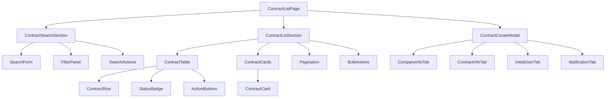

# SCR002-admin-contract-list コンポーネント設計書

## 📋 概要

契約検索一覧画面を構成するReactコンポーネントの詳細設計書です。

## 🏗️ コンポーネント階層



## 📦 コンポーネント詳細

### 1. ContractListPage（ページコンポーネント）

**パス**: `src/app/admin/contracts/page.tsx`

**責務**:
- ページ全体のレイアウト管理
- 状態管理の統括
- 子コンポーネントの協調

**Props**:
```typescript
interface ContractListPageProps {
  searchParams?: {
    page?: string;
    perPage?: string;
    contractId?: string;
    companyName?: string;
    status?: string;
  };
}
```

**状態管理**:
```typescript
const [filters, setFilters] = useState<ContractFilters>({});
const [selectedIds, setSelectedIds] = useState<string[]>([]);
const [isModalOpen, setIsModalOpen] = useState(false);
const [viewMode, setViewMode] = useState<'table' | 'card'>('table');
```

### 2. ContractSearchSection（検索セクション）

**パス**: `src/components/admin/contracts/ContractSearch/index.tsx`

**責務**:
- 検索条件の入力管理
- フィルター条件の管理
- 検索実行のトリガー

**コンポーネント構成**:

#### 2.1 SearchForm
```typescript
interface SearchFormProps {
  initialValues?: Partial<ContractSearchParams>;
  onSearch: (values: ContractSearchParams) => void;
  onClear: () => void;
  isLoading?: boolean;
}

export function SearchForm({
  initialValues,
  onSearch,
  onClear,
  isLoading = false
}: SearchFormProps) {
  const { register, handleSubmit, reset, formState } = useForm({
    defaultValues: initialValues,
    resolver: zodResolver(searchSchema),
  });

  return (
    <form onSubmit={handleSubmit(onSearch)}>
      <TextField
        {...register('contractId')}
        label="契約ID"
        placeholder="CNT-2024-001"
        error={formState.errors.contractId?.message}
      />
      <TextField
        {...register('companyName')}
        label="企業名"
        placeholder="株式会社○○"
        error={formState.errors.companyName?.message}
      />
      <DateRangePicker
        startName="startDateFrom"
        endName="startDateTo"
        label="契約期間"
        register={register}
      />
      <Button type="submit" disabled={isLoading}>
        検索
      </Button>
      <Button type="button" variant="secondary" onClick={onClear}>
        クリア
      </Button>
    </form>
  );
}
```

#### 2.2 FilterPanel
```typescript
interface FilterPanelProps {
  filters: ContractFilters;
  onChange: (filters: ContractFilters) => void;
  availableStatuses: ContractStatus[];
  availableModels: ContractModel[];
}

export function FilterPanel({
  filters,
  onChange,
  availableStatuses,
  availableModels
}: FilterPanelProps) {
  return (
    <div className={styles.filterPanel}>
      <FilterGroup label="ステータス">
        {availableStatuses.map(status => (
          <Checkbox
            key={status}
            value={status}
            checked={filters.status?.includes(status)}
            onChange={(checked) => handleStatusChange(status, checked)}
          >
            <StatusBadge status={status} />
          </Checkbox>
        ))}
      </FilterGroup>

      <FilterGroup label="契約モデル">
        <Select
          value={filters.modelId}
          onChange={(value) => onChange({ ...filters, modelId: value })}
        >
          <option value="">すべて</option>
          {availableModels.map(model => (
            <option key={model.id} value={model.id}>
              {model.name}
            </option>
          ))}
        </Select>
      </FilterGroup>
    </div>
  );
}
```

### 3. ContractListSection（一覧表示セクション）

**パス**: `src/components/admin/contracts/ContractList/index.tsx`

**責務**:
- 契約データの表示
- ページネーション管理
- 一括操作の実行

#### 3.1 ContractTable
```typescript
interface ContractTableProps {
  contracts: Contract[];
  selectedIds: string[];
  onSelectAll: () => void;
  onSelect: (id: string) => void;
  sortConfig?: SortConfig;
  onSort: (key: string) => void;
}

export function ContractTable({
  contracts,
  selectedIds,
  onSelectAll,
  onSelect,
  sortConfig,
  onSort
}: ContractTableProps) {
  const allSelected = contracts.length > 0 &&
    contracts.every(c => selectedIds.includes(c.contract_id));

  return (
    <table className={styles.table}>
      <thead>
        <tr>
          <th>
            <Checkbox
              checked={allSelected}
              indeterminate={selectedIds.length > 0 && !allSelected}
              onChange={onSelectAll}
              aria-label="全選択"
            />
          </th>
          <SortableHeader
            label="契約ID"
            sortKey="contract_id"
            currentSort={sortConfig}
            onSort={onSort}
          />
          <SortableHeader
            label="企業名"
            sortKey="company_name"
            currentSort={sortConfig}
            onSort={onSort}
          />
          <SortableHeader
            label="契約期間"
            sortKey="start_date"
            currentSort={sortConfig}
            onSort={onSort}
          />
          <th>ステータス</th>
          <th>使用状況</th>
          <th>アクション</th>
        </tr>
      </thead>
      <tbody>
        {contracts.map(contract => (
          <ContractRow
            key={contract.contract_id}
            contract={contract}
            selected={selectedIds.includes(contract.contract_id)}
            onSelect={() => onSelect(contract.contract_id)}
          />
        ))}
      </tbody>
    </table>
  );
}
```

#### 3.2 ContractRow
```typescript
interface ContractRowProps {
  contract: Contract;
  selected: boolean;
  onSelect: () => void;
}

export function ContractRow({ contract, selected, onSelect }: ContractRowProps) {
  const router = useRouter();

  return (
    <tr className={styles.row}>
      <td>
        <Checkbox
          checked={selected}
          onChange={onSelect}
          aria-label={`${contract.contract_id}を選択`}
        />
      </td>
      <td>
        <Link href={`/admin/contracts/${contract.contract_id}`}>
          {contract.contract_id}
        </Link>
      </td>
      <td>
        <Tooltip content={contract.company.name}>
          <span className={styles.companyName}>
            {truncate(contract.company.name, 30)}
          </span>
        </Tooltip>
      </td>
      <td>
        <DateRange
          start={contract.period.start_date}
          end={contract.period.end_date}
        />
      </td>
      <td>
        <StatusBadge status={contract.status} />
      </td>
      <td>
        <UsageIndicator
          token={contract.usage.token}
          storage={contract.usage.storage}
        />
      </td>
      <td>
        <ActionButtons
          onView={() => router.push(`/admin/contracts/${contract.contract_id}`)}
          onEdit={() => handleEdit(contract.contract_id)}
          onDelete={() => handleDelete(contract.contract_id)}
        />
      </td>
    </tr>
  );
}
```

#### 3.3 ContractCard（モバイル用）
```typescript
interface ContractCardProps {
  contract: Contract;
  selected: boolean;
  onSelect: () => void;
  onAction: (action: string) => void;
}

export function ContractCard({
  contract,
  selected,
  onSelect,
  onAction
}: ContractCardProps) {
  return (
    <div className={styles.card}>
      <div className={styles.cardHeader}>
        <Checkbox
          checked={selected}
          onChange={onSelect}
        />
        <StatusBadge status={contract.status} />
      </div>

      <div className={styles.cardBody}>
        <h3>{contract.contract_id}</h3>
        <p>{contract.company.name}</p>
        <DateRange
          start={contract.period.start_date}
          end={contract.period.end_date}
        />
      </div>

      <div className={styles.cardFooter}>
        <UsageIndicator
          token={contract.usage.token}
          storage={contract.usage.storage}
          compact
        />
        <DropdownMenu>
          <MenuItem onClick={() => onAction('view')}>詳細</MenuItem>
          <MenuItem onClick={() => onAction('edit')}>編集</MenuItem>
          <MenuItem onClick={() => onAction('delete')}>削除</MenuItem>
        </DropdownMenu>
      </div>
    </div>
  );
}
```

### 4. ContractCreateModal（契約登録モーダル）

**パス**: `src/components/admin/contracts/ContractModal/index.tsx`

**責務**:
- 新規契約の入力フォーム管理
- バリデーション実行
- APIへのデータ送信

```typescript
interface ContractCreateModalProps {
  isOpen: boolean;
  onClose: () => void;
  onSuccess: (contract: Contract) => void;
}

export function ContractCreateModal({
  isOpen,
  onClose,
  onSuccess
}: ContractCreateModalProps) {
  const [activeTab, setActiveTab] = useState(0);
  const [formData, setFormData] = useState<ContractCreateData>({});
  const { mutate: createContract, isLoading } = useCreateContract();

  const tabs = [
    { label: '企業情報', component: CompanyInfoTab },
    { label: '契約情報', component: ContractInfoTab },
    { label: '初期ユーザー', component: InitialUserTab },
    { label: '通知設定', component: NotificationTab },
  ];

  const handleSubmit = async () => {
    try {
      const contract = await createContract(formData);
      onSuccess(contract);
      onClose();
    } catch (error) {
      console.error(error);
    }
  };

  return (
    <Modal isOpen={isOpen} onClose={onClose} size="large">
      <ModalHeader>
        <h2>新規契約登録</h2>
      </ModalHeader>

      <ModalBody>
        <TabList>
          {tabs.map((tab, index) => (
            <Tab
              key={index}
              active={activeTab === index}
              onClick={() => setActiveTab(index)}
            >
              {tab.label}
            </Tab>
          ))}
        </TabList>

        <TabPanel>
          {React.createElement(tabs[activeTab].component, {
            data: formData,
            onChange: setFormData,
          })}
        </TabPanel>
      </ModalBody>

      <ModalFooter>
        <Button variant="secondary" onClick={onClose}>
          キャンセル
        </Button>
        {activeTab < tabs.length - 1 ? (
          <Button onClick={() => setActiveTab(activeTab + 1)}>
            次へ
          </Button>
        ) : (
          <Button
            onClick={handleSubmit}
            disabled={isLoading}
          >
            {isLoading ? '登録中...' : '登録'}
          </Button>
        )}
      </ModalFooter>
    </Modal>
  );
}
```

## 🎨 共通コンポーネント

### StatusBadge（ステータスバッジ）
```typescript
interface StatusBadgeProps {
  status: ContractStatus;
  size?: 'small' | 'medium' | 'large';
}

export function StatusBadge({ status, size = 'medium' }: StatusBadgeProps) {
  const config = {
    active: {
      label: '有効',
      color: appTheme.colors.success,
      icon: CheckCircleIcon,
    },
    expired: {
      label: '期限切れ',
      color: appTheme.colors.warning,
      icon: AlertCircleIcon,
    },
    cancelled: {
      label: '解約済み',
      color: appTheme.colors.neutral,
      icon: XCircleIcon,
    },
  };

  const { label, color, icon: Icon } = config[status];

  return (
    <span
      className={styles.badge}
      style={{ backgroundColor: `${color}20`, color }}
      data-size={size}
    >
      <Icon className={styles.icon} />
      {label}
    </span>
  );
}
```

### UsageIndicator（使用状況インジケーター）
```typescript
interface UsageIndicatorProps {
  token: {
    used: number;
    limit: number;
    percentage: number;
  };
  storage: {
    used_gb: number;
    limit_gb: number;
    percentage: number;
  };
  compact?: boolean;
}

export function UsageIndicator({
  token,
  storage,
  compact = false
}: UsageIndicatorProps) {
  if (compact) {
    return (
      <div className={styles.compactIndicator}>
        <ProgressBar
          value={token.percentage}
          max={100}
          label="Token"
          color={getColorByPercentage(token.percentage)}
        />
        <ProgressBar
          value={storage.percentage}
          max={100}
          label="Storage"
          color={getColorByPercentage(storage.percentage)}
        />
      </div>
    );
  }

  return (
    <div className={styles.indicator}>
      <div className={styles.metric}>
        <span>トークン</span>
        <span>{formatNumber(token.used)} / {formatNumber(token.limit)}</span>
        <ProgressBar
          value={token.percentage}
          max={100}
          showLabel={false}
        />
      </div>
      <div className={styles.metric}>
        <span>ストレージ</span>
        <span>{storage.used_gb}GB / {storage.limit_gb}GB</span>
        <ProgressBar
          value={storage.percentage}
          max={100}
          showLabel={false}
        />
      </div>
    </div>
  );
}
```

### Pagination（ページネーション）
```typescript
interface PaginationProps {
  currentPage: number;
  totalPages: number;
  perPage: number;
  totalItems: number;
  onPageChange: (page: number) => void;
  onPerPageChange: (perPage: number) => void;
  perPageOptions?: number[];
}

export function Pagination({
  currentPage,
  totalPages,
  perPage,
  totalItems,
  onPageChange,
  onPerPageChange,
  perPageOptions = [10, 25, 50, 100]
}: PaginationProps) {
  const pages = useMemo(() => {
    return generatePageNumbers(currentPage, totalPages);
  }, [currentPage, totalPages]);

  return (
    <div className={styles.pagination}>
      <div className={styles.perPage}>
        <label>表示件数:</label>
        <Select
          value={perPage}
          onChange={(e) => onPerPageChange(Number(e.target.value))}
        >
          {perPageOptions.map(option => (
            <option key={option} value={option}>
              {option}件
            </option>
          ))}
        </Select>
      </div>

      <div className={styles.pages}>
        <IconButton
          icon={ChevronLeftIcon}
          onClick={() => onPageChange(currentPage - 1)}
          disabled={currentPage <= 1}
          aria-label="前のページ"
        />

        {pages.map((page, index) => {
          if (page === '...') {
            return <span key={index}>...</span>;
          }
          return (
            <PageButton
              key={page}
              page={page as number}
              active={page === currentPage}
              onClick={() => onPageChange(page as number)}
            />
          );
        })}

        <IconButton
          icon={ChevronRightIcon}
          onClick={() => onPageChange(currentPage + 1)}
          disabled={currentPage >= totalPages}
          aria-label="次のページ"
        />
      </div>

      <div className={styles.info}>
        {totalItems}件中 {(currentPage - 1) * perPage + 1}-
        {Math.min(currentPage * perPage, totalItems)}件を表示
      </div>
    </div>
  );
}
```

## 🔄 状態管理パターン

### URLパラメータとの同期
```typescript
function useContractListState() {
  const router = useRouter();
  const searchParams = useSearchParams();

  // URLから初期値を取得
  const initialFilters = useMemo(() => ({
    contractId: searchParams.get('contractId') || undefined,
    companyName: searchParams.get('companyName') || undefined,
    status: searchParams.get('status')?.split(',') || undefined,
    page: Number(searchParams.get('page')) || 1,
    perPage: Number(searchParams.get('perPage')) || 10,
  }), [searchParams]);

  // フィルター変更時にURLを更新
  const updateFilters = useCallback((filters: ContractFilters) => {
    const params = new URLSearchParams();
    Object.entries(filters).forEach(([key, value]) => {
      if (value !== undefined && value !== null && value !== '') {
        if (Array.isArray(value)) {
          params.set(key, value.join(','));
        } else {
          params.set(key, String(value));
        }
      }
    });
    router.push(`?${params.toString()}`);
  }, [router]);

  return {
    filters: initialFilters,
    updateFilters,
  };
}
```

### エラーハンドリング
```typescript
function useErrorHandler() {
  const [errors, setErrors] = useState<Record<string, string>>({});

  const handleError = useCallback((error: unknown, field?: string) => {
    if (error instanceof ApiError) {
      if (field) {
        setErrors(prev => ({ ...prev, [field]: error.message }));
      } else {
        toast.error(error.message);
      }
    } else if (error instanceof ValidationError) {
      setErrors(error.errors);
    } else {
      toast.error('予期しないエラーが発生しました');
      console.error(error);
    }
  }, []);

  const clearError = useCallback((field?: string) => {
    if (field) {
      setErrors(prev => {
        const { [field]: _, ...rest } = prev;
        return rest;
      });
    } else {
      setErrors({});
    }
  }, []);

  return { errors, handleError, clearError };
}
```

## 🧪 コンポーネントテスト戦略

### テストユーティリティ
```typescript
// test-utils/render.tsx
export function renderWithProviders(
  ui: React.ReactElement,
  {
    preloadedState = {},
    queryClient = new QueryClient({
      defaultOptions: {
        queries: { retry: false },
        mutations: { retry: false },
      },
    }),
    ...renderOptions
  } = {}
) {
  function Wrapper({ children }: { children: React.ReactNode }) {
    return (
      <QueryClientProvider client={queryClient}>
        <ThemeProvider theme={appTheme}>
          {children}
        </ThemeProvider>
      </QueryClientProvider>
    );
  }

  return render(ui, { wrapper: Wrapper, ...renderOptions });
}
```

### モックデータ
```typescript
// test-utils/mocks/contracts.ts
export const mockContracts: Contract[] = [
  {
    contract_id: 'CNT-2024-001',
    company: {
      name: '株式会社テスト',
      code: 'TEST001',
    },
    period: {
      start_date: '2024-04-01',
      end_date: '2025-03-31',
    },
    status: 'active',
    usage: {
      token: {
        used: 5000,
        limit: 10000,
        percentage: 50,
      },
      storage: {
        used_gb: 25,
        limit_gb: 100,
        percentage: 25,
      },
    },
  },
];
```

## 📚 関連ドキュメント

- [実装ガイド](./implementation-guide.md)
- [UI仕様書](/docs/03-features/admin-contract-list/ui-specification.md)
- [API仕様書](/docs/03-features/admin-contract-list/api-specification.md)