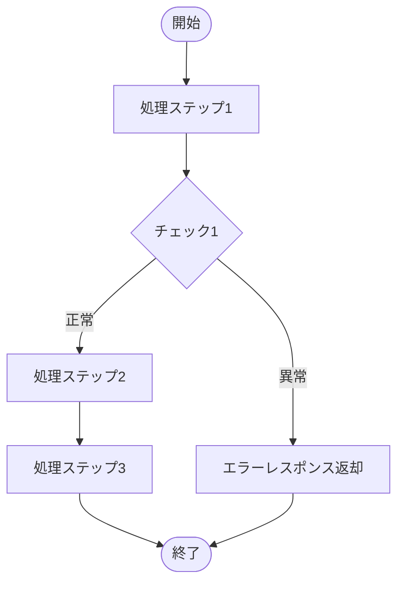
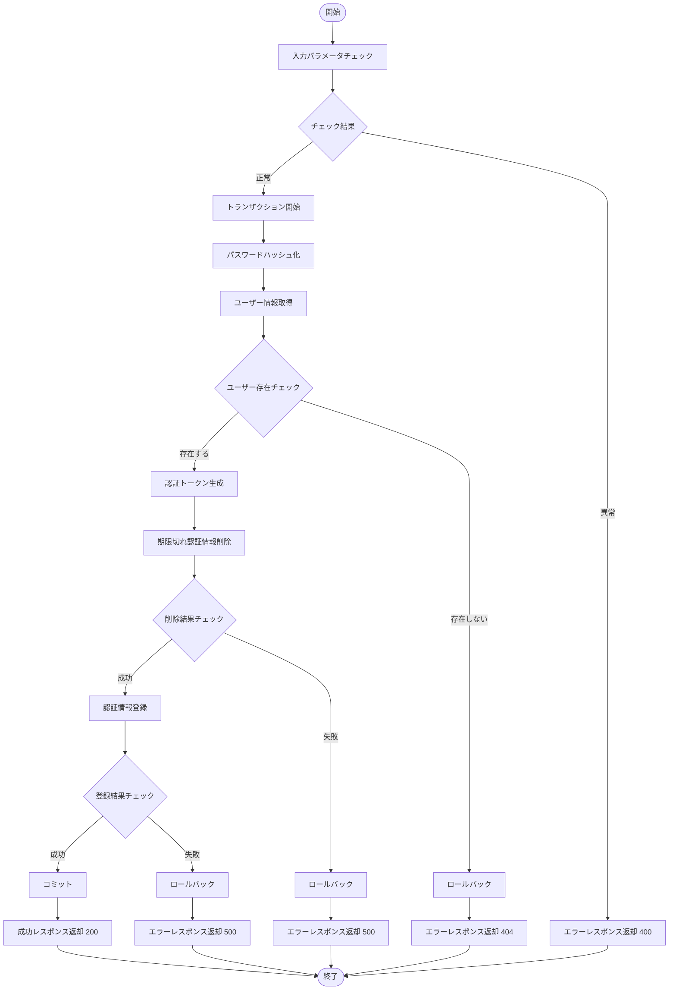

# {API名} - 処理設計書

> **📌 このファイルはテンプレートです**
>
> - このファイルに記載されている「**例:**」や「**記入例:**」は、テンプレート使用時の参考情報です
> - 実際の処理設計書を作成する際は、これらの例示セクションは**削除**してください
> - `{プレースホルダー}` 部分を実際の値に置き換えて使用してください
> - 実際の処理設計書には具体的な値のみを記載し、例示や参考情報は含めないでください

## 📑 目次

1. [バリデーション・エラー仕様](#1-バリデーションエラー仕様)
   - 1.1 [エラー一覧と処理フロー](#11-エラー一覧と処理フロー)
2. [処理フロー](#2-処理フロー)
   - 2.1 [フロー図](#21-フロー図)
3. [処理概要](#3-処理概要)
4. [処理詳細](#4-処理詳細)
5. [使用データベース詳細](#5-使用データベース詳細)
   - 5.1 [使用テーブル一覧](#51-使用テーブル一覧)
   - 5.2 [SQL実行順序](#52-sql実行順序)
   - 5.3 [インデックス最適化](#53-インデックス最適化)
6. [トランザクション管理](#6-トランザクション管理)
   - 6.1 [トランザクション開始・終了タイミング](#61-トランザクション開始終了タイミング)
7. [セキュリティ実装](#7-セキュリティ実装)
   - 7.1 [認証・認可実装](#71-認証認可実装)
   - 7.2 [入力検証](#72-入力検証)
   - 7.3 [ログ出力ルール](#73-ログ出力ルール)
8. [備考](#8-備考)
   - 8.1 [関連ドキュメント](#81-関連ドキュメント)
   - 8.2 [注意事項](#82-注意事項)

**注:** すべての処理設計書でこの目次構成を統一してください。該当しない項目がある場合は「なし」と明記してください。

**注:** API基本情報（エンドポイント、HTTPメソッド、入力パラメータ詳細など）は [specification.md](./specification.md) を参照してください。

---

## 1. バリデーション・エラー仕様

このAPIで発生する可能性があるすべてのエラー（バリデーション、認証、データベース等）とその処理フローを記載します。

**重要:** 共通のエラーハンドリング方針については、以下を参照してください：
- [API共通仕様書 - エラーハンドリング方針](./common-specification.md#7-エラーハンドリング方針)
- [API共通仕様書 - 共通HTTPステータスコード](./common-specification.md#4-共通httpステータスコード)
- [API共通仕様書 - 共通エラーコード](./common-specification.md#5-共通エラーコード)

### 1.1 エラー一覧と処理フロー

| No | エラー種別 | 発生タイミング | チェック内容 | 処理フロー | 次ステップ | HTTPステータス | エラーコード | エラーメッセージ | 備考 |
|----|-----------|--------------|------------|----------|-----------|--------------|------------|---------------|------|
| {No} | {エラー種別} | ({ステップ番号}) {ステップ名} | {チェック内容の説明} | {処理内容} | ({ステップ番号}) {ステップ名} | {ステータスコード} | {ERROR_CODE} | {エラーメッセージ} | {補足情報} |

**記入例:（テンプレート参考用 - 実際の処理設計書では削除）**

| No | エラー種別 | 発生タイミング | チェック内容 | 処理フロー | 次ステップ | HTTPステータス | エラーコード | エラーメッセージ | 備考 |
|----|-----------|--------------|------------|----------|-----------|--------------|------------|---------------|------|
| 1 | バリデーションエラー | (1) 入力パラメータチェック | ユーザーIDが未入力である | エラーレスポンス設定 | (13) レスポンス情報返却 | 400 | INVALID_PARAMETER | ユーザーIDは必須です | - |
| 2 | バリデーションエラー | (1) 入力パラメータチェック | パスワードが未入力である | エラーレスポンス設定 | (13) レスポンス情報返却 | 400 | INVALID_PARAMETER | パスワードは必須です | - |
| 3 | バリデーションエラー | (1) 入力パラメータチェック | ユーザーIDが6桁以外である | エラーレスポンス設定 | (13) レスポンス情報返却 | 400 | INVALID_PARAMETER | ユーザーIDは6桁で入力してください | - |
| 4 | バリデーションエラー | (1) 入力パラメータチェック | パスワードが8桁以外である | エラーレスポンス設定 | (13) レスポンス情報返却 | 400 | INVALID_PARAMETER | パスワードは8桁で入力してください | - |
| 5 | 認証エラー | (4) ユーザー情報チェック | ユーザーが存在しない | ロールバック → エラーレスポンス設定 | (8) ロールバック → (13) レスポンス情報返却 | 401 | AUTH_FAILED | ユーザーIDまたはパスワードが違います | - |
| 6 | データベースエラー | (6) 期限切れ認証情報削除 | DELETE処理に失敗した | ロールバック → エラーレスポンス設定 | (8) ロールバック → (13) レスポンス情報返却 | 500 | INTERNAL_ERROR | 認証情報の削除に失敗しました | - |
| 7 | データベースエラー | (9) 認証情報登録 | INSERT処理に失敗した | ロールバック → エラーレスポンス設定 | (8) ロールバック → (13) レスポンス情報返却 | 500 | INTERNAL_ERROR | 認証情報の登録に失敗しました | - |

**注:**
- エラー種別: バリデーションエラー、認証エラー、認可エラー、データベースエラー、外部API連携エラー等
- 処理フロー: エラー発生時の処理内容（エラーレスポンス設定、ロールバック等）
- プロジェクト固有のエラーコードを使用する場合は備考欄に記載

---

## 2. 処理フロー

### 2.1 フロー図



**記入例:（テンプレート参考用 - 実際の処理設計書では削除）**



**注:** Mermaid記法を使用してフロー図を記述してください。

---

## 3. 処理概要

処理の目的と流れを抽象的に記載します。「何をするか（What）」にフォーカスし、実装の詳細は処理詳細セクションに記載します。

---

### (1) {処理ステップ名}

**目的:** {この処理ステップの目的を1行で記載}

**処理の流れ:**
1. {処理内容1}
2. {処理内容2}
3. {処理内容3}

**次ステップへの遷移:**
- 正常: ({次のステップ番号}) {次のステップ名}
- 異常: ({次のステップ番号}) {次のステップ名} - HTTPステータス: {ステータスコード}

**使用テーブル:** {テーブル名} ({操作種別})

---

### 記入例（テンプレート参考用 - 実際の処理設計書では削除）

### (1) 入力パラメータチェック

**目的:** リクエストパラメータの妥当性を検証する

**処理の流れ:**
1. バリデーション仕様(1)に基づき、ユーザーIDとパスワードをチェック
2. チェック正常時: データベーストランザクションを開始
3. チェック異常時: エラーレスポンスを設定

**次ステップへの遷移:**
- 正常: (2) パスワードハッシュ化
- 異常: (13) レスポンス情報返却 - HTTPステータス: 400

**使用テーブル:** なし

---

### (2) パスワードハッシュ化

**目的:** パスワードをハッシュ化してセキュアに検索可能な形式にする

**処理の流れ:**
1. プロパティファイルからsalt値を取得
2. パスワードとsaltを結合してハッシュ化（SHA-256、1回）

**次ステップへの遷移:**
- 正常: (3) ユーザー情報取得

**使用テーブル:** なし

---

### (3) ユーザー情報取得

**目的:** ユーザーID・パスワードに該当するユーザー情報を取得する

**処理の流れ:**
1. ユーザーマスタから該当ユーザーを検索
2. 取得したレコードから事業所コードを変数に設定

**次ステップへの遷移:**
- 正常: (4) ユーザー情報チェック

**使用テーブル:** users (SELECT)

---

### (4) 以降の処理ステップ

...

（以降の処理ステップも同様に記載）

---

## 4. 処理詳細

処理概要をより詳細に、実装レベルで記載します。「どう実装するか（How）」にフォーカスし、変数名、SQL詳細、具体的な条件分岐、データ設定方法、実装例コードなどを含めます。

---

### (1) {処理ステップ名}

#### ① {サブステップ名}

{実装レベルの詳細説明}

**処理内容:**
- {具体的な実装内容1}
- {具体的な実装内容2}

**変数・パラメータ:**
- 変数名: {型} - {説明}
- パラメータ名: {型} - {説明}

**SQL詳細:**（該当する場合のみ）
```sql
{実際に実行するSQL}
```

**実装例:**（該当する場合のみ）
```javascript
{実装コード例}
```

**条件分岐詳細:**
- **①-1 {条件の場合}**
  - {次のステップへの遷移}
  - レスポンス設定:
    | No | 項目名 | 値 | 備考 |
    |----|--------|-----|------|
    | 1 | result | {値} | {説明} |
    | 2 | message | {メッセージ} | {説明} |
    | 3 | code | "{コード}" | {説明} |

- **①-2 {条件の場合}**
  - {次のステップへの遷移}
  - レスポンス設定:
    | No | 項目名 | 値 | 備考 |
    |----|--------|-----|------|
    | 1 | result | {値} | {説明} |
    | 2 | message | {メッセージ} | {説明} |
    | 3 | code | "{コード}" | {説明} |

#### ② {サブステップ名}

{処理内容の説明}

**処理内容:**
- {具体的な実装内容}

**変数・パラメータ:**
- 変数名: {型} - {説明}

---

### 記入例（テンプレート参考用 - 実際の処理設計書では削除）

### (1) 引数チェック

#### ① バリデーション実施

引数の各項目に対して、[バリデーション仕様](#バリデーション仕様)の (1) を実施する。

**処理内容:**
- ユーザーIDの未入力チェック
- パスワードの未入力チェック
- ユーザーIDの桁数チェック（6桁固定）
- パスワードの桁数チェック（8桁固定）
- パスワードの形式チェック（半角英小文字・大文字・数字）

**変数・パラメータ:**
- userId: string - リクエストから受け取ったユーザーID
- password: string - リクエストから受け取ったパスワード

**条件分岐詳細:**
- **①-1 チェック結果が正常の場合**
  - (2) パスワードハッシュ化へ遷移

- **①-2 チェック結果が異常の場合**
  - 下記のレスポンス情報を設定し (13) レスポンス情報返却へ遷移
  - レスポンス設定:
    | No | 項目名 | 値 | 備考 |
    |----|--------|-----|------|
    | 1 | result | 1 | エラーを示す |
    | 2 | message | ▽チェック(1)の該当するメッセージ | バリデーション仕様参照 |
    | 3 | code | "400" | Bad Request |

#### ② トランザクション開始

データベーストランザクションを開始する。

**処理内容:**
- データベース接続の取得
- トランザクション開始コマンドの実行
- トランザクション状態の管理

---

### (2) パスワードハッシュ化

#### ① Salt（ソルト）取得

プロパティファイルからパスワードハッシュ化用のsalt (`password.hash.salt`) を取得する。

**処理内容:**
- プロパティファイルパス: `config/application.properties`
- プロパティキー: `password.hash.salt`
- Salt値: 任意の4文字

**変数・パラメータ:**
- salt: string - プロパティファイルから取得したsalt値（4文字）

#### ② ハッシュ化実施

対象文字列の末尾に①で取得した情報を結合しハッシュ化する。

**処理内容:**
- 入力文字列: `password`（引数から受け取ったパスワード）
- 結合後の文字列: `password + salt`
- ハッシュアルゴリズム: SHA-256
- ハッシュ化回数: 1回

**変数・パラメータ:**
- password: string - 元のパスワード
- salt: string - ①で取得したsalt値
- hashedPassword: string - ハッシュ化後のパスワード

**実装例:**
```javascript
const targetString = password + salt;
const hashedPassword = sha256(targetString);
```

---

### (3) ユーザー情報取得

#### ① データベース検索実施

下記のSQLを実行し、検索条件に該当するデータを取得する。

**検索対象テーブル:** ユーザーマスタ

**取得項目:**
- ユーザーID
- ユーザー名
- 事業所コード
- パスワード

**検索条件:**
- ユーザーID = 引数.userId
- パスワード = 引数.password（ハッシュ化済み）
- 削除フラグ = '0'

**SQL詳細:**
```sql
SELECT
  user_id,
  user_name,
  office_code,
  password
FROM
  users
WHERE
  user_id = :userId
  AND password = :hashedPassword
  AND deleted_flag = '0'
```

**変数・パラメータ:**
- userId: string - 検索条件として使用するユーザーID
- hashedPassword: string - (2)でハッシュ化したパスワード
- userRecord: object - 検索結果のレコード

#### ② 変数への設定

①で取得した事業所コードを変数 `belongOfficeCode` に設定する。

**処理内容:**
- 取得したレコードから事業所コードを抽出
- 変数に設定

**変数・パラメータ:**
- belongOfficeCode: string - ①で取得した事業所コード（後続処理で使用）

**実装例:**
```javascript
const belongOfficeCode = userRecord?.office_code || null;
```

---

### (4) 以降の処理ステップ

...

（以降の処理ステップも同様に記載）

---

## 5. 使用データベース詳細

このAPIで使用するデータベーステーブルとSQL実行順序を記載します。

### 5.1 使用テーブル一覧

| No | テーブル名 | 論理名 | 操作種別 | 処理ステップ | 目的 | インデックス利用 |
|----|-----------|--------|---------|------------|------|----------------|
| {No} | {物理名} | {論理名} | {SELECT/INSERT/UPDATE/DELETE} | ({ステップ番号}) {ステップ名} | {目的} | {利用するインデックス} |

**記入例:（テンプレート参考用 - 実際の処理設計書では削除）**

| No | テーブル名 | 論理名 | 操作種別 | 処理ステップ | 目的 | インデックス利用 |
|----|-----------|--------|---------|------------|------|----------------|
| 1 | users | ユーザーマスタ | SELECT | (3) ユーザー情報取得 | ユーザー認証 | PRIMARY KEY (user_id) |
| 2 | login | ログインテーブル | DELETE | (6) 期限切れ認証情報削除 | 古い認証情報の削除 | INDEX (expires_at) |
| 3 | login | ログインテーブル | INSERT | (9) 認証情報登録 | 新しい認証トークンの登録 | PRIMARY KEY (user_id) |

### 5.2 SQL実行順序

| 順序 | 処理ステップ | SQL種別 | テーブル | トランザクション |
|------|------------|---------|---------|----------------|
| {順序} | ({ステップ番号}) {ステップ名} | {SELECT/INSERT/UPDATE/DELETE} | {テーブル名} | {読み取り/書き込み} |

**記入例:（テンプレート参考用 - 実際の処理設計書では削除）**

| 順序 | 処理ステップ | SQL種別 | テーブル | トランザクション |
|------|------------|---------|---------|----------------|
| 1 | (3) ユーザー情報取得 | SELECT | users | 読み取り |
| 2 | (6) 期限切れ認証情報削除 | DELETE | login | 書き込み |
| 3 | (9) 認証情報登録 | INSERT | login | 書き込み |

### 5.3 インデックス最適化

**使用するインデックス:**
- {テーブル名}.{カラム名}: {インデックス種別} - {目的}

**記入例:（テンプレート参考用 - 実際の処理設計書では削除）**
- users.user_id: PRIMARY KEY - ユーザー一意識別
- users.(user_id, password): 複合インデックス - ログイン認証高速化
- login.expires_at: INDEX - 期限切れデータ検索高速化

**注:** インデックス詳細は[データベース設計書](../01-architecture/database.md)を参照してください。

---

## 6. トランザクション管理

このAPIのトランザクション開始・終了タイミングを記載します。

**重要:** 共通のトランザクション管理方針については、[API共通仕様書 - トランザクション管理](./common-specification.md#15-トランザクション管理)を参照してください。

### 6.1 トランザクション開始・終了タイミング

**トランザクション開始:**
- 処理ステップ: ({ステップ番号}) {ステップ名}
- 開始条件: {条件}

**トランザクション終了（コミット）:**
- 処理ステップ: ({ステップ番号}) {ステップ名}
- 終了条件: すべての処理が正常完了

**トランザクション終了（ロールバック）:**
- 処理ステップ: ({ステップ番号}) {ステップ名}
- ロールバック対象: {対象の処理ステップ}

**記入例:（テンプレート参考用 - 実際の処理設計書では削除）**

**トランザクション開始:**
- 処理ステップ: (1) 入力パラメータチェック - ②
- 開始条件: バリデーション完了後

**トランザクション終了（コミット）:**
- 処理ステップ: (11) コミット
- 終了条件: 認証情報登録が成功

**トランザクション終了（ロールバック）:**
- 処理ステップ: (8) ロールバック
- ロールバック対象: (6) 期限切れ認証情報削除、(9) 認証情報登録

---

## 7. セキュリティ実装

このAPI固有のセキュリティ実装詳細を記載します。

**注:** 共通のセキュリティ仕様は[API共通仕様書 - セキュリティ](./common-specification.md#14-セキュリティ)を参照してください。

### 7.1 認証・認可実装

**実装内容:**
- {実装詳細1}
- {実装詳細2}

**記入例:（テンプレート参考用 - 実際の処理設計書では削除）**
- パスワードはSHA-256でハッシュ化（salt付き）
- JWTトークン生成（有効期限: 1時間）
- トークンにユーザーID、契約ID、ロールを含める

### 7.2 入力検証

**検証項目:**
- {検証項目1}: {検証内容}
- {検証項目2}: {検証内容}

**記入例:（テンプレート参考用 - 実際の処理設計書では削除）**
- ユーザーID: 6桁固定、英数字のみ
- パスワード: 8桁以上、英数字記号のみ
- SQLインジェクション対策: プリペアドステートメント使用

### 7.3 ログ出力ルール

**出力する情報:**
- {情報1}
- {情報2}

**出力しない情報（機密情報）:**
- {情報1}
- {情報2}

**記入例:（テンプレート参考用 - 実際の処理設計書では削除）**

**出力する情報:**
- リクエストID
- ユーザーID
- 処理ステップ名
- エラー種別

**出力しない情報:**
- パスワード（平文・ハッシュ化後問わず）
- 認証トークン
- 個人情報（メールアドレス、氏名など）

---

## 8. 備考

### 8.1 関連ドキュメント

- [API仕様書](./specification.md) - このAPIの入力・出力仕様
- [API共通仕様書](./common-specification.md) - すべてのAPIに共通する仕様
- [データベース設計書](../01-architecture/database.md) - テーブル定義
- [認証・認可設計](../01-architecture/) - 認証フロー詳細

### 8.2 注意事項

- {このAPIに固有の注意事項}
- {実装上の注意点}
- {運用上の注意点}

---

**このテンプレートに従って、統一された処理設計書を作成してください。**
