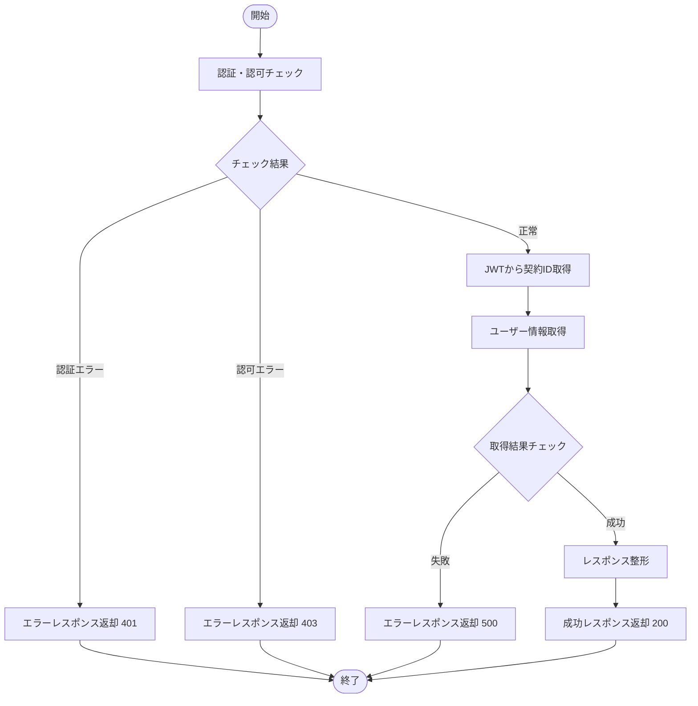

# ユーザー一覧取得API - 処理設計書

## 📑 目次

1. [バリデーション・エラー仕様](#1-バリデーションエラー仕様)
   - 1.1 [エラー一覧と処理フロー](#11-エラー一覧と処理フロー)
2. [処理フロー](#2-処理フロー)
   - 2.1 [フロー図](#21-フロー図)
3. [処理概要](#3-処理概要)
4. [処理詳細](#4-処理詳細)
5. [使用データベース詳細](#5-使用データベース詳細)
   - 5.1 [使用テーブル一覧](#51-使用テーブル一覧)
   - 5.2 [SQL実行順序](#52-sql実行順序)
   - 5.3 [インデックス最適化](#53-インデックス最適化)
6. [トランザクション管理](#6-トランザクション管理)
   - 6.1 [トランザクション開始・終了タイミング](#61-トランザクション開始終了タイミング)
7. [セキュリティ実装](#7-セキュリティ実装)
   - 7.1 [認証・認可実装](#71-認証認可実装)
   - 7.2 [入力検証](#72-入力検証)
   - 7.3 [ログ出力ルール](#73-ログ出力ルール)
8. [備考](#8-備考)
   - 8.1 [関連ドキュメント](#81-関連ドキュメント)
   - 8.2 [注意事項](#82-注意事項)

**注:** API基本情報（エンドポイント、HTTPメソッド、入力パラメータ詳細など）は [specification.md](./specification.md) を参照してください。

---

## 1. バリデーション・エラー仕様

このAPIで発生する可能性があるすべてのエラー（バリデーション、認証、データベース等）とその処理フローを記載します。

**重要:** 共通のエラーハンドリング方針については、以下を参照してください：
- [API共通仕様書 - エラーハンドリング方針](../../common-specification.md#7-エラーハンドリング方針)
- [API共通仕様書 - 共通HTTPステータスコード](../../common-specification.md#4-共通httpステータスコード)
- [API共通仕様書 - 共通エラーコード](../../common-specification.md#5-共通エラーコード)

### 1.1 エラー一覧と処理フロー

| No | エラー種別 | 発生タイミング | チェック内容 | 処理フロー | 次ステップ | HTTPステータス | エラーコード | エラーメッセージ | 備考 |
|----|-----------|--------------|------------|----------|-----------|--------------|------------|---------------|------|
| 1 | 認証エラー | (1) 認証・認可チェック | JWTトークンが存在しない | エラーレスポンス設定 | (6) レスポンス情報返却 | 401 | AUTH_FAILED | 認証が必要です | - |
| 2 | 認証エラー | (1) 認証・認可チェック | JWTトークンの期限が切れている | エラーレスポンス設定 | (6) レスポンス情報返却 | 401 | TOKEN_EXPIRED | トークンの有効期限が切れています | - |
| 3 | 認可エラー | (1) 認証・認可チェック | ユーザーのロールが system_admin, operation_admin 以外である | エラーレスポンス設定 | (6) レスポンス情報返却 | 403 | PERMISSION_DENIED | この操作を実行する権限がありません | system_admin, operation_admin のみアクセス可能 |
| 4 | データベースエラー | (3) ユーザー情報取得 | SELECT処理に失敗した | エラーレスポンス設定 | (6) レスポンス情報返却 | 500 | INTERNAL_ERROR | ユーザー情報の取得に失敗しました | - |

**注:**
- エラー種別: バリデーションエラー、認証エラー、認可エラー、データベースエラー等
- 処理フロー: エラー発生時の処理内容（エラーレスポンス設定等）
- このAPIは読み取り専用のため、トランザクションは使用しません（ロールバック不要）

---

## 2. 処理フロー

### 2.1 フロー図



---

## 3. 処理概要

処理の目的と流れを抽象的に記載します。「何をするか（What）」にフォーカスし、実装の詳細は処理詳細セクションに記載します。

---

### (1) 認証・認可チェック

**目的:** リクエストの認証・認可を検証する

**処理の流れ:**
1. リクエストヘッダーからJWTトークンを取得
2. JWTトークンの有効性を検証（期限切れ、改ざんチェック）
3. JWTトークンからユーザーのロールを取得
4. ロールが `system_admin`, `operation_admin` のいずれかであることを確認

**次ステップへの遷移:**
- 正常: (2) JWTから契約ID取得
- 異常（認証エラー）: (6) レスポンス情報返却 - HTTPステータス: 401
- 異常（認可エラー）: (6) レスポンス情報返却 - HTTPステータス: 403

**使用テーブル:** なし

---

### (2) JWTから契約ID取得

**目的:** スコープ制限のため、ログイン中のユーザーの契約IDを取得する

**処理の流れ:**
1. JWTトークンから契約ID（contract_id）を取得

**次ステップへの遷移:**
- 正常: (3) ユーザー情報取得

**使用テーブル:** なし

---

### (3) ユーザー情報取得

**目的:** データベースからユーザー情報を取得する

**処理の流れ:**
1. usersテーブルとgroupsテーブルを左外部結合
2. 契約IDで絞り込んだユーザー情報を全件取得
3. 総件数をカウント

**次ステップへの遷移:**
- 正常: (4) レスポンス整形
- 異常: (6) レスポンス情報返却 - HTTPステータス: 500

**使用テーブル:** users (SELECT), groups (SELECT)

---

### (4) レスポンス整形

**目的:** 取得したデータをレスポンス形式に整形する

**処理の流れ:**
1. 取得したユーザー情報をレスポンス形式に変換
2. 日時フィールド（lastLoginAt, createdAt, updatedAt）をISO 8601形式（JST）に変換
3. グループ情報（groupId, groupName）を設定（グループ未所属の場合はnull）
4. 総件数を設定

**次ステップへの遷移:**
- 正常: (5) 成功レスポンス返却

**使用テーブル:** なし

---

### (5) 成功レスポンス返却

**目的:** 成功レスポンスをクライアントに返却する

**処理の流れ:**
1. レスポンスボディを構築（success: true, data, timestamp）
2. HTTPステータス 200 で返却

**次ステップへの遷移:**
- (終了)

**使用テーブル:** なし

---

### (6) レスポンス情報返却

**目的:** エラーレスポンスをクライアントに返却する

**処理の流れ:**
1. エラーレスポンスボディを構築（success: false, error, timestamp）
2. 適切なHTTPステータスコードで返却

**次ステップへの遷移:**
- (終了)

**使用テーブル:** なし

---

## 4. 処理詳細

処理概要をより詳細に、実装レベルで記載します。「どう実装するか（How）」にフォーカスし、変数名、SQL詳細、具体的な条件分岐、データ設定方法、実装例コードなどを含めます。

---

### (1) 認証・認可チェック

#### ① JWTトークン取得

リクエストヘッダーからJWTトークンを取得する。

**処理内容:**
- Authorizationヘッダーから Bearer トークンを取得
- トークンが存在しない場合はエラー

**変数・パラメータ:**
- authHeader: string - Authorizationヘッダーの値（例: "Bearer eyJhbGciOiJIUzI1NiIsInR5cCI6IkpXVCJ9..."）
- token: string - JWTトークン本体

**実装例:**
```typescript
const authHeader = request.headers.get('Authorization');
if (!authHeader || !authHeader.startsWith('Bearer ')) {
  throw new AuthenticationError('認証が必要です');
}
const token = authHeader.substring(7); // "Bearer " を除去
```

#### ② JWTトークン検証

JWTトークンの有効性を検証する。

**処理内容:**
- トークンの署名検証
- トークンの期限切れチェック
- トークンのペイロード取得

**変数・パラメータ:**
- token: string - JWTトークン
- payload: object - トークンペイロード（userId, contractId, role, exp等）

**実装例:**
```typescript
import jwt from 'jsonwebtoken';

try {
  const payload = jwt.verify(token, process.env.JWT_SECRET);
  // payload: { sub, name, email, contract_id, role, exp, iat }
} catch (error) {
  if (error.name === 'TokenExpiredError') {
    throw new AuthenticationError('トークンの有効期限が切れています', 'TOKEN_EXPIRED');
  }
  throw new AuthenticationError('認証が必要です', 'AUTH_FAILED');
}
```

#### ③ ロールチェック

ユーザーのロールが適切であることを確認する。

**処理内容:**
- JWTペイロードからロールを取得
- ロールが `system_admin`, `operation_admin` のいずれかであることを確認
- それ以外のロールの場合はエラー

**変数・パラメータ:**
- role: string - ユーザーのロール
- allowedRoles: string[] - 許可されたロール

**実装例:**
```typescript
const role = payload.role;
const allowedRoles = ['system_admin', 'operation_admin'];

if (!allowedRoles.includes(role)) {
  throw new ForbiddenError('この操作を実行する権限がありません', {
    required_role: 'system_admin',
    current_role: role,
  });
}
```

**条件分岐詳細:**
- **①-1 認証成功、認可成功の場合**
  - (2) JWTから契約ID取得へ遷移

- **①-2 トークンなし、期限切れの場合**
  - 下記のレスポンス情報を設定し (6) レスポンス情報返却へ遷移
  - レスポンス設定:
    | No | 項目名 | 値 | 備考 |
    |----|--------|-----|------|
    | 1 | success | false | エラーを示す |
    | 2 | error.code | "AUTH_FAILED" または "TOKEN_EXPIRED" | エラーコード |
    | 3 | error.message | "認証が必要です" または "トークンの有効期限が切れています" | エラーメッセージ |
    | 4 | HTTPステータス | 401 | Unauthorized |

- **①-3 ロールが不正の場合**
  - 下記のレスポンス情報を設定し (6) レスポンス情報返却へ遷移
  - レスポンス設定:
    | No | 項目名 | 値 | 備考 |
    |----|--------|-----|------|
    | 1 | success | false | エラーを示す |
    | 2 | error.code | "PERMISSION_DENIED" | エラーコード |
    | 3 | error.message | "この操作を実行する権限がありません" | エラーメッセージ |
    | 4 | error.details | { required_role, current_role } | 詳細情報 |
    | 5 | HTTPステータス | 403 | Forbidden |

---

### (2) JWTから契約ID取得

#### ① 契約ID取得

JWTトークンから契約IDを取得する。

**処理内容:**
- JWTペイロードから契約ID（contract_id）を取得

**変数・パラメータ:**
- contractId: string - 契約ID

**実装例:**
```typescript
const contractId = payload.contract_id;
```

---

### (3) ユーザー情報取得

#### ① 検索条件構築

検索条件を構築する。

**処理内容:**
- 契約IDによる絞り込み条件を設定

**変数・パラメータ:**
- whereClause: string - WHERE句
- queryParams: object - SQLパラメータ

**実装例:**
```typescript
const whereClause = 'WHERE u.contract_id = @contractId';
const queryParams: Record<string, any> = {
  contractId: contractId
};
```

#### ② データベース検索実施

検索条件に該当するユーザー情報を取得する。

**検索対象テーブル:** users, groups

**取得項目:**
- ユーザーID (u.id)
- ユーザー名 (u.name)
- メールアドレス (u.email)
- ロール (u.role)
- グループID (u.group_id)
- グループ名 (g.name AS group_name)
- 最終ログイン日時 (u.last_login_at)
- 作成日時 (u.created_at)
- 更新日時 (u.updated_at)

**検索条件:**
- 契約ID（必須）
- 検索・フィルタリングはクライアント側で実施

**SQL詳細:**
```sql
SELECT
  u.id,
  u.name,
  u.email,
  u.role,
  u.group_id,
  g.name AS group_name,
  u.last_login_at,
  u.created_at,
  u.updated_at
FROM
  users u
LEFT JOIN
  groups g ON u.group_id = g.id
WHERE
  u.contract_id = @contractId
ORDER BY
  u.created_at DESC
```

**変数・パラメータ:**
- users: array - 取得したユーザー情報の配列
- total: number - 総件数

**実装例:**
```typescript
try {
  const sql = `
    SELECT
      u.id,
      u.name,
      u.email,
      u.role,
      u.group_id,
      g.name AS group_name,
      u.last_login_at,
      u.created_at,
      u.updated_at
    FROM
      users u
    LEFT JOIN
      groups g ON u.group_id = g.id
    ${whereClause}
    ORDER BY
      u.created_at DESC
  `;

  const users = await db.query(sql, queryParams);
  const total = users.length;
} catch (error) {
  throw new InternalError('ユーザー情報の取得に失敗しました');
}
```

**条件分岐詳細:**
- **②-1 検索成功の場合**
  - (4) レスポンス整形へ遷移

- **②-2 検索失敗の場合**
  - 下記のレスポンス情報を設定し (6) レスポンス情報返却へ遷移
  - レスポンス設定:
    | No | 項目名 | 値 | 備考 |
    |----|--------|-----|------|
    | 1 | success | false | エラーを示す |
    | 2 | error.code | "INTERNAL_ERROR" | エラーコード |
    | 3 | error.message | "ユーザー情報の取得に失敗しました" | エラーメッセージ |
    | 4 | HTTPステータス | 500 | Internal Server Error |

---

### (4) レスポンス整形

#### ① データ変換

取得したデータをレスポンス形式に変換する。

**処理内容:**
- DBのカラム名をキャメルケースに変換
- 日時フィールドをISO 8601形式（JST）に変換
- グループ情報を設定（未所属の場合はnull）

**変数・パラメータ:**
- formattedUsers: array - 整形後のユーザー情報配列

**実装例:**
```typescript
const formattedUsers = users.map((user) => ({
  id: user.id,
  name: user.name,
  email: user.email,
  role: user.role,
  groupId: user.group_id || null,
  groupName: user.group_name || null,
  lastLoginAt: user.last_login_at ? new Date(user.last_login_at).toISOString() : null,
  createdAt: new Date(user.created_at).toISOString(),
  updatedAt: new Date(user.updated_at).toISOString(),
}));
```

#### ② レスポンスボディ構築

レスポンスボディを構築する。

**処理内容:**
- 標準レスポンス形式（success, data, timestamp）でレスポンスを構築
- dataオブジェクトにusers配列とtotalを設定

**変数・パラメータ:**
- responseBody: object - レスポンスボディ

**実装例:**
```typescript
const responseBody = {
  success: true,
  data: {
    users: formattedUsers,
    total: total,
  },
  timestamp: new Date().toISOString(),
};
```

---

### (5) 成功レスポンス返却

#### ① レスポンス返却

成功レスポンスをクライアントに返却する。

**処理内容:**
- HTTPステータス 200
- Content-Type: application/json
- レスポンスボディを返却

**実装例:**
```typescript
return new Response(JSON.stringify(responseBody), {
  status: 200,
  headers: {
    'Content-Type': 'application/json',
  },
});
```

---

### (6) レスポンス情報返却

#### ① エラーレスポンス返却

エラーレスポンスをクライアントに返却する。

**処理内容:**
- エラー種別に応じたHTTPステータスコード
- Content-Type: application/json
- エラーレスポンスボディを返却

**実装例:**
```typescript
const errorResponse = {
  success: false,
  error: {
    code: errorCode,
    message: errorMessage,
    details: errorDetails || undefined,
  },
  timestamp: new Date().toISOString(),
};

return new Response(JSON.stringify(errorResponse), {
  status: httpStatus,
  headers: {
    'Content-Type': 'application/json',
  },
});
```

---

## 5. 使用データベース詳細

このAPIで使用するデータベーステーブルとSQL実行順序を記載します。

### 5.1 使用テーブル一覧

| No | テーブル名 | 論理名 | 操作種別 | 処理ステップ | 目的 | インデックス利用 |
|----|-----------|--------|---------|------------|------|----------------|
| 1 | users | ユーザーテーブル | SELECT | (3) ユーザー情報取得 | ユーザー情報の取得 | PRIMARY KEY (id), idx_users_contract_id |
| 2 | groups | ユーザーグループテーブル | SELECT | (3) ユーザー情報取得 | グループ名の取得 | PRIMARY KEY (id) |

### 5.2 SQL実行順序

| 順序 | 処理ステップ | SQL種別 | テーブル | トランザクション |
|------|------------|---------|---------|----------------|
| 1 | (3) ユーザー情報取得 | SELECT | users, groups | 読み取り |

### 5.3 インデックス最適化

**使用するインデックス:**
- users.id: PRIMARY KEY - ユーザー一意識別
- users.contract_id: idx_users_contract_id - 契約別ユーザー検索の高速化
- groups.id: PRIMARY KEY - グループ一意識別

**注:** 検索・フィルタリングはクライアント側で実施するため、role や group_id のインデックスは不要です。

**注:** インデックス詳細は[データベース設計書](../../../01-architecture/database.md)を参照してください。

---

## 6. トランザクション管理

このAPIのトランザクション開始・終了タイミングを記載します。

**重要:** 共通のトランザクション管理方針については、[API共通仕様書 - トランザクション管理](../../common-specification.md#15-トランザクション管理)を参照してください。

### 6.1 トランザクション開始・終了タイミング

**トランザクション開始:**
- このAPIは読み取り専用のため、トランザクションは使用しません

**トランザクション終了（コミット）:**
- なし

**トランザクション終了（ロールバック）:**
- なし

**注:** このAPIは読み取り専用（SELECT）のみのため、トランザクション管理は不要です。

---

## 7. セキュリティ実装

このAPI固有のセキュリティ実装詳細を記載します。

**注:** 共通のセキュリティ仕様は[API共通仕様書 - セキュリティ](../../common-specification.md#14-セキュリティ)を参照してください。

### 7.1 認証・認可実装

**実装内容:**
- JWTトークンによる認証（Bearer Token）
- トークンの署名検証
- トークンの期限切れチェック
- ロールベースのアクセス制御（RBAC）
- `system_admin`, `operation_admin` のみアクセス可能
- その他のロールはアクセス不可
- 契約IDによるスコープ制限（全ユーザー適用）

### 7.2 入力検証

**検証項目:**
- このAPIはクエリパラメータを受け付けないため、入力検証は不要です
- SQLインジェクション対策: プリペアドステートメント使用（契約IDのみ）

### 7.3 ログ出力ルール

**出力する情報:**
- リクエストID
- ユーザーID
- 契約ID
- エンドポイント
- HTTPメソッド
- 処理時間
- HTTPステータス
- エラーコード（エラー時のみ）

**出力しない情報（機密情報）:**
- JWTトークン
- メールアドレス（全文マスキング: ya****@example.com）
- 個人を特定できる詳細情報

**実装例:**
```typescript
logger.info({
  requestId: requestId,
  userId: payload.sub,
  contractId: payload.contract_id,
  endpoint: '/users',
  method: 'GET',
  processingTime: processingTime,
  httpStatus: 200,
});
```

---

## 8. 備考

### 8.1 関連ドキュメント

- [API仕様書](./specification.md) - このAPIの入力・出力仕様
- [API共通仕様書](../../common-specification.md) - すべてのAPIに共通する仕様
- [データベース設計書](../../../01-architecture/database.md) - テーブル定義
- [認証・認可設計](../../../01-architecture/) - 認証フロー詳細
- [API実装ベストプラクティス](../../implementation-best-practices.md) - 実装例とコードサンプル

### 8.2 注意事項

- このAPIはクライアント側キャッシュ戦略を採用しています
- サーバー側では契約IDで絞り込んだ全件データを返却します（契約IDはJWTトークンから自動取得）
- 初回アクセス時に全件データ（最大1,000件推奨）を取得し、クライアント側でキャッシュします
- **検索・フィルタリング・ソート・ページングは全てクライアント側で実施してください**
- キャッシュ有効期間: 5分（推奨）
- CRUD操作後は即座にキャッシュを無効化して再取得してください
- データ件数が1,000件を超える場合は、サーバーサイドページネーションへの移行を検討してください
- 詳細は[API共通仕様書 - クライアントサイドキャッシュ戦略](../../common-specification.md#9-クライアントサイドキャッシュ戦略)を参照してください

**パフォーマンス最適化:**
- 契約IDのインデックスを活用した高速検索
- LEFT JOINによるグループ名の効率的な取得
- 必要最小限のカラムのみ取得
- クライアント側でのフィルタリングにより、サーバー負荷を軽減

**将来的な拡張:**
- データ件数増加時のサーバーサイドページネーション対応
- より高度な検索機能（全文検索等）が必要な場合は別APIとして実装を検討

---

**このテンプレートに従って、統一された処理設計書を作成しました。**
